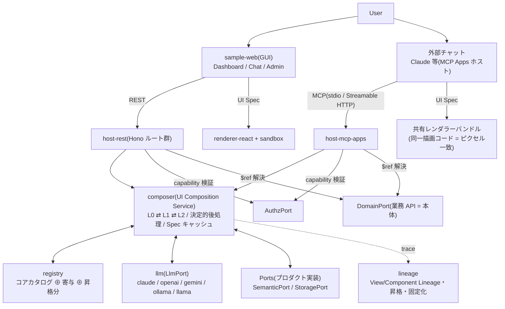
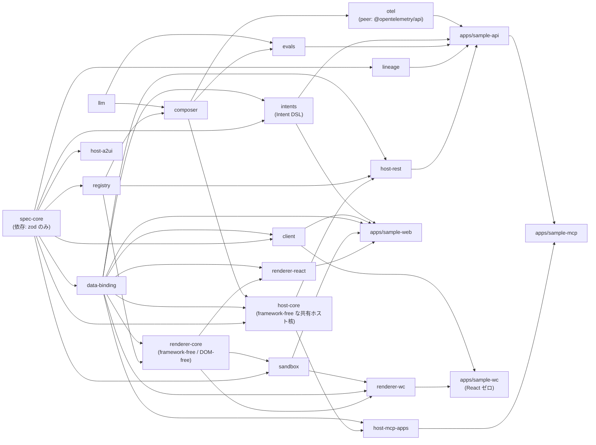
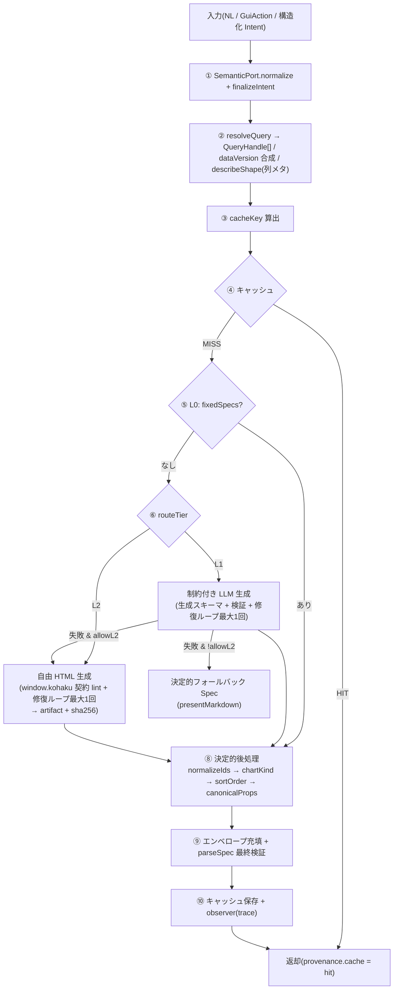
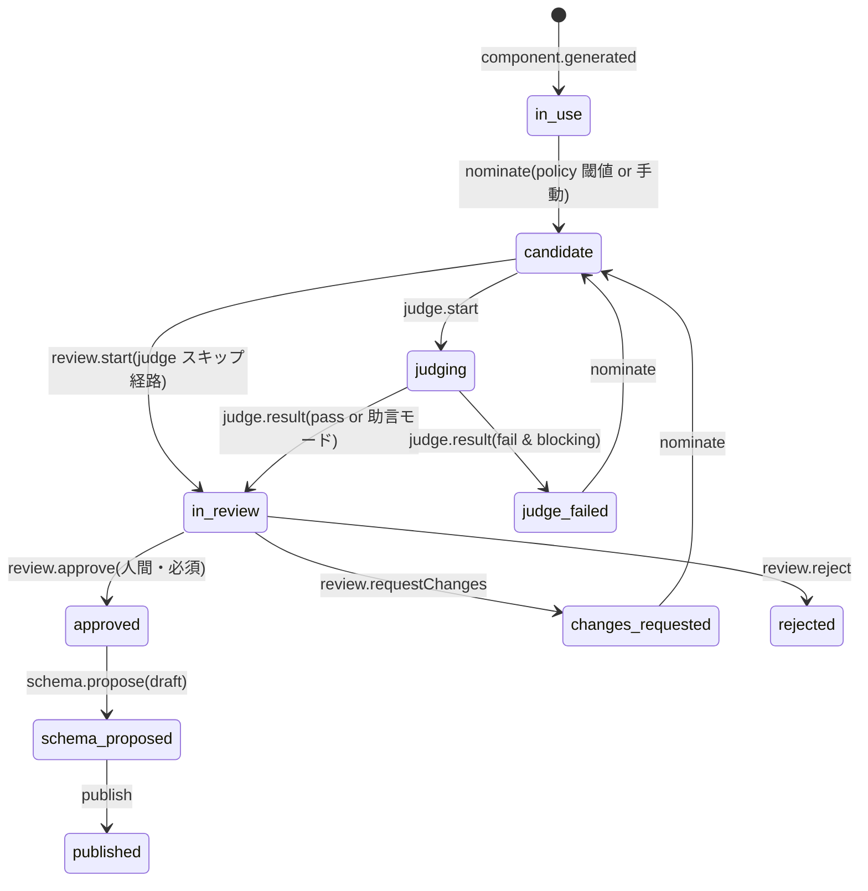

# kohaku 実装設計書

[English](design.md) | 日本語

| 項目 | 内容 |
|---|---|
| バージョン | v0.1(実装済み) |
| 最終更新 | 2026-09-11 |
| 位置づけ | **実装された姿**の設計記録。プロトコルの規範(MUST/SHOULD)は [../spec/SPEC.ja.md](../spec/SPEC.ja.md) |
| 読者 | フレームワークを拡張・保守する開発者 |

---

## 1. 目的と核心原則

kohaku は「チャットでも GUI でも、同内容のリクエストなら同一の UI が出る」という AI 時代の UI 要件を満たす Generative UI 基盤である。

> **UI をコードではなくデータ(宣言的 UI Spec)として扱い、生成(Composition)と描画(Rendering)を完全分離する。**

この原則から導かれる 3 つの実装上の柱:

1. **同一表示の構造的保証** — チャットも Web も同一の Composition Service に合流し、Spec キャッシュ(キー = `intentHash + dataVersion + catalogFingerprint`)が「同内容のリクエスト → 同一 Spec」をバイトレベルで保証する。LLM の temperature 0 は補助であって保証ではない。
2. **参照渡しデータバインディング** — UI Spec には `query://` 参照だけが載り、バルクデータは部品が API から直接取得する。LLM が組み立てるのは配管であって水ではない(転記ハルシネーションの構造的排除)。
3. **三層の生成階層と統制** — L0(固定)⇄ L1(宣言的合成)⇄ L2(サンドボックス自由生成)+ 昇格パイプライン。柔軟性は L2 で確保し、統制(レビュー・スキーマ化・監査)を通って L1/L0 に固化する。

## 2. 全体アーキテクチャ



実装でのポイント:

- **Intent 層はプロダクト側(SemanticPort)にある**。GUI 操作は決定的に、自然言語は LLM で、同一の `CanonicalIntent` に正規化される。フレームワークは正規化の決定性部分(キーソート・ハッシュ)だけを所有する。
- **host-* は薄いアダプタ**。compose 呼び出し・capability 発行・lineage 記録の配線のみで、ロジックは composer / lineage に置く。
- **バックエンドは言語非依存**。上図の `host-rest` 以下(composer・ports・lineage・host-*)は TS 参照実装(`packages/*`)だが、同一プロトコルの **Python フル移植**(`python/kohaku`。REST は FastAPI・MCP は MCP Apps プロファイル)も存在し、ワイヤ互換で conformance CONFORMANT。詳細は §3 の「Python 実装」小節と [../python/README.ja.md](../python/README.ja.md)。

## 3. パッケージ構成と依存グラフ



依存の要点: **環境中立レンダラーロジックは `renderer-core` が単一の正**で、`renderer-react` と `renderer-wc` が同一の核を消費する(詳細は §7.1)。

| パッケージ | 責務 | 中核ファイル |
|---|---|---|
| spec-core | UI Spec スキーマ・構造検証・Intent 正規化/ハッシュ・diff/patch・cacheKey・**Port 型** | `src/schema/spec.ts` `src/ports.ts` `src/diff.ts` |
| registry | ComponentDefinition・federated 解決・capability 交渉・**LLM 生成スキーマ変換** | `src/catalog.ts` `src/generation.ts` `src/core/` |
| llm | LlmPort(プロバイダ非依存契約)・env 解決・構造化出力フォールバック・`streamObject`(累積 partial 通知の任意拡張 — 逐次ストリーミングの供給源) | `src/adapters/ai-sdk.ts`(SDK 隔離点) |
| composer | compose/recompose・L0/L1/L2・修復ループ・決定的後処理・キャッシュ | `src/compose.ts`(入口)`src/tier-ladder.ts`(L1→L2 梯子)`src/single-flight.ts` `src/assemble.ts` `src/post/rules.ts` |
| data-binding | `query://` 正規形・BindingClient(Bearer capability・STALE 検出) | `src/client.ts` |
| storage-memory | StoragePort の参考実装: `createMemoryStoragePort()`(純インメモリ。Zero-Port の既定 & テスト用ダブル)と `createFileStoragePort(dataDir)`(旧 sample-api の port 相当。Spec キャッシュはメモリ、lineage / 昇格 / 固定化は `dataDir` 配下) | `src/memory-storage-port.ts` `src/file-storage-port.ts` |
| authz-hmac | AuthzPort の参考実装: `createHmacAuthzPort(secret)`(HMAC-SHA256 capability token) | `src/hmac-authz-port.ts` |
| port-contracts | **private・test-only。** StoragePort / AuthzPort の共有契約スイート(`describeStoragePortContract` / `describeAuthzPortContract`)で、参考実装・本番アダプタを問わず全アダプタが通す | `src/storage.ts` `src/authz.ts` |
| intents | Intent DSL(環境中立)。`defineVocabulary`(値集合 + ラベルの単一源)・`defineIntent`(単一定義)から IntentDef(SemanticPort)・FacetView(GUI ファセット)・MCP ツール入力・coerce を導出 | `src/vocabulary.ts` `src/intent.ts` `src/facet-view.ts` |
| renderer-core | framework-free / DOM-free な共有核。イベント統制(`resolveEmit`)・書き込み判定(`resolveInvokeTarget`)・state ストア・BoundDataController(鮮度突合/最後発優先/無効化)・per-part presenter・文言・テーマ解決 | `src/control/emit.ts` `src/stores/bound-data-controller.ts` `src/presenters/` |
| renderer-react | React レンダラー。SpecView(フラットリスト解決)・ImplRegistry・useBoundData・per-node ErrorBoundary。純ロジックは renderer-core を import(単一の正)| `src/SpecView.tsx` `src/context.tsx` |
| renderer-wc | 非 React レンダラー。単一 `<kohaku-surface>`(Custom Elements + Shadow DOM)がツリー全体を構築。chart は inline SVG、L2 は sandbox を直接再利用。renderer-react との parity を担保 | `src/kohaku-surface.ts` `src/tree.ts` `test/parity/` |
| client | 型付きホストクライアント(REST プロファイル §6.1 の全ルート)・SSE ストリーム・binding 合成の再エクスポート | `src/client.ts` |
| admin-react | 統制コンソール(4 つのレビュー面)を React コンポーネントとして提供。データは `client` 経由のみ・テーマは renderer-core トークン経由・昇格プレビューは sandbox 直接マウント(sha256 同一性)。プロダクト固有の知識(ヘッダ・ドラフト既定値・追加タブ・辞書)は props で注入 | `src/KohakuAdmin.tsx` `src/tabs/` |
| sandbox | L2 隔離実行(3 重防御)・postMessage ブリッジ・SandboxFrame・`./smoke`(配信前スモーク検証ランナー。jsdom は optional peer) | `src/mount.ts` `src/host-bridge.ts` `src/smoke/` |
| lineage | イベント記録・**昇格状態機械**・固定化・REST 用 Recorder | `src/promotion/machine.ts` `src/lineage.ts` |
| evals | Golden Spec 回帰(揺らぎ正規化)・LLM-as-Judge(L2 昇格審査 + L1 品質採点)・品質回帰ハーネス・FixtureLlm | `src/golden.ts` `src/judge.ts` `src/quality.ts` |
| host-core | framework-free な共有ホスト核。host-rest と host-mcp-apps が消費する(renderer-core と renderer-react / renderer-wc の関係と同型 — 単一の正を 2 つの薄いアダプタが消費)。固定化(L1→L0)配信 + 陳腐化自己修復(`composeWithFixation` / `resolveFixatedResult` / `settleFixation`)、capability 発行(生成済み Spec 向け `issueCapabilityForSpec` / ref 一覧向け `issueCapabilityForRefs`。デフォルト TTL 600 秒。加えて両ホストが呼ぶ fail-closed な `issueSpecCapabilitySafely` ラッパ)、`/binding/resolve`・`kohaku_resolve_binding`・初期データ事前解決が共有する read-ref 解析(`parseInvokableRef`: 予約パラメータの分離 + 合流と source 照合。capability 検証とエラー → ステータス写像は各ホストに残る)、書き込み後の副作用応答(`applyActionEffects`。fail-open)、intent 解決(`resolveIntent`)、cancelled を意識した fail-open な合成結果記録(`recordComposedResult`)、クライアント向けエラーメッセージ(`errorMessage` / `clientMessageFor`)、fail-open な観測フックヘルパ(`notifyHook` / `failOpen`)。依存は spec-core + data-binding + composer | `src/fixation.ts` `src/capability.ts` `src/binding-ref.ts` `src/action-effects.ts` `src/intent.ts` `src/errors.ts` `src/view-recorder.ts` |
| host-rest | REST プロファイル(Hono)。ルートはグループ別に分割 | `src/routes.ts` `src/routes/` |
| host-mcp-apps | MCP Apps(SEP-1865)プロファイル | `src/server.ts`(ツール登録)`src/initial-data.ts`(初期データ事前解決)`src/snapshot.ts` |
| otel | 薄い opt-in OpenTelemetry 層。`createOtelComposeObserver` が `ComposeObserver` の呼び出しをスパンへ変換し、composer の `composeObservers` で製品側の observer と束ねて使う。依存は composer のみ(peer: `@opentelemetry/api`)— exporter/SDK の配線は無い(ホストプロセス自身の責務)。詳細は下記「Trace context / OTel」参照 | `src/observer.ts` |
| host-a2ui | A2UI プロファイル [Draft](spec-core のみ依存・環境中立)。**既定は A2UI v0.9.1 準拠**: UISpec → `createSurface`+`updateComponents`、SpecPatch → `updateComponents`、A2UI `action` → GuiAction、JSONL 直列化。v0.9.1 は strict でワイヤ拡張不可のため kohaku 固有情報はサイドカー(`KohakuSidecar`)へ無損失退避。**opt-in の `target: "v1.0"`**(`toA2ui`/`patchToA2ui`)は A2UI v1.0 RC に追従: `createSurface` に `components`(と `resolveData` 指定時の `dataModel`)を直接同梱し、`theme` は出力せず、`fromA2uiEvent` は v1.0 の function-call メッセージ(`callAgentFunction`/`rendererFunctionResponse`)も受理して kohaku に対応概念が無い旨を `{kind:"unsupported", reason}` として明示的に返す。既定出力(`target` 省略時)はバイト同一を維持(golden テストで固定) | `src/to-a2ui.ts` `src/patch-to-a2ui.ts` `src/from-a2ui-event.ts` `src/jsonl.ts` |

ビルド方式: 全パッケージは**開発時は src 直接 export**(`exports` が `.ts` を指す)。tsx / Vite / Vitest が TS を直接解決し、型検査はパッケージごとの `tsc --noEmit`(TypeScript 7)。公開してもこの分離は崩れない: `publishConfig` が `exports` を上書きするのは**公開 tarball の中だけ**で、ワークスペースは引き続き src を解決する。dist 自体はバンドラではなく、型検査と同じ `tsc`(TypeScript 7。7.0.2 で宣言出力に対応)による 1:1 トランスパイル — バンドラは `Function.prototype.toString()` で文字列化されるサンドボックス guest のクロージャを書き換えてしまい、また検査と出力を同じコンパイラに揃えることで両者が食い違う余地を無くすため。ローカルのテストはビルド成果物を一切読まないので、`pnpm smoke:pack` が全パッケージを pack し、ワークスペース外で素の npm によりインストールして各エントリの import と型解決を検証する(CI の独立ジョブ)。

### Python 実装(`python/kohaku`)

同一プロトコル(Kohaku Protocol v0.1)の **Python フル移植**をモノレポ内に同居させる(`python/` の uv workspace。pnpm workspace 外)。TS 参照実装とは**ワイヤ互換** — canonical JSON がバイト一致するため `intent.hash` / `specHash` / キャッシュキー / `catalogFingerprint` が言語をまたいで一致する。TS ホスト ⇄ Python ホストの conformance 通過が「プロトコルは言語非依存」の実証になる(renderer-react ⇄ renderer-wc の parity が「Spec はレンダラー非依存」の実証であるのと同型)。

- **契約境界は `spec/`**。Python は `spec/`(SPEC.md + JSON Schema)とビルド済みレンダラー HTML にのみ依存し、TS パッケージ内部には触れない。適合状況は conformance **MUST 19/19 = CONFORMANT** — 19 は conformance manifest の全 33 MUST のうち黒箱検査可能なもので、残り 14 件の reference MUST(MCPAPP-* / SBX-*、および文書規範 5 件)はパッケージテストで担保(CI の `conformance-ts` ジョブ〈TS ホスト〉と `conformance-python` ジョブ〈Python ホスト〉がそれぞれのサンプルホストを起動して TS 側 CLI の黒箱検査で毎コミット担保)。
- **パッケージ対応**(`python/kohaku/src/kohaku/` のサブモジュールが TS `packages/*` に対応):

| Python サブモジュール | 対応する TS パッケージ |
|---|---|
| `spec/` | spec-core(スキーマ・正準化・検証・Port 定義) |
| `registry/` | registry(core は TS export の JSON から構築) |
| `data_binding/` | data-binding |
| `intents/` | intents |
| `llm/` | llm(OpenAI 互換 + claude〈`anthropic` SDK `>=1.0`・strict tool use — `strict: true` に加え、プロバイダの構造化出力サブセットが拒否する JSON Schema キーワードを除去し description へ退避する `_sanitize_for_anthropic`〉+ gemini〈google-genai〉の各アダプタ / FakeLlm。extras で段階導入) |
| `composer/` | composer(L0/L1/L2・修復ループ) |
| `lineage/` | lineage(記録・昇格・固定化) |
| `evals/` | evals(judge / golden / FixtureLlm) |
| `storage/` | `@kohaku-ui/storage-memory` の `createFileStoragePort` 相当 |
| `host_core/` | host-core の完全移植: TS の全モジュールが Python 側に対応を持ち、`host_rest` / `host_mcp` が薄いアダプタとして利用する(モジュール単位の詳細: [../python/README.ja.md](../python/README.ja.md))。挙動差が 1 点だけ残る: 両プロファイルが fixation self-heal を直列化する共有 keyed mutex(`keyed_mutex.py`)は、キー粒度がプロファイル間で異なる — REST は `(tenant, intentHash)`、MCP は `intentHash` 単独でキーする |
| `host_rest/` | host-rest(FastAPI) |
| `host_mcp/` | host-mcp-apps(MCP Apps プロファイル) |

- **クロス言語互換の担保**は 3 点(golden fixture / core カタログ JSON export / conformance 黒箱)。レイヤ依存方向(逆流禁止)は import-linter の layers 契約で機械担保する(`uv run lint-imports`)。
- **意図的な差異**: JS 検証(L2 の `L2_SCRIPT_SYNTAX` 構文検査 / `l2Smoke` ランナー)は同梱 TS CLI(`kohaku smoke-l2`)への **Node サイドカー委譲**で提供し、Node 非併設のスタンドアロン配備ではスキップ(仕様の「動的コード生成不可の環境ではスキップ」規定)。内部 API は snake_case、ワイヤ形状(JSON キー・エンドポイント・`_meta` キー)は TS と完全一致。恒久差異の全量とセットアップ手順は [../python/README.ja.md](../python/README.ja.md) が正。

## 4. 中核データモデル

### 4.1 UI Spec

[../spec/examples/quarterly-sales.spec.json](../spec/examples/quarterly-sales.spec.json) が正準例。設計上の不変条件:

- **フラットリスト + ID 参照**(`components[]` + `children: id[]`)。LLM が生成・修正しやすく、diff/patch・将来のストリーミングに向く。`id: "root"` を根とする非循環 DAG。
- **エンベロープは LLM が生成しない**。LLM の出力は `{components, events}` のみで、`kohaku` / `intent` / `dataVersion` / `provenance` はコードが充填する(composer `assembleSpec`)。
- **テーマ非依存**。トークン(色・余白)は renderer 側の `ThemeTokens` で解決する。同一プロダクト内なら Web も外部チャットも同じトークン → ピクセル一致。
- `provenance` が View Lineage の最前面(tier / cache / model / fallback)。UI 上の ProvenanceBadge がそのまま監査表示になる。

<a id="cache-key"></a>
### 4.2 CanonicalIntent とキャッシュキー

```
CanonicalIntent = { canonical: "sales.quarterly_summary", params: {…}, hash: "sha256:…" }
hash   = sha256(canonicalStringify({canonical, params}))   // キー深ソートの canonical JSON
cacheKey = "kohaku:0.2:<intentHash>:<dataVersion>:<catalogFingerprint>"
```

- `canonicalStringify`(キー深ソート + undefined 除去)が決定性の土台。GUI 由来でも NL 由来でも、同じ意味の Intent は同じバイト列 → 同じハッシュになる。
- `catalogFingerprint`(`type@version` ソート結合の FNV-1a。sandbox-template 分は `#fnv1a64(html)` を付加し、同じ type@version で再公開された別内容の成果物を旧内容と区別する)をキーに含めるのは実装時の追加判断 — 部品改版・昇格でカタログが変わると指紋が変わり、古い Spec を取り違えない。
- **`generatorVersion`(6 番目・任意)と `policyFingerprint`(7 番目・任意)がキーを拡張する**: `cacheKey = "kohaku:0.2:<intentHash>:<dataVersion>:<catalogFingerprint>[:<generatorVersion>][:<policyFingerprint>]"`。`generatorVersion` は呼び出し側が手動で上げる区切り(後述の few-shot / 出力言語 / design-system 節)。`policyFingerprint`(`packages/composer/src/context.ts` の `policyFingerprint`)は `ComposePolicy.outputLanguage` / `designSystem`(本文全体) / `fewShot.id` / `selectComponents.id` から**導出**する保険的な値(canonical JSON → sha256 先頭 16 hex)で、呼び出し側が手動の `generatorVersion` 更新を忘れてもキャッシュを自動で分離する。この 4 項目がいずれも未設定なら空文字(= 未指定と同義)になり、それらに触れないポリシーのキャッシュキーはこのコンポーネント導入前とバイト単位で不変。非空だが `generatorVersion` が未指定の場合は 6 番目のスロットに `-` プレースホルダを入れ、両者が位置的に衝突しないようにする。ワイヤプロトコルの一部ではなく内部のキャッシュ分割専用の値。

### 4.3 SpecPatch(差分モデル)

JSON Patch ではなく**コンポーネント単位の意味的パッチ**(`upsert` / `remove` / `events` / `intent` / `dataVersion` / `refVersions` / `state` / `provenance`)。`orderComponents`(root 起点 DFS)を正準順序とし、`applyPatch(prev, diffSpec(prev, next)) === next` が成立する。インタラクションループ(`recompose`)の応答形式。

## 5. 合成パイプライン(composer)



### L1 制約付き生成の二段構え

LLM の役割を「カタログからの選択 + 型付き props 充填」に限定するため、生成スキーマを動的構築する(registry `buildGenerationSchema`):

1. **提示用スキーマ**(プロバイダ最小公倍数): 部品ごとの variant(anyOf)。props は真の Zod スキーマから決定的変換 — `optional → anyOf [orig, null]`・全 property required・`additionalProperties: false`・default 除去(OpenAI strict / Gemini 制約対応)。**`data.$ref` は SemanticPort が解決した QueryHandle の enum に固定** — LLM は未知の参照を偽造できない。イベント payload は `{key, value}` ペア配列(strict mode は自由形オブジェクト不可)。
2. **真のスキーマで再検証**: 生成結果は null 除去(null = 省略の規約)→ カタログの propsSchema で parse(default 充填)→ カタログ照合(型・data 要否・イベント宣言)→ 構造検証。失敗したらエラー一覧をプロンプトに添えて 1 回だけ修復再試行。

<a id="few-shot"></a>
### few-shot 自己強化(generatorVersion bump 規約)

`ComposePolicy.fewShot`(3-9)を配線すると、L1 生成プロンプトのカタログ後・指示前に「良い構成の例」セクションが挿入され、LLM が既存の良構成に倣いやすくなる。安全性には関与しない — 生成後の検証パイプライン(生成スキーマ → `catalog.validate` → 構造検証)は不変で、few-shot は品質向上のみ。サンプルは `createFixationFewShot(storage)`(`apps/sample-api/src/fewshot.ts`)で **固定化済み(レビュー通過)Spec を手本に供給**し、`canonical 一致優先 → intentHash 昇順` の先頭 2 件(`maxExamples`、既定 2)を注入する。`examples()` の throw は握りつぶして空扱いにするため、供給側の失敗が生成を止めることはない。固定化リスト全体と canonical ごとのソート結果は最大 1 秒(`options.cacheMs`)キャッシュし、L1 生成のたびに全件コピー・ソートし直すコストを、固定化の変更を検知するまでの遅延上限 1 秒と引き換えに抑える。

- **決定性の契約**: `examples(intent)` は同一 intent に対して常に同じ順序・同じ集合を返さねばならない。これが「同一 intent → 同一プロンプト → 同一生成」というキャッシュ整合の前提になる。
- **generatorVersion bump 規約(必須)**: few-shot の **on/off・供給源の変更はプロンプト内容の変化**であり、cacheKey の `generatorVersion` 成分(既定 `p<PROMPT_REVISION>/<modelId>`)を必ず bump して反映する。bump しないと、既にキャッシュ済みの intent には旧世代の Spec が返り続け、few-shot が効かない。逆に **few-shot 未供給(空配列)なら生成プロンプトは前版とバイト単位で同一** で、`buildL1Prompt` はセクション自体を追加しない(既存 FixtureLlm フィクスチャが無傷である根拠)。参考: 本サンプルで few-shot を既定オンにした際は `PROMPT_REVISION` を `"1" → "2"` に上げている(`packages/composer/src/prompt.ts`)。同じ規約は `selectComponents` の変更にも適用する。`ComposePolicy.fewShot.id` / `selectComponents.id`(任意)はさらに `policyFingerprint`(§4.2)へ供給され、この手動規約の上に自動の保険を重ねる。

<a id="output-language"></a>
### 生成テキストの出力言語(generatorVersion bump 規約)

`ComposePolicy.outputLanguage` は **LLM が生成する表示文言** — L1 の見出しタイトルと L2 ウィジェットの文言(`<title>`・ラベル・注記)— の言語を選ぶ。両生成プロンプトに「Output language」セクションとして差し込まれ(`buildL1Prompt` / `buildL2Prompt`)、**プロンプト自体の言語に関係なく**生成テキストが指定言語に従う(L1/L2 システムプロンプト自体は `PROMPT_REVISION` `"10"` 時点で英語で記述)。**既定は `"English"`**。これはレンダラーの i18n 上書き(`RendererProvider.messages` / `context.messages`)とは直交する — 後者はライブラリ既定の UI 文言(ローディング・検証・空表示)を差し替えるだけで生成内容には触れない。`outputLanguage` の変更はプロンプト内容の変化なので、few-shot / designSystem と同じ **generatorVersion bump 規約**に従う: cacheKey の `generatorVersion` 成分を bump し、旧言語でキャッシュされた Spec を世代で分離する(bump しないと既にキャッシュ済みの intent には前言語が返り続ける)。未指定なら、このオプションを一切参照しないビルドとプロンプトのバイト列は同一。

**セッション単位の言語(デモが使う配線)**: wire では言語を `session.locale`(`"en"` / `"ja"`。SPEC §6.1「セッションロケール」)で運び、host-rest が `SessionContext.locale` へ透過し、`ComposeContext.policyFor`(`compose` / `composeStream` の入口で `withTenantCatalog` の後・キャッシュキー計算の前に 1 回だけ解決)がセッションごとの `ComposePolicy` に差し替える。MCP 面では同じノブがツール呼び出しごとの `locale` 引数になる(SPEC §6.2「ツールロケール」): UI を生成する全ツールがこれを受け付け、呼び出し側 LLM が利用者の会話言語に合わせて設定し(ツール説明に明記)、host-mcp-apps が同じ `SessionContext.locale` へ写す — 予約名は intent params へ入る前に取り除かれ、intent ハッシュは言語中立のまま保たれる。sample-api は EN/JA の policy 対を事前構築する(`compose-context.ts`): EN は従来 policy そのまま(generatorVersion `p<rev>/<model>/ds3` — 既存キャッシュ・golden は不変)、JA は `outputLanguage: "Japanese"`・JA の L0 固定スペック(`createFixedSpecs("ja")`)・generatorVersion `…/ds3/ja` を設定する(言語トークンがキャッシュを分離する。キャッシュキー自体はロケール成分を持たない)。JA は few-shot を外す(固定化された手本は EN Spec のため JA 生成を英語に偏らせる)。固定化ショートカットは EN セッション限定(`host-deps.ts`): `FixationRecord` は言語を持たないため、EN トラフィックから固定化された Spec を JA セッションへ配信しない — JA は通常 compose(JA キャッシュまたは JA 生成)に落ちる。既知のデモ上のトレードオフ: 言語混在トラフィックでは固定化提案の安定度集計が希釈される(JA は同一 intentHash に対し別の structureHash を生む)こと、**データセル値は英語のまま**であること(`query://` の結果は不変条件として言語中立 — チャート/表の行内の地域・チャネル表示ラベルはドメイン層由来。ドリルダウンは二言語語彙の `reverseLabel` で両言語を受理する)。DomainPort(`apps/sample-api/src/domain/queries.ts`)由来の列見出し・KPI ラベル・KPI 注記(例:「Total revenue」「Revenue (JPY)」「No target set」)も同様で、`session.locale` に関わらず英語のまま — DomainPort 由来ラベルの二言語化は未設計の将来課題。

<a id="prompt-caching"></a>
### opt-in の Anthropic プロンプトキャッシュ(`promptParts`)対 スキーマ段階の `data.$ref` 制約キャッシュ(`refConstraint`)

Anthropic の構造化出力経路はリクエストの出力文法(スキーマ + ツール集合)をコンパイルし、その文法自体の形状をキーに 24 時間キャッシュする。決定 #4(§13)は `data.$ref` を解決済み QueryHandle 集合の enum に固定しており、これは intent の関数なので、既定ではコンパイル済み文法が intent ごとに異なり、文法コンパイルをキャッシュするプロバイダは(ほぼ)全ての異なる intent で再コンパイルすることになり、以前のコンパイル結果を再利用できない。これは決定 #4 のガバナンス上の利点(スキーマ段階での偽造防止)との間で実測されたトレードオフであってバグではないため、kohaku は既定を変えるのではなく **2 つの独立した opt-in の逃げ道**を用意し、どちらを切り替えるかは運用者が計測してから決めることを前提にする(`apps/sample-api/scripts/measure-grammar-latency.ts`)。

- **`ComposePolicy.refConstraint: "schema" | "validate"`**(既定 `"schema"`。すなわち決定 #4 のまま不変)は「生成スキーマ自体が何を制約するか」を決める。`"validate"` は `buildL1GenerationSchema` の `data.$ref` を intent ごとの enum からプレーンな `{ type: "string" }` へ緩和し、コンパイル済み文法の形状を intent 非依存にする(`selectComponents` による絞り込みは受ける)ため、同一 intent の再呼び出しだけでなく異なる intent の compose 呼び出し間でも再利用可能になる。代償: スキーマはもはや解決済み集合外の参照を返却前に拒否できないため、`generateL1` の `collectIssues` が生成後に明示的に集合所属を検査し、参照が解決済み集合の外であれば既存の修復ループへ `DATA_REF_UNRESOLVED` issue を送り返す(SPEC §4 の CMP-GEN-001 はどちらの強制点も許容する)。これは LLM に送るスキーマを変えるため、`"validate"` は `policyFingerprint`(§4.2)に参加する — ただし既定の `"schema"`(明示指定でも未指定でも)は unset と同一に畳み込まれるため、既存のキャッシュキーや固定化安定度の golden はいずれも動かない。
- **`promptParts`(`GenerateObjectRequest`/`GenerateTextRequest`、`@kohaku-ui/llm`)** は別の、補完的な機構である: `prompt` を任意の `{ cacheable, rest }` に分割し(不変条件: `cacheable + rest === prompt`)、キャッシュ対応アダプタが(出力文法ではなく)プロンプトの**内容**の先頭側・バイト不変な部分をプロバイダ側の再利用向けに印付けできるようにする。`buildL1Prompt`/`buildL2Prompt` は既に静的な半分(`buildL1PromptStatic`/`buildL2PromptStatic` — canonical intent・refs・shape・catalog・few-shot・output language・design system。いずれも 1 回の `generateL1`/`generateL2` 呼び出しの生存期間中は固定)と、試行ごとに変わる唯一の部分である修復フィードバックの接尾辞とに分解済みであり、`buildL1PromptParts`/`buildL2PromptParts` はその境界をそのまま `cacheable`/`rest` として公開する(構成上成り立つため実行時チェック不要)。これは**同一 compose 内の再利用**(修復ループの再試行間)を狙ったものである — catalog/few-shot/output-language のような intent 非依存セクションを、必然的に intent ごとに変わる canonical intent セクションより前に前置きすればより広い intent 横断のキャッシュ境界を開けるが、それは `buildL1Prompt`/`buildL2Prompt` の既存のバイト出力を変えてしまう(あらゆる FixtureLlm フィクスチャがそれをキーにしている)ため見送った。llm 層がこれに基づいて実際に**動作を変える**のは、`LlmConfig.promptCache` がオン(`KOHAKU_LLM_PROMPT_CACHE=1`。既定 off)かつ `config.provider === "claude"` の両方が揃ったとき(`packages/llm/src/adapters/ai-sdk.ts`)だけであり、その場合 user メッセージを 2 つの text part に分割し先頭に `providerOptions.anthropic.cacheControl = { type: "ephemeral" }` を付ける。他の全プロバイダ(OpenAI/Gemini は既に自動プレフィックスキャッシュを行い、ollama/llama はこのアダプタが対応する等価機構を持たない)では no-op であり、呼び出し側が `promptParts` を渡さない場合も no-op である — composer は常に `promptParts` を(計算コストが軽いため)供給し、実際の挙動変化は opt-in の env フラグのみで制御される。`PROMPT_REVISION` はどちらの場合も不変(プロンプト内容の変化ではなく、不変のバイト列をどう送信するかだけの違い)。
- どちらも加算的: `promptCache` off / `refConstraint` 未指定(いずれも既定)は、既存のプロンプトのバイト列・生成スキーマ・`policyFingerprint`・キャッシュキーを寸分違わず再現する。

<a id="reasoning-effort"></a>
### 推論エフォート(`ComposePolicy.effort`)

`ComposePolicy.effort?: { l1?: LlmEffort; l2?: LlmEffort }`(`LlmEffort = "low"|"medium"|"high"|"xhigh"|"max"`、`@kohaku-ui/llm`)は tier ごとに `generateL1` の `GenerateObjectRequest.effort` と `generateL2` の `GenerateTextRequest.effort` へ独立に渡される — L1(制約付きカタログ選択)と L2(自由形式 HTML)は推論コストの性質が異なるため、運用者がどちらか片方だけへエフォートを多く配分したい場合があるからである。tier を片方未指定にすると、その呼び出しには `effort` フィールド自体を一切送らない(プロバイダ既定)。エフォート制御を実装しない `LlmPort`(`FakeLlm`/`FixtureLlm`、または `adapters/ai-sdk.ts` に対応オプションが無いプロバイダ)は単に無視する。

- **プロバイダ配線(`adapters/ai-sdk.ts` の `resolveProviderOptions`)**: `claude` は `providerOptions.anthropic.effort` を設定する — インストール済み `@ai-sdk/anthropic` のリクエスト構築コードは *language-model* 側の provider-options オブジェクト(`anthropicLanguageModelOptions`)の `effort` を読んで API ボディの `output_config: { effort }` に転送する。同名の `effort` は *system-message* 側の provider-options(`anthropicSystemMessageProviderOptions`。`mid-conversation-effort-2026-08-01` ベータ配下で会話途中のエフォート変更を扱う別機能)にも存在するが、こちらは配線対象ではない。`openai` は `providerOptions.openai.reasoningEffort` を設定する(`resolveModel` が組み立てる Responses API モデルが `openaiLanguageModelResponsesOptionsSchema` にこのフィールドを公開している)。`ollama`/`llama`(`@ai-sdk/openai-compatible` 経由)は `providerOptions.openaiCompatible.reasoningEffort` を設定し、どちらのプロバイダ名で構成されていてもこのアダプタが読む。`gemini` はインストール済み `@ai-sdk/google` にエフォート**レベル**に相当するオプションが存在しない(数値の `thinkingConfig.thinkingBudget` のみで単位が異なる)ため、`effort` はこのプロバイダでは黙って無視される。
- **キャッシュキーの正しさ**: `policy.effort` が(何らかの形で)設定されていれば必ず `policyFingerprint`(§4.2)に畳み込まれる(`l1`/`l2` 両方が参加し、片方のみ設定なら他方は `null` 扱い)— エフォートは同一 intent/モデルに対する生成結果を変えうるため。一切設定しない場合は unset と区別できない(空文字列フィンガープリント、この機能導入前とバイト同一の cacheKey)。

<a id="per-tier-llm"></a>
### tier ごとの LLM(`ComposeContext.llmByTier`)

`ComposeContext.llmByTier?: { L1?: LlmPort; L2?: LlmPort }` は、この機能が入る前は全 tier が使っていた単一の `llm: LlmPort` を tier ごとに上書きする加算的なオプションである。`llm` は必須のまま残り、`llmByTier` が設定しない tier のフォールバック先になる。動機となるユースケースは `kohaku dataset export`(L1 の制約付き生成タスクに特化した蒸留データセット。小型モデルのファインチューニング用)である — 運用者はファインチューニング済みモデルを L1 に割り当てつつ、L2 の自由形式生成には大型モデルを維持でき、しかもこれらを 1 つの `ComposeContext` から実行できる。`resolveTierLlm(ctx, tier)`(`context.ts`)は、`tiers/l1-generate.ts` と `tiers/l2-generate.ts` の双方が各 tier の LLM を実際に発行する箇所で呼ぶ唯一の解決点であり、`llmByTier` が未設定なら常に `ctx.llm` を返す(この機能導入前と同一)。

- **モデル識別の記録**: `TierResult.model`(`ComposeAttempt`/`ComposeTrace` に現れる)は、`resolveTierLlm` がその tier 用に実際に解決したポートを反映するようになった — L1 は元々そうだった(`GenerateObjectResult.model` は生成を行ったポート自身に由来する)。L2 は「解決済みの tier ポート」の `llm.modelId` を読むようになった(基底の `ctx.llm.modelId` ではなく)— これは既存のバグを本変更で顕在化させ修正したものである: `GenerateTextRequest` は自前の `model` 結果フィールドを持たないため、`generateL2` は元々呼び出しポート自身の `modelId` を代用してきたが、この変更以前はそれが tier 単位の上書きが効いている場合でも無条件に基底ポートのままだった。
- **キャッシュキーの正しさ — 難所**: `defaultGeneratorVersion(llm)`(prompt.ts)は単一モデルから `p<PROMPT_REVISION>/<modelId>` を組み立てるが、呼び出し側(sample-api 等)はモデル ID を一切含まない独自文字列で `generatorVersion` を上書きすることがある — そのため tier ごとのモデルが絡むと `generatorVersion` だけではキャッシュを分離しきれない。代わりに `compose.ts` が `tierLlmFingerprintMaterial(ctx)`(`context.ts`)— `llmByTier` の各エントリの `{provider, modelId}` — を計算し、`policyFingerprint` の第 2 引数(§4.2)へ**設定済み tier の少なくとも 1 つの provider/modelId が基底 `ctx.llm` と実際に異なるときに限り**畳み込む。したがって: `llmByTier` 未設定 → `tierLlmFingerprintMaterial` は `undefined` を返す → `policyFingerprint` 既存の「フィンガープリント対象フィールドが 1 つも設定されていない」早期リターンがそのまま発火 → cacheKey はこの機能導入前とバイト同一。`llmByTier` を設定していても全エントリがたまたま基底モデルと一致する(実際の生成差分がない)場合も同じ早期リターン、同じ cacheKey。tier ごとのモデルが実際に異なる場合だけキャッシュキーが動く — しかも運用者が `generatorVersion` を手で bump し忘れる心配なく自動的に。
- **`defaultGeneratorVersion` はあえて変更していない**(tier ごとのポートを受け取るオーバーロードは追加しない): これは composer 自身が呼ぶことのない呼び出し側向けの便宜関数であり(`ComposePolicy.generatorVersion` のフィールド単位のドキュメント参照)、呼び出し側がこのヘルパーを使っていたとしても `llmByTier` を観測する術がない。`generatorVersion` は引き続き「どのプロンプト改訂 / どの基底モデルか」に答え、上記のフィンガープリントが「この compose は実際に tier ごとに異なるモデルを使ったか」に答える — 詳しい理由は `defaultGeneratorVersion` 自身のドキュメントコメントを参照。
- 全体として加算的: `llmByTier` を一切設定しない `ComposeContext` は、発行先・記録されるモデル・`policyFingerprint`・cacheKey のいずれにも変化がない。

<a id="streaming"></a>
### 逐次ストリーミング(composeStream の暫定 patch)

`composeStream` は「スケルトン(`ui.loading`)→ 暫定 patch × 0..N → 確定 patch → done」を返す(SPEC §6.1.1 の patch 0..N の範囲内 — ワイヤ契約は不変)。暫定 patch は LLM の部分出力から組んだ**暫定 Spec への差分**で、`LlmPort.streamObject`(任意実装。累積 partial を callback 通知)を llm が実装するときだけ流れる(FakeLlm は `partials` スクリプト、ai-sdk アダプタはネイティブ構造化モードのみ — プロンプト JSON フォールバックでは従来どおりスケルトン → 確定 patch)。

- **parse & heal**(`buildProvisionalSpec`): 累積 partial を生成スキーマの decode に通し(throw = 未完成 → skip)、**バッチ一括のカタログ検証で完成部品だけを抽出**(部品ごとに個別呼び出しせず 1 回で済ませる — `validateAgainstCatalog` はここでは部品間依存を持たない。暫定 Spec は events を持たないため)→ `children` を到着済み id に刈り込み → `events` は確定 patch まで後送(payload テンプレートの参照整合を途中形で保証しないため)→ 通常の決定的後処理 + 構造検証(`postAndValidate`)+ negotiate。通らない段階は skip。root 以外の実部品が 1 つ揃うまで暫定を出さない(スケルトンのローディングを空コンテナで置き換えない)。
- **配信は conflating**(最新 partial だけ保持)**かつ壁時計 60ms に 1 回を上限にスロットル**: 消費・生成がこの間隔を上回るペースで進んでも、中間形は decode/validate/diff のフルコストを都度払わずに次の送出へまとめられる。待機中に届いた新しい partial は保留中の下書きを上書きし続けるため、待機明けの送出は常に最新内容を反映し、生成完了後の確定 patch はこのスロットルの影響を受けず即時に送られる。ID は normalizeIds(root 据え置き + DFS 順連番)を逐次適用 — 追記中心の部分出力に対して実用上安定で、揺れても確定 patch が正準形へ収束させる(受信順 applyPatch の結果は常に検証済み Spec。REST-STR-002 は構成上保証)。
- **統制は不変**: 暫定 Spec はキャッシュ・lineage 記録・固定化の対象外(SPEC の MUST NOT)。single-flight の**リーダーのみ**ストリームし、追随者は共有結果の最終形だけを受ける。ストリーミングは初回 attempt のみ(修復 attempt は非ストリーム — 暫定表示を巻き戻さない)。generatorVersion 影響なし(プロンプト不変)。
- **スキーマ・L0 参照の共有**: `PreparedCompose.getL1Schema()` / `getFixedSpec()`(`packages/composer/src/compose.ts`)が `buildL1GenerationSchema` と `ComposePolicy.fixedSpecs.lookup` を compose 1 回分だけ遅延メモ化するため、`composeStream` 自身の早期経路チェックと共有の生成本体(`generateSpec` / `generateL1`)が互いにスキーマ構築や固定 Spec 参照を重複して行わない — 遅延評価なので、キャッシュヒットや L0 早期確定の経路は一切追加コストを払わない。

<a id="budget-guard"></a>
### コスト/トークン予算ガード(自動ティア降格)

`ComposePolicy.budget` を配線すると、**LLM を呼ぶ直前(L1 生成前・修復前・L2 前)** に予算を判定し、拒否時は追加の LLM 呼び出し(修復再試行・L2 昇格)を諦めて決定的フォールバック(`presentMarkdown`)へ降格する。暴走コストを抑える安全弁で、生成品質には関与しない。**予算は「追加の呼び出しを止める閾値」であって単一呼び出しの上限ではない** — LLM の出力量は事前確定できないため、初回・単一の呼び出しが予算を大幅に超過しても止められない(ハード上限は構造的に不可能。超過は `trace.usage` に事後記録される)。

- **`perCompose.stopAfterTokens`**: 各 LLM 呼び出しの直前に、それまでの attempts の usage 積算(input+output 合計)がこの値に達していれば以降の呼び出しをスキップする。`stopAfterTokens: 0` は「予算ゼロ = 一切生成しない」で、初回 L1 も呼ばずフォールバックする。
- **`check()`**: プロダクト供給のグローバル予算フック(日次予算・テナント別予算など、**状態の保持先はプロダクト責務** — フレームワークは決めない)。LLM を呼ぶ直前ごとに呼ばれ、`allow:false` でその時点の呼び出しをスキップする。**副作用のない冪等な読み取り**であること(1 compose 中に複数回呼ばれ得る)。`throw` は握りつぶして素通し(allow)— 予算状態が判定不能なときに全 UI を落とさないため。この fail-open は無観測にはせず、発火を `observer.onBudgetCheckError`(下記)に転写する。
- **降格の記録と観測**: 降格 Spec は `provenance.fallback`(`kind: "generation"`)の `reason` に予算超過が判別できる値を載せる。`observer.onError`(`phase: "fallback"`)には `ctx.budgetExceeded: true` と `reason` が渡り、**文字列一致に頼らず機械判別**できる。降格 Spec は**キャッシュしない**(フォールバックの非保存規約に乗る)。L0(固定 Spec)・キャッシュヒットは LLM を呼ばないので判定対象外(素通し)。ストリーミング経路(`composeStream`)は生成本体(`runGeneration`)を共有するため、予算降格は**スケルトン → フォールバック patch** として自然に流れる。
- **fail-open の観測(`onBudgetCheckError`)**: `check()` が `throw` して素通しに倒れたとき、`observer.onBudgetCheckError(ctx, error)` に発火を転写する。**これは失敗通知ではない**(生成は継続し Spec は正常に配信され得る)ため `onError` とは別チャネルで、予算フックが壊れて全 UI が無条件素通しになっている状態を監視・是正するために使う。`ctx.tier`(`L1`/`L2`)で throw が起きた段が判る。`throw` が起きた LLM 呼び出しごとに呼ばれ得る。
- **後方互換**: `budget` 未指定なら予算判定コード自体が走らず、挙動・性能とも完全不変。

<a id="abort-cancellation"></a>
### クライアントの中断は生成フォールバックと区別する

`ComposeOptions.abort` は呼び出し元が渡す `AbortSignal` を L1/L2 の LLM 生成(修復ループ含む)へ貫通させる。host-rest は `c.req.raw.signal` を配線しており、放棄されたリクエスト(クライアント切断・タイムアウト)を誰も受け取らないのにフル生成し続けることがない。コード `ABORTED` の `LlmError` は transient な provider 障害とは別に分類され(`TierResult.failure: "aborted"`。`"transient"` ではない)、L1→L2 へは決して昇格しない(受け取り手がもういない)。また実際の生成失敗と違い、オペレーターが監視する fallback レート分析に加算してはならない。

- **フォールバック Spec 自体は同じ・型は変えない**: 中断された生成も他の L1/L2 失敗と同じ決定的フォールバック(`presentMarkdown`)に降格し、`provenance.fallback.kind` は `"generation"` のまま(中断は新しい fallback kind ではないので、`kind` で分岐する既存の消費者に変更は要らない)。異なるのはトレース側で、`ComposeTrace.cancelled: true` がセットされ、`ComposeObserver.onError` には `phase: "fallback"` ではなく `phase: "cancelled"` が渡る。
- **ホストはキャンセル済み compose の lineage 記録をスキップする**: host-rest の `deliverComposed`/`finishStream` と host-mcp-apps の `composeAndAudit` は `result.trace.cancelled` を見て、セットされていれば監査記録(両プロファイルの `recorder.composed`/`recorder.fallback`。`recorder` 未配線時の MCP プロファイルではレガシーの `onComposed`)を丸ごとスキップする — レスポンス(フォールバック Spec)は通常どおり返し、監査/lineage の副作用だけを止める。これがなければ、放棄されたリクエストのたびに `analytics.ts` の fallback レート集計が本物の生成失敗と一緒に押し上げられ、オペレーターが本当に見たいシグナルが埋もれてしまう。
- **single-flight も同じマーキングを伝播する**: leader の生成に相乗りする follower は leader の outcome から `trace.cancelled` をコピーするため、共有生成そのものがキャンセルされた場合は follower も leader と同じく lineage 記録から除外される。また共有 `AbortController` が発火した(最後の waiter が離脱した)時点で、いま進行中の(結果的にキャンセルされる)生成 Promise の決着を待たずに in-flight テーブルのエントリを即座に削除する — その隙間に到着した呼び出し元はキャンセル済みの結果に相乗りせず、新しい leader として生成をやり直す。
- **キャッシュキー / Spec キャッシュには影響しない**: キャンセルされた生成はフォールバックであり、フォールバックは Spec キャッシュに永続化されない(既存の `shouldPersist` 規約)ため、中断が降格 Spec でキャッシュを汚すことはない。

<a id="deadline-guard"></a>
### compose 全体のデッドライン(`ComposeBudget.deadlineMs`)

既存のトークン予算ガード(上記)と LLM 呼び出し単位のタイムアウト(`KOHAKU_LLM_TIMEOUT_MS`。`outputBudgetFactor` でスケール)にはギャップがある: L1 生成・修復ラウンド・L2 試行はそれぞれ自分のタイムアウト内に収まっていても、compose 全体の待ち時間を縛るものがないため、呼び出し元が許容する以上に待たされ得る。`ComposeBudget.deadlineMs`(`PreparedCompose.startedAt` からの経過ミリ秒)は `perCompose`/`check` の兄弟概念としてこの隙間を埋める — 呼び出しポイント・降格の形・後方互換性の契約を丸ごと共有する(未指定なら:タイマーは一切起動せず、余計な `Date.now()` 呼び出しも発生せず、この項目が存在する前とバイト単位で同一)。

- **呼び出し間の判定**: トークン予算とまったく同じポイント(L1 生成の直前・各修復再試行の直前・L2 の直前)で判定する。`checkBudget` の新しい `elapsedMs` 引数として渡され、`checkBudget` 自体は純粋関数のまま保たれる(`elapsedMs` は呼び出し元が供給する — `trace.ts` の `durationMs` と同じ流儀で `Date.now() - startedAt` として計算する。この関数自身は時計を読まない)ので、決定的なままユニットテストできる。却下理由(`"Budget exceeded: deadline …ms reached (elapsed …ms)"`)は `perCompose` のトークン閾値理由と区別できる文言にしてあり、同じチェックポイントで両方が却下条件を満たす場合はトークン判定が先に勝つ(`perCompose` が `check()` に優先する既存の順序と同じ)。
- **実行中呼び出しの判定**: さらに、実際のタイマー(`budget.ts` の `createDeadlineGuard`。`tier-ladder.ts` の `runTierGeneration` が compose ごとに一度だけ起動し、L1→L2 のラダー全体で共有する — 試行ごとに巻き戻さない)を仕込み、デッドラインが実行中の呼び出しの途中で経過した場合にその呼び出し自体を中断させる(次の呼び出しの開始を止めるだけでは足りないケースをカバーする)。このタイマーの `AbortController` は `ComposeOptions.abort` と(`AbortSignal.any` で)合成されるため、呼び出し元による中断とまったく同じ経路で LLM アダプタへ届く。
- **2 つの中断源の見分け方(ここが肝)**: 実行中に `AbortSignal` が発火すると、composer から見ればそれが呼び出し元自身のシグナルによるものでも、呼び出し単位の `KOHAKU_LLM_TIMEOUT_MS` によるものでも、この新しいデッドラインタイマーによるものでも、同じ `LlmError`(コード `ABORTED`)として現れる — LLM アダプタ側はこれらを区別しないし、区別させる設計にもしていない。区別は composer 側で自分だけの手段で行う: `createDeadlineGuard` は他の何によっても発火しない、より狭い第二のシグナル `deadlineSignal` を併せて返し、`tiers/shared.ts` の `runRepairLoop` が `ABORTED` を捕捉した時点で `deadlineSignal.aborted` を確認する。デッドライン由来だった場合、その結果は(呼び出し間スキップと)**同じ** `TierResult.failure: "budget"` として分類され(デッドラインを名指しする `budgetReason` も添える)、`"aborted"` にはしない — そのため降格した結果は `ctx.budgetExceeded: true` となり、`trace.cancelled` は立てない。これは上記の「クライアントの中断は生成フォールバックと区別する」規則とは意図的に逆になる: デッドラインはオペレーターが設定した予算上の結果であり、オペレーターが監視する fallback レートに加算されるべきものであって、実際の呼び出し元 `AbortSignal`/クライアント切断(加算されてはならない)とは違うからだ。
- **タイマーの後始末**: ガードのタイマーは L1→L2 ラダーが決着した時点(成功・フォールバックいずれでも)で `runTierGeneration` の `finally` で破棄(`clearTimeout`)され、ランタイムが対応していれば `unref` もされる — 発火しなかったデッドラインがプロセスを生かし続けたり、テストでハンドルをリークしたりしない。
- **既知の制限**: `perCompose` のトークン閾値と同様、呼び出し間の判定は「デッドライン経過をまだ一度も測っていない呼び出し」自体を先回りして止めることはできない(たとえば同じティックでデッドラインに達し、かつ新しい呼び出しが始まった場合、その 1 回は最初の `await` まで走ってしまう)。上記の実行中中断はこの隙間の実務的な部分(長い呼び出しがデッドラインを超えて走りっぱなしになること)を塞ぐが、呼び出しの最終的な決着とタイマーが競合すれば、デッドラインをわずかに超えて完了することはあり得る。

<a id="correlation-id"></a>
### 相関 ID(観測イベントを起点リクエストへ結び付ける)

`ComposeOptions.correlationId`(任意・純粋な追加)は、その compose の `observer.onError` 呼び出しごとの `ComposeErrorContext.correlationId` と、配信される `ComposeTrace.correlationId` の両方へそのまま透過する — `PreparedCompose.traceBase` に乗るため、ヒット・ミス・フォールバック・single-flight の follower のいずれでも同様。呼び出し側が渡さなければどちらのフィールドもセットされず、このオプション導入前とバイト単位で不変。

- **host-rest** はリクエストごとの `requestId`(`X-Request-Id` レスポンスヘッダや `error.requestId` に既に反映済みの値と同一)を、`composeWithFixation` の固定化セルフヒール報告と、host-core 側の橋渡しによる `correlationId` の両方へ渡す — 降格/失敗した compose のログ行とクライアントに見える request id が同じ文字列になる。
- **host-mcp-apps** は MCP SDK のツール呼び出しごとの request id(`requestContextOf(extra).requestId` — ツール呼び出しの JSON-RPC id。SDK v2 の `ServerContext` の `extra.mcpReq.id`)を、`composeForTool` → `composeWithFixation` を通じて同様に渡す。**相関 id はどのプロファイルでも常にこのリクエストごとの id であり**、`_meta.traceparent` が付いていても一切それ由来にはならない — W3C の trace-id は 1 つのトレース全体で共有されるため、1 会話の中で複数ツールを呼ぶエージェントに同じ相関 id が付いてしまい、どの呼び出しに障害/セルフヒールが起きたか区別できなくなる(以前のリビジョンは `_meta.traceparent` の trace-id が存在すればそれを相関 id にしていたが、まさにこの理由で削除した。トレースの相関は下記の `traceContext` の役目)。Python も同じ「相関 id はリクエスト id のみ」というルールを、このプロファイル自身の失敗経路フック(`McpErrorInfo.correlation_id`)にそのまま踏襲する — なぜ `ComposeTrace.correlationId` まで到達しないかは §11 の「MCP 2026-07-28 / SDK v2 移行」節参照。
- **sample-api** は `compose-context.ts` の `observer.onError` でこれを `(requestId=…)` としてログに出す — オペレーターがフォールバック/hard failure のログ行から起点リクエストへそのまま辿れる。

両ホストプロファイルの `composeWithFixation`(`packages/host-core/src/fixation.ts`)は同じ `requestId` パラメータを 2 つの用途(セルフヒール報告と `ComposeOptions.correlationId`)へ両方渡すため、リクエストごとに考えるべき ID は独立した 2 つではなく常に 1 つ。

<a id="trace-context-otel"></a>
### Trace context / OTel(W3C Trace Context 伝播 + 薄い opt-in OpenTelemetry 層)

`ComposeOptions.traceContext`(任意・純粋な追加 — `{ traceparent; tracestate? }`、[W3C Trace Context](https://www.w3.org/TR/trace-context/))は `correlationId` と同じ経路で透過する — `ComposeErrorContext.traceContext` と `ComposeTrace.traceContext`(`TraceBase` に乗るためヒット/ミス/フォールバック/follower いずれも同様)へそのまま伝わる。狙いは呼び出し側が選んだ id を付けるだけでなく、compose を**呼び出し側自身のトレースの子スパン**として記録できるようにすること。**トレースの相関は `traceContext` だけが担い**、上の `correlationId` がトレース紐付けを兼ねることはどちらのプロファイルでも無い。

- **host-rest** は `traceparent` / `tracestate` リクエストヘッダから、**host-mcp-apps** はツール呼び出しの `_meta.traceparent` / `_meta.tracestate`(MCP 2026-07-28 / SEP-414)から充填する。両者とも host-core が共有する `parseTraceContext`(`packages/host-core/src/trace-context.ts`。`TRACEPARENT_RE` もここが定義元)で検証する — `traceparent` が欠落・不整形なら常にエラーではなく `traceContext` が単に未設定になる(fail-open)。`TRACEPARENT_RE` は全ゼロの trace-id・全ゼロの parent-id も拒否するようになった(どちらも W3C 仕様上は無効な値で、OpenTelemetry 自身の `isSpanContextValid` がエクスポート側で黙って捨てるだけになっていたのは一貫性を欠いていた)。`tracestate` は W3C 推奨の 512 文字を超えると(`traceparent` は残したまま)破棄する — 下流の observer へ未検証のまま無制限に渡さないため。両ホストの `composeWithFixation` は、通常 compose フォールバックの `ComposeOptions.traceContext` へ `correlationId` と並べてこれを転送する。
- **Python** は抽出・検証のみを移植する(`kohaku.host_core.trace_context.parse_trace_context`。全ゼロ id の拒否・512 文字の `tracestate` 上限も同様に移植済み)。各プロファイル自身の失敗経路観測情報(`HostErrorInfo.trace_context` / `McpErrorInfo.trace_context`)にのみ現れる — なぜ `ComposeTrace` まで到達しないかは §11 の「MCP 2026-07-28 / SDK v2 移行」節を参照(`correlation_id` について既に記録済みのパリティギャップと同じ理由)。

`@kohaku-ui/otel` の `createOtelComposeObserver({ tracer?, attributes?, providerName? })` は `ComposeObserver` の呼び出しをスパンへ変換する:

- `onComposed` は配信された Spec 1 件につき `kohaku.compose` という名のスパンを 1 本記録する。`traceContext` があればそれをスパンの親として復元し(`@opentelemetry/api` の `trace.setSpanContext` を、自前でパースした `SpanContext` に対して呼ぶだけなので、`@opentelemetry/api` 以外の peer は不要 — `@opentelemetry/core` の propagator も要らない)、その後属性を設定し、スパンを OK(配信された Spec がフォールバックなら `trace.fallback.reason` をメッセージにした ERROR)で終了する。`startTime` は `trace.durationMs` だけ遡らせる(`Date.now() - trace.durationMs`。近似値)ので、トレースのウォーターフォール上でスパンの長さが常に約 0 に見えるのではなく、実際の compose 時間に近い長さになる。
- `onError` は**本当の**生成失敗(`phase: "hard"` または `"cache"` のみ)に対してのみ ERROR ステータスのスパンを 1 本記録する(例外が `Error` なら `span.recordException` で添付)。`"fallback"`(配信はされたが劣化した Spec)と `"cancelled"`(呼び出し側の abort — 上の「クライアント abort と生成フォールバックの区別」参照)の 2 つのフェーズは `onError` では**スパンを一切作らない** — どちらも必ず `onComposed` にも到達し(フォールバック compose は必ず `trace.fallback` 付きで `onComposed` を呼ぶ)、そちら側の単一のスパンが既にその結果を表しているため、`onError` 側でもスパンを作ると二重計上になる(`KOHAKU_OTEL=1` にした途端、劣化配信 1 件が ERROR スパン 2 本になり見かけ上のフォールバック率がほぼ倍になっていた。以前のリビジョンは `"fallback"` にも第 2 のスパンを、`"cancelled"` にも同一スパンで OK + `"cancelled"` イベントを作っていたが、いずれも二重計上として削除した)。
- `onBudgetCheckError` は**失敗通知ではない**(生成は継続する)ため、`kohaku.compose` ではなく専用の `kohaku.budget_check` という名のスパンとして記録する(`kohaku.compose` を使うと、トレースコンテキストを持たない無関係なイベントで compose スパンの件数が水増しされてしまう)。ERROR ステータスにはせず、純粋にスパンイベントとしてのみ記録する。
- どのフックも自前の try/catch は持たず、composer 側が既に持つ fail-open の契約(`fireObserverHook`。あらゆる `ComposeObserver` 呼び出しを既に包んでいる)に乗る — 壊れた/未設定の `Tracer`(`TracerProvider` 未登録、あるいは例外を投げるもの)があっても compose は失敗しない。

`gen_ai.*` の 5 属性(`gen_ai.operation.name` / `gen_ai.provider.name` / `gen_ai.request.model` / `gen_ai.usage.input_tokens` / `gen_ai.usage.output_tokens`)は OpenTelemetry の GenAI semantic conventions に従うが、これはまだ **"Development" ステータス**である。そのためこのパッケージはあらゆる属性**キー名**を(`attributes` で)差し替え可能にしており、「安定」だとは文書化しない。「現時点でのベストエフォートなマッピング」以上の semconv 準拠は主張しない。`gen_ai.provider.name` の値は `ComposeTrace` からは導出できない(モデル id だけを持ち、`LlmPort.modelId`、プロバイダ名は一切持たない)ため、この属性を立てたい呼び出し側は `providerName`(文字列、またはモデル id を引数に取る関数)を渡す。

`composer` の `composeObservers(...observers)` は任意個の `ComposeObserver` を束ねる(各フック呼び出しをそれぞれ独立に `fireObserverHook` で包むため、1 つの observer が例外を投げても残りの observer の実行は止まらない)。`apps/sample-api` の `compose-context.ts` は、`KOHAKU_OTEL=1` の場合**にのみ**これを使ってデモのコンソール observer と `createOtelComposeObserver()` を束ねる — 未設定(既定)のときはこのオプション導入前と**全く同じ observer オブジェクト**を返す(単に等価というだけでなく)ので、既定挙動は不変。このパッケージは exporter / SDK の初期化を一切行わない(それはホストプロセス自身の責務のまま — docs/user-guide.md の「Trace context / OTel」節を参照)。`KOHAKU_OTEL=1` かつ `TracerProvider` が未登録の状態でも、`createOtelComposeObserver` の既定 tracer(`trace.getTracer("@kohaku-ui/otel")`)は no-op になるだけで、これは害のない、完全にサポートされた構成である。

### 決定的後処理(4 ルール、純関数・冪等)

| ルール | 内容 |
|---|---|
| normalizeIds | ID を「root + type 由来連番」(title1, chart1, table1…)に決定化。children / events の参照も一貫リネーム |
| chartKind | 時系列 x(role: time)→ line 強制、構成比(pie)はカテゴリ > 6 で bar に降格。**チャート選択を LLM 任せにしない** |
| sortOrder | components を root 起点 DFS の正準順に。spreadsheet に最初の measure 列の降順ソートを既定充填 |
| canonicalProps | カタログ default 充填 + キー順正規化(バイト決定性) |

`describeShape`(列メタデータのみ。行データは渡さない)が chartKind / sortOrder の判断材料。未実装ポートではこれらのルールは静かにスキップされる。

## 6. データバインディングと capability

```
/compose ──→ { spec, capability }      ← capability は spec 内の全 $ref を覆う read スコープ
   ブラウザ: BindingClient が GET /binding/resolve?ref=… に Authorization: Bearer <capability>
   サーバー: AuthzPort.verify(token, {kind:"read", ref}) → DomainPort.invoke(path, params)
   応答: TabularData { columns, rows, dataVersion, total? }
```

- capability はサンプルでは HMAC-SHA256 の自己完結トークン(`payload.scopes[].ref` 完全一致 + exp)。発行・検証とも AuthzPort 実装の責務で、フレームワークは発行タイミング(compose 後)と検証タイミング(resolve 時)だけを規定する。
- `TabularData.dataVersion` を Spec の `dataVersion` と突合し、不一致は `STALE_VERSION` として表面化(データが先に更新されたケースの検出点)。
- **L2 サンドボックスには token を渡さない**。親側ブリッジが代理フェッチする(§8)。

### 書き込みループの二経路(小ループ / 大ループ)

書き込み(`presentForm` submit / `action.button` の `emit:"action.invoke"`)は部品が `BindingClient.invokeAction` を直接実行する(ページコードの `onEvent` 往復をさせない — LLM のコンテキストも通らない)。応答 `ActionResult { result, invalidates?, refVersions? }` を起点に、更新の反映は二経路を使い分ける。

- **小ループ(表示データの in-place 更新)**: `invalidates`(陳腐化した `query://` URI)を Renderer 内部のデータ無効化バス(`useDataInvalidation`)へ publish する。各 `useBoundData` は自 ref の無効化を購読しており、書き込み直後にその場で再解決する。再解決時の突合は `refVersions`(参照単位の新版)で行い、不明なら突合スキップする — 「自分の書き込みで STALE 警告」になるのを防ぐ検証済みの罠。Spec は差し替えず、再合成もしない(低コスト・低レイテンシ)。
- **大ループ(構造からの作り直し)**: 書き込みがデータ版(`dataVersion`)を進めた結果を新しい Spec に反映したいときは、通常のインタラクションループ(`/events` → 再 compose)を回す。`dataVersion` はキャッシュキー成分なので `cacheKey` が変わり、自然に再合成される(構造も更新しうる)。

副作用の宣言は host 側の `KohakuHostDeps.actionEffects(action, payload, result)` フックに分離する(`DomainPort` は不改変)。未配線なら応答は `{result}` のみで、従来どおり大ループだけが働く(完全後方互換)。L2 sandbox では親側ブリッジが無効化バスを購読し、`SandboxHandle.invalidate(ref)` の `data.invalidate` HostMessage に橋渡しして guest の in-place 再取得を促す。

### 双方向バインディング(`data.bind` [Draft]、A1)

コントロール値 → クライアントローカル状態 `$state` → `data.$ref` のクエリパラメータ差し込み → クライアント内で再解決を、compose(サーバー往復・LLM)なしで成立させる。クロスフィルタ・連動ダッシュボードの核。

- **Spec 表現**: `data.bind = { <param>: { $state, values[] } }`(構造化サイドカー)。`$ref` は束縛パラメータを初期 `$state` 値で埋めた**初期 variant の具体正準 URI**で、`parse/validate/capability/固定化` の全経路がこれを「base」として無改造に扱える。初期値の三者一致(`$ref` の値 = `spec.state[key]` = `values` 要素)を `BIND_*` 構造検証で強制。
- **解決(spec-core 純関数)**: `resolveBoundRef(dataRef, state)` が `$ref` をパースし束縛パラメータを `$state` 値で置換・正準化して effective ref を返す(初期状態は `$ref` そのもの)。React/非 React で意味論を共有。`useBoundData` は `node.data.$ref` の直読みを effective ref に置換するだけで `$state` 変化 → 自動再解決になる。
- **鮮度**: 初期 variant(effective ref === `$ref`)は従来どおり `refVersions` で版突合(決定性維持)。ユーザーがフィルタを変えた client 由来 variant は compose が版を pin していないので**突合スキップ**(書き込みループの「不明なら突合スキップ」を再利用し、誤 STALE を回避)。
- **capability(偽造禁止の維持)**: フィルタは「どのデータを返すか」を変える(予約 `_` の「並べ替え・切り出し」とは異なり認可を変える)。よって除外モデルは流用せず、compose 時に `enumerateBindVariants` で `values` の直積 effective ref を列挙し、各 variant を read スコープで発行する(`issueCapabilityForSpec`)。client が生成しうる ref は `values`(= 認可済み)からの選択に限られ、到達可能集合 = compose 時認可集合。`values` 外は 403。variant 総数上限 256(超過は capability 発行を拒否)。
- **決定性・キャッシュ・固定化**: bind による param 差し替えは client 内の effective ref だけを変え、components/events/state 初期値は不変 → cacheKey も structureHash も不変(フィルタ変更で Spec は再合成されない = 本機能の価値)。固定化は初期 variant refs が `resolveQuery(intent)` 出力と一致する限りドリフトしない。
- **入力側**: 既存 `state.set` + `$value` を流用し、軽量コントロール `control.select`(change → state.set)を追加。L1 生成には開放しない(`generation:"excluded"`。state/visibleWhen と同じ扱い)。判断は §13 #13 に要約(Scope の exact 化・L1 開放は将来課題)。

## 7. レンダリング(renderer-core / renderer-react / renderer-wc)

- `SpecView` がフラットリストを root から再帰解決し、`ImplRegistry`(type → React 実装)に委譲する。未知 type はプレースホルダ(描画は壊れない)。
- データは `useBoundData(node)` フックが解決(loading / ready / stale / error の状態機械)。
- **UI 文言は `RendererMessages` に集約**(単一の正は renderer-core の `DEFAULT_MESSAGES`。**既定は英語**)。React は `RendererProvider.messages`、WC は `context.messages` の部分上書きで i18n する。**フォーマット用ロケールの既定も `"en-US"`**(renderer-core の `DEFAULT_LOCALE`。`renderer-react` / `renderer-wc` の両方がこれを参照し、既定値がずれない)— 数値・日付フォーマットとソート照合順序に使う。上書きは React なら `RendererProvider` の `locale`、WC なら `context.locale` / `locale` プロパティで行う。サンプルアプリは**英語を既定**とし、ヘッダーの EN/JA トグルで **JA** を選ぶとアプリ全体が切り替わる — ここに日本語レンダラー messages と `locale: "ja-JP"` を注入し、ページクロームは独自の型付き辞書(`i18n/ui.ts`)で、ダッシュボードのファセットラベルは二言語 `facet-views.json` オーバーレイで日本語化し、すべての API 呼び出しに `session.locale` を送って生成自体も追従させる(§5「出力言語」。sample-wc は従来どおり `?lang=ja` でレンダラー messages のみ切替)。カタログ側の prop 既定(`ui.loading` の label「Loading…」、`presentList` の emptyText「(No data)」等)は Spec に焼き込まれるためレンダラー messages の対象外。この i18n 軸(ライブラリ既定 UI 文言)は `outputLanguage`(LLM 生成内容の言語)からは引き続き独立 — デモのトグルは単に両軸を同時に駆動する。
- **イベント統制**: 部品は `useEmitEvent` で発火するが、**Spec の `events` に宣言された `on` だけが上流に転送される**。payload テンプレート(`"$row.region"` / `"$value"`)はクリック行などのランタイム値で解決してから渡す。表のローカルソート(意図を変えない操作)と行クリック(意図を変える操作 → `/events`)の対比が設計の見せ場。
- コア 15 部品(+ ランタイム専用 `ui.loading` の計 16 種)の React 実装は `./core` サブパス(presentChart は Recharts、`control.select` は双方向バインディングの入力側)。フレームワークが実装を持つことで、MCP 用の自己完結バンドル(戦略 A)が成立する。

### 7.1 レンダラー非依存(renderer-core 抽出 + 非 React レンダラー = A2)

「宣言的 UI Spec はレンダラー非依存」を、2 つ目のレンダラー(Web Components / Vanilla)で実証する。

- **`renderer-core`(framework-free / DOM-free)が環境中立ロジックの単一の正**。イベント統制(`resolveEmit` = SPEC-EVT-002 の唯一の門番)・書き込み判定(`resolveInvokeTarget`)・データ解決の状態機械(`BoundDataController` = 鮮度突合 / 最後発優先 / 無効化バス。A1 の `$state` 由来 variant は突合スキップ)・state ストア・payload / 行テンプレート解決・per-part presenter(metric/chart/spreadsheet/markdown/form の純ロジック)・文言・テーマ解決を集約。React に固有なのはツリー構築・反応機構・エラー隔離・markup の 4 点だけ。
- **`renderer-wc`** は単一 `<kohaku-surface>`(Custom Elements + Shadow DOM)がツリー全体を 1 つの shadow root に構築する(部品型ごとの要素にはしない)。テーマは React と同じ JS 解決トークンを inline 展開して pixel-match を機構化(+ `:host` CSS 変数は外部上書き点)。上流イベントは `CustomEvent("kohaku-event")` + `onEvent` プロパティ。**L2 は `mountSandbox` を無改造で直接再利用**。chart は依存ゼロの inline SVG(bar/line/area)+ pie/scatter は表フォールバック + 常に a11y データテーブル。
- **`renderer-react` は Phase 5 で自前の純ヘルパを renderer-core の import に置換**(公開 API は re-export で不変)。React に残るのは hooks 本体(`useBoundData` / `SpecStateProvider` / `useInvokeAction`)= フレームワーク固有の反応機構ラッパのみ。`useBoundData` は `BoundDataController.attach` の薄いラッパ(`useEffect` + `useState`)であり、React 側に残る責務は再 attach 粒度(値ベースの deps — 生の `$ref`・`data.bind` の JSON シグネチャ・Spec 由来の期待バージョン。effective ref と node/spec のオブジェクト同一性は意図的に除外する。$state 駆動の ref 切替は controller 自身が追従するため)と、`$state` を `SpecStateReadable` として controller に供給すること(`SpecStateProvider` 内の購読ブリッジ経由。`createSpecStateStore` + `useSyncExternalStore` のストアそのものへの切替ではない)のみである。純関数・定数・型・presenter・文言・バスは renderer-core を単一の正とする。
- **「同一表示」の検証**は 3 層: ①共有核の単体テスト(renderer-core)②意味的 DOM 等価(golden コーパスに対し React 木 ≡ WC 木)③共有イベント挙動コーパス(rowClick payload / 未宣言 drop / state.set→visibleWhen / A1 bind 再解決 / 書き込みループが両レンダラーで同一の外部観測)。実体は `packages/renderer-wc/test/parity`。chart のみ pixel 一致は主張せず a11y テーブルの意味的等価に留める。詳細は §7.1 のレンダラー適合チェックリスト([spec/SPEC.ja.md](../spec/SPEC.ja.md) §7.1)。
- **アクセシビリティ(SPEC-A11Y-001、SHOULD)** は②と同じ golden コーパス・同じ React ⇄ WC parity ハーネスに相乗りする: `packages/renderer-wc/test/parity/a11y.test.ts` が axe-core の構造的ルール(ARIA 妥当性、name/role/value の意味論、ラベル、見出し階層、テーブルヘッダ、フォーム部品のラベル付け)をコーパスの各エントリ + コーパスの既定状態には無い open/error 状態(dialog/toast の開状態、フォームバリデーションエラー)の両方について両レンダラーで検査する。実際の視覚レイアウトを要するルール(`color-contrast`・`target-size` 等)やページ全体の文書・landmark 構造を前提とするルールは断片単位のレンダラー検査には適用外として除外する(一覧と理由は `packages/renderer-wc/test/parity/axe-config.ts`)。
- 実演: `apps/sample-wc`(React ゼロの Vanilla ページ)が sample-api の compose 結果を `<kohaku-surface>` で描画し、A1 クロスフィルタを動かす。

**L1 部品とサイジングトークン(v2)**。「presenter」という語は 2 種類を指す: **ロジック presenter**(props/data を view model へ変換する純粋関数。例: `resolveChartConfig` / `prepareRows` / `resolveMetricView`。スタイルもトークンも持たない)と**スタイル presenter**(トークンをスタイルオブジェクトへ変換する関数。例: `chartCaptionStyle` / `metricCardStyle` / `tabButtonStyle`)。**スタイル** presenter は px リテラルの代わりに `NonColorTokens` バッグ(多くの呼び出し箇所では `SizingTokens` という別名。`resolveSizing(theme)`。React は `useSizing()`、WC は `rt.sizing`)を受け取り、radius・spacing・フォントサイズ・shadow も色と同じくテーマに追従する。組み込み部品は L2 キットと比率を共有する(KPI はカード、テーブルは控えめな色のヘッダーと 1px の区切り線、ボタンは `radius.md` の角丸に semibold)。presenter の**ファイル**単位で見ると、ロジックのみ(`markdown.ts` の `parseMarkdownBlocks`/`parseMarkdownInline` にはスタイル関数が一切無い)、ロジックとスタイルが同居(`chart.ts` / `spreadsheet.ts` / `metric.ts` / `data-state.ts` / `tabs.ts` はいずれも同一ファイル内にロジック関数とスタイル関数を併せ持つ)、あるいはスタイルのみ、のいずれもあり得る — サイジングバッグの必須化はファイル内のスタイル側にのみ及ぶ。インタラクション状態(hover / active / focus-visible)は、**部品**がインラインではなくスタイルシートを使う唯一の箇所であり、「スタイルシートが使われる唯一の箇所」ではない: WC 自身の `<style>` は `PARTS_STATE_CSS` と `:host{display:block}` を 1 つにまとめて持ち、別途 L2 の iframe にはキットのスタイルシートとテーマのスタイルシートの両方が渡される(§8)。renderer-core の `PARTS_STATE_CSS` はテーマ非依存(`currentColor` / `filter` / `color-mix` から導出し、トークン値そのものは持たない)であり、`RendererProvider` がドキュメントごとに 1 回(React 19 のホイストされた `<style href precedence>`)、`<kohaku-surface>` が shadow root ごとに 1 回注入する。parity 比較対象のサブツリーの外にあるため、inline トークンによる pixel-match の仕組みには影響しない。L2 の UI クローム(バッジ + 通知)もトークン化されており(`color.warning.*` / `color.negative.*` / `radius.*` / `font.size.*` / `space.*`)、プロダクトごとに非表示にできる(`SandboxFrame.badge="hidden"` / `context.sandbox.badge`)。

### 7.2 セマンティックデザイントークンと light/dark テーマ(B2)

**型の住処と値の住処を分ける**。トークンの語彙(型)は `spec-core` の `KnownThemeTokens`(全キー optional + 開いた index signature)で、既定値(light/dark の実体)は `renderer-core` の `defaultLightTheme` / `defaultDarkTheme` が持つ(spec-core は環境中立なので値を持てない)。`ThemeTokens = KnownThemeTokens & Record<string, string | number>` なので既知キーは補完が効き、プロダクト独自トークンの拡張も許す(完全後方互換)。

- **解決の基底網**: `resolveToken(theme, name)`(2 引数版)は `theme[name] → alias 表 → defaultLightTheme[name]` の順に解決する。部品コードは fallback リテラルを持たず 2 引数で呼ぶ(3 引数版は後方互換で残置)。両レンダラー(React `useToken` / WC `tokenStr`)が同一の `defaultLightTheme` を引くため、テーマ未指定でも解決値が機構的に一致し、A2 parity(React=WC ピクセル一致)が保たれる。静的 golden は無いため色の再ベースラインも不要。
- **alias**: `color.danger`→`color.negative`、`color.focus`→`color.primary`。alias は既定テーマに**実体を持たず** alias 表のみで解決する(アプリが `{ ...defaultDarkTheme, ...brand }` で対象トークンを上書きしたとき、alias が上書き先へ追従できる。`color.focus` は v1 では描画側 consumer 無しの予約)。
- **アプリの使い方**: 「基底テーマ(既定 light/dark)を spread → ブランド差分を重ねる」= `{ ...defaultDarkTheme, ...brand }`。部分テーマでキーが欠落して dark が light に落ちて割れる事故を防ぐため、必ず基底を先に spread する。
- **MCP Apps / OpenAI Apps SDK のホストテーマ取り込み**: `themeFromHostStyles(variables, base, map = HOST_STYLE_VARIABLE_MAP)`(renderer-core・純関数・DOM 非依存)は、`base` に対しホスト標準の `hostContext.styles.variables`(`--color-background-primary` / `--color-text-primary` など。`@modelcontextprotocol/ext-apps` の `McpUiStyleVariableKey`)のうち `KnownThemeTokens` へ 1:1 対応が付くものだけを `map`(既定はエクスポート済みの写像表 `HOST_STYLE_VARIABLE_MAP`。ホスト統合側が独自の写像表を渡すことで `themeFromHostStyles` 自体をフォークせずに製品固有のホスト変数を追加できる)経由で上書きする。未知のホスト変数名や空白のみ/欠損値は `base` を維持する(フェイルオープン・例外なし)。fill トークンとその foreground トークンは常にペアでのみ写像する。写像対象外: `color.primary`(汎用ブランド/アクセント色に対応するホスト標準変数が無い)、ホストの `-inverse` 系一式(`--color-background-inverse` / `--color-text-inverse` / `--color-border-inverse`。ホスト側の語彙では「反転した背景面に載せるコンテンツ用」を意味し、kohaku には対応する「反転面」概念が無い。kohaku 側の `color.on-primary` は `color.primary` / `color.negative` という fill の上に載る foreground であり、その白値は kohaku 自身の fill との組み合わせで ≥4.5:1 になるよう測定して選んでいるため、fill 側を kohaku の既定のままにホストの inverse テキスト色だけを採用するとこの測定済みペアリングが壊れる)、`chart.axis` / `chart.palette`(ホスト側にチャート色の対応が無い)— いずれも `base` を維持する。`apps/sample-mcp/renderer/main.tsx` が利用(§11 の「widget のホスト統合」④を参照)。

**トークン語彙**。ステータス色は `{solid, surface, text, border}` の面モデルで最小化する。v2 以降は語彙に**非色トークン**も含む — `font.family.sans|mono`、`font.size.xs|sm|md|lg|xl|2xl`、`space.1..6`(4px 基準)、`radius.sm|md|lg|full`、`shadow.sm|md`(dark 値が異なる唯一の非色ファミリー)、`motion.duration|easing`。値は単位付きの CSS 文字列(`"8px"`)なので両レンダラーが同一のテキストを inline 展開し parity は構造上成立する。`resolveSizing(theme)`(renderer-core)がこれらをフラットな `SizingTokens` にまとめて解決し、presenter に渡す。high-contrast テーマは引き続き対象外。L2 iframe 内へのテーマ伝播は §8 の「L2 へのデザインシステム適用」で対応済み(`sandboxThemeCss` が全トークンを `:root` の CSS 変数として注入)。

| ファミリー | キー | 既定値 |
|---|---|---|
| フォントファミリー | `font.family.sans` | `system-ui, -apple-system, "Segoe UI", Roboto, "Hiragino Sans", "Noto Sans JP", sans-serif` |
| | `font.family.mono` | `ui-monospace, SFMono-Regular, Menlo, Consolas, monospace` |
| フォントサイズ | `font.size.xs / sm / md / lg / xl / 2xl` | `11px / 12.5px / 13.5px / 15px / 20px / 28px` |
| スペース | `space.1 … space.6` | `4px / 8px / 12px / 16px / 24px / 32px` |
| 角丸 | `radius.sm / md / lg / full` | `4px / 8px / 12px / 9999px` |
| シャドウ | `shadow.sm / md` | light `0 1px 2px rgb(0 0 0 / .06)` / `0 8px 32px rgb(0 0 0 / .18)`;dark `0 1px 2px rgb(0 0 0 / .5)` / `0 8px 32px rgb(0 0 0 / .6)` |
| モーション | `motion.duration / motion.easing` | `150ms` / `cubic-bezier(.2,0,0,1)` |

| トークン | light | dark | 用途 |
|---|---|---|---|
| `color.background` | `#ffffff` | `#0f1115` | ページ/ルート背景。塗り上の白抜き |
| `color.surface` | `#f8fafc` | `#1a1d24` | カード・テーブルヘッダ・コード・loading の面 |
| `color.border` | `#e5e7eb` | `#333a47` | 枠線・区切り(装飾セパレータ) |
| `color.text` | `#1a1a2e` | `#e6e8ee` | 見出し・本文 |
| `color.muted` | `#6b7280` | `#9aa1ad` | 補助/ヘルプ/キャプション/空表示/軸ラベル |
| `color.on-primary` | `#ffffff` | `#ffffff` | primary/negative 塗り上の前景(両モード白) |
| `color.primary` | `#4f46e5` | `#5b5ef0` | ブランド主色・ボタン塗り・タブ active・フォーカス |
| `color.positive` | `#16a34a` | `#4ade80` | 増(上昇)強調 solid・メトリクス delta |
| `color.positive.surface` | `#f0fdf4` | `#14311f` | 成功通知の面 |
| `color.positive.text` | `#166534` | `#4ade80` | 明背景で可読な成功文字 |
| `color.positive.border` | `#bbf7d0` | `#1f5133` | 成功通知の枠 |
| `color.negative` | `#dc2626` | `#dc2626` | 減/危険 solid・danger ボタン塗り・必須マーク |
| `color.negative.surface` | `#fee2e2` | `#3b1d1d` | エラー通知の面 |
| `color.negative.text` | `#991b1b` | `#fca5a5` | エラー通知の文字 |
| `color.negative.border` | `#fecaca` | `#5b2626` | エラー通知の枠 |
| `color.warning.surface` | `#fef9c3` | `#3a2f14` | stale/警告 通知の面 |
| `color.warning.text` | `#854d0e` | `#fcd34d` | stale/警告 通知の文字 |
| `color.info.surface` | `#eff6ff` | `#172a3f` | 情報通知の面 |
| `color.info.text` | `#1e40af` | `#93c5fd` | 情報通知の文字 |
| `color.info.border` | `#bfdbfe` | `#2b4a6b` | 情報通知の枠 |
| `color.scrim` | `rgba(17, 24, 39, 0.45)` | `rgba(0, 0, 0, 0.6)` | モーダルダイアログの背景幕(overlay.dialog の全画面 scrim)。alias ではなく両モードとも実体を持つが、`color.danger`/`color.focus`/`chart.palette` と同様 L2 生成語彙(composer の `BuiltinTokenName`)からは除外される(sandbox はダイアログ背景幕を描画しないため、モデルが狙う対象がない)。それでもプロダクトが上書きできるテーマ値ではあるため、ここに載せている |
| `color.danger` | (= negative) | (= negative) | **非推奨 alias**(alias 表で `color.negative` へ) |
| `color.focus` | (= primary) | (= primary) | フォーカス枠の予約(alias 表で `color.primary` へ) |
| `chart.axis` | `#374151` | `#9aa1ad` | チャートの軸線・参照線・grid・tick |
| `chart.palette` | `#4f46e5,#0ea5e9,#10b981,#f59e0b,#ef4444,#8b5cf6,#14b8a6` | `#818cf8,#38bdf8,#34d399,#fbbf24,#f87171,#a78bfa,#2dd4bf` | チャート系列色(CSV) |

**dark 値の AA 方針(WCAG。実測で確定)**。本文/補助テキストは背景・surface 上で ≥ 4.5:1、solid delta・軸線・チャート系列など UI/大きめは ≥ 3:1。tone の `*.text` は同 tone の `*.surface` 上で ≥ 4.5:1。`color.on-primary`(白)は両モードとも primary/negative 塗りの上で ≥ 4.5:1 を満たすよう塗りの明度を選ぶ(テーマ依存の前景反転を避ける)ため、dark の `color.primary` は `#6366f1`(白文字 4.47:1 で僅かに未達)ではなく `#5b5ef0`(4.88:1)を採る。

- **negative の相反要求**: `color.negative` は「白文字が乗る danger 塗り(≥4.5:1 が必要)」と「暗背景上の delta/必須マーク文字(≥3:1)」を単一トークンで満たす必要がある(alias 表の色は実体を持たない前提)。単一色で両方 ≥4.5:1 は数学的に不可能(白と暗背景の両方に十分なコントラストを持つ明度は存在しない)なので、**白文字 ≥4.5:1 を優先**して dark も `#dc2626`(白文字 4.83:1)を採り、暗背景上は 3.91:1(≥3:1、UI/大きめ相当。方向は ▲▼ と符号で色に依存せず冗長化)で両立させた。結果 negative は light/dark 同値になる。
- **border は装飾扱い(AA 非対象)**: 既定 light の border 系は白/淡色面に対して 1.18〜1.31:1 で、そもそも 3:1 を満たしていない = この設計は border を「コンポーネント識別に必須でない装飾セパレータ」(WCAG 1.4.11 の対象外)として扱う。dark だけ border を 3:1 に上げると light と非一貫になるため、dark border も装飾のまま、暗背景での構造視認のため軽く持ち上げるに留める(`#2c313c`→`#333a47`)。
- コントラスト比は `packages/renderer-core/test/theme.test.ts` の AA テストで機械検証する(本文 ≥4.5 / UI ≥3 / tone text / chart palette 全色)。

### 7.3 Spec 差し替えのオプトインアニメーション(React 19.3 `<ViewTransition>`、renderer-react のみ)

`renderer-react` の `SpecView` は、レンダリング済みの部分木をいくつかの瞬間に丸ごと差し替える — L0 の固定 Spec が L1 の生成結果に置き換わる瞬間、ストリーミング中の Spec が最終形へ収束する瞬間、ドリルダウンでビューが差し替わる瞬間。`SpecView` は `enableViewTransitions` プロパティ(既定 `false`)を **オプトイン** で受け取り、有効化すると React 19.3 の安定版 `<ViewTransition>` コンポーネント(`react/index.d.ts`、`@version 19.3.0`)で Spec 由来の部分木を包み、こうした差し替えをポップではなくクロスフェードさせる。これは意図的に React 限定の機能である — `renderer-core` は DOM フリー/フレームワークフリーのままで View Transitions に関する記述を一切持たず、WC レンダラーも影響を受けない。

- **既定 off ⇒ DOM はバイト単位で不変。** プロパティを省略すると `SpecTree` は直接レンダリングされ、`<ViewTransition>` はツリーに一切現れない — React/WC パリティコーパス(`packages/renderer-wc/test/parity`)はこのプロパティを渡さないため、DOM の意味的等価性の検証は変わらず成立する。
- **「差し替え」の定義**: `<ViewTransition>` は `` `${provenance.tier}:${intent.canonical}` `` を `key` とする。これは上記の瞬間 — L0→L1 の tier 反転、または intent が変わるドリルダウン — でのみ変化し、単一世代のスケルトン → プロビジョナルパッチ → 最終パッチの間は安定する(composer はプロビジョナルパッチを約 60ms にスロットリングし、`tier`/`intent` は世代全体で固定、パッチごとに変わるのは `components`/`state` のみ)。key が安定していれば世代内の更新は in-place で reconcile されて remount しないため、どれだけ頻繁に届いてもそれ自体がクロスフェードを引き起こすことはない。
- **トランジションが実際に再生されるのは非同期スケジュールされた更新のみ**。React 自身の契約により、`<ViewTransition>` は `startTransition` / `useDeferredValue` / Action / Suspense のリビールでスケジュールされた更新でのみアニメーションし、通常の同期 `setState` が組み込みのオプトアウトになる。`SpecView` はトップレベルの Spec state を所有しないためこれを自分では判断できない — 差し替えをアニメーションさせたい呼び出し元は、その `setSpec` 呼び出しだけを `startTransition` で包む必要がある(`apps/sample-web` の `DashboardPage` を参照。"View transitions" トグルが on のときだけ、compose 結果を反映する `setView` を `startTransition` で包む)。一方、`useSpecStream` のパッチ適用のような頻繁な更新は通常の同期 `setState` のままにする。
- **安全なデグレード**: jsdom(テスト環境)や View Transition API を持たないブラウザでも、エラーなく従来どおり描画される — `react-dom` の `startViewTransition` は `document.startViewTransition(...)` を try/catch で包み、ブラウザに該当 API が無ければ即座にコミットするフォールバックへ落ちる。
- `SpecStateProvider`(クライアントローカルな `$state`)は `<ViewTransition>` 境界を包む側(包まれる側ではない)に置かれているため、差し替えによる remount で `$state` が失われることはない — remount されるのはレンダリングされた DOM 部分木のみ。

## 8. サンドボックス(L2 実行環境)

生成 L2 コードは、自前の `document` を持たず、`location` への代入も `window.open` もできない Worker の中で実行する(SBX-EXEC-001)— 以前はサンドボックス文書内で直接実行していたところからの意図的な転換である。5 層の防御(いずれか単独でも破られない):

| 層 | 機構 | 効果 |
|---|---|---|
| 1 | `<iframe sandbox="allow-scripts">` のみ(`allow-same-origin` なし → opaque origin) | 親 DOM / cookie / storage 不可達 |
| 2 | nonce のみの `script-src`(`'nonce-<mount 毎の nonce>'`。`'unsafe-inline'` は無し)+ `worker-src blob:` / `child-src blob:`(applier が起動する唯一の blob Worker 用)+ `connect-src 'none'` 等、fetch 系ディレクティブは全て restrict-only(外部オリジンは指定不可) | 信頼された文書自身の bootstrap `<script nonce>` のみが実行可能。生成 artifact 自体が文書内で実行可能な `<script>` になることは無い |
| 3 | Worker 実行 + applier 許可リスト | 生成 script は自前の document/location/window.open/importScripts/ネットワークを持たない専用 Worker(`guest/worker-shim.ts`)で実行する。DOM への変更はすべて短配列 op として信頼文書側の applier(`guest/dom-applier.ts`)へ中継され、spec-core の許可リスト(`schema/sandbox-dom.ts`)外の要素/属性/スタイルプロパティ、および単調増加しない seq をすべて拒否する |
| 4 | ブリッジ allowlist + クォータ | `binding.fetch` は当該ノードの `data.$ref` と**完全一致のみ**(-32001)。未宣言イベント破棄。30 req/min・同時 2・応答 1MiB。`binding.fetch` 失敗は固定文字列 + code のみ Worker に届き、元エラー(内部詳細を含みうる)は `onTelemetry` へ回す |
| 5 | ナビゲーションガード(多重防御) | 層 3 が既に guest から自前の document・代入可能な location・window.open を奪っているため、自己遷移はもはや以前ほどの脅威ではない — この層は実行分離自体が破れた場合にのみ意味を持つ |

- ハンドシェイク: opaque origin では `event.origin` 検査が使えないため、**ノンス + `event.source === iframe.contentWindow` + MessageChannel 移譲**で代替する。MessagePort は信頼文書(`dom-applier.ts`)が保持し、Worker には一切渡さない — これが Worker 化にあたって `protocol.ts` と `host-bridge.ts` を無変更にできた理由であり、親向けワイヤプロトコルは不変で、guest 側でそれを駆動するものだけが新しくなった。
- **ナビゲーションガード**: 親は iframe をドキュメントに追加する**前**に `load` リスナーを登録し(`createNavigationGuard`、`packages/sandbox/src/navigation-guard.ts`)、最初の `load`(初期 `srcdoc` 文書)を把握した上で、それ以降の `load`(`location` への代入・リンク追従・`window.open`・`<meta http-equiv=refresh>` による guest 文書の差し替え)を不正ナビゲーションとして扱う: iframe を即座に破棄し、サンドボックスは `error` へ遷移、`denied` telemetry を発火する。applier は加えて `submit` イベントと `<a>` へのクリックを常時 `preventDefault` する(多重防御 — `<form>` も `<a>` もそもそも許可リスト経由では生成不可能)。
- 生成コードから使える API は `self.kohaku`(`window.kohaku` としても参照可能。fetchData / emit / onProps / ready)だけ。composer の L2 生成プロンプト(`L2_SYSTEM_PROMPT`)はこの契約と Worker DOM シムの実際の表面の両方と対になっており、生成 HTML は配信前に**契約 lint**(`collectL2Issues`。幻覚 API 参照・`ready()` 欠落・JS 構文エラー・出力途中切れ・非決定的描画・利用不能な外部ライブラリ・ナビゲーション試行・applier が常に拒否するマークアップ・Worker シムに存在しない API・色直書き〈`designSystem` 配線時のみ〉・未知のデザインキットクラス名〈`designSystem.kit` 配線時のみ〉の 11 項目。エラーコード付きの全項目は [specification.ja.md](specification.ja.md) §8)で検査され、不合格は L1 と同じ修復ループ(最大 `maxRepairAttempts` 回)で差し戻される。L2 の LLM 呼び出しはフル HTML の長出力(実測 6〜12KB)を伴うため、`outputBudgetFactor=3` でタイムアウト・出力トークン上限とも L1 基準の 3 倍に拡大して行う(ローカル ollama で既定 60s の境界に落ちる実測への対処)。
- **L2 の出力形式は JSON ラップではなく素の HTML 文書**(`generateText` 経路。表示タイトルは `<title>` から導出し、コードフェンス・前後の説明文は `extractHtmlDocument` が除去する)。小型モデルは「長大な HTML を JSON 文字列フィールドに埋め込む」形式で系統的に壊れるため(文法制約モード = 文字列の早期クローズによる決定的な途中切れ / プロンプト JSON モード = エスケープ崩れ。いずれも実測)、モデルが最も自然に書ける形式に揃えた。その後 `splitArtifact`(`guest/artifact-parts.ts`)がタイトル・`<style>` 内容・`<script>` 本文・body マークアップに分解する — srcdoc は artifact 自身のマークアップを一切載せず、Worker 自身のサニタイズ HTML パーサだけが body を DOM 化し、それも他の変更と同じく applier の許可リスト検査を経る op として現れる。
- **配信前スモーク検証(`ComposePolicy.l2Smoke`・任意配線)**: 静的 lint 通過後、`@kohaku-ui/sandbox/smoke` の `createL2Smoke()` が**本番と全く同じコードパスをリハーサル**する — `domApplierMain` を、信頼された iframe 文書の代わりとなる jsdom 文書に対して関数として直接呼び出し、Worker 側(`buildWorkerShimJs() + scripts`)は実 Worker の代わりに(jsdom には無いため)`node:vm` で実行し、両者をインメモリのポートで接続する。(疑似)親側に `ui.ready` が届くまで待ち、それより前の実行時例外(`L2_SMOKE_RUNTIME_ERROR` — `ResizeObserver` や `canvas.getContext` 呼び出しのようなシム API の欠落も含む。今やスモークと本番の両方が同じ TypeError を投げる)と、`readyTimeoutMs`(既定 1 秒)内の `ready()` 未到達(`L2_SMOKE_NO_READY`)を検出し、非空なら静的 lint と同じ修復ループに差し戻す。ブラウザが実行するのと同一のシム・applier コードなので、シムの能力ギャップは配信後に発覚するのではなく配信前に捕捉される。jsdom と `node:vm` は optional peer で、いずれか未導入の環境・検証器の throw はすべて fail-open(従来挙動)。vm コンテキスト内では DOM 的な `unhandledrejection` イベントが一切発火されないため、生成スクリプト内の待ち受けられていない async 例外は process レベルで **realm 相関付き**(当該 vm コンテキストの Promise 由来のときだけ記録)により捕捉する。sample-api は既定オンで配線(sample-mcp は createApp 共有で自動追従)。
  - **`createL2Smoke` は信頼済み入力を前提とした検査であり、セキュリティ境界ではない**: LLM 生成の `<script>` を `node:vm` で**ホストプロセス自身の中で**実行し、ホストレルムのクロージャをそのスクリプトの実行コンテキストへ直接注入する — 上記のブラウザ側多重防御(opaque-origin iframe + nonce CSP + Worker + applier 許可リスト + ブリッジ許可リスト)と異なり、悪意あるスクリプトをホストプロセスのメモリ/環境から隔離する仕組みはここには存在しない。現状の配線(検証対象の HTML の出所が composer 自身の固定システムプロンプトによる L1/L2 生成パイプラインのみ)では安全だが、composer の生成を経ずに未信頼の入力が sandbox/smoke の HTML 引数へ直接到達しうる経路には、プロセス/ワーカー単位の隔離を先に追加しない限り接続してはならない。
  - **「信頼済み入力」はプロンプトインジェクションに対する免疫を意味しない**: `sales.custom` の自由記述のような、利用者の自然言語がそのまま L2 生成プロンプトに入る経路では、生成された HTML はあくまでコンポーザーの出力ではあるものの、悪意ある利用者はプロンプト経由でその内容を誘導できる。「固定のシステムプロンプトの下で自前のパイプラインが生成したものである」という前提だけでは、構造化された intent パラメータのみで駆動されるチャートの場合と異なり、`createL2Smoke` のインプロセス `node:vm` 実行に攻撃者の影響を受けたコンテンツが到達しないことを保証できない。これは参照実装が把握したうえで受容しているギャップである: `l2Smoke` は opt-in の `ComposePolicy` 配線であり(未設定なら生成スクリプトをインプロセスで一切実行しない)、未配線時は既定でオフになる。したがって露出があるのは、あるデプロイが明示的にこれを配線した場合に限られる。信頼できない利用者に compose を開放しつつこの事前配信チェックも使いたい製品は、スモーク実行そのもの(worker スレッドまたは別プロセス)を隔離しなければならない — L2 lint や固定システムプロンプトという前提は、その経路での隔離の代替にはならない。
- artifact は mount 前に sha256 検証(改ざん・取り違え防止)。
- boot(`ui.ready` 到達)前に guest の実行時エラー(`telemetry.report kind:"error"` — Worker が同期 error / unhandledrejection の両方を報告し、applier 自身も Worker 起動失敗や `messageerror` を報告する)が届いたら、boot timeout(既定 5 秒)を待たず実エラーの内容で即 `error` 状態にする。ready 後のエラーは描画済み UI を壊さないため状態遷移しない(telemetry での観測のみ)。
- **強制停止が可能になった**: destroy 時の `worker.terminate()` は暴走した生成スクリプト(無限ループ等)を実際に停止できる — 旧来の同一文書内実行モデルにはこれに相当する停止手段が無かった。
- **手動確認チェックリスト(ブラウザ、`pnpm test` の対象外)**: `packages/sandbox/test/fixtures/hostile-artifact.html` は Node 上の自動テストでは再現できない試行(`self.location.href =`・`importScripts`・`fetch`・`new XMLHttpRequest`・`innerHTML="<script>...</script>"`・``)を一式まとめている。sample-web にマウントし、chrome-devtools で CSP 違反コンソールがゼロ・アウトバウンドネットワーク要求がゼロであることを確認する。

### L2 へのデザインシステム適用(トークン名参照 + 描画時 CSS 変数注入)

L2 自由生成にプロダクトのデザインシステムを適用する機構。**生成物に具体色を焼き込まず、トークン名参照(`var(--kohaku-*)`)で書かせて値は描画時に注入する** — L2 artifact は Spec の一部(sha256 対象)なので、値を焼き込むとテーマ非依存(SPEC-ENV-003)とキャッシュのテーマ横断再利用が壊れるため。3 層で構成する:

| 層 | 機構 | 住処 |
|---|---|---|
| 生成時 | `ComposePolicy.designSystem`(`DesignSystemGuide`)→ L2 プロンプトに「デザインシステム」節(トークン語彙 = 名前 + 用途説明のみ・**値は載せない** + 自然言語の `guidelines`)を挿入 | composer `design-system.ts` |
| 検査時 | 契約 lint に `L2_RAW_COLOR`(色直書き検出 → 修復差し戻し)。`enforceTokenColors`(既定 true)が安全弁 — 小型モデルで修復が収束しない場合は false でプロンプト指示のみに緩められる | composer `l2-generate.ts` |
| 描画時 | `mountSandbox` が `sandboxThemeCss(theme)`(既定ライトテーマとマージ + `chart.palette` を `--kohaku-chart-palette-1..7` に分解、7 色未満は循環充填)を srcdoc の `<head>` に `<style>:root{…}</style>` として常時注入。React(`SandboxFrame.theme`)/ WC(`context.theme`)の両経路 | renderer-core `theme.ts` + sandbox `srcdoc.ts` |

- **デザインキット(v2)**: `DesignSystemGuide.kit`(`DesignKitVocabulary = { id, version, classes, utilities, namespaces, skeleton? }`。組み込みは composer の `DEFAULT_KIT_VOCABULARY`)は L2 プロンプトに「デザインキット」節を追加する — キットクラス(`k-card`・`k-kpi`・`k-btn`・`k-table`・`k-badge`・`k-notice`・`k-stack`/`k-row`/`k-grid`・`k-input`/`k-select`/`k-label`・`k-chart` + SVG ヘルパー)を用途説明付きで、Tailwind 風ユーティリティのサブセット(`gap-4`・`rounded-lg`・`text-muted` など)、短いスケルトンとともに提示し、`L2_UNKNOWN_CLASS` lint を有効化する(語彙にないキット名前空間のクラス名は差し戻される。`enforceKitClasses` は `enforceTokenColors` と同じ安全弁)。描画側は renderer-core の `defaultDesignKit`(`{ id, version, css }`): `mountSandbox` は既定でその CSS をテーマ変数と生成 CSS の間に注入する(生成スタイルが勝つ)— `kitCss: ""` で無効化、それ以外の文字列を渡せばプロダクト独自のキットになる(対応する独自語彙は `designSystem.kit` に設定する。ブランドの Web フォントは `@font-face` の data URI として埋め込める — `font-src data:` が既に許可している)。キット CSS は生の色値を持たず、色はすべて `var(--kohaku-color-*)` 参照・`currentColor`・キーワード `transparent` のいずれかである(SPEC-ENV-003 が対象とするのは具体的な色の値であり、`transparent` は値を持たない)ため、他と同様にテーマへ追従する。寸法もトークンで書かれているが、キット自身が使っているような意図的なリテラル(1px のヘアラインボーダー、2px のフォーカスリング、`.k-badge` の 2px 縦パディング、`.k-grid` の 160px の `minmax` 列下限、480px のグリッドブレークポイント、`.k-btn:active` の .5px の押し込みナッジ、SVG チャートの寸法)は例外であり、`display:flex`・`color-mix()`・`filter` のようなレイアウト・エフェクトは制限されない(組み込みキットもこの 3 つを使っている)。語彙と CSS はレイヤリング規約によりパッケージが分かれており、`packages/sandbox/test/design-kit-contract.test.ts` が語彙の全クラスとセレクタの対応・`id`/`version` の一致を固定する。互換性契約: クラスはバージョン内で追加のみ(リネーム・削除はしない)なので昇格済みアーティファクトは描画され続ける。語彙は `designSystem` の一部なので、変更は `policyFingerprint` 経由で自動的にキャッシュを分離する。`L2_SYSTEM_PROMPT` 自体も、末尾が `"Keep the design simple and readable"` の一文ではなく、7 項目のデザインブリーフ(階層構造・余白・控えめな配色・等幅数字〈tabular figures〉・状態通知・可変幅・ブラウザ既定スタイルの排除 — 最後の 1 項目がキットの存在理由そのもの)で終わるようになった。
- **キットの版追跡とロールバック(M-1/M-2)**: composer は `ComposePolicy.generatorVersion` / `designSystem.kit` のいずれかが設定されているとき、`provenance.generatorVersion` / `provenance.kit`(`{id, version}`。いずれも MAY — spec/SPEC.md §2.1 付記 13 番)を刻む。tier を問わず刻まれ、キャッシュヒットや L1→L0 固定化をまたいでも値は変わらない(固定化済み Spec は、現在のポリシーが何を指していようと、固定化時点で刻まれたキットを報告し続ける — `assemble.ts` の `assembleSpec`、`fixation.ts` はそれをそのまま spread する)。`mountSandbox` の `kit` オプションは `DesignKitStylesheet`(`{id, version, css}`。今は `@deprecated` の文字列 `kitCss` を置き換える)も受け付けるようになり、この値を `provenanceKit` 引数(前述のフィールドから供給)と突合する。不一致時は `bridge.onTelemetry({kind: "kit-mismatch"})` で fail-open に通知する(描画は止めない — **SPEC-KIT-001**、SHOULD)。`kit` はさらにリゾルバ `(node, spec) => DesignKitStylesheet | string | undefined` も受け付け、React の `SandboxFrame` と WC の `<kohaku-surface>` の `context.sandbox.kit`(従来の React/WC 非対称を解消)の両方で使える — 各アーティファクト自身の `provenance.kit` に一致するスタイルシートをホストが選べるようになり、`kitCss` の全か無かのロールバック問題(これまでは `kitCss: ""` で v2 の崩れを止めると、既に生成済みの v1 アーティファクトのスタイルまで一緒に剥がれていた)を解消する。
- **テーマ追従**: 値は mount 時注入なので、light/dark 切替・ブランド差し替えに**再生成なし**で追従する(SandboxFrame はテーマ内容の変化で iframe を再マウント)。昇格済み L2 部品(promoted artifact)もトークン参照のままテーマ適応する。
- **キャッシュ運用**: `designSystem` の on/off・内容変更はプロンプト内容の変化なので **`generatorVersion` を bump して世代分離**する(few-shot と同じ規約。sample-api は `${defaultGeneratorVersion(llm)}/ds1` の ds サフィックスで管理)。デザインシステム導入前にキャッシュ・昇格済みの旧生成物は色直書きのまま残る(キャッシュは bump で再生成、昇格部品は再昇格で更新)。
- **語彙の既定**: `DEFAULT_TOKEN_DESCRIPTIONS`(composer)が `KnownThemeTokens` 全網の用途説明を持ち、`tokens` で説明の上書き・独自トークンの追加ができる(独自トークンは描画側テーマにも同名で値を供給する — 語彙と値の両輪)。プロンプト断片は TS/Python で文字単位一致(両テストに同一 golden を固定)。
- **依存方向**: sandbox が `@kohaku-ui/renderer-core`(`sandboxThemeCss`)に依存する(規約の依存方向 `renderer-core → sandbox` の範囲内。sandbox は従来 spec-core のみだったため、この機能で初めて renderer-core を取り込んだ)。

## 9. Lineage と統制

### 9.1 イベントモデル

追記専用の `LineageEventRecord {id(ulid), ts, actor{kind: user|model|system}, type, payload}`。View 系(composed / rendered / interacted / fallback)・Component 系(generated / used / nominated / judged / reviewed / schemaProposed / published / withdrawn — 却下は独立イベントを持たず `component.reviewed` に `decision: "reject"` として記録される)・Fixation 系(`intent.observed` / `intent.fixated` / `intent.unfixated`。`intent.observed` は将来の Intent 頻度機能向けに予約されており v0.1 では発火しない)の 3 系統。

- `view.composed` には specHash / **structureHash**(構造のみのハッシュ — 固定化の安定度判定に使う)/ intentHash / params / tier / cache / surface を記録。
- L2 合成時は `component.generated`(artifact html 含む — デモ規模の判断。本番は artifact ストア推奨)と `component.used` を自動記録。**利用ログが昇格の入力源**になる。

### 9.2 昇格(L2→L1)状態機械



- **table-driven の純関数**(`transition(status, action, policy)`)。LIN-PRM-001(publish には人間 approve が先行)は状態機械の構造自体が保証し、テストで固定している。
- **状態の二重記録と「正」の役割分担**: 昇格状態は StoragePort のスナップショット(`promotions.json`)と Lineage イベントの両方に記録するが、**読み取りの正はスナップショット**(状態遷移・状態別一覧 `listByStatus` はスナップショットを索引に使う)で、**Lineage は監査の正**(誰が・いつ・どの版で判定/承認したかの追記専用ログ)。スナップショット喪失時に Lineage からの状態リプレイで復旧する経路は**未実装**(既知制約・スコープ外)であり、スナップショットの永続化が最終的な状態権威になる。
- publish の**副作用はプロダクト側**(`onPublish` コールバック): サンプルではカタログ再解決(指紋が変わる)+ Intent カタログ追記(永続化はスナップショット〈前述〉の役割であり `onPublish` の役割ではない)。昇格部品の既定実装種別は `sandbox-template`(統制下入り)で、ネイティブ実装への置換は人間の開発タスク(サンプルはヒートマップのネイティブ実装を事前バンドル)。
- **unpublish は publish のスナップショット優先順序(スナップショット権威 → 監査 → 投影除去)と対称**: `onUnpublish` コールバック(カタログ/Intent からの除去)はスナップショットが既に `withdrawn` に遷移し `component.withdrawn` が監査ログに乗った後にのみ走るため、除去処理の途中失敗が起動時 `reconcile` の再公開元になり得るスナップショット不整合を残さない。`onPublish` と同じ理由で `onUnpublish` は**冪等でなければならない** — `reconcile` は draft を保持したまま published でないスナップショットすべても走査して `onUnpublish` を再適用し、途中失敗した投影除去を収束させる。
- **publish 自身の監査記録は fail-open**: `component.published` の記録はスナップショット遷移(既に永続化済み)と投影適用(`onPublish`)の間に位置するため、記録自体が throw しても(ストレージの瞬断など)例外を捕捉し任意の `onError` フック(`{ endpoint: "promotion.publish.audit", artifactId, tenant? }`)へ報告するだけで伝播させない — `onPublish` はそのまま実行される。これは「投影が適用されること」を「監査イベントが確実にログに乗ること」より優先する意図的な設計で、`reconcile` がその差分を埋める: published スナップショットの走査に `component.published` 監査のバックフィルも組み込み、各 published スナップショットについて `listLineage({ type: ["component.published"], artifactId, tenant })` を確認し、見つからなければ `reconciled: true` を監査マーカーとして1件記録する(バックフィル自体の失敗も同じ `onError` フック、エンドポイント `"promotion.reconcile.audit"` で報告される)。2回目の reconcile はバックフィル済みイベントを検出し二重記録しない。`reconciled: true` イベントは `analytics.ts` の `promotions.published` 集計で他のイベントと同様にカウントされる(どちらにせよ投影は 1 回だけ公開されており、遅れたのは監査ログへの記録だけであるため)。**unpublish 自身の `component.withdrawn`(`from: "published"`)監査記録も同様に fail-open**(`onError` エンドポイント `"promotion.unpublish.audit"`)であり、`reconcile` の withdrawn スナップショット走査は対称的に欠損分をバックフィルする(`from: "published"` で照合するため、昇格前の withdraw が記録した無関係な `component.withdrawn` イベントはバックフィルを抑止しない)。
- **published 投影の自己完結**: `published` 遷移時、`persist` は `html` / `sha256` / `ref` / draft の `componentType` をスナップショット自身の `data` にも複製する(既に保存されている `draft` に加えて)。これ以前は `reconcile` が published 投影の `html` を復元できる手段は `component.generated` の Lineage イベントのみだったため、`lineage.jsonl` の置換・消失が起きると、スナップショット(状態権威)は `published` のままなのに次の reconcile で published コンポーネントがカタログから無音消失する — 「状態権威」と謳いながらスナップショット単体では自己完結していなかった。候補のロードは今はまずスナップショット自身の複製を優先し、それが無い場合(この変更より前に永続化された古いスナップショット、または複製を持たない非 published 状態)のみ `component.generated` にフォールバックする。他の遷移(unpublish 自身の persist を含む。呼び出し時点で候補の状態は既に `withdrawn`)では複製しない — withdrawn/rejected なスナップショットには `html` から再構築すべき投影がそもそも残っていない。
- **`reconcile` は起動時に限らずオンデマンドで呼べ、結果を返す**: `POST /promotions/reconcile`(オペレータ用の逃げ道、host-rest)は起動時と同じ投影復旧パスを実行する。専用のガバナンス kind(`promotion.reconcile`)で保護され、promotion ロックのテナント無し用バケットで直列化される(1 テナントに限定されない全テナント横断の走査であるため)。`reconcile()` は `{ published, withdrawn, skipped }` を返すようになった: 何件の published/withdrawn スナップショットの投影が再適用されたか、および投影を再構築できず(published スナップショットにスナップショット自身の `html` 複製も `component.generated` も無い)スキップした件数 — 各スキップは黙って握りつぶされず `onError({ endpoint: "promotion.reconcile.projection" })` でも個別に報告される。
- **`reconcile` は published/withdrawn スナップショットだけを走査し、各候補を並行遷移と突き合わせて再確認する**: `mayHaveProjection(status)` 述語(`published` と `withdrawn` のみ — `schema_proposed` は draft を持つが未公開なので投影を持たない)が、ロードすら行わずに他の全ステータスをスキップする。走査(`listPromotionStates`)と各候補自身のロード(`store.load`。常にスナップショットを読み直す)は間にロックを挟まない別々の読み取りであり、上記の reconcile ルートが取るテナント無し用バケットは *テナント指定の* approve/withdraw とは直列化しないため、走査とロードの間にそれが割り込みうる。`store.load` の読み取りは既に手元にある最新値なので、両分岐ともロード直後にその候補の status を再確認し、走査が期待していた値と食い違っていれば — 陳腐化した走査エントリは失敗ではないので数えず `onError` も出さずに — スキップする(published 分岐は走査後に withdrawn になった候補を再公開せず、withdrawn 分岐は走査後に再公開された候補を unpublish しない)。もう一方の分岐が(この回か次回の reconcile で)スキップされたエントリを収束させる。走査+ロードの一連をテナントごとの全ロックバケットに対して直列化する(2 段ロック)ことで、走査レベルでもこの窓を完全に塞げるはずだが、構造的な後続課題として今回は実装しない。
- **`approve()` は既に published な候補への再実行を no-op にせず投影を収束させる**: バッチ内の遷移が一つも走る前の時点で候補が既に `published` であった場合の再 `approve()` は、永続化済みの draft/html で `onPublish` を再実行してそのまま返す(以前は投影を再適用せず成功を返すだけだった)。`onPublish` の失敗はスナップショットが `published` に遷移した後にしか起こり得ない(上記の順序)ため、その失敗後に `approve()` を再試行した呼び出し元は以前は「成功」応答を受け取りながら投影は次の `reconcile` まで反映されないままだった — この差分を待たずに即座に収束させる。`reconcile` が既に前提としている `onPublish` の冪等性契約に乗るだけなので安全。
- **`judge_failed` からの `approve()` による復帰**: 状態機械は既に `judge_failed --nominate--> candidate`(上図)を許可していたが、サービス層 `approve()` の入口は `in_use` / `changes_requested` からしか nominate せず、ブロッキングなジャッジ失敗(`judgeBlocking: true`)で `judge_failed` に留まった候補には明文化された復帰経路が無かった。`approve()` の入口は今は `judge_failed` からも nominate し、candidate → judge → review → publish に再合流する(ジャッジをやり直せば通る可能性がある)— 既存の `changes_requested` 復帰と対称。
- **テナント安全なスキャン**: `artifactId` はコンテンツの sha256 由来でグローバルに一意なため、同じ artifactId を複数テナントが独立に昇格させることがあり得る。テナント範囲なしで動作しうる読み取り経路(`list`/`evaluateAndList` の読み取りステップである `scanCandidates`、および `listByStatus`)はいずれも、呼び出しレベルの(未指定かもしれない)tenant ではなく各レコード自身が記録した tenant でキー付け・ロードするようになった。これにより全テナント横断のスキャンが、同じ artifactId を持つ 2 テナントの独立した候補を 1 件に潰したり、使用回数を合算したりしなくなる。テナント範囲なしで動作しうる唯一の書き込み経路である `evaluateAndList` の自動 nominate は、テナント付きの候補をテナント無し状態として永続化することは安全にできない(そのテナント自身のガバナンス状態を覆い隠す・汚染することになる)ため、代わりにその候補 1 件の永続化だけをスキップし(`in_use` のまま残す)、`onError({ endpoint: "promotion.nominate.tenant" })` でスキップを報告する — レコードが一切 tenant を持たない単一テナント運用はこのガードの影響を一切受けない。
- **レビューのプレビューは「記録済み artifact の直接マウント」**(`POST /promotions/:id/preview`): `component.generated` に保持した html / sha256 / **ref(生成時の `data.$ref`)** を返し、レビュー UI がチャット面と同じ sandbox(隔離 iframe)で直接マウントする。**再 compose によるプレビューは採らない** — キャッシュ落ち時に LLM が別内容を再生成し「承認対象と違うもの」を見せる事故があり得るため、同一性を sha256 で保証できる記録済み artifact を正とする。データ解決には**生成時 ref 1 参照限定の read capability** を同梱発行する(sandbox ブリッジの完全一致 allowlist と対。write スコープなし)。認可は専用の `promotion.preview`(閲覧 `promotion.get` と分離 — データ read 権の発行を閲覧ロールに開かない)。

#### 評価(LLM-as-Judge)と rubric バージョニング

`packages/evals` の judge は**重み付き観点ルーブリック**を multi-sample の self-consistency 平均で採点する(重み合計≠1.0 のカスタム rubric も正規化して score を [0,1] に収める)。2 系統:

- **L2 昇格審査**(`judge()` / `l2PromotionRubric`): safety / determinism / a11y / schema_inferability / generality / visual_quality。入力は HTML + 利用実績 + **実行時テレメトリ**(telemetry 経由 `component.used` の `renderedCount` / `errorCount`。昇格集計 uses とは別軸の「実描画の信頼性」観測をプロンプトに転写する。判定自体は従来どおり `judgeBlocking` に従う)。
- **L1 品質採点**(`judgeSpec()` / `l1QualityRubric`): chart_fit / clarity / information_density / data_reference。入力は UISpec(採点用に部品・props・`data.$ref`・events へ要約)+ 意図 + 列メタ。`runQuality()` が golden 回帰と併走する**品質回帰ハーネス**(FakeLlm/FixtureLlm で決定的)を提供する。

**rubric バージョニング**: `Rubric` は `id` + `version` を持ち、`JudgeVerdict` と `component.judged` の `verdict`(`rubricId` / `rubricVersion`。additive)に刻む。どの版で判定したかが監査で再現できる。**人間オーバーライド**は新イベント型を足さず、`component.judged`(judge verdict)と `component.reviewed`(human decision)を artifactId で突合して検出する(例: judge 不合格を人間が approve で覆した)。

`l2PromotionRubric` 自身の改版履歴: **0.1 → 0.2** で `visual_quality` 基準を追加。**0.2 → 0.3**(Task 8)で重みを再配分(`visual_quality` 0.10→0.20 / `generality` 0.15→0.05)し、`safety` の下限(veto)を導入した(根拠は `judge.ts` の `floor` doc コメントを参照)。旧版はそれぞれ `l2PromotionRubricV0_1` / `l2PromotionRubricV0_2`(両言語でエクスポート・ピン留め)として残り、スコアの変動に備えられない呼び出し側は `judge()` に明示的に渡せる。`rubricVersion: "0.1"` で記録された判定は `visual_quality` で全く採点されておらず(`"0.1"`/`"0.2"` で記録された判定も現行の重み・`safety` 下限では採点されていない)、過去の判定を事後的に現行ルーブリックへ突合する仕組みは無いため、既存カタログ全体を現行ルーブリックで評価し直したい運用者は該当候補を**withdraw のうえ再承認**する必要がある。

### 9.3 固定化(L1→L0)

頻出 L1 Intent(uses / sessions / **構造安定度** = 最頻 structureHash 比率)を候補化し、人間承認で `FixationRecord`(pinnedSpec)として保存。**効果は host 側の短絡**で実装する — compose 前に `fixationLookup(intentHash)` を照会し、ヒットすれば pinned 構造 + 最新 dataVersion を `provenance {tier: L0, cache: fixated}` で返す。composer は無変更。`$ref` 参照渡しのおかげで、構造を固定してもデータは常に最新。

`FixationRecord.pinnedSpec` は小型モデルへの蒸留にとっても最良の教師データになる — 人間がすでに承認済みの、その Intent に対する `{components, events}` そのものだからだ(カタログ拘束の宣言的 UI 生成は、小型モデルが frontier に迫る領域の一つ)。`@kohaku-ui/evals` の `exportDistillationDataset`(Python 側は `kohaku.evals.export_distillation_dataset`)は、`FixationRecord` 群(任意で golden regression Spec を補助教師データとして追加可能)を JSONL データセットに変換する。1 行 1 Spec の canonical JSON で `{intent, refs, shape?, target: {components, events}, source, meta}`。`kohaku`(プロトコル版数)・`provenance`・`dataVersion` は意図的に除外している — composer がモデルの実際の出力の周りにこの 3 つを埋めるため、含めると蒸留対象が宣言的 UI そのものではなく infra の配管を模倣する学習になってしまう。`source: "fixation"` の行では、`FixationRecord` が持っていれば `meta` に `tenant` と `catalogFingerprint` も入る — `tenant` が無いと、複数テナントにまたがるデータセット(オンディスクの `fixations.json` は (tenant, intentHash) ごとに 1 レコードを正当に並存させる)を書き出し後に見分けられず、`catalogFingerprint` が無いと `target` のコンポーネント型・バージョンがどのカタログ世代で有効だったかの記録が残らない。任意の `tenant` 絞り込み(`ExportDistillationDatasetOptions.tenant` / CLI の `--tenant`)で 1 テナント分の fixation だけに制限できる(golden の行はテナントを持たず常に含まれる)。`FixationRecordSchema` の検証に失敗したエントリは(実行時の読み取りパスと同じく fail-open で)書き出し全体を中断せずスキップされる。エントリは `(intentHash, source)` 昇順にソートされ(同じ intentHash を共有する場合は `fixation` が `golden` より先に並ぶ、明示的なタイブレーク)、各行は `canonicalStringify` で書き出されるため、再実行すればバイト同一になり、言語をまたいでも同じデータセットを再現できる(クロス言語 golden で固定)。CLI の使い方は [user-guide.ja.md §7](user-guide.ja.md#7-運用の勘どころ) を参照。

## 10. LLM 抽象(llm)

- 外部契約は自前の `LlmPort`(`generateObject` / `generateText`)。**Vercel AI SDK は `adapters/ai-sdk.ts` 1 ファイルに隔離**(SDK のメジャー流動を吸収する防波堤 — AI SDK 7 移行で実証済み: 非推奨化された `generateObject`/`streamObject` 呼び出しは `generateText`/`streamText` + `output: Output.object({schema})` に、`system` は `instructions` に、すべてこの 1 ファイル内だけで置き換わり、`LlmPort` 側のメソッド名・フィールドは無変更のまま)。
- 構造化出力のエラー: スキーマのパース・検証失敗は `generateText`/`streamText` 自体が `AI_NoObjectGeneratedError` で reject する形で現れる(`Output.object` の `parseCompleteOutput` は SDK 自身の呼び出し内で await される)。ステップが出力を一切生成できなかった場合(例: `tool-calls` で終了しテキストが無い)は `.output` の getter/promise から `AI_NoOutputGeneratedError` として現れる。いずれも `LlmError` コード `INVALID_OUTPUT` に写像する。
- プロバイダ: claude / openai / gemini は各公式 provider、**ollama / llama は `@ai-sdk/openai-compatible` + `supportsStructuredOutputs: true`**(これがないと JSON Schema が送信されず自由形式 JSON になる)。
- `KOHAKU_LLM_STRUCTURED_MODE`: `auto`(既定)はネイティブ構造化出力 → 失敗時に**プロンプト JSON モード**(スキーマをプロンプトに添えて素のテキスト生成 → JSON 抽出 → 検証)へ 1 回フォールバック。ollama/llama.cpp が大きな anyOf スキーマの grammar コンパイルで**同一リクエストでも散発的に 400 を返す**実地問題への対策。`strict` / `prompt` で固定も可能。
- **推論エフォート(`LlmEffort`、`GenerateObjectRequest`/`GenerateTextRequest.effort`)**: `"low"|"medium"|"high"|"xhigh"|"max"` を取る任意のノブで、Adaptive Reasoning(固定思考トークン予算に代わる Claude 4.6+/5 の機構)を制御する。既定は完全未指定(プロバイダ既定。この機能導入前とリクエスト形状が同一)。`adapters/ai-sdk.ts` の `resolveProviderOptions` で各プロバイダへ配線する: `claude` → `providerOptions.anthropic.effort`(*language-model* 側の provider option。ワイヤ上は `output_config.effort` — 別スコープでベータ配下の *system-message* 側の会話途中エフォート変更用 `effort` とは別物)、`openai` → `providerOptions.openai.reasoningEffort`(Responses API モデルのオプション)、`ollama`/`llama` → `providerOptions.openaiCompatible.reasoningEffort`、`gemini` → 対応オプションなし・黙って無視。tier ごとにこれを駆動する composer 側の `ComposePolicy.effort` は [§5「推論エフォート」](#reasoning-effort) を参照。
- **既定モデルの引き上げ**: `DEFAULT_MODELS.claude`(env.ts)を `"claude-sonnet-4-6"` から `"claude-sonnet-5"` へ変更。モデル ID は `defaultGeneratorVersion` の一部であるため、`KOHAKU_LLM_MODEL` を一度も設定していない運用者の**既定**cacheKey が変わる — アップグレード後、既定モデルの既存の L0/L1/L2 キャッシュは 1 回だけミスし、新 ID の下で再充填される。`openai`/`gemini`/`ollama`/`llama` の既定は変更していない(本変更の一環では一次情報源に照らした確認を行っていない)。

## 11. ホストアダプタ

### host-core(共有・framework-free)

固定化(L1→L0)短絡・capability 発行・失敗経路の観測ロジックはプロファイルごとに複製せず、`@kohaku-ui/host-core`
に一度だけ持ち、host-rest と host-mcp-apps がそれを薄いアダプタとして消費する(`renderer-core` が
`renderer-react` / `renderer-wc` 双方の単一の正であるのと同型。詳細は §7.1)。ホスト側は小さな
`FixationDeliveryHost` オブジェクト(固定化ルックアップ・自己修復 API・任意の `(tenant, intentHash)` 単位の直列化・
`onSelfHealError` コールバック)を渡すだけで、host-core の `composeWithFixation` / `resolveFixatedResult` /
`settleFixation` が「固定化短絡 → 陳腐化判定 → 自己修復(fire-and-forget)→ 通常 compose へのフォールバック」の
一連を両プロファイルで同一に駆動する。両プロファイルとも `serialize` を同じ `createKeyedMutex`
(`@kohaku-ui/spec-core` で定義され、後方互換のため host-core が再エクスポートする。host-rest の昇格ロックや
`@kohaku-ui/storage-memory` のファイル永続化 StoragePort のファイル単位ロックも使う同一実装)に配線する — REST プロファイルの
`withFixationLock` は `(tenant, intentHash)` をキーにしテナントを解決するが、MCP プロファイルは `intentHash` 単独を
キーにしテナントは一切解決しない(自己修復呼び出しは常に `tenant: undefined`)。それでも自身のプロセス内での
fixate/unfixate/自己修復の競合は同様にガードする。`issueCapabilityForSpec`(デフォルト TTL 600 秒)と
`notifyHook` / `failOpen` の観測ヘルパも同様に共有される — ソースファイルは §3 のパッケージ表の `host-core` 行を参照。
`issueCapabilityForSpec` は任意で `IssueCapabilityOptions.allowedActions`(`DomainPort.listOperations()` が列挙する
名前の `Set`)も受け取る: この集合に無いアクションの write スコープは発行前に落とされる(`onDroppedAction` が各ドロップ
を通知し、capability 自体はそのスコープを欠いたまま発行される — fail-open)。両プロファイルとも `listOperations()` を
attach / deps インスタンスごとにメモ化して `allowedActions` を計算し(非同期であり compose のたびに再 await しては
ならない)、ドロップを既存の `onError` フック経由で `WriteScopeDroppedError` として報告する。これは L1/L2 生成が
未検証のまま生成した `action.invoke` アクション名が、そのままベアラ型の write スコープになることへの防御である。
`allowedActions` を `undefined` のままにすればフィルタは完全にスキップされる(宣言された write スコープはすべて
そのまま発行される)。

### host-rest(Hono)

`createKohakuRoutes(deps)` を任意のベースパスにマウント。compose(固定化短絡込み)/ events / binding / catalog / lineage / telemetry / promotions / fixations。エンドポイント詳細は [specification.ja.md](specification.ja.md) §5。promotions / fixations は構造型(`PromotionsApi` / `FixationsApi`)で受け、lineage パッケージの実装がそのまま適合する(依存を持たない)。

### host-mcp-apps(SEP-1865)

- `ui://kohaku/renderer.html` を `text/html;profile=mcp-app` で配信(共有レンダラーの single-file ビルド)。
- ツールの UI 宣言 `_meta` は **modern(ネスト `_meta.ui.{resourceUri, visibility}`。SEP-1865 正式化 2026-01-26 以降の正)と legacy(フラット `_meta["ui/resourceUri"]` / `_meta["ui/visibility"]`)を併記**(`toolUiMeta`)— ChatGPT 等 modern を第一に見るホストと旧ホストのどちらでも UI ツールとして認識される。`kohaku_compose`(+ 任意の intentTools)は `visibility = ["model"]`、**`kohaku_resolve_binding` / `kohaku_event` / `kohaku_action` は `["app"]`(iframe 専用)** — バルクデータ・インタラクション・書き込みがモデルのコンテキストを通らない(§4.3 問題 3 の解を MCP 面でも貫徹)。
- **`kohaku_action`(app 専用。書き込み直結路)**: REST の `POST /binding/action` に対称な書き込み口。`{action, payload?, capability}` を受け、capability 検証の前にまず `action` を `DomainPort.listOperations()`(host-core の `createAllowedActions`。`issueCapabilityForSpec` の write スコープ絞り込みと同じメモ化済みソース)と突き合わせ、未知の action は capability 検証を試みる前に `isError` で拒否する。`payload` は canonical JSON で 64KB 上限(超過も `isError`。`OperationDescriptor.paramsSchema` によるフル形状検証は後続課題 — 本リポジトリには JSON Schema 検証器がまだ配線されていない)。そのうえで**write スコープ**(`{kind:"write", ref:action}`)で capability を検証してから `domain.invoke(action, payload)` する。capability 発行スコープの収集(read = 全 `$ref` + bind variant、write = UI が宣言した書き込み action 名)は spec-core の `collectCapabilityScopes` に一元化し、host-core の `issueCapabilityForSpec` がそれを消費する。REST と MCP はいずれもこれを直接呼ぶため、3 層とも発行規則が一致する。応答 `structuredContent` は `{result, invalidates?, refVersions?}` で、`invalidates` / `refVersions` は副作用宣言フック `McpHostDeps.actionEffects` 配線時のみ載る(未配線なら `{result}` のみ = 後方互換。data-binding の `parseActionResult` が両形を読む)。TS(`packages/host-mcp-apps/src/server.ts`)/ Python(`python/kohaku/src/kohaku/host_mcp/server.py`)双方に実装。
- **REST と対称な View Lineage 監査(`McpHostDeps.recorder`)**: host-core の `ViewRecorder` インターフェース(両プロファイルで契約を共有するため host-rest から移設)を REST プロファイルと同じ形で配線する — compose 系ツール呼び出しのたびに `composed` + `fallback`(`spec.provenance.fallback` から判定する `recordViewFallback`。REST の `recordFallbackIfAny` と共有)を記録し、`kohaku_event` は再合成前に `interacted` を記録する(`interacted` を `composed` より先に記録する REST の `/events` と対称)。レガシーの `McpHostDeps.onComposed`(spec と trace のみ。`interacted`/`fallback` は記録しない)は `recorder` 未配線時のみ引き続き呼ばれ、両方配線されていれば `recorder` を優先する(移行中のプロダクトが二重記録しないため)。Python はローカル宣言の `ViewRecorderProtocol` で対称化する(2 プロファイルは import-linter のレイヤー契約上の独立した兄弟なので `host_rest` からは import しない)。
- **ツール呼び出しのキャンセル伝搬(TS のみ)**: `kohaku_compose` / `kohaku_render_snapshot` / intent tools / `kohaku_event` は MCP SDK のツール呼び出しごとの `extra.signal` を受け取り、`composeWithFixation` に `abort` として通す — クライアントがキャンセルしたツール呼び出しは REST の `c.req.raw.signal` と同様に L1/L2 の LLM 生成を止める(`trace.cancelled` が立つと監査記録をスキップする。上の「クライアントの abort は生成フォールバックと区別する」参照)。`kohaku_action` は書き込み実行前に `extra.signal.aborted` を確認する(その先には `DomainPort.invoke` にキャンセル手段が無いためこれ以上のキャンセル伝搬はできない)。導入済みの Python mcp SDK の `ServerRequestContext`(全ての低レベルリクエストハンドラに渡される。mcp 2.x — 下の「Python `mcp` 2.x 移行」参照)は依然としてツール呼び出しごとのキャンセルオブジェクトを持たず、既存の `ComposeFixationContext.abort` へ通せない(より豊富な `mcp.server.context.Context` にはキャンセルオブジェクトがあるが、ランナーは低レベルハンドラ向けにこれを構築しない)— 代わりに構造的にキャンセルが起きる(SDK のリクエストディスパッチャがクライアントの `notifications/cancelled` を、そのリクエストを実行しているタスクの cancel として適用し、ハンドラが待機中の `await` をどこであれ巻き戻す)。この事情は移植せず `host_mcp/server.py` の `_call_tool` 直上の NOTE コメントとして記録する。
- **MCP Tasks 拡張(`io.modelcontextprotocol/tasks`、2026-07-28 dated-stable、TS のみ)**: `kohaku_compose` と intent tools は、リクエストごとにオプトインした場合(`_meta["io.modelcontextprotocol/clientCapabilities"].extensions["io.modelcontextprotocol/tasks"]`)にタスク対応になり、L1/L2 生成をブロックする代わりに `CreateTaskResult` を返す。`tasks/get`/`tasks/cancel` は SDK が文書化している拡張手段に対して実装済みだが、導入済みの SDK バージョンでは現状ワイヤ越しに到達不能(検証済みの SDK バージョン制約であり kohaku 側のバグではない)— 設計全体とその制約の詳細は下の「MCP Tasks 拡張」節を参照。
- 全ツール結果に `specToText(spec)` のテキストフォールバック(content[0])を必ず格納 — UI 非対応ホストでも意味が通る(MCP Apps のオプショナル拡張思想)。**`specToText` の定義元は spec-core**(`spec-text.ts`。widget の `ui/update-model-context` 還流と共有するため。host-mcp-apps は後方互換の再エクスポート)。
- **リソース側 `_meta.ui`(SEP-1865)**: 共有レンダラーリソースに csp を空 allowlist で明示宣言(`resourceUiMeta()`。外部オリジン不要 = 最も厳しいサンドボックスをホストに許可)。csp / permissions はツール側 `_meta.ui` には置けない(ext-apps 型は `never` で拒否 — 型整合は `test/ext-apps-interop.test.ts` が devDependency の ext-apps 公開型と突き合わせて固定)。resources/list と read contents の両方に同値で載せる(contents 優先の規定)。TS / Python 対称。
- **mcp-ui レガシー UIResource 併記(`AttachOptions.legacyUiResource`・既定 off)**: SEP-1865 未対応で `ui://` プレフィックス検出だけの mcp-ui レガシーホスト(LibreChat / Smithery / Nanobot 等)向けに、compose 系ツール結果の content[] へ自己完結スナップショット HTML(`snapshotHtmlFor` — render_snapshot と共有)を `{type:"resource", …}` で後置する。静的表示(自己完結スナップショットの思想)・組み立て失敗は fail-open で併記なし・約 1MB/結果のため modern ホストでは無効のまま。sample-mcp は `KOHAKU_MCP_LEGACY_UI=1` で opt-in。TS / Python 対称。
- **widget(共有レンダラー)のホスト統合**: ①`ui/update-model-context` — app 専用ツール経由の再合成・書き込み後に現在ビューの要約テキスト(specToText)だけをモデルコンテキストへ還流(対応ホストのみ・バルクデータは通さない・初回 tool-result では送らない)。②`widgetState`(ChatGPT 独自。標準機構は無い)— view 適用ごとに `{spec, capability}` を保存し remount 時に即時復元(tool-result / 自己復旧より速い初期表示。復元済みなら自己復旧を抑止)。③`displayMode`(MCP Apps 標準)— appCapabilities で inline / fullscreen を宣言し、fullscreen 対応ホストでのみ切替トグルを描画(`renderer/host-integration.ts` に純ロジックを分離)。④**ホストテーマ追従(MCP Apps / OpenAI Apps SDK 標準)** — MCP Apps / ChatGPT は `hostContext.theme`(light/dark)と `hostContext.styles.variables`(`--color-*` / `--font-*` の CSS カスタムプロパティ。`@modelcontextprotocol/ext-apps` の `McpUiStyleVariableKey`)へ収束しており、kohaku のセマンティックトークン設計(§7.2)がそのまま受け皿になる: `renderer/host-integration.ts` の `resolveHostTheme(hostContext)`(純関数・DOM 非依存)が `ui/initialize` の hostContext(`app.getHostContext()`)と `ui/notifications/host-context-changed`(変更フィールドのみを含む通知なので、常にマージ済みのフルコンテキストから再導出する)の両方から `{mode, variables}` を抽出し、`main.tsx` が `mode` に応じて `defaultLightTheme` / `defaultDarkTheme` を基底に選び、renderer-core の `themeFromHostStyles(variables, base)` で上書きしてから `RendererProvider` の `theme` に渡す。対象外: L2(自由生成 HTML)は v0.1 の MCP 面に露出していないため(上述)、L0/L1 の renderer-react 経路のみが対象。
- **認可モデル(REST との差)**: MCP の compose / イベント経路の初期データ事前解決(`preresolveInitialData` で tool-result `_meta` に同梱する初期 `$ref` + bind variant のデータ)は、**その呼び出し 1 回について解決された principal** で `DomainPort` を叩く: `McpHostDeps.resolvePrincipal?: (extra: ServerContext) => Principal | Promise<Principal>`(TS)/ `resolve_principal`(Python)をツール呼び出しごとに 1 回ハンドラ内で解決し、未配線なら `McpHostDeps.principal`、それも未配線なら組み込みの anonymous principal にフォールバックする。`resolvePrincipal` が throw した場合は fail-closed(そのツール呼び出しは構造化されたツールエラーを返し `onError` に報告される。anonymous へ黙って後退することはない)。ここでの処理は capability トークンの検証ではなく、単なる呼び出し単位の identity 解決である。capability(HMAC 署名トークン)は tool result の `_meta["kohaku/capability"]` に載せて発行し(`structuredContent` ではない — 決定 #32 参照)、app 専用ツール(`kohaku_resolve_binding` / `kohaku_event` / `kohaku_action`)側の再取得・書き込みで検証する。これらのツールも `AuthzPort` の `verify` が principal を返さない場合は同じ解決済み principal にフォールバックする(`verdict.principal ?? principal`)。TS では `ToolContext.principalOf`(attach スコープ)が呼び出しごとの `ToolCallContext.principal` に解決され、`forCall` で組み立てられる — compose パイプライン(`composeAndAudit` / `composeAndPackage` / `composeForTool` / `preresolveInitialData` / `snapshotHtmlFor`)は解決済みの principal を伴わずに呼び出すことができない(型エラーになる)ため、暗黙に読める attach 時点の「ambient principal」はもう存在しない。したがって接続の principal 解決(認証)は `resolvePrincipal`(またはリクエスト/セッション単位の `McpHostDeps` ファクトリ)を配線するプロダクト側の責務であり、未配線の認証なしデモでは anonymous(または設定されていれば単一の静的 `principal`)が全接続についてデータ面へ到達しうる(§14 参照)。`${prefix}_action` は capability 検証の前に `action` を `DomainPort.listOperations()` と突き合わせ `payload` サイズも上限を課す — `kohaku_action` の app-only visibility ヒントを尊重しないホストに対する多層防御である。
- **`kohaku_render_snapshot`(model 可視。`snapshotWriter` 配線時のみ登録)**: UI 非対応ホスト(Claude Code / Codex CLI 等ターミナル)向けに、Web と同一の共有レンダラーで描画する自己完結 HTML を書き出す。Spec の各 data を初期 `$ref` + 全 bind variant で事前解決し、レンダラーの `#kohaku-snapshot` プレースホルダに `{spec, data}` を埋め込む(共有レンダラーはこれを検出すると**ブリッジ非接続の静的描画モード**に入る。再合成イベントは no-op)。iframe を描けないホストでの「同一 Spec → 同一描画」の受け皿。`snapshotHtmlFor` は `_meta` の初期データ事前解決と同じ有界並行数 + 全体デッドラインの共通処理(`resolveRefsBounded`〈TS〉/ `_resolve_refs_bounded`〈Python〉)で ref を解決する — 以前は TS が全体デッドラインの無い無制限並列解決、Python が per-ref タイムアウトも全体デッドラインも無い完全逐次解決だったため、1 件のハングした依存先が `render_snapshot` を無期限に止め得た。後述の `legacyUiResource` 併記は、同じ compose 呼び出しがすでに事前解決した ref マップをそのまま `snapshotHtmlFor` へ渡すため、`domain.invoke` を再度呼ばない。
- **2 トランスポート**: stdio(`src/index.ts` / `start`。Claude Desktop・ターミナル)と Streamable HTTP(`src/http.ts` / `start:http`。claude.ai / ChatGPT へは公開トンネル経由のリモートコネクタ。認証なしデモ・express 非依存の `node:http`)。共通セットアップ(Port 群・`.data`・カタログ・recorder)は `src/setup.ts` に集約する。下記の TS SDK v2 移行以降、HTTP は**ステートレス**: `createMcpHandler`(`@modelcontextprotocol/server`)が `setup.createServer` から**接続〈セッション〉ごとではなく exchange ごと**(プロトコルレベルのセッションはもう存在しない)に `McpServer` を新規生成し、`toNodeHandler`(`@modelcontextprotocol/node`)がそれを `node:http` にアダプトする。
- L2 ノードは mcp-app サーフェスでは v0.1 非対応(テキスト代替)。

### 本番用アダプタ(storage-redis / storage-postgres / authz-jwt)

**なぜ**: サンプルのファイル `StoragePort`(`@kohaku-ui/storage-memory`)は Spec キャッシュをプロセス内の `Map` として保持している。lineage / promotion / fixation はファイルに永続化されるが、読み出しは同じプロセスのインメモリ状態を経由する(`get` はこのプロセス自身の書き込みしか反映しない)。ロードバランサ配下に複数インスタンスがあると、同一表示保証(R5)は**インスタンス単位でしか成立しない** — 2 台のインスタンスがそれぞれ独立に同じ Intent を生成・キャッシュしてしまい、ラウンドロビンで振り分けられたクライアントは 1 回のキャッシュヒットではなく 2 回の compose を目にすることになる。同様に、サンプルの `AuthzPort`(`@kohaku-ui/authz-hmac`)は capability token の発行・検証こそインスタンス間で問題なく機能する(HMAC はステートレス)が、デモの *identity* 解決(`x-kohaku-role` / `x-kohaku-tenant` リクエストヘッダ)は実際の認証基盤の代用品であり、本番デプロイがそのまま持ち続けられるものではない。`@kohaku-ui/storage-redis` と `@kohaku-ui/storage-postgres` は前者の穴を(Spec キャッシュ・lineage・昇格状態・固定化を共有バックエンドに置くことで)、`@kohaku-ui/authz-jwt` は後者の穴を(bearer JWT による identity 解決を、ヘッダ方式と同じ `Principal` / テナントの形で供給することで)埋める。

**境界**: 3 パッケージのいずれも契約を拡張しない — `StoragePort` / `AuthzPort` は `packages/spec-core/src/ports.ts` で定義されたままであり(契約自体の変遷は決定 #6 を参照)、各パッケージは**参考実装**である。プロダクト独自の実装に差し替えることと、この 2 つのどちらかを採用することは等価に有効な選択肢であり、プロダクトはどちらのアダプタも使わず既存のデータストアに対して `StoragePort` / `AuthzPort` を直接実装してもよい。データベースドライバ(`ioredis`, `pg`)は peer dependency とし、プロダクト側がバージョンを決め、`client` / `pool` 注入により既存の接続を共有できるようにしている — これは LLM プロバイダ SDK や MCP SDK を `@kohaku-ui/llm` / `@kohaku-ui/host-mcp-apps` の peer にした判断と同じ考え方である。`jose`(`authz-jwt` の内部でのみ使用)はバージョンを共有する必要のない純粋な JS 依存なので通常の dependency のままとした。identity と capability は 1 つの層に統合せず、あえて分離している: 検証済み JWT は「誰が呼んでいるか」(`Principal`、テナント)だけを解決し、capability token は依然として `authz-hmac` が発行する従来どおりの HMAC 方式のままである — `authz-jwt` は `issueCapability` / `verify` をそのまま `authz-hmac` に委譲する。JWT を capability として扱うことも、capability を JWT のクレームから再導出することも行わない。capability token は `exp` 前に失効させられるようになった(仕組みは後述の「capability の失効」の段落を参照)。`authz-jwt` はこれもそのまま引き継ぐ — 発行・検証をそのまま `authz-hmac` に委譲しているのと同じ理屈である。ここに書き残す価値のあるアダプタ内部の詳細が 1 つある(ドキュメントだけの話ではなく、スキーマの形そのものを決めた判断だからだ): `storage-postgres` は 4 つの JSON ペイロード列(`kohaku_spec_cache.spec`、`kohaku_lineage.record`、`kohaku_promotion_state.state`、`kohaku_fixation.record`)をすべて `jsonb` ではなく `text` として保持している。`jsonb` はオブジェクトのキーを書き込んだ順序ではなく(長さ→辞書順で)再直列化するため、Spec をキャッシュに書き込んで読み戻すと意味的には同一でもバイト列が変わってしまい、これは REST の conformance チェックが直接検出した決定性違反だった(同一表示保証が前提とする厳密等価比較を壊す)。`text` は書き込んだバイト列をそのまま往復させる。このアダプタはこれらの列の中身に対して問い合わせを行うことは一切ない(`->` / `->>` / `@>` は使わない)ため、`text` を選んでも実際に使っていた `jsonb` の機能は何も失っていない。

**capability の失効**: `authz-hmac` が発行する capability token には、いまでは `jti` が必ず付与される。失効は `AuthzPort` 自体を変更するのではなく、具象ポートの拡張メソッド(`HmacAuthzPort.revokeCapability`)として提供する — `storage-postgres` が `ready()` を提供しているのと同じ流儀である。その裏側にあるストア `CapabilityRevocationStore`(`revoke(jti, expiresAt)` / `isRevoked(jti)`)は、`authz-hmac` にではなく `packages/spec-core/src/ports.ts` に定義されている。これは純粋にレイヤリング上の理由による: `spec/test/dependency-direction.test.ts` は同一レイヤーへの依存を禁じており、`storage-redis` / `storage-postgres` / `port-contracts` はいずれもこの型を必要としながら `authz-hmac` と同じレイヤーを共有しているため、これら全部から参照できる場所はそのレイヤー以下、すなわち spec-core しかない。`createHmacAuthzPort` はオプションで `revocations` ストアを受け取り(デフォルトはプロセス内の `createMemoryRevocationStore`)、`verify` の都度これを参照する。このデフォルトはプロセス再起動をまたいで永続化されないため、再起動すると保持していた失効記録はすべて無言で失われ、直前に失効させたトークンが `exp` まで再び有効になってしまう。`revokeCapability` はまずトークンの署名(と `exp`)を検証してから書き込むため、呼び出し側は推測しただけの `jti` を失効させることはできない。`authz-jwt` はこのオプションとメソッドをそのまま通す — 発行・検証をそのまま委譲しているのと同じ扱いである。`storage-redis` と `storage-postgres` はそれぞれ複数インスタンス運用向けにバックエンドで永続化するストアを提供し、サンプルホストでは `KOHAKU_STORAGE` で選択される。この機能が入る前に発行された capability には `jti` が無く、従来どおり検証は通るが失効はできず、`exp` を迎えて自然に失効するだけである — ローリングデプロイ中に旧インスタンスが発行したトークンを無効化してしまわないための意図的な挙動だが、これは無言で起きる(`jti` の無いトークンが受理されてもログには残らない)ため、失効を運用上あてにできるかどうかは、フリート全体が `jti` を発行するバージョンに入れ替わったことを運用者自身が把握しているかどうかにかかっている。

**テスト戦略**: 単一の契約テストスイート(`@kohaku-ui/port-contracts` の `describeStoragePortContract` / `describeAuthzPortContract`)を各実装でパラメータ化する — `storage-memory` / `storage-redis` / `storage-postgres` はいずれも同じ `StoragePort` の振る舞いアサーションを通し、`authz-jwt` は `authz-hmac` と同じ `AuthzPort` アサーションを通す。したがってアダプタ間の振る舞いの差異は特定バックエンドで後から発覚するのではなく、契約テストの失敗として現れる。バックエンドを要するスイートは共通の 3 段解決ヘルパー(`resolveAdapterBackend`)でターゲットを決める: まず明示的な `KOHAKU_TEST_REDIS_URL` / `KOHAKU_TEST_POSTGRES_URL`(CI が設定するもの)、次に Docker が使えれば `testcontainers` 経由の使い捨てコンテナ、どちらも無ければスキップ(素早く・クリーンに)——これにより Docker の無いラップトップでの `pnpm test` は緑のままで、かつ CI では `KOHAKU_ADAPTER_TESTS=require` によってスキップが無言で通ることはない。CI は Redis/Postgres のジョブサービスに対して契約スイートを実行し(`adapters` ジョブ)、さらに TS サンプルホストによる REST black-box conformance チェックを各バックエンドごとに実行する(`conformance-ts-adapters` ジョブ。`redis`/`postgres` でマトリクス化)ので、バックエンド固有の逸脱は仕様レベルのチェックでも捕捉される。`apps/sample-api/test/storage-backends.e2e.test.ts` はさらに一歩進んで、これらのアダプタが存在する理由そのものを実証する: 1 つの Redis/Postgres を共有する 2 つの独立な `createApp` インスタンスが、同じ Intent を 2 台目で `provenance.cache: "hit"` として返す。

### MCP 2026-07-28 / SDK v2 移行

MCP 仕様はプロトコルバージョン 2026-07-28 に進んだ([公式 changelog](https://modelcontextprotocol.io/specification/2026-07-28/changelog))。この改訂は 2 段階で採用した: まず changelog のうち**加算的で配線互換な項目**(以下)を、当時導入済みの v1 SDK(TS `@modelcontextprotocol/sdk` 1.x、Python `mcp` 1.x)上でホスト側・SDK 側のアップグレードなしに適用し、その後に**TS の SDK 依存そのものを v2**(`@modelcontextprotocol/server` / `client` / `core` 2.0.0)へ切り替えた(下の「TS SDK v2 移行(完了)」)。**Python もその後 `mcp` 2.x へ移行済み**である(`kohaku-ui[mcp]` の floor `>=2.2`。TS の SDK v2 移行とは別に、より後になって行われた — 下の「Python `mcp` 2.x 移行」参照)。以下の Python 固有の記述は現在すべて `mcp` 2.x の挙動を指す。

TS の SDK メジャーバージョンに関わらず成立する加算的項目:

- **全ツール結果への `resultType: "complete"`**(compose 系 / `resolve_binding` / `event` / `action` /
  `render_snapshot`、TS + Python)。TS 側は 1 箇所(`safeTool`)で付与し、SDK v2 切替後も**冗長ではなく引き続き
  必要**: SDK v2 の 2026-07-28 リクエストごとエンベロープコーデックは `resultType` 自体をスタンプし、cacheable
  な結果には `ttlMs`/`cacheScope` も充填すると文書化されているが、そのコーデックが動くのは modern(2026 era)
  の配線経路のみである — このプロファイルの実際の提供経路(`createMcpHandler` の既定 `legacy: "stateless"`
  フォールバック。現行の実機ホストはすべてこちらを話す。下の「TS SDK v2 移行」参照)も `InMemoryTransport`
  ベースのテストも、ハンドラの戻り値をそのまま素通しする — `packages/host-mcp-apps/test/mcp.test.ts` で送出さ
  れた生の JSON-RPC メッセージを傍受して確認した(SDK v2 の**クライアント**側がパース後に返す `CallToolResult`
  型はアプリケーションコードへ渡す前に `resultType` を実際に剥ぎ取る — そこでは `WireOnlyResultKey` 扱いのた
  め、このテストはパース後のクライアントオブジェクトではなく配線バイト自体を読む)。**Python はもうこのスタン
  プ処理を必要としない**: `mcp` 2.x の `CallToolResult`(および他の全 `Result` サブクラス)は
  `result_type: ResultType = "complete"` を実フィールドとして宣言しているため、このプロファイルが組み立てる
  結果はすべて既定でこれを持つ — 移行前の `_safe_tool` + `_tool_error` の
  `model_copy(update={"resultType": ...})` による回避策(`mcp` 1.x の結果モデルがパススルー
  `model_config = {"extra": "allow"}` で宣言済みフィールドを持たなかったために必要だった)は削除した。
- **`_meta.traceparent`(SEP-414)によるトレースコンテキスト、ただし相関 id とは別物**: ツール呼び出しの
  `_meta.traceparent`(+ 存在すれば `_meta.tracestate`)は、厳密な W3C 形式であれば `TraceContext` へパースされ、
  無条件に `ComposeOptions.traceContext` / `ComposeTrace.traceContext` として流れる — **相関 id には決して
  ならない**。**TS は完全に対称化済み**: `traceContext` は既存の `extra.requestId` → `correlationId` 配線
  (上の「相関 id」「Trace context / OTel」節参照)と同じ経路で `ComposeOptions.traceContext` /
  `ComposeTrace.traceContext` へ流れる一方、相関 id は traceparent の有無に関わらず常にツール呼び出しごとの
  JSON-RPC リクエスト id のまま(以前のリビジョンは traceparent が存在すればその trace-id を相関 id にしていた
  が、それだと 1 トレース内の全ツール呼び出しが同じ相関 id に潰れ、呼び出し単位の識別ができなくなるため削除
  した。上記 2 節参照)。**Python には意図的に覆い隠さないギャップがある**:
  `kohaku.host_core.compose_with_fixation` / `kohaku.composer.ComposeOptions` にはそもそも `correlation_id` /
  `trace_context` 用のパラメータが無く(この対応が持ち込んだ非対称ではなく既存のもの)、これを拡張するには
  `host_core`/`composer` に触る必要があり、この対応が守った host_mcp 限定のファイル範囲の外にある。そのため Python 側は
  `correlation_id`(TS と同じ「相関 id はリクエスト id のみ」というルールで、traceparent 由来には決してしない)
  と `trace_context` を、このプロファイル自身の失敗経路フック(`McpErrorInfo.correlation_id` /
  `McpErrorInfo.trace_context`。mcp SDK が全ての低レベルリクエストハンドラへ直接渡す `ServerRequestContext`
  〈`ctx`〉から読む — `mcp` 2.x はこれまで使っていたリクエストスコープ contextvar `request_ctx` /
  デコレータ登録方式を廃止した。`ctx.meta` は `RequestParamsMeta` の TypedDict なので、辞書アクセス
  〈`meta.get("traceparent")`〉であり属性アクセスではない)にのみ通す。
  完全な対称化(`ComposeOptions`/`ComposeTrace` への `correlation_id`/`trace_context` シンク追加)は、次に
  `host_core`/`composer` に触る WP への持ち越し課題とする。同じ回避策が REST(`HostErrorInfo.trace_context`。
  `traceparent` リクエストヘッダから)にも当てはまる: Python は `traceparent`/`tracestate` の解析・検証自体を
  TS と同一に行う(`kohaku.host_core.trace_context` — TS の `packages/host-core/src/trace-context.ts` をそのまま
  移植したもので、全ゼロ id の拒否・512 文字の `tracestate` 上限も含む)が、失敗経路フックにのみ現れ、
  `ComposeTrace` へは到達しない。OTel SDK 自体(スパン生成・エクスポート)は Python 移植の対象外
  (上の「Trace context / OTel」参照。これは TS のみ、`@kohaku-ui/otel`)。
- **`tools/list` の決定的順序**: intent tool の登録順はもともと(安定な)カタログ順に従っていた — この対応では
  `tools/list` の全ツール名順序(固定ツール → カタログ順の intent tools)を固定し、繰り返し呼んでも同一順序に
  なることを確認するテストを TS(`intent-tools.test.ts`)/ Python(`test_intent_tools.py`)双方に追加した。これ
  で今後の登録順を崩すリファクタが検知可能になる。
- **list/read 結果への `ttlMs` / `cacheScope`(SEP-2549、`CacheableResult`)**: 両言語とも実装済みで、Python
  `mcp` 2.x 移行(下記参照)以降は**両言語とも 3 エンドポイントすべて**をカバーする — この節がかつて説明して
  いた Python 側の「`tools/list`/`resources/list` のみで `resources/read` は対象外」という非対称は解消済み。
  **Python**: `mcp` 2.x の `ListToolsResult` / `ListResourcesResult` / `ReadResourceResult` はいずれも
  `CacheableResult`(`ttl_ms: int`、`cache_scope: Literal["public","private"]`)を実際の基底クラスとして宣言
  している(1.x の `ReadResourceResult` はそうではなかった)ため、`_list_tools` / `_list_resources` /
  `_read_resource`(廃止されたデコレータ方式ではなく `Server.add_request_handler` 経由で登録)は、これらの
  フィールドを設定した型付き結果を直接組み立てる — もう事後の `model_copy(update=...)` スタンプは不要(1.x
  ではコンストラクタキーワード引数を pydantic の `dataclass_transform` がエイリアスでしか型付けしなかったため
  の回避策だった)。ただしこのパリティは配線条件付きである: mcp SDK 自身の結果シリアライザ
  (`serialize_server_result`)はハンドラのダンプを**交渉済みのプロトコルバージョン**自身の配線モデルに対し
  て検証するため、`ttl_ms`/`cache_scope` がクライアントへ届くのは 2026-07-28 以降の接続だけである — legacy
  ハンドシェイクの接続にはそのフィールドを持つ配線モデルが無く、サーバを出る前に篩い落とされる(kohaku 自身の
  `kohaku/tests/host_mcp` スイートは、これを実際に観測するためだけに `mode="2026-07-28"` で接続する。
  `mcp.Client` の `mode` パラメータ参照)。
  **TS**(`packages/host-mcp-apps/src/cache-hints.ts`): `KOHAKU_MCP_LIST_CACHE_HINT`
  (`ttlMs=60_000, cacheScope="private"`)は `tools/list`/`resources/list` について Python の値と厳密に一致さ
  せてあり、両言語が配線上合意する。`ServerOptions.cacheHints`(SDK v2 のコンストラクタ時オプション)には構
  築後に差し替える手段がなく、`attachKohakuToMcpServer` は呼び出し元から渡された構築済みの `McpServer` を受
  け取るだけで自ら構築しないため、host-mcp-apps はこの値を自分でサーバーへ配線できない — そこで
  `defaultMcpListCacheHints()` として値そのものを単一の情報源としてエクスポートし、実際に `McpServer` を構築
  する呼び出し元(`apps/sample-mcp/src/setup.ts`)がコンストラクタの `cacheHints` オプションへ渡す。共有レン
  ダラーリソース(`ui://kohaku/renderer.html`)の `resources/read` — Python の `_read_resource` も今ではカバー
  するが、値は `tools/list`/`resources/list` と同じ 60 秒の `_CACHEABLE_RESULT_TTL_MS` で、リソース固有の値
  ではない — は TS では意図的に**異なる**TTL でカバーしている。SDK v2 の登録時オプション
  `registerResource(..., { cacheHint })`(`RENDERER_RESOURCE_CACHE_HINT`、`ttlMs=300_000,
  cacheScope="private"`、`AttachOptions.rendererResourceCacheHint` で attach 単位に上書き可能)を使う: レン
  ダラーバンドルは 1 プロセス内のどのクライアントから見ても同一で、プロセスの生存期間中メモ化される
  (`apps/sample-mcp/src/setup.ts` の `makeRendererHtmlLoader`)一方、コンテンツハッシュ付き URI を持たずクラ
  イアント側キャッシュを再ビルド時に破棄する手段がない — 5 分という値は、再デプロイ後にクライアントが古いバ
  ンドルを提供し続けうる期間を抑えつつ、1 セッション内での数百 KB のバンドルの再読み込みを節約する、という
  トレードオフの選択である。これは `KOHAKU_MCP_SNAPSHOT_TTL_MS`(`.data/snapshots` 配下の自己完結スナップ
  ショット HTML のディスク保持 TTL)とは無関係 — スナップショットは素の HTTP(`/snapshots/*.html`)またはロー
  カルパスとして返されるのみで MCP の `resources/read` を経由しないため、現時点で 2 つの TTL は無関係なリ
  ソースを指しており整合を取るべき鮮度上の相互作用は存在しない(将来 `resources/read` でスナップショット内容
  を公開する場合はこの値を流用せず改めて検討すべき理由を `cache-hints.ts` のコメントに記した)。検証は
  `versionNegotiation: { mode: "auto" }` を使い、`packages/host-mcp-apps/test/mcp.test.ts` は
  `createMcpHandler` をインプロセスでブリッジしている — このバージョンの SDK では手動構築した
  `McpServer.connect(InMemoryTransport)` は `supportedProtocolVersions` を何に設定しても transport レベルの
  分類手段がなく modern era へ絶対に到達できないため、実ソケットなしで modern era を再現できる
  `createMcpHandler` 経由に切り替えた。`apps/sample-mcp/test/cache-hints.test.ts` は実際の Streamable HTTP
  エントリを end-to-end で検証する。**stdio**(`apps/sample-mcp/src/index.ts`)は手動構築した `McpServer` を
  transport へ直接 connect しており `createMcpHandler` のリクエストごとの era 分類を経由しないため、設定した
  `cacheHints` に関わらず modern era を決して交渉しない — これはこの機能によるリグレッションではなく(stdio
  はこの機能以前から modern era を話したことがない)、この機能では変えられない当該 transport の既存の限界で
  ある。

**意図的に変更せず(文書化のみ・未移行)とした箇所**:

- **`packages/sandbox` の `-32001..-32004` 定数**(`RefNotAllowed` / `QuotaExceeded` / `PayloadTooLarge` /
  `RpcTimeout`)は、このパッケージ自身の guest↔host postMessage ブリッジプロトコルのコードであり、MCP の
  JSON-RPC エラーコード再配置(changelog の軽微変更 #12 による `-32000..-32019` = 実装定義、
  `-32020..-32099` = MCP 予約)とは無関係(かつ衝突もしない)— 将来の読み手が両者の番号空間を混同しないよう、
  その旨を明示する 1 行コメントを追加した。

**採用しない(12 か月の非推奨猶予期間中であり、今すぐの対応は不要)**: Sampling / Logging / Roots /
DCR の非推奨化 — kohaku のホストプロファイルはこれらのいずれも使っていない(host-mcp-apps は
`sampling/createMessage` / `roots/list` / `logging/setLevel` を一切呼ばず、Dynamic Client Registration を行う
OAuth クライアントとしても振る舞わない)ため、そもそも移行元が存在しない。下の SDK v2 切替後も再確認済み(この
切替によって Sampling / Logging / Roots / DCR 呼び出しは一切持ち込まれていない)— これは今スケジュールすべき
タスクではなく、今後 MCP 向け機能を追加するたびに再確認する価値がある事実として記録するにとどめる。

### MCP Tasks 拡張(`io.modelcontextprotocol/tasks`、2026-07-28 dated-stable、**TS のみ**)

Tasks 拡張は、時間のかかるツール呼び出しを JSON-RPC のやり取りをブロックしたまま待たせる代わりに、タスク記述子
を即座に返し、呼び出し元は別メソッドで結果をポーリングできるようにする。host-mcp-apps は実際の拡張仕様を根拠に
これを実装しており(`packages/host-mcp-apps/src/tasks.ts`)、SDK 自身の `Task` / `GetTaskRequest` /
`CreateTaskResult` 型は使わない(`@modelcontextprotocol/server` 2.0.0 はこれらをエクスポートするが
`@deprecated 2025-11-25 wire vocabulary with no SDK runtime; kept importable for interoperability only` と
明記されている — 同じメソッド名だが互換性のないネストしたワイヤ形状であり、メソッド集合も異なる〈`tasks/update`
の代わりに `tasks/result`/`tasks/list`〉)。

- **タスク対応ツール**: `kohaku_compose` と生成された intent tools のみ。どちらも同じ `composeAndPackage` →
  L1/L2 パイプラインを通るのが動機であり(L2 の自由生成は数十秒オーダーで測定されている — §7 の
  `outputBudgetFactor=3` の注記 — かつ、運用者が `ComposeBudget.deadlineMs` を設定しない限り上限がない)。
  `kohaku_render_snapshot` も compose するが、あえて同期のままにした: UI 非対応 / CLI 系ホスト向けであり、
  2026-07-28 拡張を実装できるほど高度なクライアントである可能性は低い。`kohaku_resolve_binding` /
  `kohaku_event` / `kohaku_action` はマウント済みウィジェット自身が(トップレベルのモデルではなく)ユーザーの
  インタラクション解決を待ちながら同期的に呼ぶ app-only ツールであり、タスク化するにはウィジェット側にポーリング
  実装が要る(本作業のスコープ外)。
- **リクエストごとのオプトインゲート(仕様上の MUST であり、スタイルの選択ではない)**: サーバは、そのリクエスト
  で拡張を宣言していないクライアントに `CreateTaskResult` を返しては**ならない**。`taskExtensionDeclared` は
  2026-07-28 のリクエストごとの envelope
  (`extra.mcpReq.envelope[CLIENT_CAPABILITIES_META_KEY].extensions["io.modelcontextprotocol/tasks"]` — SDK が
  ハンドラに渡す前に `_meta` から引き上げる予約済み `io.modelcontextprotocol/*` キー)を読み、非同期応答を検討
  する前に必ずこれを確認する。宣言がなければツールは従来どおり実行され、同一の同期結果を返す(検証済み:
  宣言しないリクエストの結果はバイト単位で不変 — `packages/host-mcp-apps/test/tasks.test.ts`)。
- **`AttachOptions.tasksEnabled`(既定 `false`)— 拡張全体が既定オフ**: リクエストが拡張を宣言していても、
  `tasksEnabled` を明示的に設定しない限り `kohaku_compose`/intent tools は完全に同期のまま、今日とバイト単位
  で不変である。オプションがオフの間はサーバも `ServerCapabilities.extensions` に拡張を宣言せず、
  `tasks/get`/`tasks/cancel` も一切登録されない。これは仕様が要求するものの上に乗せた意図的なプロダクト判断
  である(仕様自体が要求しているわけではない): `tasks/get` が到達不能である間(下の既知の制限を参照)、宣言し
  たクライアントに `CreateTaskResult` を渡すことは、決してポーリングできないタスクハンドルを渡すことになり
  — ハンドルが無いより悪い。しかもそれは、拡張を宣言するだけの高度さを持つクライアントからこそ、動作する同
  期呼び出しを奪うことになる。オンに切り替える前に行うべき確認は `AttachOptions.tasksEnabled` 自身の doc コ
  メント(`packages/host-mcp-apps/src/types.ts`)を参照 — この節が以下で記録するのと同じ再現手順である。
- **タスクストア**(エクスポートされている `createTaskStore`)はインメモリで、`attachKohakuToMcpServer` の呼び出し
  1 回につき 1 つ。`StoragePort`/`.data` へは意図的に永続化しない: 計算したプロセスより長生きするタスクは無意味
  であり(kohaku の compose はシリアライズされた状態から再開できない — L0/L1/L2 はタスク ID ではなく内容でキャ
  ッシュされる)、再起動で進行中タスクが消えるのは欠陥ではなく正しい挙動である。有効期限切れは**遅延評価であり
  タイマー駆動ではない** — 公開エントリポイント(`create`/`get`/`requestCancel`)はすべて、他の処理をする前に
  `ttlMs` を過ぎたレコードを掃除する。これによりスイープタイマーを `.unref()` し忘れる心配がなくなる(上の SDK v2
  移行では既に一度、手書きのスイープタイマーを撤去する羽目になっている。`apps/sample-mcp/src/setup.ts` のスナップ
  ショットファイルのスイープは、ここでもし真似ていたであろうパターンそのものである)。タスクは短命で、バックグラ
  ウンド処理ではなく明示的なタスク対応ツール呼び出しからしか作られないため、メモリは有界に保たれる。
- **`ttlMs`/`pollIntervalMs`**: `ttlMs` の既定値は 600,000ms(10 分)— 本リポジトリが capability 発行
  (`issueCapabilityForSpec`)にすでに使っている 600 秒のデフォルトを意図的になぞったもので、「compose の副産物を
  どれだけ保持する価値があるか」という同種の判断であり、`ComposeBudget.deadlineMs` が既定で未設定である以上(タ
  イトな数値を導く実測 p99 がない)、寛容だが有界なバックストップとした。`pollIntervalMs` の既定値は 2,000ms —
  「応答性がある」と「`tasks/get` を叩きすぎない」のトレードオフを、数十秒オーダーの(ミリ秒オーダーではない)処
  理向けに取った。
- **キャンセル**: `tasks/cancel` は、この作業より前から直接キャンセルされたツール呼び出しがすでに使っていたのと
  **同じ**クライアント abort 経路(`ComposeOptions.abort` → `composeWithFixation` → composer の L1/L2 LLM 呼び出
  し。上の「クライアントの abort は生成のフォールバックと区別される」を参照)に配線されており、第二のキャンセル
  概念ではない。`TaskStore.requestCancel` はタスク自身の `AbortController` を発火させる。実際に進行中の compose
  が収束すると、投げられたエラーを検査するのではなく `ComposeTrace.cancelled`(abort が原因のときに composer が
  立てる)によって分類され、そのフラグが立っているときに限りタスクは(`"failed"` ではなく)`"cancelled"` に落ち
  着く — キャンセルは非ブロッキングかつ保証されないという仕様上の位置づけと一致する(キャンセルの直前に完了した
  タスクはそのまま `"completed"` に落ち着く)。
- **`tasks/update` は意図的に未実装**: これは `status: "input_required"` に達したサーバがクライアントから途中入
  力を集めるためのものであり、kohaku の compose は途中入力を取らない — Intent のパラメータは事前にすべて渡され
  ており、composition パイプラインのどこにも「クライアントからの追加入力を待っている」状態は存在せず、フックす
  る先がない。
- **既知の制限(実測で検証済み — 2026-09-14 に `@modelcontextprotocol/server` 2.0.0 に対して観測した SDK バージ
  ョン上のギャップであり、kohaku 側の欠陥でも SDK の設計への評価でもない)**: `tasks/get`/`tasks/cancel` は
  (SDK が文書化しているコンシューマ所有の拡張手段 — `Server.setRequestHandler(method, {params, result?},
  handler)` の 3 引数形。この 2 つのメソッド名は型付き 2 引数 `RequestMethod` の対象から除外されているため、こ
  の形を使わざるを得ない)経由で正しく登録されるが、2026-07-28 でネゴシエートされた接続上では**一切ディスパッ
  チされない**。

  **根本原因**: SDK の受信リクエストルーティング(ベースの `Protocol` クラス内部、`_requestHandlers.get(method)`
  より前)は `isSpecRequestMethod(method) && !codec.hasRequestMethod(method)` を実行し、真であれば登録済みハン
  ドラ(こちらのものも含め)を一切参照せずに `-32601 Method not found` を返す。`isSpecRequestMethod` は
  `ALL_CODECS = [rev2025Codec, rev2026Codec]`、つまりネゴシエートしたエラだけでなくすべてのプロトコルエラ自身
  の凍結済みワイヤメソッドテーブルを横断してメンバーシップを確認する。`tasks/get`/`tasks/cancel` はそこに含ま
  れている — 廃止された 2025-11-25 語彙自身の予約済みメソッド名として(`@modelcontextprotocol/server` は
  `GetTaskRequestSchema`/`CancelTaskRequestSchema` 等を `@deprecated … no SDK runtime` と明記しつつ、相互運用の
  型付けのためだけにエクスポートしている)。しかし*ネゴシエートされた*2026-07-28 コアコーデック自身のテーブルに
  はこれらが含まれない(この拡張はコア仕様ではないため)ので、ゲート条件は真になり、登録・宣言された
  capabilities/extensions・使われた登録形式にかかわらず、リクエストは無条件に拒否される。このバージョンの SDK
  には、ネゴシエートされたエラのメソッドテーブルを外部から拡張・上書きする手段(`ProtocolOptions` の
  `supportedProtocolVersions` / `enforceStrictCapabilities` / `debouncedNotificationMethods` — 当該 SDK バージ
  ョンでの全フィールド)は存在しない。

  **これをどう実証したか**(同一の envelope/ヘッダ設定のもとで変数を 1 つずつ切り分けた 3 つの実験): (1) 本当
  に新規のメソッド名(例: `acme/customTaskGet`。どのエラのテーブルとも衝突しない)は `setRequestHandler` で登録
  したハンドラへ問題なくディスパッチされる。(2) メソッド名だけを `tasks/get` に差し替え、他はバイト単位で同一
  にすると、毎回 `-32601` が再現する。(3) `tasks/get` リクエストの前に
  `Server.registerCapabilities({ tasks: {...}, extensions: { "io.modelcontextprotocol/tasks": {} } })` を呼んで
  も何も変わらない — このゲートは純粋に名前ベースであり capability ベースではない。

  **将来の SDK バージョンでこの確認を数分で再実行する方法**(テストハーネス不要。導入済みの
  `@modelcontextprotocol/server` に対するスタンドアロンの Node スクリプトでよい): `createMcpHandler` で、
  `server.server.setRequestHandler("tasks/get", { params: z.object({ taskId: z.string() }) }, async (p) =>
  ({ taskId: p.taskId, status: "working" }))` を呼ぶファクトリからサーバを構築し、`await handler.fetch(new
  Request(url, { method: "POST", headers: { "content-type": "application/json", accept: "application/json,
  text/event-stream", "mcp-method": "tasks/get", "mcp-protocol-version": "2026-07-28" }, body:
  JSON.stringify({ jsonrpc: "2.0", id: 1, method: "tasks/get", params: { taskId: "x", _meta: {
  "io.modelcontextprotocol/protocolVersion": "2026-07-28", "io.modelcontextprotocol/clientCapabilities": {
  extensions: { "io.modelcontextprotocol/tasks": {} } } } } }) }))` を送る。`200` でハンドラ自身の応答が返れば
  `tasks/get` は到達可能になっている(`AttachOptions.tasksEnabled` をオンにして安全)。`code: -32601` の
  JSON-RPC エラーなら制限はまだ有効。`packages/host-mcp-apps/test/tasks.test.ts` の「known SDK limitation」
  describe ブロックは、`sendRawModern` テストヘルパー経由でまさにこの形の確認を `pnpm test` のたびに自動実行す
  るトリップワイヤであり、到達可能になった瞬間に赤くなる。

  この拡張のサーバ側 capability 宣言(`ServerCapabilities.extensions["io.modelcontextprotocol/tasks"]`、
  `server/discover` で提示)と `kohaku_compose`/intent tool の `CreateTaskResult` 応答は、この SDK 側のゲートそ
  のものからは技術的には影響を受けない — 影響を受けるのはポーリング/キャンセルの 2 メソッドだけである。しかし
  上の `AttachOptions.tasksEnabled` を参照: `tasks/get` をポーリングできない間、本リポジトリはこれら 2 つのど
  ちらも露出しない — SDK が技術的に許すことの上に乗せたプロダクト判断としてである。`tasks/get`/`tasks/cancel`
  の登録コードはそれでも残している: 仕様に忠実であり、この予約を撤廃するか公式の Tasks ランタイムを出荷する将
  来の SDK リリースに対して前方互換だからである。アップストリームへの報告は行っていない — 実ホストに対して運
  用する人が、報告するかどうか・どう報告するかを判断すべきであり、本リポジトリで決めることではない。
- **実ホストでの検証は未実施** — Claude Desktop / claude.ai / ChatGPT の MCP クライアントが
  `io.modelcontextprotocol/tasks`(あるいは影響を受けない `CreateTaskResult` 形状そのもの)に対してどう振る舞う
  かは未検証。この確認と、SDK をアップグレードするたびに `tasks/get`/`tasks/cancel` の到達可能性を再検証すること
  は、ユーザー側の作業として残っている。

### TS SDK v2 移行(完了)

TS は `@modelcontextprotocol/sdk` 1.30.0 から、分割された v2 パッケージ `@modelcontextprotocol/server` /
`client` / `core` 2.0.0 へ移行した。合わせて `@modelcontextprotocol/ext-apps` 2.0.0(SDK v2 を peer に取るた
め 2 つのアップグレードは連動する)と、新規の `@modelcontextprotocol/node` 2.0.0(fetch の
Request/Response ↔ `node:http` アダプタ。`apps/sample-mcp/src/http.ts` が必要とする — 下記参照)も導入した。
4 パッケージすべて `pnpm-workspace.yaml` の catalog に固定した(旧 `@modelcontextprotocol/sdk` の catalog
エントリは削除)。**Python もその後 `mcp` 2.x へ移行済み**である(`kohaku-ui[mcp]` の floor `>=2.2`。この TS の
切替とは別に、より後になって行われた — 下の「Python `mcp` 2.x 移行」参照)。

- **機械的な部分**: ベンダー codemod(`npx @modelcontextprotocol/codemod v1-to-v2`)が import パスを書き換え
  (`@modelcontextprotocol/sdk/server/mcp.js` → `@modelcontextprotocol/server` 等)、生の shape 形式の
  `inputSchema: {...}` をすべて `z.object({...})` で包み(非推奨でない `registerTool` オーバーロード)、自動
  では終えられない 8 箇所にフラグを立てた: SDK の `extra` 引数を `ctx` へリネームしようとしたが、この
  プロファイル自身の `ctx: ToolContext` がすでにその名を使っていたため断念した 5 つのツールハンドラ(`extra`
  のまま残し、その**型だけ**を固めた — 下記参照)と、v1 形式の合成 `{signal, requestId}` モックコンテキストを
  組み立てていて v2 ハンドラが読む形と一致しなくなった 3 つのテスト呼び出し箇所。`apps/sample-mcp/src/http.ts`
  は codemod の機械的出力をそのまま受け入れず、ゼロから手で書き直した — codemod は
  `StreamableHTTPServerTransport` をその場で `@modelcontextprotocol/node` の
  `NodeStreamableHTTPServerTransport` に差し替えただけで、これはコンパイルは通るものの、移行が退役させるはず
  だった**ステートフル**なセッションレジストリ設計をそのまま残してしまう(下の「プロトコルレベルのセッション
  廃止」参照)。
- **`requestContextOf` を実型で固めた**: 先行吸収シム(`extra.mcpReq?.signal ?? extra.signal`、
  `extra.mcpReq?.id ?? extra.requestId`)は SDK v2 の実際の `ServerContext` 型への薄い射影になった
  (`extra.mcpReq.signal`、`extra.mcpReq.id` — どちらも常に存在し、もはやフォールバック先の flat な形は無い)
  — 5 箇所すべての呼び出し元は無変更のままで、まさにこのシムが意図したとおりになった。`traceContextOf` も
  ついでに、SDK 自身がエクスポートする `TRACEPARENT_META_KEY` / `TRACESTATE_META_KEY` 定数経由で読むよう整え
  た(値は `"traceparent"` / `"tracestate"` — 置き換えた手書きリテラルと同一値。これらが 2026-07-28 の
  リクエストごとエンベロープ(プロトコルバージョン・クライアント情報・クライアント capabilities・ログレベル
  用に SDK が予約する領域)の一部ではなく、通常の `_meta` キーであることは確認済み)。
- **`resultType` の二重スタンプ問題は先に決め打ちせず実測で解消した**: 上の加算的項目の記述の通り —
  `InMemoryTransport` と HTTP の `legacy: "stateless"` フォールバック(現行の実機ホストがすべて話す経路)の
  どちらでも、SDK はハンドラ自身の `resultType` を剥ぎ取りも上書きもしないことを実測確認した。`safeTool` の
  手動スタンプが配線上の唯一の発生源であり続けるため、そのまま残した。
- **プロトコルレベルのセッション廃止**: `apps/sample-mcp/src/http.ts` の `transports` / `lastSeen` セッション
  レジストリ(mcp-session-id → transport。アイドル TTL による掃除・`MAX_SESSIONS` 上限・超過時の
  `Retry-After: 5` 付き 503)は、この計画の以前の記述どおり**単純化ではなく完全に撤去**した — 
  `createMcpHandler`(`@modelcontextprotocol/server`)が `setup.createServer` から exchange ごとに新しい
  `McpServer` を組み立て、`toNodeHandler`(`@modelcontextprotocol/node`)がそれを `node:http` にアダプトする
  ため、ルーティング・カウント・掃除・上限のいずれの対象となるセッション状態も残っていない。本アプリの運用面
  から具体的に消えたもの: `Mcp-Session-Id` リクエスト/レスポンスヘッダーそのもの(`Access-Control-Allow-Headers`
  / `-Expose-Headers` からも削除)、セッション上限の `503` + `Retry-After` 応答、アイドル TTL 掃除タイマー、
  セッション終了操作としての `DELETE /mcp`(現在は `405` で応答 — これは 2025-era のセッション操作に対する
  SDK 自身のステートレスフォールバック挙動で、GET〈スタンドアロン SSE ストリーム〉も同様に応答される)。
  **消えた環境変数は無い** — `MAX_SESSIONS` / `SESSION_IDLE_TTL_MS` / `SWEEP_INTERVAL_MS` はいずれも
  環境変数で設定可能だったことは一度もなく(ハードコードされた定数だった。存在したのは `McpHttpServerOptions`
  上のテスト注入用オプション `maxSessions`/`idleTtlMs` のみで、これらはレジストリと共に削除される)。本アプリ
  自身の POST ボディサイズガード(`readJsonBody`、`MAX_BODY_BYTES` = 4 MiB、`KOHAKU_MCP_HTTP_ALLOWED_HOSTS` の
  DNS リバインディング対策)はセッションとは無関係で無変更のまま — `toNodeHandler`/`toWebRequest` 自体は
  ボディサイズの上限を課さないため、事前読み込み済みでサイズチェック済みのボディを引き続きアダプタの
  `parsedBody` 引数として渡す。`KOHAKU_MCP_HTTP_ALLOWED_HOSTS` の host:port 完全一致セマンティクスは、SDK 自身
  の `hostHeaderValidation` ヘルパ(同じく `@modelcontextprotocol/node`)へ意図的に置き換えなかった — こちら
  は hostname のみ(port 非依存)の検証であり、この環境変数にとっては観測可能な挙動変化になる、より緩い
  一致条件だからである。
- **`server/discover`**: SDK が既定実装を提供する(配布済みの型定義を読んで確認した限り、全 `McpServer` が継承
  するベース `Protocol` / `Server` クラス上の非公開 `_ondiscover` ハンドラ)— そのため何も配線していない。
- **エラー面**: `safeTool` 自身のエラー処理(catch → `reportMcpError` → `isTypedHostError` → 型付きツール
  エラー)は SDK の `ProtocolError`/`SdkError` 階層に一切触れない — このプロファイル自身のハンドラが投げる値
  だけを扱うため、更新すべき v1 形状の前提は元々無かった。codemod がフラグを立てた 8 箇所のテスト呼び出しは、
  v1 形式の `{ signal, requestId }` の代わりに `ServerContext` 形式の `{ mcpReq: { signal, id } }` を渡すよう
  書き換え、v1→v2 の**フォールバック**ロジック(`requestContextOf` からすでに削除済み)を専用に検証していた
  2 テストは、`ServerContext` 形式を直接検証するテストへ畳み込んだ。
- **ext-apps 2.0 / `apps/sample-mcp/renderer/**`**: コード変更は不要だった。`App` の公開面
  (`getHostContext`/`getHostCapabilities`/`getHostVersion`、`onhostcontextchanged`/`ontoolresult`/
  `ontoolinput`/`ontoolcancelled`、`callServerTool`/`updateModelContext`/`requestDisplayMode`/
  `sendSizeChanged`、`connect`)と、このレンダラーが読む `McpUiHostContext`/`McpUiAppCapabilities` の各フィー
  ルド(`theme`、`styles.variables`、`displayMode`、`availableDisplayModes`、`toolInfo.tool.name`)は
  ext-apps 1.7 と 2.0 の間で不変(`on*` セッターは `addEventListener` を推奨する `@deprecated` 扱いになった
  が引き続き完全に動作する — ここではスタイル書き換えではなく依存アップグレードにとどめるため採用していない)。
  `RESOURCE_MIME_TYPE` / `RESOURCE_URI_META_KEY`(`packages/host-mcp-apps/test/ext-apps-interop.test.ts` が
  突き合わせる `./server` サブパス)も同じ値のままである。
- **観測可能な挙動**: 配線契約に変更なし — ツール名・`structuredContent` の形・`_meta["kohaku/capability"]` の
  位置・`resultType: "complete"`・`ui://` リソース宣言・初期データのペイロードはすべて移行前とバイト同一。唯
  一の真にユーザー可視な変更は上述の HTTP セッション面の撤去(すでにこの節で削除予定と文書化済みだったもの)の
  みである。
- **検証**: リポジトリ全体で `pnpm test` と `pnpm typecheck` がグリーン、かつ
  `pnpm --filter @kohaku-ui-sample/mcp build:renderer` も成功する。MCP の一次情報の適合スイート
  (`@modelcontextprotocol/conformance`)は存在するが、評価の上で**見送った**(下記の項目を参照)。したがって
  本リポジトリ自身の `spec/SPEC.md` セルフチェックと同様、このパッケージ自身のテストスイートが検証ゲートに
  なる — **実機ホスト確認(Claude Desktop / claude.ai / ChatGPT)は未実施**であり、
  デプロイする者に委ねる。ここまでの内容は「実機ホストの挙動が影響を受けていないことの確認」ではなく、あくま
  で「本リポジトリ自身のテストスイート(トランスポート層の HTTP スモークテストを含む)がグリーンであること」
  の確認にとどまる。
- **`@modelcontextprotocol/conformance` — 2026-09-14 に評価し見送り**: 公式スイートは公開されており
  (安定版 0.1.16 / 0.2.0-alpha)、`apps/sample-mcp` の Streamable HTTP エントリに対して実際に走らせた結果は
  **30 シナリオ中 5 件通過**だった。これは任意のサーバを黒箱検査するツールではなく、固定のリファレンス実装を
  検証する SDK メンテナ向けハーネスであり、シナリオがフィクスチャ名(`test_simple_text`・`test://static-text`
  など)をハードコードしている。したがって失敗 25 件のうち 18 件はフィクスチャ名の不一致、3 件は本プロファイル
  が意図的に宣言していない任意 capability(prompts / completion / logging)を N/A ではなく失敗と採点したもの、
  実質的な指摘は 1 件のみ(`dns-rebinding-protection` = `KOHAKU_MCP_HTTP_ALLOWED_HOSTS` の既定未設定。
  `apps/sample-mcp/src/http.ts` が認証なしデモの方針として既に文書化済み)だった。採用しない決め手は、安定版が
  プロトコル 2025-11-25 止まりで上記の 2026-07-28 移行を一切検証できない一方、alpha の 2026-07-28 シナリオは
  批准済みの changelog ではなく**未マージ**の仕様提案を検査していること、そして両系列とも MCP Apps / SEP-1865
  (`ui://`・`_meta.ui`)= 本プロファイルで実際に独自であり外部検査の価値がある部分をカバーしないことである。
  採用するとハーネスを満たすためだけのフィクスチャ用ツールをサンプルに足すか、実際の退行を同じノイズに埋もれ
  させる大きな expected-failures ベースラインを抱えるかの二択になる。**再評価の条件**: 安定版が批准済み仕様に
  対する 2026-07-28 をカバーし、かつ MCP Apps のシナリオを追加するか、製品サーバがベースラインファイルなしで
  フィクスチャ系シナリオを除外できるようになったとき。
- **未着手のまま残したもの**: ext-apps の非推奨 `on*` セッターから `addEventListener` への移行。実機ホスト
  確認(上記)。(このセクションが従来ここに挙げていた `ttlMs`/`cacheScope` の TS 後続課題は、その後上記の
  「レスポンスキャッシュ」の記述と §13 の決定 #39 の通り着手済み。同じくこのセクションが従来挙げていた
  Python `mcp` 2.x への切替も、より後の別対応として着手済み — 下の「Python `mcp` 2.x 移行」と §13 の決定
  #41 参照。)

### Python `mcp` 2.x 移行(完了)

Python は `mcp` 1.28.1 から 2.x SDK(`kohaku-ui[mcp]` の floor `>=2.2`)へ、上記の TS SDK v2 切替とは独立に、
より後になって移行した。両 SDK はバージョン管理が独立した無関係のパッケージ(Python 側は `mcp`、TS 側は
`@modelcontextprotocol/*`)であり、ここでの「2.x」は TS の同じメジャーバージョンを指すものではない — 本節を
通じて記述してきたパリティに関する注記は、すでにすべて `mcp` 2.x の挙動を説明している。

- **コンストラクタベースのハンドラ登録がデコレータに取って代わる**: `mcp` 1.x の低レベル `Server` は
  `tools/list` / `tools/call` / `resources/list` / `resources/read` を `@srv.list_tools()` /
  `@srv.call_tool()` 等のデコレータで登録していた。2.x はこれを廃止し、`Server.add_request_handler(method,
  params_type, handler)`(`handler: async (ctx, params) -> result`)で登録するようになった。
  `Server.get_capabilities()` は、以前デコレータが埋めていたテーブルと同じように、`_request_handlers` に登録
  済みのメソッドから `ServerCapabilities` を導出する — そのため `attach_kohaku_to_mcp_server` の公開シグネチャ
  (`attach(server, deps, options) -> None`)は変更不要で、内部実装のみ変更した。この attach 方式は spec 語彙の
  メソッド(`tools/list` 等)を、2.x が本来*カスタム*/拡張メソッド向けに文書化している同じ API 経由で登録する
  ことになる。`test_mcp_setup.py` のテストが `server.get_capabilities(...).tools`/`.resources` を固定し、将来
  SDK が core メソッドに対して `_request_handlers` から capabilities を導出しなくなる変更への保険としている
  (`host_mcp/server.py` の `attach_kohaku_to_mcp_server` 自身のリスク注記も参照)。
- **`ServerRequestContext` がリクエストスコープ contextvar `request_ctx` に取って代わる**: 登録済みの各ハンド
  ラは、自身専用の `ctx: ServerRequestContext[LifespanResultT, RequestT]`(`session` / `lifespan_context` /
  `protocol_version` / `method` / `params` / `request_id` / `meta` / `request`)を第一引数として直接受け取るよ
  うになったため、`McpHostDeps.resolve_principal` は `ctx: ServerRequestContext[Any, Any]` を取る(もはや
  `| None` ではない — 登録済みハンドラには常に ctx がある)。失敗経路の可観測性ヘルパー
  (`_correlation_id_of` / `_trace_context_of`)も、`mcp.server.lowlevel.server.request_ctx.get()` を検索する
  代わりに、これを普通の関数引数として読む。`ctx.meta` は `RequestParamsMeta` の **TypedDict**
  (`extra_items=Any`)なので、辞書アクセス(`meta.get("traceparent")`)であり、1.x の形(
  `getattr(meta, "traceparent", None)`)のような属性アクセスではない。
- **型付き結果フィールドが `extra="allow"` パススルーに取って代わる**: `mcp` 1.x の `Result` サブクラスは
  `model_config = {"extra": "allow"}` だったため、`resultType` / `ttlMs` / `cacheScope` は構築後に
  `model_copy(update={...})` で手動スタンプする必要があった(設定できる宣言済みフィールドが無かったため)。
  2.x はこれらを実フィールドとして宣言している(`Result.result_type: ResultType = "complete"`。
  `CacheableResult.ttl_ms: int = 0` / `.cache_scope: Literal["public","private"] = "private"` は
  `ListToolsResult` / `ListResourcesResult` / **そして今や `ReadResourceResult` も**継承する基底クラス — 1.x
  の `ReadResourceResult` はこれを継承していなかったため、`resources/read` は Python では持てなかったキャッ
  シュヒント対応を新たに得た)ので、このプロファイルは型付き結果をこれらのフィールドを設定した状態で直接組み
  立て、`model_copy` によるスタンプ手順は廃止した。フィールド名は `to_camel` エイリアスジェネレータと
  `populate_by_name=True` を伴う `snake_case`(`structured_content` / `is_error` / `mime_type` /
  `input_schema` 等であり、`structuredContent` / `isError` 等ではない)— これは `host_mcp/server.py` の
  `mcp_types` モデルを組み立てる・読み取る全呼び出し箇所と、`CallToolResult`/`Tool`/`Resource` の属性を検証す
  る全テストに及ぶ。
- **`mcp.Client` が `create_connected_server_and_client_session` に取って代わる**: 廃止された 1.x のテストヘ
  ルパ(`mcp.shared.memory`)は `mcp.Client(server, mode=..., cache=...)` に置き換わった。これは低レベル
  `Server` インスタンスへインプロセスで直接接続する。`mode="legacy"`(このテストスイートの既定 —
  `kohaku/tests/host_mcp/_helpers.py` の `connect()` 参照)はインメモリトランスポート上で 2026 年以前の
  `initialize` ハンドシェイクを駆動し、廃止された 1.x ヘルパーの挙動とバイト単位で同一である。
  `mode="2026-07-28"` は代わりに直接ディスパッチ(`DirectDispatcher`。JSON-RPC フレーミング無し)し、
  2026-07-28 の配線モデルは持つが legacy でネゴシエートした接続の配線モデルには無いもの(`tools/list` /
  `resources/list` / `resources/read` の `ttl_ms`/`cache_scope` — 上の `ttlMs`/`cacheScope` の項参照)をテスト
  が観測する必要がある箇所でのみ使う。`cache=None` はクライアント自身の SEP-2549 レスポンスキャッシュを無効化
  し、テスト自身の呼び出し回数アサーションがキャッシュヒットで短絡されないようにする。
- **サンプル HTTP ホスト(`sales_api.mcp_http`)は `Server.streamable_http_app(...)` を使う**: 2.x の低レベル
  `Server` は、自前の `StreamableHTTPSessionManager`・`/mcp` の `Route`・セッションマネージャを実行する
  `Starlette` の `lifespan` を組み立てる単一呼び出しのコンストラクタを新たに持つ(1.x には同等物が無かった) —
  このモジュール自身が手組みしていた `StreamableHTTPSessionManager` + `Mount` + `lifespan` の配線を置き換え
  た。`custom_starlette_routes` は同じ返り値の app にスナップショット配信ルートを追加し、CORS は
  `Starlette.add_middleware` で事後に重ねる(`streamable_http_app` 自体には `middleware` パラメータが無いた
  め)。このモジュールが意図的に上書きしている挙動が一つある: `streamable_http_app` は `host` がループバック
  アドレスであれば DNS リバインディング防御を自動有効化するが、このサンプルの文書化された方針は
  `KOHAKU_MCP_HTTP_ALLOWED_HOSTS` が opt-in しない限り防御を*無効*にすることなので、空の `allowed_hosts` は
  `None`(`127.0.0.1`/`localhost` に対して防御を黙って再有効化してしまう)ではなく明示的な
  `TransportSecuritySettings(enable_dns_rebinding_protection=False)` を渡すようにした。検証は実際に uvicorn
  サーバを起動する代わりに、Starlette の `TestClient` で ASGI app をインプロセス構築して行った
  (`examples/sales-api/sales_api_tests/test_mcp_setup.py` の `TestBuildStarletteApp`): `/mcp` 越しの
  `initialize` ラウンドトリップと同じルートへの CORS プリフライト、それに既存のスナップショットルートのテスト
  である。
- **1.x/2.x の同時サポートは無し**: 登録層・リクエストコンテキストの形・テストヘルパーはいずれも 1.x と 2.x
  で構造的に異なるため、`kohaku-ui[mcp]` の floor は両対応ではなく直接 `>=2.2` へ引き上げた。

## 12. サンプル実装の設計

売上分析ドメイン。**導入ラダーの 3 階層すべてを実演**する階層分担が要点:

| 階層 | 担当ビュー | 意味 |
|---|---|---|
| **L0 固定 Spec** | Quarterly Summary(四半期サマリー)/ KPI Overview(KPI概況)/ Records(明細)/ Target Attainment(目標達成)(`intents/fixed-specs.ts`) | 「App UI = L1 の固化形態」の文字通りの実装。**LLM なしで完全動作** |
| **L1 宣言的合成** | Trend(推移)/ Product Ranking(製品ランキング) | LLM がカタログから選択 + props 充填するデモ |
| **L2 自由生成** | `sales.custom`(カタログ外の要求の受け皿) | sandbox 実行 → 昇格パイプラインの入口 |

- Intent カタログ(7 種 + 昇格分が動的合流)が SemanticPort の唯一の語彙。GUI 操作(view.select / facet.change / rowClick drilldown)は決定的に、NL は LLM でこの語彙にマップされる。
- **Intent の単一定義(`@kohaku-ui/intents`)**: コア 7 Intent は `defineIntent`(`intents/catalog.ts`)で 1 箇所に定義し、SemanticPort 用 `IntentDef`・GUI ファセット記述子(`FacetView`)・MCP ツール入力・client coerce の `valueType` を導出する。値集合(region / channel / metric / groupBy / granularity)は `defineVocabulary`(`intents/vocab.ts`)が単一源で、Zod enum・GUI options・A1 `data.bind` values(`fixed-specs.ts`)・drilldown のラベル逆引きが全てここから出る(旧: 値集合が types.ts / catalog enum / promoted enum / FacetPanel の 4 箇所に散在していたのを解消)。GUI ファセットは `pnpm intents:emit`(`scripts/generate-facet-views.ts`)が `apps/sample-web/src/generated/facet-views.json` に emit し、sample-web は server コード非依存でこれをデータ import する(生成物はコミット対象・決定的で、CI がドリフト検査)。
- シードは固定 PRNG(seed=20260610)による決定的生成・コミット済み(576 行)。`dataVersion` は `sales@<seedTag>[+<contentHash12>]#bump-N` の形式(`repo.ts` の `seedTag = SEED_VERSION + seed/meta.json の内容ハッシュ短縮形`。例: `sales@seed-20260610.1+3f2a9c1e8b04#bump-0`)で、bump 管理操作がキャッシュ無効化のデモになる。
- 可変カタログ: 昇格(publish)でカタログが増えるため、`app.ts` は holder + delegating proxy で `ResolvedCatalog` を差し替え可能にしている(指紋が変わる → キャッシュも自然に切り替わる)。
- **light/dark テーマ切替の実演(B2, §7.2)**: `apps/sample-web` はヘッダのトグル(prefers-color-scheme 初期化 + localStorage 永続化)でモードを切り替え、`buildTheme(mode) = { ...defaultLight/DarkTheme, ...brand }` を `RendererProvider` の `theme` に注入する。`apps/sample-wc` は同じ流儀で `surface.theme` を差し替える(set theme が再描画を起動)。**Spec 描画の外側のページ chrome**(ヘッダ・カード・背景・Admin)は Renderer の管轄外なので、サンプル側で CSS 変数 `--app-*`(light 値=従来リテラル、dark 値=`defaultDarkTheme` と同期)を `:root[data-theme]` に敷いて追従させる。ブランド差分(`theme/tokens.ts` の `brand`)は空 = サンプルは kohaku 既定の見た目そのまま。L2 iframe 内(デザインキット、§8)・L2 host chrome(トークン化済みの sandbox バッジ/通知、§7.1)はいずれも対応済み。v1 非対象は high-contrast テーマのみ。

## 13. 設計判断記録

> 実装過程で確定した主要な設計判断の記録。`#` は本節ローカルの通し番号である。

| # | 判断 | 理由 / 帰結 |
|---|---|---|
| 1 | 開発時はパッケージを src 直接 export とし、dist は publishConfig で公開 tarball の中だけに閉じる | d.ts バンドラと Zod ヘビー API の相性問題が消滅。開発イテレーション高速化。公開にはビルドと、ローカルテストが読まない成果物のための pack smoke が別途必要 |
| 2 | LLM 抽象を独立パッケージ + AI SDK 1 ファイル隔離 | 5 プロバイダ × 構造化出力差異の自前実装回避と、SDK API 流動の遮断を両立(AI SDK 6→7 移行で実地検証済み — `adapters/ai-sdk.ts` 内だけで吸収し `LlmPort` は無変更) |
| 3 | 生成スキーマの「提示用変換 + 真スキーマ再検証」二段構え | OpenAI strict(optional 不可)/ Gemini($ref 不可)/ ollama の差異を一つの決定的変換で吸収 |
| 4 | `data.$ref` を解決済みハンドルの enum に固定 | 参照偽造をスキーマレベルで不可能に(プロンプト指示より強い統制) |
| 5 | キャッシュキーに catalogFingerprint を追加 | 部品改版・昇格時の古い Spec 取り違え防止(部品の独立進化を契約で守る方針と整合) |
| 6 | StoragePort を拡張(lineage 読み出し / promotion / fixation) | 当初の Port 案では永続化が書き込みのみで管理面が成立しない。SPEC.md 付記に差分明記 |
| 7 | SemanticPort.describeShape 追加(オプショナル) | チャート種別規則に列メタが必要。行データは渡さない(参照渡し原則の維持) |
| 8 | サンプル定番ビューを L0 固定 Spec に | LLM なしの完全動作(導入ラダー Step 0 実証)+ L0 の意味の実演。L1 は trend 等に残す |
| 9 | 昇格の既定出力を sandbox-template に | 昇格 = 統制下入り(スキーマ化・監査可能化)であり、ネイティブ実装書き換えではない。パイプラインが完全自動化可能な範囲に収まる |
| 10 | 固定化の効果を host 側短絡で実装 | composer 無変更で L0 = 「LLM を一切通らない経路」が成立 |
| 11 | 構造化出力の auto フォールバック(プロンプト JSON) | ollama/llama.cpp の散発 400(同一リクエストでも)への実地対策 |
| 12 | ID 正規化を後処理の先頭に固定 | LLM の選ぶ ID の揺らぎを吸収し、events/children の参照書き換えとセットで決定化 |
| 13 | 双方向バインディングを構造化サイドカー `data.bind` + capability variant 列挙で実装(A1) | `$ref` を初期 variant の正準 URI に保ち既存経路を無改造で通す。フィルタは認可を変えるため予約 `_` の除外モデルは流用せず `values` 直積を read スコープに列挙(偽造禁止の維持)。Scope の exact 化・L1 開放は将来課題 |
| 14 | セマンティックデザイントークンの型付け(型=spec-core)と既定 light/dark テーマ(値=renderer-core)(B2, §7.2) | 直書き色を語彙化し、`defaultLightTheme` を解決の基底網にして両レンダラーが同一値を引く(A2 parity は機構的に保持)。dark は AA 実測。negative は danger 塗り(白文字 ≥4.5)を優先し light/dark 同値、border は装飾扱い |

### 主要判断(続き)

上表に未掲載の直近の主要判断(番号は上表からの続き)。L2 堅牢化、Python 移植、マルチホスト対応のレビュー由来判断、外部エコシステム追従を含む。

| # | 判断 | 理由 / 帰結 |
|---|---|---|
| 15 | L2 自由生成の出力を素の HTML 文書にする(JSON ラップ廃止) | 小型モデルが長大 HTML を JSON 文字列に埋め込むと系統的に壊れる実測への対処。`generateText` + `extractHtmlDocument` で抽出、途中切れは lint で検出 |
| 16 | `LlmPort` に `outputBudgetFactor`(既定 1、L2 は 3)を導入 | 呼び出し種別ごとに期待出力量が桁違いという本質を呼び出し側が宣言。タイムアウトと出力トークン上限の両方に倍率を掛け、時間だけ伸びてトークンで切れる片手落ちを防ぐ(additive・既定不変) |
| 17 | L2 生成 HTML をブリッジ契約 lint(6 項目)で配信前検査し L1 と同じ修復ループに載せる | 遅い実行時失敗(boot timeout)を速い生成時失敗 + 自動修復に変換。字句検査ゆえの誤検出は「修復 1 回無駄」に留まり正解を落とさない安全側の非対称 |
| 18 | Python 実装を同一リポジトリ(`python/` の uv workspace)に置き `spec/` を契約境界とする | プロトコル可動中は spec 変更と Python 追従を 1 PR で原子化するのが決定的。CI で「Python ホスト起動 → TS CLI で conformance 黒箱」を毎コミット |
| 19 | クロス言語互換を golden fixture・カタログ export・conformance 黒箱の 3 点で担保 | 検出粒度が違う 3 層(golden はバイト差を関数単位で、conformance はワイヤ全体の結合不整合)。canonical JSON のバイト一致を実測で確認 |
| 20 | Python 版カタログは JSON Schema を正とし zod-strip 意味論のバリデータで検証 | core カタログを TS export の JSON から無変換で構築。strip / default 充填 / union 宣言順を再現し specHash / catalogFingerprint を言語間一致させる(pydantic を真スキーマにしない) |
| 21 | ~~MCP 書き込み capability をモデル可視の `structuredContent` に載せたまま維持~~ — **#32 で反転** | ~~`_meta` ストリップ耐性(widget 自己復旧)を優先。認証なしデモの脅威モデルで受容し、本番配備時に read/write トークン分離へ移行する前提~~ |
| 22 | sample-mcp が sample-api の `.data` を既定共有し書き込み競合を受容 | 「Web と MCP で昇格状態が共有される一貫体験」を最短で示すため。lost update は低頻度な昇格承認 / 固定化の read→rename 窓に限られ、既知の限界として文書化 |
| 23 | `actionEffects` の失敗は確定済み書き込みの成功として応答 | 書き込みは確定済みで「失敗」報告は事実に反する。再送による非冪等書き込みの重複を防ぐ。`{result}` のみの後方互換形で応答し、失敗は観測フックに分離記録(TS/Python × REST/MCP の 4 面) |
| 24 | Python 移植のレイヤ依存方向を import-linter の layers 契約で機械担保 | 単一パッケージ構成で慣習依存だった依存方向を CI(`uv run lint-imports`)が検出。TS の typecheck / パッケージ境界に対称な担保 |
| 25 | L1 逐次ストリーミングは「検証済み暫定 Spec への patch」として配信 | parse & heal(完成部品抽出・children 刈り込み・events 後送)で受信側は applyPatch だけ。ワイヤ契約(patch 0..N)不変・暫定はキャッシュ/記録対象外・リーダーのみ |
| 26 | 既定は A2UI v0.9.1 追従で kohaku 固有情報はサイドカー(ワイヤ外)温存。A2UI v1.0 RC 向けの opt-in `target: "v1.0"` を追加し既定出力はバイト同一を維持 | v0.9.1 は strict でワイヤ拡張不可(裏取りで判明)。x-kohaku-* ワイヤ温存方針を反転し `{messages, sidecar}` の無損失退避に。remove は全量再送・Grid 廃止。v1.0 RC(JSON Schema を直接検証)は components/data model を createSurface に同梱し theme を廃止するが、RC がまだ安定していない(a2ui.org 目標 Q4 2026)ため opt-in・既定不変とした |
| 27 | L2 生成 HTML の配信前スモーク検証を jsdom in-process 実行で行う | fake `window.kohaku` + 決定的合成データで ready 到達を検査し修復ループへ(契約 lint の実行時版)。async 例外は realm 相関付き unhandledRejection 捕捉。fail-open・致命 2 シグナル限定 |
| 28 | 操作後のモデルコンテキスト還流は specToText 要約のみ | app 専用ツールのモデル不可視性とバルクデータ不通過(§4.3)を保ちつつ「いま何が見えているか」を還流。specToText は spec-core へ移設(「ワイヤ契約は spec-core が定義元」原則の拡大) |
| 29 | mcp-ui レガシーホスト互換は opt-in の静的スナップショット併記 | `ui://` UIResource に自己完結スナップショット(render_snapshot と共有)を後置。約 1MB/結果のため既定 off・fail-open。modern ホストでは有効化しない |
| 30 | Python の JS 検証は同梱 TS CLI への Node サイドカー委譲 | 構文検査 + jsdom スモークを `kohaku smoke-l2` サブプロセスで供給し検証ロジックを TS 単一の正に保つ。Node 併設時のみ解消・非併設は fail-open スキップという非対称を容認 |
| 31 | Python BindingClient.resolve は raw payload を返す | pydantic TabularData の dataVersion 必須と SPEC の SHOULD(省略可)が衝突。受信側の寛容さを保つため戻りは検証済み dict(突合・浅い検査の意味論は TS と同一) |
| 32 | MCP 書き込み capability をモデル可視の `structuredContent` から `_meta["kohaku/capability"]` へ移動(#21 を反転) | 実機の証拠(`apps/sample-mcp/renderer/main.tsx`)により、Claude Desktop は `structuredContent` と `_meta` を**同時に**剥がし、`callServerTool` 経路では両方残ることが判明 — #21 の前提だった「`_meta` だけが剥がれる」は成立しない一方、モデル可視性のリスク(ホストまたはプロンプトインジェクションがトークンを読んで `${prefix}_action` に任意 payload の write を発火させる)は残る。`${prefix}_action` は追加で `action` を `DomainPort.listOperations()`(host-core の `createAllowedActions`。capability 発行と共有)と突き合わせ、`payload` を canonical JSON 64KB で上限を課す多層防御を行う(`OperationDescriptor.paramsSchema` によるフル検証は後続課題 — 本リポジトリには JSON Schema 検証器がまだ配線されていない) |
| 33 | zod 4.6 の `z.iso.datetime()` 正規表現の厳格化(秒が必須化)を `provenance.composedAt` に受け入れ、`spec/schemas` を再生成 | 旧 TS の正規表現は秒を省略可としていたが、Python の `ISO_DATETIME_PATTERN` は既に秒を必須としており、潜在的な言語間の差異だった。zod 更新でこれを解消(実際の `composedAt` は全て `Date#toISOString()` 由来で常に秒を含むため生成側の変更は不要) |
| 34 | opt-in の Anthropic プロンプトキャッシュ(`promptParts`)と opt-in の `ComposePolicy.refConstraint: "validate"` を並列に用意し、両方とも既定 off とする | 決定 #4 の intent ごとの `data.$ref` enum はプロバイダ側の構造化出力文法キャッシュを妨げると実測されたが、そのスキーマ段階の偽造防止は既定として維持する価値がある。既定を一方に決め打ちせず、文法キャッシュの逃げ道(`refConstraint`)と補完的なプロンプト内容キャッシュの逃げ道(`promptParts`)の両方を、運用者が計測してから切り替える opt-in として用意する(`measure-grammar-latency.ts`) |
| 35 | opt-in の tier ごとの推論エフォートノブ `LlmEffort`/`ComposePolicy.effort` を追加し、設定時のみ `policyFingerprint` へ畳み込む | Claude 4.6+/5 は固定思考トークン予算をエフォートレベルへ置き換えた。L1(制約付き選択)と L2(自由形式 HTML)は推論コストの性質が異なるため、ノブは全体一括ではなく tier ごとにした。全 5 プロバイダを横断する「エフォート」のプロバイダ中立な表現は存在しないため、単一のクロスプロバイダフィールドではなく `adapters/ai-sdk.ts` でプロバイダごとに配線した(claude/openai/ollama+llama は対応オプションあり、gemini は無し) |
| 36 | `ComposeContext.llmByTier` を加算的な tier ごとの `LlmPort` 上書きとして追加し、`defaultGeneratorVersion` ではなく `policyFingerprint` の追加引数 `tierLlm` でキャッシュを分離する | 運用者が小型のファインチューニング済みモデル(`kohaku dataset export` の蒸留データセットはまさに L1 の制約付き生成タスクを対象とする)を L1 に割り当てつつ、L2 には大型モデルを維持できるようにする。`defaultGeneratorVersion` はこの分離を確実には担えない — 呼び出し側はしばしばモデル ID を含まない独自文字列で `generatorVersion` を上書きするため(sample-api の `…/ds3`/`…/ds3/ja` サフィックス)。実際の tier ごとのモデル識別を(基底 `llm` と本当に異なる場合に限り)フィンガープリントへ畳み込むことで、呼び出し側の `generatorVersion` 文字列の中身に関わらずキャッシュの正しさを保ちつつ、`llmByTier` 未設定時は cacheKey をバイト同一に保つ |
| 37 | `ComposeBudget.deadlineMs`(compose 全体の壁時計デッドライン)を `perCompose` の兄弟概念として追加し、呼び出し間の判定に加えて実行中の呼び出しも中断させる | LLM 呼び出し単位のタイムアウト(`KOHAKU_LLM_TIMEOUT_MS`)は compose 全体を縛らない(L1 + 修復 + L2 がそれぞれ自分のタイムアウト内に収まっていても、合計の待ち時間は際限なく伸び得る)。実行中中断の場合も既存のトークン予算降格の形(`TierResult.failure: "budget"`、`ctx.budgetExceeded: true`)を再利用する — デッドライン由来の `ABORTED` と本物の呼び出し元キャンセルの見分けは、`LlmError` 自体を調べるのではなく分類箇所で行う(他の何によっても発火しない、より狭い第二のシグナル `deadlineSignal`)。そのためデッドラインはオペレーターが監視する fallback レート分析に加算され、実際のクライアント切断は引き続き加算されない |
| 38 | TS を `@modelcontextprotocol/sdk` 1.x から分割 v2 パッケージ(`server`/`client`/`core`/`node` 2.0.0)と `ext-apps` 2.0.0 へ一括で移行し、`apps/sample-mcp` のステートフルな HTTP セッションレジストリを(ベンダー codemod の機械的出力が行うような)`@modelcontextprotocol/node` の `NodeStreamableHTTPServerTransport` への移植ではなく完全撤去とした | プロトコルバージョン 2026-07-28 はプロトコルレベルのセッションをそもそも廃止しており、`createMcpHandler` は SDK 自身のステートレス提供エントリ(exchange ごとに新しい `McpServer` を生成し、まだ 2025-era の旧クライアント向けにステートレスフォールバックも内蔵する)である — 手組みのセッションレジストリ(掃除タイマー・セッション上限・`Mcp-Session-Id` 処理)をその隣に残すのは、利益なく 2 つの競合するステート管理モデルを保守することになり、しかもこのレジストリの撤去自体がこの移行に着手する前からここに「いずれ不要になる」と記録済みだった。`resultType: "complete"` の手動スタンプ(`safeTool`)は SDK 自身の 2026-era コーデックのスタンプに任せず維持した — `InMemoryTransport` も、現行の実機ホストが話す HTTP のステートレスフォールバックも、これを剥ぎ取りも上書きもしないことを配線バイトの傍受で確認した |
| 39 | TS に `ttlMs`/`cacheScope`(SEP-2549)を実装する: *値*は `host-mcp-apps`(`defaultMcpListCacheHints()`。Python の `tools/list`/`resources/list` のヒントと厳密に一致)に置きつつ、`McpServer` を構築する呼び出し元(`apps/sample-mcp/src/setup.ts`)が `ServerOptions.cacheHints` へ渡す形にする。加えて共有レンダラーリソースの `resources/read`(`registerResource(..., {cacheHint})`)をカバーし、そのキャッシュ TTL は 5 分として `KOHAKU_MCP_SNAPSHOT_TTL_MS` とは独立に決めた(無関係なリソースのため)— この決定が着手した時点では Python `mcp` 1.x の `read_resource()` デコレータには `resources/read` に同等のフックが無かったが、決定 #41 の後の Python `mcp` 2.x 移行で Python 側もこのギャップを解消した(ただし値はこの決定の TS 固有の 5 分ではなく、list 系ヒントと共有する 60 秒) | `ServerOptions.cacheHints` はコンストラクタ時専用(SDK v2 に事後差し替え手段はない)であり、`attachKohakuToMcpServer` は自ら `McpServer` を構築しないため、host-mcp-apps はリソース単位のヒントのように自己配線できない — それでも*値*自体はライブラリに置くことで(各呼び出し元での重複を避け)言語間の単一の情報源であり続けつつ、配線そのものは SDK の API 制約であってプロダクト側の意思決定ではないことを尊重する。検証は `versionNegotiation: {mode:"auto"}` と `createMcpHandler` のインプロセス fetch ブリッジで行った — このバージョンの SDK では手動構築した `McpServer.connect(InMemoryTransport)` は(transport レベルの分類がないため)`supportedProtocolVersions` を何に設定しても modern era を交渉できない |
| 40 | MCP Tasks 拡張(`io.modelcontextprotocol/tasks`、2026-07-28 dated-stable)を kohaku 独自の型(`packages/host-mcp-apps/src/tasks.ts`)で実装し、SDK の廃止済み 2025-11-25 `Task`/`GetTaskRequest`/`CreateTaskResult` 語彙は使わない。タスク対応にするのは `kohaku_compose` と生成された intent tools のみ。`tasks/cancel` は既存のクライアント abort 経路(`ComposeOptions.abort` → `trace.cancelled`)に配線し第二のキャンセル概念にはしない。インメモリの `TaskStore` は遅延評価によるオンアクセス期限切れでタイマーを持たない。**拡張全体を `AttachOptions.tasksEnabled`(既定 `false`)の背後にゲートする** — オフの間は、リクエストが拡張を宣言していても compose 系は本作業以前とバイト単位で不変の同期のままであり、サーバも拡張を宣言せず `tasks/get`/`tasks/cancel` も一切登録しない | SDK 自身の task 型は互換性のない別のワイヤ形状を持つ別拡張(ランタイムなし)のものであり、土台にすべきではない。タスク対応をcompose 系に絞ることは実際のレイテンシの所在(L1/L2 生成)と一致し、マウント済みウィジェット自身の同期呼び出しにポーリング実装を要求せずに済む。abort 経路を再利用する(並行する新経路を発明しない)ことで、単一の既検証済みキャンセル分類を保てる。タイマーを持たないストアは、SDK v2 移行で一度修正した経緯のあるキープアライブタイマーの落とし穴(撤去したセッションスイープタイマー)を最初から回避する — **本実装中に実測で発見**: `tasks/get`/`tasks/cancel` は SDK の文書化された拡張手段で登録されるが、導入済みの `@modelcontextprotocol/server` 2.0.0 自身の受信リクエストルーティングにより、kohaku のハンドラに到達する前に無条件で拒否される(`-32601`)。両メソッド名が廃止済みだが依然認識される 2025-11-25 語彙自身の予約名と衝突しているためであり、検証済みの SDK バージョン上のギャップ(トリップワイヤテストと、数分で再実行できる再確認手順つきで固定)であって kohaku 側のバグではない。`kohaku_compose`/intent tool の `CreateTaskResult` 応答経路はこの影響を受けず、エンドツーエンドで検証済み。**既定オフのゲートはその発見の上に乗せた別個の意図的な判断である**: `tasks/get` をポーリングできない間、`CreateTaskResult` は宣言したクライアントが決して解決できないタスクハンドルであり — ハンドルが無いより悪く、しかも拡張を宣言するだけの高度さを持つクライアントからこそ、動作する同期呼び出しを奪うことになる |
| 41 | Python を `mcp` 1.28.1 から 2.x SDK(`kohaku-ui[mcp]` の floor `>=2.2`)へ移行する。`attach_kohaku_to_mcp_server` の公開シグネチャは変更せず、廃止されたデコレータ API の代わりに同じ 4 メソッドを `Server.add_request_handler` で再登録し、廃止された `request_ctx` contextvar の代わりに `ServerRequestContext` を全ハンドラへ通し、`result_type`/`ttl_ms`/`cache_scope` が実の宣言済みフィールドになったことで `mcp` 1.x の `model_copy(update={"resultType": ...})` スタンプを廃止する。サンプル HTTP ホストでは、手組みの `StreamableHTTPSessionManager` + `Mount` + `lifespan` 配線を `Server.streamable_http_app(...)` に置き換える | 登録層・リクエストコンテキストの形・1.x のテストヘルパー(`create_connected_server_and_client_session`。2.x で削除)はいずれも 1.x と 2.x で構造的に非互換であり、1.x を 2.x と併存させたまま移行の手数を減らす道は無かった — floor は直接 `>=2.2` へ引き上げた。`attach_kohaku_to_mcp_server` のシグネチャを維持したことで、この移行は `host_mcp` 内部 + サンプルホストの変更にとどまり、`mcp_setup.py` の `McpHostDeps` 配線への波及は `resolve_principal` のパラメータ型以外に生じなかった。`resources/read` が 2.x で `CacheableResult` 対応を得たのは(決定 #39 参照)この移行の副産物であり目的ではない。検証: `kohaku/tests/host_mcp` のスイート全体が(属性名と接続ヘルパーの機構だけを更新した状態で)意図を変えずに通過し、加えて `ttl_ms`/`cache_scope` を配線上で観測するためだけに `mode="2026-07-28"` 接続を追加した(legacy でネゴシエートした接続の配線モデルはそれらを篩い落とす — 上の `ttlMs`/`cacheScope` の項参照)。サンプル HTTP ホストの ASGI app は、実サーバを起動せず Starlette の `TestClient` でインプロセス構築して検証した |
| 42 | `storage-redis` / `storage-postgres` / `authz-jwt` をプロトコル外の参考実装アダプタパッケージとして提供し、ドライバ SDK(`ioredis`, `pg`)は peer dependency とし、JWT identity 解決は HMAC capability 発行と厳密に分離する | ファイル `StoragePort` のプロセス内 Spec キャッシュでは同一表示保証(R5)がインスタンス単位でしか成立しない。複数インスタンス運用にはバックエンド共有が必要になる。これを実現するのに `ports.ts` を拡張する必要は無かったため(§11「本番用アダプタ」)、これらのパッケージは追加的かつ差し替え可能なものにとどまる。peer ドライバは LLM プロバイダ SDK / MCP SDK と同じ考え方に従う。JWT を identity 専用(capability には決してならない)に保つことで、capability token は依然として `exp` 前に失効できない(`authz-hmac` に deny list もキーローテーションも無い)という帰結を受け入れる — 回避せず、参考実装の性質として明記する。**決定 #43 により差し替え(supersede)された**。この判断を下した時点の障害が解消されたため、決定 #43 で失効を追加している |
| 43 | 事前失効(`jti` を全発行トークンに付与 + 差し替え可能な `CapabilityRevocationStore`)を追加する。`AuthzPort` 自体は変更しない | 決定 #42 の「失効できない」という結論を差し替える(supersede)ものであり、その判断根拠を否定するものではない: #42 が下された時点では、`authz-hmac` は未マージのブランチに属しており、そこに失効機能を実装するとそのブランチのスコープを広げてしまうため、決定として正しかった。そのブランチはその後マージされた。変わったのはこの点であり、それが今回この決定を可能にしている——差し替えられているのは #42 が受け入れたトレードオフそのものであって、当時の判断の妥当性ではない。失効は `AuthzPort` を変更せず、具象ポートの拡張メソッド(`HmacAuthzPort.revokeCapability`)として提供する。これは `storage-postgres` が `ready()` を提供しているのと同じ流儀である。`CapabilityRevocationStore` 自体は `authz-hmac` ではなく spec-core の `ports.ts` に定義する: `spec/test/dependency-direction.test.ts` が同一レイヤーへの依存を禁じており、`storage-redis` / `storage-postgres` / `port-contracts` がいずれもこの型を必要としながら `authz-hmac` と同じレイヤーを共有しているため、それら全部より厳密に下のレイヤーである spec-core にしか置けない。`authz-jwt` はストアとメソッドの両方をそのまま通す。これは発行・検証をすでに委譲しているのと同じ扱いである。この変更より前に発行されたトークンには `jti` が無く、失効可能にはせず自然に満了させる。これによりローリングデプロイで旧インスタンスのトークンが無効化されることはない |

## 14. 既知の制限と v0.2 候補

- flutter 等の追加レンダラー、host-agui / host-a2a(SPEC に Reserved)、`component publish`(federated 配信)。**renderer-wc(Web Components)は A2 で実装済み**(§7.1)
- renderer-wc のストリーミング(`compose-stream` 統合)は v1 対象外(WC は最終 Spec を受ける。patch は `applyPatch` 手動適用)。pie/scatter chart は WC v1 で表フォールバックに降格
- **SSE 逐次ストリーミング(Spec の部分配信)は実装済み**(§5「逐次ストリーミング」。React 経路 = useSpecStream が消費)。**Python 実装も暫定 patch 0..N 対応でパリティ**(`stream_object` は StreamingLlmPort + TypeGuard の言語適応。python/README「既知の差異」参照)
- presentSpreadsheet 編集の複式簿記的な不変条件デモ(編集の write 経路自体〈`props.editable` + `cellEdit`〉は実装済み。docs/specification.ja.md §7 参照)
- MCP Apps サーフェスでの L2 描画(二重サンドボックス境界の検討が必要)
- 昇格スキーマの LLM 自動抽出(現状は承認フォームで人間が確定)
- artifact 専用ストア(現状 component.generated イベントに html を内包)
- sandbox 専用オリジン配信(現状 srcdoc 方式のみ)
- opt-in `target: "v1.0"`(`packages/host-a2ui`、判断 #26)を超えた A2UI v1.0 RC の完全追従: コンポーネント単位 `catalogId` 上書き、実際のレンダラー関数カタログ(`callRendererFunction`/`agentFunctionResponse` は型のみで未発行)、および RC 安定後の再検証(a2ui.org 目標 Q4 2026・現時点ではまだ RC)
