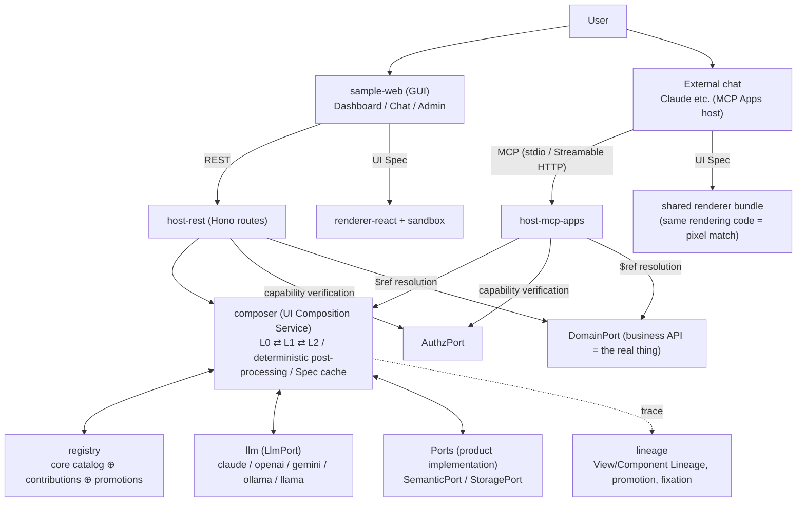
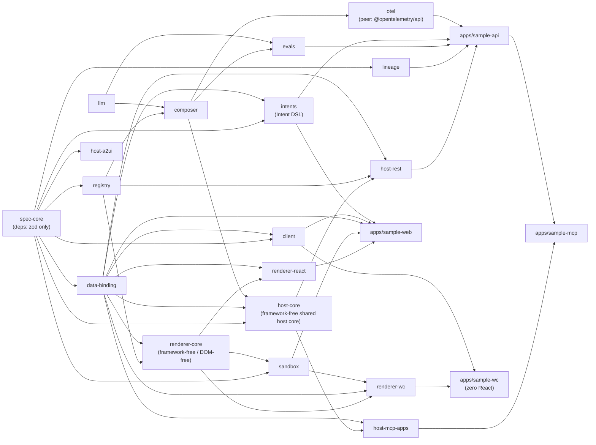
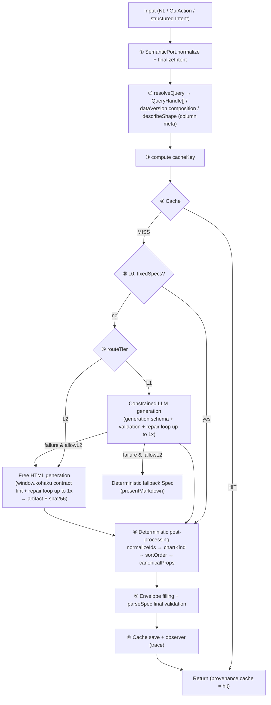
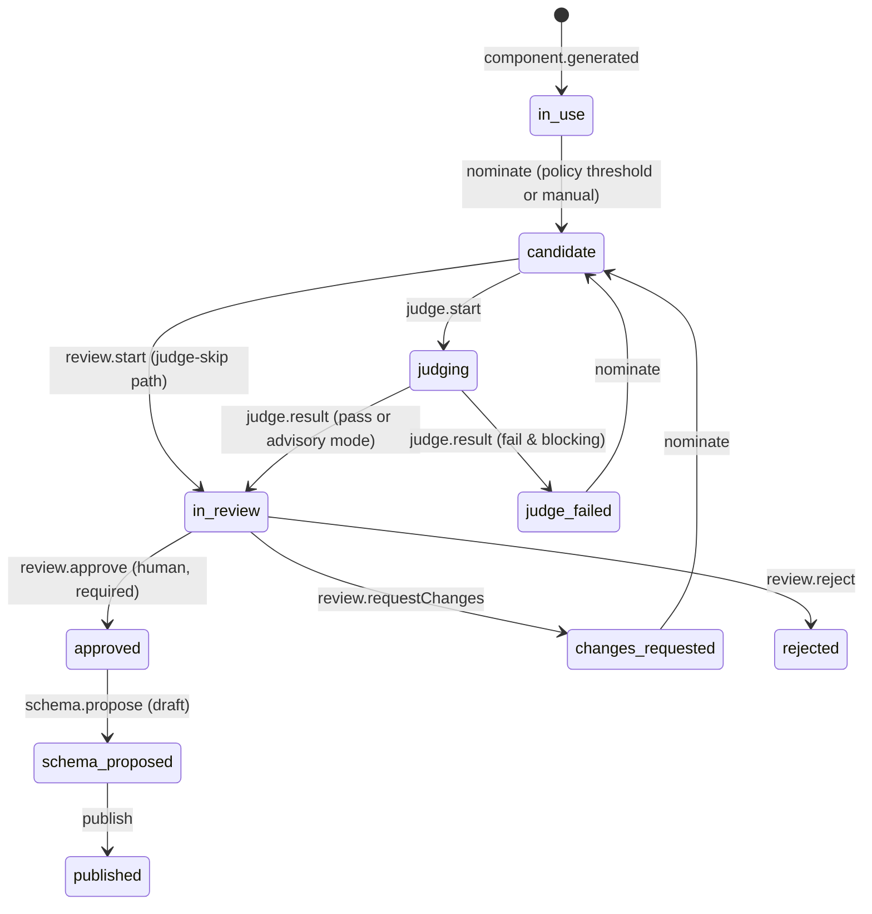

# kohaku Implementation Design Document

English | [日本語](design.ja.md)

| Item | Content |
|---|---|
| Version | v0.1 (implemented) |
| Last updated | 2026-09-11 |
| Positioning | Design record of the **as-implemented** state. The protocol's normative requirements (MUST/SHOULD) are in [../spec/SPEC.md](../spec/SPEC.md) |
| Audience | Developers extending or maintaining the framework |

---

## 1. Purpose and Core Principles

kohaku is a Generative UI foundation that satisfies the AI-era UI requirement: "for a request with the same content, the same UI appears whether it comes through chat or through the GUI."

> **Treat the UI as data (a declarative UI Spec) rather than code, and fully separate generation (Composition) from rendering (Rendering).**

Three implementation pillars derive from this principle:

1. **Structural guarantee of identical display** — Both chat and Web converge on the same Composition Service, and the Spec cache (key = `intentHash + dataVersion + catalogFingerprint`) guarantees "same-content request → same Spec" at the byte level. The LLM's temperature 0 is an aid, not a guarantee.
2. **Pass-by-reference data binding** — The UI Spec carries only `query://` references, and bulk data is fetched by the components directly from the API. What the LLM assembles is the plumbing, not the water (structural elimination of transcription hallucination).
3. **Three-tier generation hierarchy and governance** — L0 (fixed) ⇄ L1 (declarative composition) ⇄ L2 (free generation in a sandbox) + a promotion pipeline. Flexibility is secured at L2, and passing through governance (review, schematization, audit) it is solidified down into L1/L0.

## 2. Overall Architecture



Key points in the implementation:

- **The Intent layer lives on the product side (SemanticPort)**. GUI operations are normalized deterministically, natural language is normalized by the LLM, and both are normalized into the same `CanonicalIntent`. The framework owns only the deterministic part of normalization (key sorting, hashing).
- **host-* are thin adapters**. They only wire up the compose call, capability issuance, and lineage recording; the logic lives in composer / lineage.
- **The backend is language-independent**. Everything below `host-rest` in the diagram above (composer, ports, lineage, host-*) is the TS reference implementation (`packages/*`), but a **full Python port** of the same protocol (`python/kohaku`; REST via FastAPI, MCP via the MCP Apps profile) also exists, is wire-compatible, and is conformance CONFORMANT. See the "Python implementation" subsection in §3 and [../python/README.md](../python/README.md).

## 3. Package Structure and Dependency Graph



Key dependency point: **`renderer-core` is the single source of truth for environment-neutral renderer logic**, and both `renderer-react` and `renderer-wc` consume the same core (details in §7.1).

| Package | Responsibility | Core files |
|---|---|---|
| spec-core | UI Spec schema, structural validation, Intent normalization/hashing, diff/patch, cacheKey, **Port types** | `src/schema/spec.ts` `src/ports.ts` `src/diff.ts` |
| registry | ComponentDefinition, federated resolution, capability negotiation, **LLM generation schema conversion** | `src/catalog.ts` `src/generation.ts` `src/core/` |
| llm | LlmPort (provider-independent contract), env resolution, structured-output fallback, `streamObject` (optional extension for cumulative partial notifications — the source for incremental streaming) | `src/adapters/ai-sdk.ts` (SDK isolation point) |
| composer | compose/recompose, L0/L1/L2, repair loop, deterministic post-processing, cache | `src/compose.ts` (entry) `src/tier-ladder.ts` (L1→L2 ladder) `src/single-flight.ts` `src/assemble.ts` `src/post/rules.ts` |
| data-binding | `query://` canonical form, BindingClient (Bearer capability, STALE detection) | `src/client.ts` |
| storage-memory | Reference StoragePort implementations: `createMemoryStoragePort()` (pure in-process, the Zero-Port default and test double) and `createFileStoragePort(dataDir)` (the former sample-api port: Spec cache in memory, lineage / promotions / fixations under `dataDir`) | `src/memory-storage-port.ts` `src/file-storage-port.ts` |
| authz-hmac | Reference AuthzPort implementation: `createHmacAuthzPort(secret)`, the HMAC-SHA256 capability token | `src/hmac-authz-port.ts` |
| port-contracts | **Private, test-only.** Shared StoragePort / AuthzPort contract suites (`describeStoragePortContract` / `describeAuthzPortContract`) that every adapter — reference or production — must pass | `src/storage.ts` `src/authz.ts` |
| intents | Intent DSL (environment-neutral). From `defineVocabulary` (single source for value set + labels) and `defineIntent` (single definition), derives IntentDef (SemanticPort), FacetView (GUI facets), MCP tool input, and coerce | `src/vocabulary.ts` `src/intent.ts` `src/facet-view.ts` |
| renderer-core | Framework-free / DOM-free shared core. Aggregates event governance (`resolveEmit`), write-target decision (`resolveInvokeTarget`), state store, BoundDataController (freshness reconciliation / last-write-wins / invalidation), per-part presenters, messages, and theme resolution | `src/control/emit.ts` `src/stores/bound-data-controller.ts` `src/presenters/` |
| renderer-react | React renderer. SpecView (flat-list resolution), ImplRegistry, useBoundData, per-node ErrorBoundary. Pure logic is imported from renderer-core (single source of truth) | `src/SpecView.tsx` `src/context.tsx` |
| renderer-wc | Non-React renderer. A single `<kohaku-surface>` (Custom Elements + Shadow DOM) builds the whole tree. Charts are inline SVG, and L2 directly reuses sandbox. Guarantees parity with renderer-react | `src/kohaku-surface.ts` `src/tree.ts` `test/parity/` |
| client | Typed host client (all routes of REST profile §6.1), SSE stream, re-export of binding composition | `src/client.ts` |
| sandbox | L2 isolated execution (triple defense), postMessage bridge, SandboxFrame, `./smoke` (pre-delivery smoke verification runner; jsdom is an optional peer) | `src/mount.ts` `src/host-bridge.ts` `src/smoke/` |
| lineage | Event recording, **promotion state machine**, fixation, Recorder for REST | `src/promotion/machine.ts` `src/lineage.ts` |
| evals | Golden Spec regression (jitter normalization), LLM-as-Judge (L2 promotion review + L1 quality scoring), quality regression harness, FixtureLlm | `src/golden.ts` `src/judge.ts` `src/quality.ts` |
| host-core | Framework-free shared host core, consumed by host-rest and host-mcp-apps (the same relationship renderer-core has with renderer-react / renderer-wc — a single source of truth two thin adapters consume). Fixation (L1→L0) delivery + staleness self-healing (`composeWithFixation` / `resolveFixatedResult` / `settleFixation`), capability issuance (`issueCapabilityForSpec` for a composed Spec / `issueCapabilityForRefs` for a ref list, TTL default 600s, plus the fail-closed `issueSpecCapabilitySafely` wrapper both hosts call), read-ref parsing shared by `/binding/resolve`, `kohaku_resolve_binding` and initial-data pre-resolution (`parseInvokableRef`: reserved-param split + merge and source check; capability verify and error → status mapping stay in each host), the post-write effects response (`applyActionEffects`, fail-open), intent resolution (`resolveIntent`), the cancelled-aware fail-open composed-result recording (`recordComposedResult`), client-safe error messages (`errorMessage` / `clientMessageFor`), and fail-open observability-hook helpers (`notifyHook` / `failOpen`). Depends on spec-core + data-binding + composer | `src/fixation.ts` `src/capability.ts` `src/binding-ref.ts` `src/action-effects.ts` `src/intent.ts` `src/errors.ts` `src/view-recorder.ts` |
| host-rest | REST profile (Hono). Routes are split by group | `src/routes.ts` `src/routes/` |
| host-mcp-apps | MCP Apps (SEP-1865) profile | `src/server.ts` (tool registration) `src/initial-data.ts` (initial-data pre-resolution) `src/snapshot.ts` |
| otel | Thin, opt-in OpenTelemetry layer. `createOtelComposeObserver` turns `ComposeObserver` calls into spans; combined with a product's own observer via composer's `composeObservers`. Depends only on composer (peer: `@opentelemetry/api`) — no exporter/SDK wiring (host process's own responsibility). See "Trace context / OTel" below | `src/observer.ts` |
| host-a2ui | A2UI profile [Draft] (depends on spec-core only, environment-neutral). **A2UI v0.9.1 compliant by default**: UISpec → `createSurface`+`updateComponents`, SpecPatch → `updateComponents`, A2UI `action` → GuiAction, JSONL serialization. Since v0.9.1 is strict and does not allow wire extensions, kohaku-specific information is losslessly stashed into a sidecar (`KohakuSidecar`). **Opt-in `target: "v1.0"`** (`toA2ui`/`patchToA2ui`) follows the A2UI v1.0 RC instead: `createSurface` bundles `components` (and, with `resolveData`, `dataModel`) directly, `theme` is dropped, and `fromA2uiEvent` additionally accepts the v1.0 function-call messages (`callAgentFunction`/`rendererFunctionResponse`), returning an explicit `{kind:"unsupported", reason}` for them since kohaku has no function-call concept. Default output (`target` omitted) stays byte-identical (golden-tested) | `src/to-a2ui.ts` `src/patch-to-a2ui.ts` `src/from-a2ui-event.ts` `src/jsonl.ts` |

Build approach: all packages **export src directly during development** (`exports` points at `.ts`); tsx / Vite / Vitest resolve TS directly, and type checking is per-package `tsc --noEmit` on TypeScript 7. Publishing does not disturb that split: `publishConfig` overlays `exports` with `dist` only inside the published tarball, so the workspace keeps resolving source. The dist itself is a 1:1 transpile with the same `tsc` (TypeScript 7, which does emit declarations as of 7.0.2) rather than a bundler: a bundler would rewrite the sandbox guest closures that are stringified with `Function.prototype.toString()`, and using one compiler for both checking and emitting removes any chance of the two disagreeing. Because no local test ever loads the build output, `pnpm smoke:pack` packs every package, installs the tarballs with plain npm outside the workspace and imports and type-resolves each entry; it runs as its own CI job.

### Python implementation (`python/kohaku`)

A **full Python port** of the same protocol (Kohaku Protocol v0.1) is co-located in the monorepo (the uv workspace under `python/`; outside the pnpm workspace). It is **wire-compatible** with the TS reference implementation — because canonical JSON is byte-identical, `intent.hash` / `specHash` / cache keys / `catalogFingerprint` match across languages. TS host ⇄ Python host passing conformance is the proof that "the protocol is language-independent" (isomorphic to how renderer-react ⇄ renderer-wc parity is the proof that "the Spec is renderer-independent").

- **The contract boundary is `spec/`**. Python depends only on `spec/` (SPEC.md + JSON Schema) and the pre-built renderer HTML, and never touches the internals of the TS packages. Conformance status is **MUST 19/19 = CONFORMANT** — the 19 are the black-box-verifiable MUSTs of the 33 in the conformance manifest; the remaining 14 reference MUSTs (MCPAPP-* / SBX-*, and five documentary norms) are covered by package tests (the CI jobs `conformance-ts` (TS host) and `conformance-python` (Python host) each start their sample host and guarantee it on every commit via the TS-side CLI's black-box inspection).
- **Package correspondence** (submodules of `python/kohaku/src/kohaku/` correspond to TS `packages/*`):

| Python submodule | Corresponding TS package |
|---|---|
| `spec/` | spec-core (schema, canonicalization, validation, Port definitions) |
| `registry/` | registry (core is built from the JSON exported by TS) |
| `data_binding/` | data-binding |
| `intents/` | intents |
| `llm/` | llm (OpenAI-compatible + claude 〈`anthropic` SDK `>=1.0`, strict forced tool-use — `strict: true` plus `_sanitize_for_anthropic` to strip/description-fold JSON Schema keywords the provider's structured-output subset rejects〉 + gemini 〈google-genai〉 adapters / FakeLlm; introduced incrementally via extras) |
| `composer/` | composer (L0/L1/L2, repair loop) |
| `lineage/` | lineage (recording, promotion, fixation) |
| `evals/` | evals (judge / golden / FixtureLlm) |
| `storage/` | equivalent of `@kohaku-ui/storage-memory`'s `createFileStoragePort` |
| `host_core/` | Full mirror of host-core: every TS module now has a Python counterpart, consumed by `host_rest` / `host_mcp` as thin adapters (per-module detail: [../python/README.md](../python/README.md)). One behavioral difference persists: the shared keyed mutex (`keyed_mutex.py`) that both profiles serialize fixation self-heal through differs in key granularity — REST keys it by `(tenant, intentHash)`, MCP by `intentHash` alone |
| `host_rest/` | host-rest (FastAPI) |
| `host_mcp/` | host-mcp-apps (MCP Apps profile) |

- **Cross-language compatibility is guaranteed at 3 points** (golden fixture / core catalog JSON export / conformance black-box). The layer dependency direction (no back-flow) is mechanically guaranteed by import-linter's layers contract (`uv run lint-imports`).
- **Intentional differences**: JS validation (L2's `L2_SCRIPT_SYNTAX` syntax check / the `l2Smoke` runner) is provided by **Node sidecar delegation** to the bundled TS CLI (`kohaku smoke-l2`), and is skipped in a standalone deployment where Node is not co-located (per the spec's "skip in environments where dynamic code generation is impossible" provision). Internal APIs are snake_case; the wire shape (JSON keys, endpoints, `_meta` keys) is fully identical to TS. The full set of permanent differences and setup steps is authoritatively covered by [../python/README.md](../python/README.md).

## 4. Core Data Model

### 4.1 UI Spec

[../spec/examples/quarterly-sales.spec.json](../spec/examples/quarterly-sales.spec.json) is the canonical example. Design invariants:

- **Flat list + ID references** (`components[]` + `children: id[]`). Easy for the LLM to generate and edit, and suited to diff/patch and future streaming. An acyclic DAG rooted at `id: "root"`.
- **The envelope is not generated by the LLM**. The LLM's output is only `{components, events}`; `kohaku` / `intent` / `dataVersion` / `provenance` are filled in by code (composer `assembleSpec`).
- **Theme-independent**. Tokens (colors, spacing) are resolved by the renderer's `ThemeTokens`. Within the same product, both Web and external chat use the same tokens → pixel match.
- `provenance` is the front face of View Lineage (tier / cache / model / fallback). The ProvenanceBadge in the UI doubles as the audit display.

<a id="cache-key"></a>
### 4.2 CanonicalIntent and Cache Key

```
CanonicalIntent = { canonical: "sales.quarterly_summary", params: {…}, hash: "sha256:…" }
hash   = sha256(canonicalStringify({canonical, params}))   // deep key-sorted canonical JSON
cacheKey = "kohaku:0.2:<intentHash>:<dataVersion>:<catalogFingerprint>"
```

- `canonicalStringify` (deep key sort + undefined removal) is the foundation of determinism. Whether it originates from GUI or from NL, an Intent with the same meaning becomes the same byte sequence → the same hash.
- Including `catalogFingerprint` (FNV-1a over the sorted, joined `type@version` set; a sandbox-template entry appends `#fnv1a64(html)` so re-publishing different content under the same type@version is distinguished from what it replaced) in the key is an additional decision made at implementation time — when a component is revised or promoted and the catalog changes, the fingerprint changes and an old Spec is not mistakenly reused.
- **`generatorVersion` (6th, optional) and `policyFingerprint` (7th, optional) extend the key**: `cacheKey = "kohaku:0.2:<intentHash>:<dataVersion>:<catalogFingerprint>[:<generatorVersion>][:<policyFingerprint>]"`. `generatorVersion` is the caller-set, hand-bumped separator described in the few-shot / output-language / design-system sections below. `policyFingerprint` (`packages/composer/src/context.ts`'s `policyFingerprint`) is a belt-and-suspenders **derived** from `ComposePolicy.outputLanguage` / `designSystem` (its full body) / `fewShot.id` / `selectComponents.id` (canonical JSON → sha256, first 16 hex) — it separates the cache automatically even when a caller forgets the manual `generatorVersion` bump those sections call for. It is the empty string (equivalently: omitted) whenever none of those four fields is set, so a policy that never touches them produces a cache key byte-identical to before this component existed; when it is non-empty but `generatorVersion` is unset, a `-` placeholder fills the 6th slot so the two components can never collide positionally. This is an internal cache-partitioning value, not part of the wire protocol.

### 4.3 SpecPatch (diff model)

Not JSON Patch but a **semantic patch at the component level** (`upsert` / `remove` / `events` / `intent` / `dataVersion` / `refVersions` / `state` / `provenance`). `orderComponents` (root-origin DFS) is the canonical order, and `applyPatch(prev, diffSpec(prev, next)) === next` holds. It is the response format of the interaction loop (`recompose`).

## 5. Composition Pipeline (composer)



### The two-stage structure of L1 constrained generation

To limit the LLM's role to "selection from the catalog + typed props filling," the generation schema is built dynamically (registry `buildGenerationSchema`):

1. **Presentation schema** (least common multiple across providers): a per-component variant (anyOf). Props are deterministically converted from the true Zod schema — `optional → anyOf [orig, null]`, all properties required, `additionalProperties: false`, defaults removed (to satisfy OpenAI strict / Gemini constraints). **`data.$ref` is pinned to the enum of QueryHandles that SemanticPort resolved** — the LLM cannot forge an unknown reference. Event payloads are a `{key, value}` pair array (strict mode disallows free-form objects).
2. **Re-validation with the true schema**: the generated result has nulls removed (null = the convention for omission) → parsed with the catalog's propsSchema (default filling) → matched against the catalog (type, data requirement, event declarations) → structural validation. On failure, the error list is attached to the prompt and a repair retry is attempted just once.

<a id="few-shot"></a>
### few-shot self-reinforcement (generatorVersion bump convention)

Wiring `ComposePolicy.fewShot` (3-9) inserts an "examples of good composition" section into the L1 generation prompt, after the catalog and before the instructions, making it easier for the LLM to follow existing good compositions. It does not participate in safety — the post-generation validation pipeline (generation schema → `catalog.validate` → structural validation) is unchanged, and few-shot is only quality improvement. The sample supplies **fixated (review-passed) Specs as exemplars** via `createFixationFewShot(storage)` (`apps/sample-api/src/fewshot.ts`), injecting the top 2 (`maxExamples`, default 2) ordered by `canonical match first → intentHash ascending`. Throws from `examples()` are swallowed and treated as empty, so a failure on the supply side never stops generation. The full fixation list and each canonical's sorted derivation of it are cached for up to 1s (`options.cacheMs`), bounding how stale a fixation change can be without redoing the copy+sort on every single L1 generation.

- **Determinism contract**: `examples(intent)` must always return the same order and the same set for the same intent. This is the premise of cache consistency: "same intent → same prompt → same generation."
- **generatorVersion bump convention (required)**: **turning few-shot on/off or changing the supply source is a change to prompt content**, and the `generatorVersion` component of cacheKey (default `p<PROMPT_REVISION>/<modelId>`) must be bumped to reflect it. Without a bump, an already-cached intent keeps returning an old-generation Spec and few-shot has no effect. Conversely, **if few-shot is not supplied (empty array), the generation prompt is byte-for-byte identical to the previous revision**, and `buildL1Prompt` does not add the section itself (the reason existing FixtureLlm fixtures are unharmed). For reference: when this sample made few-shot on by default, `PROMPT_REVISION` was raised `"1" → "2"` (`packages/composer/src/prompt.ts`). The same convention applies to changes in `selectComponents`. `ComposePolicy.fewShot.id` / `selectComponents.id` (optional) additionally feed `policyFingerprint` (§4.2), an automatic safety net on top of this manual convention.

<a id="output-language"></a>
### Output language of generated text (generatorVersion bump convention)

`ComposePolicy.outputLanguage` selects the language of the **user-visible text the LLM generates** — the L1 heading title and L2 widget text (`<title>`, labels, annotations). It is threaded into both generation prompts as an "Output language" section (`buildL1Prompt` / `buildL2Prompt`), so the generated text follows the requested language **regardless of the prompt's own language** (the L1/L2 system prompts themselves are authored in English as of `PROMPT_REVISION` `"10"`). **The default is `"English"`.** This is orthogonal to the renderer i18n override (`RendererProvider.messages` / `context.messages`), which only re-skins the library-default UI strings (loading, validation, empty state) and never touches generated content. Because changing `outputLanguage` changes prompt content, it follows the same **generatorVersion bump convention** as few-shot / designSystem: bump the `generatorVersion` component of cacheKey so Specs cached under a prior language are separated by generation (without a bump, an already-cached intent keeps returning the previous language). When unspecified, the prompt bytes are identical to a build that never references the option.

**Per-session language (the wiring the demo uses)**: the wire carries the language as `session.locale` (`"en"` / `"ja"`; SPEC §6.1 "Session locale"), host-rest threads it into `SessionContext.locale`, and `ComposeContext.policyFor` (resolved once at the entry of `compose` / `composeStream`, after `withTenantCatalog` and before the cache key is computed) swaps in a per-session `ComposePolicy`. On the MCP surface the same knob is a per-tool-call `locale` argument (SPEC §6.2 "Tool locale"): every UI-producing tool accepts it, the calling LLM sets it to the user's conversation language (the tool description says so), and host-mcp-apps maps it onto the same `SessionContext.locale` — the reserved name is stripped before the intent params so the intent hash stays language-neutral. sample-api prebuilds an EN/JA policy pair (`compose-context.ts`): EN is the historical policy verbatim (generatorVersion `p<rev>/<model>/ds3` — existing caches and goldens untouched), JA sets `outputLanguage: "Japanese"`, JA L0 fixed specs (`createFixedSpecs("ja")`), and generatorVersion `…/ds3/ja` (the language token is what separates the caches; the cache key itself has no locale component). JA omits few-shot (fixated examples are EN Specs and would bias JA generation). The fixation shortcut is gated to EN sessions (`host-deps.ts`): `FixationRecord` carries no language, so a Spec pinned from EN traffic is not served to JA sessions — JA falls through to normal compose (JA cache or JA generation). Known demo trade-offs: mixed-language traffic dilutes fixation-proposal stability tallies (JA produces different structureHashes for the same intentHash), and **data cell values stay English** (`query://` results are language-neutral by invariant — region/channel display labels inside chart/table rows come from the domain layer; drilldown accepts both languages via the bilingual vocabulary's `reverseLabel`). The same is true of column headers, KPI labels, and KPI notes coming from the DomainPort (`apps/sample-api/src/domain/queries.ts`, e.g. "Total revenue", "Revenue (JPY)", "No target set") — they are English regardless of `session.locale`; bilingualizing DomainPort-sourced labels is a future item, not yet designed.

<a id="prompt-caching"></a>
### Opt-in Anthropic prompt caching (`promptParts`) vs. schema-stage `data.$ref` caching (`refConstraint`)

Anthropic's structured-output path compiles the request's output grammar (schema + tool set) and caches that compiled form for 24h, keyed on the grammar's own shape. Decision #4 (§13) pins `data.$ref` to an enum of the resolved QueryHandle set, which is a function of the Intent — so under the default the compiled grammar differs per Intent, and a provider that caches grammar compilation recompiles on (almost) every distinct Intent rather than reusing a prior compile. This is a real, measured trade-off against decision #4's governance benefit (schema-level forgery-proofing), not a bug, so kohaku ships **two independent, opt-in escape hatches** rather than changing the default, and expects an operator to measure before flipping either one (`apps/sample-api/scripts/measure-grammar-latency.ts`).

- **`ComposePolicy.refConstraint: "schema" | "validate"`** (default `"schema"`, i.e. decision #4 unchanged) governs *what the generation schema itself constrains*. `"validate"` relaxes `buildL1GenerationSchema`'s `data.$ref` from the per-Intent enum down to a plain `{ type: "string" }` — making the compiled grammar shape Intent-independent (subject to `selectComponents` narrowing) and therefore reusable across different Intents' compose calls, not just repeated calls of the same one. The cost: the schema can no longer reject an out-of-set reference before it is returned, so `generateL1`'s `collectIssues` instead checks set-membership explicitly after generation and sends a `DATA_REF_UNRESOLVED` issue back into the existing repair loop when a reference falls outside the resolved set (SPEC §4's CMP-GEN-001 permits either enforcement point). Because this changes the schema sent to the LLM, `"validate"` participates in `policyFingerprint` (§4.2) — but the default `"schema"` (whether set explicitly or left unset) folds in identically to unset, so no existing cache key or fixation-stability golden moves.
- **`promptParts` (`GenerateObjectRequest`/`GenerateTextRequest`, `@kohaku-ui/llm`)** is a separate, complementary mechanism: an optional `{ cacheable, rest }` split of `prompt` (invariant: `cacheable + rest === prompt`) that a caching-capable adapter can use to mark a leading, byte-stable portion of the prompt **content** (as opposed to the output grammar) for provider-side reuse. `buildL1Prompt`/`buildL2Prompt` already factor into a static half (`buildL1PromptStatic`/`buildL2PromptStatic` — canonical intent, refs, shape, catalog, few-shot, output language, design system: everything fixed for the lifetime of one `generateL1`/`generateL2` call) and a repair-feedback suffix that is the only part varying attempt-to-attempt; `buildL1PromptParts`/`buildL2PromptParts` expose exactly that boundary as `cacheable`/`rest`, so it holds by construction and needs no runtime check. This targets **within-one-compose reuse** across the repair loop's retries — reordering the prompt to front-load the Intent-independent sections (catalog/few-shot/output-language) ahead of the necessarily per-Intent canonical-intent section would open a wider, cross-Intent cache boundary, but was rejected because it would change `buildL1Prompt`/`buildL2Prompt`'s existing byte output, which every FixtureLlm fixture is keyed on. The llm layer only *acts* on this when both `LlmConfig.promptCache` is on (`KOHAKU_LLM_PROMPT_CACHE=1`, default off) and `config.provider === "claude"` (`packages/llm/src/adapters/ai-sdk.ts`): it then splits the user message into two text parts and marks the leading one with `providerOptions.anthropic.cacheControl = { type: "ephemeral" }`. It is a no-op for every other provider (OpenAI/Gemini already do automatic prefix caching; ollama/llama have no equivalent this adapter addresses) and a no-op whenever the caller passes no `promptParts` — so composer always populates `promptParts` (cheap to compute) while the actual behavior change is gated entirely by the opt-in env flag. `PROMPT_REVISION` is unaffected either way (no prompt content changes — this is purely how the unchanged bytes are transmitted).
- Both are additive: `promptCache` off / `refConstraint` unset (the defaults) reproduce the pre-existing prompt bytes, generation schema, `policyFingerprint`, and cache keys exactly.

<a id="reasoning-effort"></a>
### Reasoning effort (`ComposePolicy.effort`)

`ComposePolicy.effort?: { l1?: LlmEffort; l2?: LlmEffort }` (`LlmEffort = "low"|"medium"|"high"|"xhigh"|"max"`, `@kohaku-ui/llm`) is threaded per tier into `generateL1`'s `GenerateObjectRequest.effort` and `generateL2`'s `GenerateTextRequest.effort` — independently, since L1 (constrained catalog selection) and L2 (free-form HTML) have different reasoning-cost profiles and an operator may want to spend more effort only on one of them. A tier left unset sends no `effort` field at all for that call (provider default). `LlmPort` implementations that do not implement effort control (`FakeLlm`/`FixtureLlm`, or a provider `adapters/ai-sdk.ts` has no matching option for) simply ignore it.

- **Provider wiring (`adapters/ai-sdk.ts`'s `resolveProviderOptions`)**: `claude` sets `providerOptions.anthropic.effort` — the installed `@ai-sdk/anthropic`'s request-building code path reads `effort` off the *language-model* provider-options object (`anthropicLanguageModelOptions`) and forwards it as `output_config: { effort }` in the API body; a same-named `effort` field also exists on a *different* object, the *system-message* provider options (`anthropicSystemMessageProviderOptions`, gated behind the `mid-conversation-effort-2026-08-01` beta for changing effort mid-conversation) — that one is not what this wires. `openai` sets `providerOptions.openai.reasoningEffort` (the Responses-API model `resolveModel` constructs exposes this on `openaiLanguageModelResponsesOptionsSchema`). `ollama`/`llama` (via `@ai-sdk/openai-compatible`) set `providerOptions.openaiCompatible.reasoningEffort`, read by that adapter regardless of which of the two provider names is actually configured. `gemini` has no equivalent effort-*level* option in the installed `@ai-sdk/google` (only a numeric `thinkingConfig.thinkingBudget`, a different unit), so `effort` is silently ignored for that provider.
- **Cache-key correctness**: folded into `policyFingerprint` (§4.2) whenever `policy.effort` is set at all (both `l1`/`l2` participate, defaulted to `null` when only one tier is set) — effort changes generated output for the same Intent/model. Never setting it is indistinguishable from unset (empty-string fingerprint, byte-identical cacheKey to before this field existed).

<a id="per-tier-llm"></a>
### Per-tier LLM (`ComposeContext.llmByTier`)

`ComposeContext.llmByTier?: { L1?: LlmPort; L2?: LlmPort }` is an additive per-tier override of the single `llm: LlmPort` every tier used before this field existed; `llm` stays required and is the fallback for any tier `llmByTier` does not set. The motivating use case is `kohaku dataset export` (the distillation dataset for fine-tuning a small model on exactly the L1 constrained-generation task): an operator can point L1 at that fine-tuned model while keeping a larger general model for L2's free-form generation, without giving up the ability to run both from one `ComposeContext`. `resolveTierLlm(ctx, tier)` (`context.ts`) is the single resolution point both `tiers/l1-generate.ts` and `tiers/l2-generate.ts` call at the point each tier's LLM is actually dispatched; when `llmByTier` is unset it always returns `ctx.llm`, identically to before.

- **Model-identity recording**: `TierResult.model` (surfaced in `ComposeAttempt`/`ComposeTrace`) now reflects the port `resolveTierLlm` actually resolved for that tier — for L1 this was already true (`GenerateObjectResult.model` comes from the port that generated it); for L2 it is `llm.modelId` read off the *resolved* tier port rather than the base `ctx.llm.modelId` (a pre-existing bug this change surfaced and fixed: `GenerateTextRequest` carries no `model` result field of its own, so `generateL2` has always substituted the calling port's own `modelId` — but before this change that was unconditionally the base port even when a per-tier override was in play).
- **Cache-key correctness — the hard part**: `defaultGeneratorVersion(llm)` (prompt.ts) composes `p<PROMPT_REVISION>/<modelId>` from a single model, but a caller (e.g. sample-api) may override `generatorVersion` with its own string that does not encode the model id at all — so `generatorVersion` alone cannot be relied on to separate the cache once per-tier models are in play. Instead, `compose.ts` computes `tierLlmFingerprintMaterial(ctx)` (`context.ts`) — the `{provider, modelId}` of every `llmByTier` entry — and folds it into `policyFingerprint`'s second argument (§4.2) **only when at least one set tier's provider/modelId genuinely differs from the base `ctx.llm`'s**. So: `llmByTier` unset → `tierLlmFingerprintMaterial` returns `undefined` → `policyFingerprint`'s existing "no fingerprinted field set" early return still fires → cacheKey byte-identical to before this field existed. `llmByTier` set but every entry happens to match the base model (no actual generation difference) → same early return, same cacheKey. Only a real per-tier model difference perturbs the cache key — and it does so automatically, without any caller remembering to bump `generatorVersion` by hand.
- **`defaultGeneratorVersion` is deliberately left untouched** (no overload taking per-tier ports): it is a caller-facing convenience the composer never calls itself (see the field-level doc on `ComposePolicy.generatorVersion`), so it has no way to observe `llmByTier` even if a caller uses it. `generatorVersion` keeps answering "which prompt revision / which base model"; the fingerprint above is what answers "did this compose actually use a different model for some tier" — see `defaultGeneratorVersion`'s own doc comment for the full reasoning.
- Additive throughout: a `ComposeContext` that never sets `llmByTier` sees no change to dispatch, recorded model, `policyFingerprint`, or cacheKey.

<a id="streaming"></a>
### Incremental streaming (composeStream's provisional patches)

`composeStream` returns "skeleton (`ui.loading`) → provisional patch × 0..N → final patch → done" (within the range of patch 0..N in SPEC §6.1.1 — the wire contract is unchanged). A provisional patch is a **diff to a provisional Spec** assembled from the LLM's partial output, and it flows only when llm implements `LlmPort.streamObject` (optional implementation; notifies cumulative partials via callback) (FakeLlm uses the `partials` script; the ai-sdk adapter uses native structured mode only — the prompt JSON fallback keeps to the old skeleton → final patch behavior).

- **parse & heal** (`buildProvisionalSpec`): the cumulative partial is run through the generation schema decode (throw = incomplete → skip), **completed components are extracted via one whole-batch catalog validation** (rather than one call per component — `validateAgainstCatalog` has no cross-component dependency here, since a provisional Spec never carries events) → `children` is pruned to the ids that have arrived → `events` are deferred until the final patch (because reference integrity of payload templates is not guaranteed in an intermediate form) → the usual deterministic post-processing + structural validation (`postAndValidate`) + negotiate. Stages that do not pass are skipped. No provisional is emitted until at least one real component other than root is complete (so the skeleton's loading is not replaced with an empty container).
- **Delivery is conflating** (keeping only the latest partial) **and throttled to at most one provisional-patch emission per 60ms** of wall-clock time: when consumption or generation outpaces that interval, intermediate forms are coalesced into the next emission rather than each paying the full decode/validate/diff cost. A newer partial arriving during the wait still keeps overwriting the pending draft, so the next emission after the wait always reflects the freshest content, and the final patch (once generation completes) is never delayed by this throttle. IDs are assigned by applying normalizeIds incrementally (root fixed + DFS-order sequential numbering) — practically stable for append-centric partial output, and even if it wobbles, the final patch converges it to the canonical form (the result of applyPatch in receive order is always a validated Spec; REST-STR-002 is guaranteed by construction).
- **Governance is unchanged**: provisional Specs are excluded from caching, lineage recording, and fixation (a MUST NOT of the SPEC). Only the **leader** in single-flight streams, and followers receive only the final form of the shared result. Streaming happens only on the first attempt (repair attempts are non-streaming — they do not roll back the provisional display). No effect on generatorVersion (the prompt is unchanged).
- **Schema/L0-lookup sharing**: `PreparedCompose.getL1Schema()` / `getFixedSpec()` (`packages/composer/src/compose.ts`) lazily memoize `buildL1GenerationSchema` and `ComposePolicy.fixedSpecs.lookup` for the lifetime of one compose, so `composeStream`'s own fast-path checks and the shared generation body (`generateSpec` / `generateL1`) never build the schema or query the fixed-spec source more than once between them — a cache hit or L0 short-circuit still pays nothing extra, since the getters are only invoked lazily.

<a id="budget-guard"></a>
### Cost/token budget guard (automatic tier downgrade)

Wiring `ComposePolicy.budget` evaluates the budget **immediately before an LLM call (before L1 generation, before repair, before L2)**, and on rejection it gives up the additional LLM call (repair retry, L2 escalation) and downgrades to the deterministic fallback (`presentMarkdown`). It is a safety valve to curb runaway cost and does not participate in generation quality. **The budget is "a threshold to stop additional calls," not a cap on a single call** — because the LLM's output volume cannot be determined in advance, a first, single call that greatly exceeds the budget cannot be stopped (a hard cap is structurally impossible; overages are recorded after the fact in `trace.usage`).

- **`perCompose.stopAfterTokens`**: immediately before each LLM call, if the accumulated usage of prior attempts (input+output total) has reached this value, subsequent calls are skipped. `stopAfterTokens: 0` means "zero budget = generate nothing at all" and falls back without even calling the first L1.
- **`check()`**: a global budget hook supplied by the product (daily budget, per-tenant budget, etc.; **where state is held is a product responsibility** — the framework does not decide it). Called immediately before each LLM call, and `allow:false` skips that call at that point. It must be a **side-effect-free, idempotent read** (it may be called multiple times within one compose). A `throw` is swallowed and passes through (allow) — so that when the budget state is undeterminable, the entire UI is not brought down. This fail-open is not left unobserved: the firing is transcribed to `observer.onBudgetCheckError` (below).
- **Recording and observing downgrades**: a downgrade Spec carries in `provenance.fallback`'s (`kind: "generation"`) `reason` a value from which the budget overage can be identified. `observer.onError` (`phase: "fallback"`) is passed `ctx.budgetExceeded: true` and `reason`, allowing **machine discrimination without relying on string matching**. A downgrade Spec is **not cached** (it rides the fallback non-persistence convention). L0 (fixed Spec) and cache hits do not call the LLM, so they are not subject to evaluation (pass-through). The streaming path (`composeStream`) shares the generation core (`runGeneration`), so budget downgrade flows naturally as **skeleton → fallback patch**.
- **Observing fail-open (`onBudgetCheckError`)**: when `check()` `throw`s and falls to pass-through, the firing is transcribed to `observer.onBudgetCheckError(ctx, error)`. **This is not a failure notification** (generation continues and the Spec may be delivered normally), so it is a separate channel from `onError`, used to monitor and correct the state where the budget hook is broken and the entire UI is unconditionally passing through. `ctx.tier` (`L1`/`L2`) tells which stage the throw occurred in. It may be called per LLM call where a `throw` occurred.
- **Backward compatibility**: if `budget` is unspecified, the budget-evaluation code itself does not run, and behavior and performance are completely unchanged.

<a id="abort-cancellation"></a>
### Client aborts are distinguished from generation fallbacks

`ComposeOptions.abort` threads a caller-supplied `AbortSignal` through the L1/L2 LLM generation (including the repair loop); host-rest wires `c.req.raw.signal` so an abandoned request (client disconnect, timeout) is not generated to completion for nobody. An `LlmError` with code `ABORTED` is classified separately from a transient provider failure (`TierResult.failure: "aborted"` rather than `"transient"`) — it is never promoted L1→L2 (there is no one left to receive it) and, unlike a real generation failure, must not be counted against the fallback-rate analytics an operator watches.

- **The fallback Spec is marked, not re-typed**: an aborted generation still degrades to the same deterministic fallback (`presentMarkdown`) as any other L1/L2 failure, and `provenance.fallback.kind` stays `"generation"` (a cancel is not a new fallback kind, so consumers that already switch on `kind` need no change). What differs is the trace: `ComposeTrace.cancelled: true` is set, and `ComposeObserver.onError` receives `phase: "cancelled"` instead of `phase: "fallback"`.
- **Hosts skip lineage recording for a cancelled compose**: host-rest's `deliverComposed`/`finishStream` and host-mcp-apps' `composeAndAudit` check `result.trace.cancelled` and skip the audit record (`recorder.composed`/`recorder.fallback` on both profiles, or the legacy `onComposed` on the MCP profile when `recorder` is unwired) entirely when it is set — the response (a fallback Spec) is still returned as usual, only the audit/lineage side-effect is withheld. Without this, every abandoned request would silently inflate `analytics.ts`'s fallback-rate tally alongside genuine generation failures, masking the signal an operator actually wants to watch.
- **Single-flight propagates the same marking**: a follower riding along on a leader's generation copies `trace.cancelled` from the leader's outcome, so followers are excluded from lineage recording exactly like the leader whenever the shared generation itself was cancelled. Separately, as soon as the shared `AbortController` fires (the last waiter leaves), the in-flight table entry is removed immediately rather than waiting for the now-doomed generation promise to settle — a caller arriving in that window becomes a fresh leader instead of being coalesced onto a cancelled result.
- **Cache key / spec cache are unaffected**: a cancelled generation is a fallback, and fallbacks are never persisted to the Spec cache (the existing `shouldPersist` rule), so an abort cannot pollute the cache with a degraded Spec.

<a id="deadline-guard"></a>
### Compose-wide deadline (`ComposeBudget.deadlineMs`)

Today's token budget guard (above) and the per-LLM-call timeout (`KOHAKU_LLM_TIMEOUT_MS`, scaled by `outputBudgetFactor`) leave a gap: an L1 generation plus a repair round plus an L2 attempt can each stay inside their own call timeout while the caller waits far longer than it is willing to, because nothing bounds the *whole compose's* wall-clock time. `ComposeBudget.deadlineMs` (milliseconds elapsed since `PreparedCompose.startedAt`) closes that gap as a sibling of `perCompose`/`check`, sharing the same call sites, downgrade shape, and backward-compatibility contract (unset ⇒ no timer armed, no extra `Date.now()` call, behavior and performance byte-identical to before this field existed).

- **Between-call enforcement**: checked at the exact same points as the token budget — immediately before L1 generation, before each repair re-attempt, before L2 — via `checkBudget`'s new `elapsedMs` parameter. `checkBudget` itself stays a pure function (`elapsedMs` is supplied by the caller, computed as `Date.now() - startedAt` the same way `trace.ts`'s `durationMs` already is — the function never reads the clock itself), so it remains fully deterministic and unit-testable without touching real time. The rejection reason (`"Budget exceeded: deadline …ms reached (elapsed …ms)"`) is worded to be distinguishable from `perCompose`'s token-threshold reason; when both would reject at the same checkpoint, the token check wins (checked first, matching `perCompose`'s existing precedence over `check()`).
- **In-flight enforcement**: a deadline is additionally armed as a real timer (`budget.ts`'s `createDeadlineGuard`, called once per compose by `tier-ladder.ts`'s `runTierGeneration`, shared across the whole L1→L2 ladder rather than reset per attempt) that aborts a call already in progress when the deadline elapses mid-call, rather than only stopping the *next* call from starting. The timer's `AbortController` is combined (`AbortSignal.any`) with `ComposeOptions.abort`, so it rides the exact same path to the LLM adapter as a caller abort does.
- **Telling the two abort sources apart (the subtlety)**: an `AbortSignal` firing mid-call surfaces to the composer as the same `LlmError` (code `ABORTED`) whether it came from the caller's own signal, the per-call `KOHAKU_LLM_TIMEOUT_MS` floor, or this new deadline timer — the LLM adapter does not (and is not asked to) distinguish them. The composer tells them apart on its own side instead: `createDeadlineGuard` hands back a second, narrower `deadlineSignal` that is armed by nothing else, and `tiers/shared.ts`'s `runRepairLoop` checks `deadlineSignal.aborted` at the point it catches the `ABORTED` error. When it is the deadline, the outcome is classified as `TierResult.failure: "budget"` (the *same* classification as a between-call skip, complete with a `budgetReason` naming the deadline) — **not** `"aborted"` — so the resulting fallback is `ctx.budgetExceeded: true` and is **not** marked `trace.cancelled`. This is the opposite of the "client aborts are distinguished from generation fallbacks" rule above, deliberately: a deadline is an operator-configured budget outcome and must count toward the generation-fallback rate an operator watches, unlike an actual caller `AbortSignal`/client disconnect, which must not.
- **Timer hygiene**: the guard's timer is disposed (`clearTimeout`) in `runTierGeneration`'s `finally` once the L1→L2 ladder settles (success or fallback either way), and is `unref`'d where the runtime supports it, so an outstanding deadline never keeps the process alive or leaks a handle in tests.
- **Known limitation**: like `perCompose`'s token threshold, the between-call check cannot pre-empt a call that has not started measuring the deadline yet at all (e.g. if `deadlineMs` is reached in the same tick a fresh call begins, that one call still runs to its first `await`). The in-flight abort above closes the *practical* gap this leaves (a long call is not left to run past the deadline), but a call can still complete just past the deadline if its final resolution races the timer.

<a id="correlation-id"></a>
### Correlation id (tying an observability event back to its triggering request)

`ComposeOptions.correlationId` (optional, purely additive) is threaded unchanged into every `ComposeErrorContext.correlationId` (each `observer.onError` call for that compose) and into the delivered `ComposeTrace.correlationId` — hit, miss, fallback, and single-flight follower alike, since it rides `PreparedCompose.traceBase`. When the caller passes none, neither field is set and behavior is byte-identical to before this option existed.

- **host-rest** passes its per-request `requestId` (the same value already echoed as the `X-Request-Id` response header and `error.requestId`) both to `composeWithFixation`'s fixation self-heal reporting and, via host-core's forwarding, as `correlationId` — so a degraded/failed compose's log line and the client-visible request id are the same string.
- **host-mcp-apps** passes the MCP SDK's per-call request id (`requestContextOf(extra).requestId` — the JSON-RPC id of the tool call, `extra.mcpReq.id` in SDK v2's `ServerContext`) the same way, through `composeForTool` → `composeWithFixation`. **The correlation id is the per-call request id on every profile, unconditionally** — it is never derived from `_meta.traceparent`, even when the tool call carries one: a W3C trace-id is shared by an entire trace, so an agent that calls several tools in one conversation would otherwise get the SAME correlation id on all of them, making it impossible to tell which call a reported failure or self-heal belongs to. (An earlier revision did derive it from `_meta.traceparent`'s trace-id when present — that behavior was removed for exactly this reason; trace correlation is `traceContext`'s job, see below.) Python mirrors the same request-id-only rule for its own failure-path hook (`McpErrorInfo.correlation_id`) — see §11's "MCP 2026-07-28 / SDK v2 migration" section for why it does not yet reach `ComposeTrace.correlationId` there.
- **sample-api** logs it in `compose-context.ts`'s `observer.onError` as `(requestId=…)`, so an operator can grep a fallback/hard-failure log line straight back to the request that triggered it.

Both host profiles' `composeWithFixation` (`packages/host-core/src/fixation.ts`) forward the same `requestId` parameter to both purposes (self-heal reporting and `ComposeOptions.correlationId`), so there is exactly one id per request to reason about, not two independently-threaded ones.

<a id="trace-context-otel"></a>
### Trace context / OTel (W3C Trace Context propagation + a thin, opt-in OpenTelemetry layer)

`ComposeOptions.traceContext` (optional, purely additive — `{ traceparent; tracestate? }`, [W3C Trace Context](https://www.w3.org/TR/trace-context/)) is threaded the same way `correlationId` is: unchanged into `ComposeErrorContext.traceContext` and `ComposeTrace.traceContext` (hit/miss/fallback/follower alike, riding `TraceBase`). It exists so a compose can be recorded as a **child span of the caller's own trace**, not merely tagged with a caller-chosen id. **Trace correlation flows only through `traceContext`** — `correlationId` (above) never doubles as a trace-linking mechanism, on either profile.

- **host-rest** fills it from the `traceparent` / `tracestate` request headers; **host-mcp-apps** fills it from the tool call's `_meta.traceparent` / `_meta.tracestate` (MCP 2026-07-28 / SEP-414). Both validate via host-core's shared `parseTraceContext` (`packages/host-core/src/trace-context.ts`, also the home of `TRACEPARENT_RE`) — a missing or malformed `traceparent` is never an error, it simply leaves `traceContext` unset (fail-open). `TRACEPARENT_RE` additionally rejects an all-zero trace-id or an all-zero parent-id (both invalid per the W3C spec — accepting them here only to have OpenTelemetry's own `isSpanContextValid` silently discard them on the export side would be an inconsistency), and `tracestate` longer than the W3C-recommended 512 characters is dropped (the `traceparent` is still carried) rather than forwarded unbounded to a downstream observer. Both hosts' `composeWithFixation` forward the parsed `traceContext` into the normal-compose fallback's `ComposeOptions.traceContext` alongside `correlationId`.
- **Python** mirrors only the extraction/validation (`kohaku.host_core.trace_context.parse_trace_context`, including the same all-zero-id rejection and 512-character `tracestate` cap), surfaced via each profile's own local failure-path observability info (`HostErrorInfo.trace_context` / `McpErrorInfo.trace_context`) — see §11's "MCP 2026-07-28 / SDK v2 migration" section for why it does not yet reach `ComposeTrace` there (the same parity gap already recorded for `correlation_id`).

`@kohaku-ui/otel`'s `createOtelComposeObserver({ tracer?, attributes?, providerName? })` turns `ComposeObserver` calls into spans:

- `onComposed` records one span named `kohaku.compose` per delivered Spec, restoring `traceContext` (when present) as the span's parent — via `@opentelemetry/api`'s `trace.setSpanContext` on a hand-parsed `SpanContext`, so this package needs nothing beyond the `@opentelemetry/api` peer (no `@opentelemetry/core` propagator) — then sets attributes and ends the span OK (or ERROR, with `trace.fallback.reason` as the message, when the delivered Spec is a fallback). Its `startTime` is backdated by `trace.durationMs` (`Date.now() - trace.durationMs`, an approximation) so the span's length in a trace waterfall reflects the actual compose time instead of always reading ~0.
- `onError` records one ERROR-status span (the exception attached via `span.recordException` when it is an `Error`) for a **genuine** generation failure — `phase: "hard"` or `"cache"` only. Phases `"fallback"` (a degraded-but-delivered Spec) and `"cancelled"` (a caller abort — see "Client aborts are distinguished from generation fallbacks" above) create **no span in `onError`**: both outcomes already reach `onComposed` too (a fallback compose always calls it, with `trace.fallback` set), whose own single span already represents them — recording a second span in `onError` for either would double the apparent fallback rate as soon as `KOHAKU_OTEL=1` is set (an earlier revision did create a second span for `"fallback"`, and a same-span OK-with-`"cancelled"`-event for `"cancelled"`; both were removed as double-counting).
- `onBudgetCheckError` is **not a failure notification** (generation continues) and is recorded as its own span, named `kohaku.budget_check` (not `kohaku.compose`, which would otherwise pollute the compose span count with an unrelated event carrying no trace context) — purely a span event, never an ERROR status.
- Every hook relies on the composer's own fail-open contract (`fireObserverHook`, already wrapping every `ComposeObserver` call) rather than its own try/catch: a broken/misconfigured `Tracer` (no `TracerProvider` registered, or one that throws) never fails a compose.

The 5 `gen_ai.*` attributes (`gen_ai.operation.name` / `gen_ai.provider.name` / `gen_ai.request.model` / `gen_ai.usage.input_tokens` / `gen_ai.usage.output_tokens`) follow OpenTelemetry's GenAI semantic conventions, which are still **"Development" status** — this package therefore makes every attribute **key name** independently overridable (`attributes`) rather than documenting them as stable, and never claims semconv compliance beyond "current best-effort mapping." `gen_ai.provider.name`'s value cannot be derived from `ComposeTrace` (it carries only a model id, `LlmPort.modelId`, never a provider name) — a caller passes `providerName` (a string or a function of the model id) when it wants that attribute set.

`composer`'s `composeObservers(...observers)` combines any number of `ComposeObserver`s (each hook call independently wrapped in `fireObserverHook`, so one observer throwing never stops the others in the list from running). `apps/sample-api`'s `compose-context.ts` uses it to combine the demo's console observer with `createOtelComposeObserver()` **only when `KOHAKU_OTEL=1`** — unset (the default) returns the exact same observer object as before this option existed, so default behavior is unchanged, not merely equivalent. This package ships **no exporter / SDK initialization** (that stays the host process's own responsibility — see docs/user-guide.md's "Trace context / OTel" section); with `KOHAKU_OTEL=1` but no `TracerProvider` registered, `createOtelComposeObserver`'s default tracer (`trace.getTracer("@kohaku-ui/otel")`) is a no-op, which is a harmless, fully-supported configuration.

### Deterministic post-processing (4 rules, pure functions, idempotent)

| Rule | Content |
|---|---|
| normalizeIds | Determinizes IDs to "root + type-derived sequential numbers" (title1, chart1, table1…). References in children / events are renamed consistently |
| chartKind | Time-series x (role: time) → forced to line; composition ratio (pie) → downgraded to bar when categories > 6. **Chart selection is not left to the LLM** |
| sortOrder | Puts components into canonical root-origin DFS order. Fills a spreadsheet with a default descending sort on the first measure column |
| canonicalProps | Fills catalog defaults + normalizes key order (byte determinism) |

`describeShape` (column metadata only; row data is not passed) is the input for chartKind / sortOrder decisions. On unimplemented ports these rules are silently skipped.

## 6. Data Binding and capability

```
/compose ──→ { spec, capability }      ← capability is a read scope covering all $ref in the spec
   Browser: BindingClient sends GET /binding/resolve?ref=… with Authorization: Bearer <capability>
   Server: AuthzPort.verify(token, {kind:"read", ref}) → DomainPort.invoke(path, params)
   Response: TabularData { columns, rows, dataVersion, total? }
```

- In the sample, the capability is a self-contained HMAC-SHA256 token (exact match on `payload.scopes[].ref` + exp). Both issuance and verification are the responsibility of the AuthzPort implementation; the framework only prescribes the issuance timing (after compose) and the verification timing (at resolve).
- `TabularData.dataVersion` is reconciled with the Spec's `dataVersion`, and a mismatch is surfaced as `STALE_VERSION` (the detection point for the case where data was updated first).
- **The L2 sandbox is not given the token**. The parent-side bridge fetches on its behalf (§8).

### The two paths of the write loop (small loop / large loop)

Writes (`presentForm` submit / `action.button`'s `emit:"action.invoke"`) are executed by the component directly via `BindingClient.invokeAction` (no round-trip through the page code's `onEvent` — and it does not pass through the LLM's context either). Starting from the response `ActionResult { result, invalidates?, refVersions? }`, the reflection of updates uses two paths as appropriate.

- **Small loop (in-place update of displayed data)**: `invalidates` (the staled `query://` URIs) is published to the Renderer's internal data-invalidation bus (`useDataInvalidation`). Each `useBoundData` subscribes to invalidation of its own ref, and re-resolves in place immediately after the write. Reconciliation at re-resolution uses `refVersions` (the new version per reference), and if unknown, reconciliation is skipped — a verified trap this prevents is "getting a STALE warning from your own write." The Spec is not swapped, and no recomposition happens (low cost, low latency).
- **Large loop (rebuild from structure)**: when you want to reflect the result of a write that advanced the data version (`dataVersion`) into a new Spec, run the usual interaction loop (`/events` → recompose). Since `dataVersion` is a cacheKey component, the `cacheKey` changes and it is naturally recomposed (the structure may also update).

Side-effect declaration is separated into the host-side `KohakuHostDeps.actionEffects(action, payload, result)` hook (`DomainPort` is not modified). If not wired, the response is only `{result}` and, as before, only the large loop operates (fully backward compatible). In the L2 sandbox, the parent-side bridge subscribes to the invalidation bus and bridges it into a `data.invalidate` HostMessage of `SandboxHandle.invalidate(ref)`, prompting the guest's in-place refetch.

### Two-way binding (`data.bind` [Draft], A1)

Control value → client-local state `$state` → injection into the query parameters of `data.$ref` → re-resolution within the client, established without compose (server round-trip, LLM). The core of cross-filters and linked dashboards.

- **Spec representation**: `data.bind = { <param>: { $state, values[] } }` (a structured sidecar). `$ref` is the **concrete canonical URI of the initial variant** with the bound parameter filled by the initial `$state` value, so all of the `parse/validate/capability/fixation` paths can treat it as "base" without modification. The three-way agreement of the initial value (`$ref`'s value = `spec.state[key]` = an element of `values`) is enforced by `BIND_*` structural validation.
- **Resolution (spec-core pure function)**: `resolveBoundRef(dataRef, state)` parses `$ref`, substitutes the bound parameter with the `$state` value, canonicalizes, and returns the effective ref (the initial state is `$ref` itself). The semantics are shared between React and non-React. `useBoundData` simply replaces the direct read of `node.data.$ref` with the effective ref, so a `$state` change → automatic re-resolution.
- **Freshness**: the initial variant (effective ref === `$ref`) is version-reconciled with `refVersions` as before (maintaining determinism). A client-originated variant produced when the user changes the filter has no version pinned by compose, so **reconciliation is skipped** (reusing the write loop's "skip reconciliation if unknown" to avoid false STALE).
- **capability (maintaining forgery prohibition)**: a filter changes "which data is returned" (unlike the reserved `_` for "reordering / slicing," it changes authorization). Therefore the exclusion model is not reused; at compose time `enumerateBindVariants` enumerates the direct-product effective refs of `values`, and issues each variant with a read scope (`issueCapabilityForSpec`). The refs a client can generate are limited to selections from `values` (= authorized), so the reachable set = the compose-time authorized set. Anything outside `values` is 403. The variant total is capped at 256 (over that, capability issuance is refused).
- **Determinism, cache, fixation**: param substitution via bind changes only the effective ref within the client; components/events/state initial values are unchanged → cacheKey and structureHash are also unchanged (a Spec is not recomposed on a filter change = the value of this feature). Fixation does not drift as long as the initial variant refs match the output of `resolveQuery(intent)`.
- **Input side**: the existing `state.set` + `$value` is reused, and a lightweight control `control.select` (change → state.set) is added. It is not opened to L1 generation (`generation:"excluded"`; the same treatment as state/visibleWhen). The decision is summarized in §13 #13 (making Scope exact and opening to L1 are future tasks).

## 7. Rendering (renderer-core / renderer-react / renderer-wc)

- `SpecView` recursively resolves the flat list from root and delegates to `ImplRegistry` (type → React implementation). Unknown types become a placeholder (rendering does not break).
- Data is resolved by the `useBoundData(node)` hook (a state machine of loading / ready / stale / error).
- **UI wording is consolidated in `RendererMessages`** (the single source of truth is renderer-core's `DEFAULT_MESSAGES`; **the default is English**). React overrides partially via `RendererProvider.messages`, WC via `context.messages`, for i18n. **The formatting locale defaults to `"en-US"` too** (renderer-core's `DEFAULT_LOCALE`, consumed by both `renderer-react` and `renderer-wc` so the two stay in lockstep) — used for number/date formatting and sort collation; pass `locale` on `RendererProvider` (React) or `context.locale` / the `locale` property (WC) to override it. The sample app **defaults to English**; selecting **JA** on the header EN/JA toggle switches the whole app — it injects the Japanese renderer messages and `locale: "ja-JP"` here, localizes the page chrome via its own typed dictionary (`i18n/ui.ts`), picks the JA facet labels from the bilingual `facet-views.json` overlays, and sends `session.locale` on every API call so generation itself follows (§5 "Output language"; sample-wc still takes `?lang=ja` and switches renderer messages only). Catalog-side prop defaults (`ui.loading`'s label "Loading…", `presentList`'s emptyText "(No data)", etc.) are baked into the Spec, so they are not subject to the renderer messages. This i18n axis (library-default UI strings) remains independent of `outputLanguage` (the language of LLM-generated content) — the demo toggle simply drives both axes at once.
- **Event governance**: components fire with `useEmitEvent`, but **only the `on` declared in the Spec's `events` is forwarded upstream**. Payload templates (`"$row.region"` / `"$value"`) are resolved with runtime values such as the clicked row before being passed. The contrast between a table's local sort (an operation that does not change intent) and a row click (an operation that changes intent → `/events`) is the showpiece of the design.
- The React implementations of the 15 core components (+ the runtime-only `ui.loading`, 16 in total) are in the `./core` subpath (presentChart is Recharts, `control.select` is the input side of two-way binding). Because the framework owns the implementations, the self-contained bundle for MCP (strategy A) is possible.

### 7.1 Renderer independence (renderer-core extraction + non-React renderer = A2)

"The declarative UI Spec is renderer-independent" is proven with a second renderer (Web Components / Vanilla).

- **`renderer-core` (framework-free / DOM-free) is the single source of truth for environment-neutral logic**. It aggregates event governance (`resolveEmit` = the sole gatekeeper of SPEC-EVT-002), the write-target decision (`resolveInvokeTarget`), the data-resolution state machine (`BoundDataController` = freshness reconciliation / last-write-wins / invalidation bus; A1's `$state`-derived variants skip reconciliation), the state store, payload / row template resolution, per-part presenters (the pure logic of metric/chart/spreadsheet/markdown/form), messages, and theme resolution. What is React-specific is only 4 things: tree construction, the reactivity mechanism, error isolation, and markup.
- **`renderer-wc`** is a single `<kohaku-surface>` (Custom Elements + Shadow DOM) that builds the whole tree into one shadow root (not an element per component type). Theming is mechanized for pixel-match by inline-expanding the same JS-resolved tokens as React (+ `:host` CSS variables are the external override point). Upstream events are `CustomEvent("kohaku-event")` + an `onEvent` property. **L2 directly reuses `mountSandbox` without modification**. Charts are dependency-free inline SVG (bar/line/area) + pie/scatter fall back to a table + always an a11y data table.
- **`renderer-react` had its own pure helpers replaced by imports from renderer-core in Phase 5** (the public API is unchanged via re-export). What remains in React is the hooks themselves (`useBoundData` / `SpecStateProvider` / `useInvokeAction`) = only framework-specific reactivity-mechanism wrappers. `useBoundData` is now a thin wrapper over `BoundDataController.attach` (`useEffect` + `useState`); what stays React-specific there is only re-attach granularity (value-based deps — the raw `$ref`, a JSON signature of `data.bind`, and the Spec-derived expected version — deliberately excluding the effective ref and node/spec object identity, since the controller itself tracks `$state`-driven ref switches) and supplying `$state` to the controller as a `SpecStateReadable` via a subscription bridge inside `SpecStateProvider` (not the `createSpecStateStore` + `useSyncExternalStore` store itself). Pure functions, constants, types, presenters, messages, and buses treat renderer-core as the single source of truth.
- **Verification of "identical display"** is at 3 layers: ① unit tests of the shared core (renderer-core) ② semantic DOM equivalence (React tree ≡ WC tree against a golden corpus) ③ a shared event-behavior corpus (rowClick payload / undeclared drop / state.set→visibleWhen / A1 bind re-resolution / the write loop are externally observed identically on both renderers). The substance is `packages/renderer-wc/test/parity`. Only for charts is pixel match not claimed; it stays at semantic equivalence of the a11y table. Details are in §7.1's renderer conformance checklist ([spec/SPEC.md](../spec/SPEC.md) §7.1).
- **Accessibility (SPEC-A11Y-001, SHOULD)** rides the same golden corpus and the same React ⇄ WC parity harness as ②: `packages/renderer-wc/test/parity/a11y.test.ts` runs axe-core's structural rules (ARIA validity, name/role/value semantics, labels, heading order, table headers, form-control labeling) against both renderers' output for every corpus entry, plus a few open/error states (an open dialog/toast, a form validation error) not covered by the corpus's default state. Rules that need real visual layout (`color-contrast`, `target-size`, …) or page-level document/landmark structure do not apply to a fragment-scoped renderer check and are excluded (`packages/renderer-wc/test/parity/axe-config.ts` has the list and rationale).
- Demonstration: `apps/sample-wc` (a Vanilla page with zero React) renders sample-api's compose result with `<kohaku-surface>` and runs the A1 cross-filter.

**L1 parts and the sizing tokens (v2)**. "Presenter" covers two shapes: **logic presenters** (pure functions mapping props/data to a view model — e.g. `resolveChartConfig`, `prepareRows`, `resolveMetricView` — no styling, no tokens) and **style presenters** (functions turning tokens into a style object — e.g. `chartCaptionStyle`, `metricCardStyle`, `tabButtonStyle`). Every *style* presenter takes a `NonColorTokens` bag (aliased `SizingTokens` at most call sites; `resolveSizing(theme)`; React `useSizing()`, WC `rt.sizing`) instead of literal px, so radius / spacing / font sizes / shadows follow the theme exactly like colors, and the built-in parts share the L2 kit's proportions (the KPI is a card; tables have a muted header and 1px dividers; buttons are semibold on `radius.md`). A presenter *module* can be all logic (`markdown.ts`'s `parseMarkdownBlocks`/`parseMarkdownInline` have no style counterpart at all), a mix (`chart.ts`, `spreadsheet.ts`, `metric.ts`, `data-state.ts`, `tabs.ts` all pair logic functions with style functions in the same file), or all style — the sizing-bag requirement binds only the style half of a module. Interaction states (hover / active / focus-visible) are the one place a **part** uses a stylesheet rather than inline style — not the only place a stylesheet appears at all: WC's own `<style>` bundles `PARTS_STATE_CSS` together with `:host{display:block}`, and separately the L2 iframe is handed both a kit stylesheet and a theme stylesheet (§8). renderer-core's `PARTS_STATE_CSS` is theme-neutral (derives from `currentColor` / `filter` / `color-mix`, holds no token values), injected once per document by `RendererProvider` (React 19 hoisted `<style href precedence>`) and once per shadow root by `<kohaku-surface>`. It sits outside the parity-compared subtree, so the inline-token pixel-match mechanism is untouched. The L2 chrome (badge + notices) is tokenized (`color.warning.*`, `color.negative.*`, `radius.*`, `font.size.*`, `space.*`) and can be hidden per product (`SandboxFrame.badge="hidden"` / `context.sandbox.badge`).

### 7.2 Semantic design tokens and light/dark themes (B2)

**Separate the home of the type from the home of the value**. The token vocabulary (types) is spec-core's `KnownThemeTokens` (all keys optional + an open index signature), and the default values (the actual light/dark bodies) are held by renderer-core's `defaultLightTheme` / `defaultDarkTheme` (spec-core is environment-neutral and cannot hold values). Because `ThemeTokens = KnownThemeTokens & Record<string, string | number>`, known keys get completion and extension with product-specific tokens is also allowed (fully backward compatible).

- **The base resolution net**: `resolveToken(theme, name)` (2-arg version) resolves in the order `theme[name] → alias table → defaultLightTheme[name]`. Component code holds no fallback literal and calls with 2 args (the 3-arg version is retained for backward compatibility). Because both renderers (React `useToken` / WC `tokenStr`) draw from the same `defaultLightTheme`, resolved values mechanically match even without a specified theme, and A2 parity (React=WC pixel match) is preserved. Since there is no static golden, no color re-baselining is needed either.
- **alias**: `color.danger`→`color.negative`, `color.focus`→`color.primary`. Aliases have **no body** in the default theme and resolve via the alias table only (so that when the app overrides the target token with `{ ...defaultDarkTheme, ...brand }`, the alias can follow to the override target; `color.focus` is a reservation with no rendering-side consumer in v1).
- **How the app uses it**: "spread the base theme (default light/dark) → layer the brand diff" = `{ ...defaultDarkTheme, ...brand }`. To prevent the accident where a partial theme drops a key and dark falls back to light and breaks, always spread the base first.
- **MCP Apps / OpenAI Apps SDK host-theme adoption**: `themeFromHostStyles(variables, base, map = HOST_STYLE_VARIABLE_MAP)` (renderer-core, pure, DOM-free) overlays `base` with any of the host's standard `hostContext.styles.variables` (`--color-background-primary`, `--color-text-primary`, … — `@modelcontextprotocol/ext-apps`'s `McpUiStyleVariableKey`) that have a 1:1 mapping onto `KnownThemeTokens`, via `map` (defaults to the exported `HOST_STYLE_VARIABLE_MAP` lookup table; a host integration can pass its own map, e.g. to add product-specific host variables, without forking the function). An unrecognized host variable name, or an empty/blank/missing value, falls through to `base` (fail-open, never throws). A fill token and its foreground token are only ever mapped as a pair. Not mapped: `color.primary` (no host standard variable names a generic brand/accent color); the host's `-inverse` family (`--color-background-inverse` / `--color-text-inverse` / `--color-border-inverse`, meaning "content on an inverted background surface" in the host vocabulary) — kohaku has no "inverted surface" concept to pair it with, and adopting only the host's inverse text color while leaving the fill at kohaku's own `color.primary`/`color.negative` would break the measured ≥4.5:1 pairing those fills have with `color.on-primary`; and `chart.axis`/`chart.palette` (no host chart-color equivalent) — all three keep following `base`. Used by `apps/sample-mcp/renderer/main.tsx` (see §11's "Host integration of the widget" ④).

**Token vocabulary**. Status colors are minimized with a `{solid, surface, text, border}` surface model. Since v2 the vocabulary also carries **non-color tokens** — `font.family.sans|mono`, `font.size.xs|sm|md|lg|xl|2xl`, `space.1..6` (4px base), `radius.sm|md|lg|full`, `shadow.sm|md` (the only non-color family whose dark value differs) and `motion.duration|easing`. Their values are CSS strings with units (`"8px"`), so both renderers inline the identical text and parity holds by construction; `resolveSizing(theme)` (renderer-core) resolves them into the flat `SizingTokens` bag the presenters take. High-contrast themes remain out of scope. Theme propagation into the L2 iframe is addressed in §8's "Applying a design system to L2" (`sandboxThemeCss` injects every token as a `:root` CSS variable).

| Family | Keys | Default |
|---|---|---|
| Font family | `font.family.sans` | `system-ui, -apple-system, "Segoe UI", Roboto, "Hiragino Sans", "Noto Sans JP", sans-serif` |
| | `font.family.mono` | `ui-monospace, SFMono-Regular, Menlo, Consolas, monospace` |
| Font size | `font.size.xs / sm / md / lg / xl / 2xl` | `11px / 12.5px / 13.5px / 15px / 20px / 28px` |
| Space | `space.1 … space.6` | `4px / 8px / 12px / 16px / 24px / 32px` |
| Radius | `radius.sm / md / lg / full` | `4px / 8px / 12px / 9999px` |
| Shadow | `shadow.sm / md` | light `0 1px 2px rgb(0 0 0 / .06)` / `0 8px 32px rgb(0 0 0 / .18)`; dark `0 1px 2px rgb(0 0 0 / .5)` / `0 8px 32px rgb(0 0 0 / .6)` |
| Motion | `motion.duration / motion.easing` | `150ms` / `cubic-bezier(.2,0,0,1)` |

| Token | light | dark | Usage |
|---|---|---|---|
| `color.background` | `#ffffff` | `#0f1115` | Page/root background; knockout on fills |
| `color.surface` | `#f8fafc` | `#1a1d24` | Surface for cards, table headers, code, loading |
| `color.border` | `#e5e7eb` | `#333a47` | Borders and dividers (decorative separators) |
| `color.text` | `#1a1a2e` | `#e6e8ee` | Headings and body text |
| `color.muted` | `#6b7280` | `#9aa1ad` | Secondary/help/caption/empty state/axis labels |
| `color.on-primary` | `#ffffff` | `#ffffff` | Foreground on primary/negative fills (white in both modes) |
| `color.primary` | `#4f46e5` | `#5b5ef0` | Brand primary color, button fill, active tab, focus |
| `color.positive` | `#16a34a` | `#4ade80` | Increase (upward) emphasis solid, metric delta |
| `color.positive.surface` | `#f0fdf4` | `#14311f` | Surface for success notices |
| `color.positive.text` | `#166534` | `#4ade80` | Success text readable on a light background |
| `color.positive.border` | `#bbf7d0` | `#1f5133` | Border for success notices |
| `color.negative` | `#dc2626` | `#dc2626` | Decrease/danger solid, danger button fill, required marker |
| `color.negative.surface` | `#fee2e2` | `#3b1d1d` | Surface for error notices |
| `color.negative.text` | `#991b1b` | `#fca5a5` | Text for error notices |
| `color.negative.border` | `#fecaca` | `#5b2626` | Border for error notices |
| `color.warning.surface` | `#fef9c3` | `#3a2f14` | Surface for stale/warning notices |
| `color.warning.text` | `#854d0e` | `#fcd34d` | Text for stale/warning notices |
| `color.info.surface` | `#eff6ff` | `#172a3f` | Surface for info notices |
| `color.info.text` | `#1e40af` | `#93c5fd` | Text for info notices |
| `color.info.border` | `#bfdbfe` | `#2b4a6b` | Border for info notices |
| `color.scrim` | `rgba(17, 24, 39, 0.45)` | `rgba(0, 0, 0, 0.6)` | Modal dialog backdrop (overlay.dialog's full-viewport scrim). Not an alias — has its own body in both modes — but, like `color.danger`/`color.focus`/`chart.palette`, excluded from the L2 generation vocabulary (`composer`'s `BuiltinTokenName`): the sandbox never renders a dialog backdrop, so there is nothing in generated content for the model to target with it. Still a product-overridable theme value, which is why it is listed here |
| `color.danger` | (= negative) | (= negative) | **Deprecated alias** (to `color.negative` via the alias table) |
| `color.focus` | (= primary) | (= primary) | Reserved for the focus ring (to `color.primary` via the alias table) |
| `chart.axis` | `#374151` | `#9aa1ad` | Chart axis lines, reference lines, grid, ticks |
| `chart.palette` | `#4f46e5,#0ea5e9,#10b981,#f59e0b,#ef4444,#8b5cf6,#14b8a6` | `#818cf8,#38bdf8,#34d399,#fbbf24,#f87171,#a78bfa,#2dd4bf` | Chart series colors (CSV) |

**The AA policy for dark values (WCAG, fixed by measurement)**. Body/secondary text is ≥ 4.5:1 on background/surface; solid deltas, axis lines, chart series, and other UI/large elements are ≥ 3:1. A tone's `*.text` is ≥ 4.5:1 on the same tone's `*.surface`. Because `color.on-primary` (white) must satisfy ≥ 4.5:1 on top of primary/negative fills in both modes, the fill's lightness is chosen accordingly (avoiding theme-dependent foreground inversion), so dark's `color.primary` is `#5b5ef0` (4.88:1) rather than `#6366f1` (4.47:1 on white, slightly short).

- **negative's conflicting requirements**: `color.negative` must satisfy, with a single token, both "a danger fill that white text sits on (needs ≥4.5:1)" and "delta/required-marker text on a dark background (≥3:1)" (on the premise that alias-table colors have no body). Satisfying both ≥4.5:1 with a single color is mathematically impossible (no lightness has sufficient contrast against both white and a dark background), so **white text ≥4.5:1 is prioritized**, and dark also takes `#dc2626` (white text 4.83:1), reconciled with 3.91:1 on the dark background (≥3:1, UI/large-element equivalent; direction is redundantly encoded with ▲▼ and signs so as not to rely on color). As a result, negative is the same value in light/dark.
- **border is treated as decorative (not subject to AA)**: the default light border colors are 1.18–1.31:1 against white/pale surfaces, which does not meet 3:1 in the first place = this design treats borders as "decorative separators not essential to component identification" (outside the scope of WCAG 1.4.11). Since raising only dark's border to 3:1 would be inconsistent with light, the dark border also stays decorative, and is only lifted slightly for structural visibility on a dark background (`#2c313c`→`#333a47`).
- Contrast ratios are mechanically verified by the AA tests in `packages/renderer-core/test/theme.test.ts` (body ≥4.5 / UI ≥3 / tone text / all colors of the chart palette).

### 7.3 Opt-in Spec-swap animation (React 19.3 `<ViewTransition>`, renderer-react only)

`renderer-react`'s `SpecView` swaps its whole rendered subtree at several moments: an L0 fixed Spec giving way to an L1 generated one, a streamed Spec settling into its final form, or a drill-down replacing the view entirely. `SpecView` takes an **opt-in** `enableViewTransitions` prop (default `false`) that wraps the Spec-derived subtree in React 19.3's stable `<ViewTransition>` component (`react/index.d.ts`, `@version 19.3.0`) so such a swap cross-fades instead of popping. This is deliberately React-only: `renderer-core` stays DOM-free/framework-free and holds nothing about View Transitions, and the WC renderer is unaffected.

- **Default off ⇒ byte-identical DOM.** With the prop omitted, `SpecTree` renders directly with no `<ViewTransition>` in the tree at all — the React/WC parity corpus (`packages/renderer-wc/test/parity`) never passes this prop and continues to assert semantic DOM equivalence unchanged.
- **What counts as a "swap"**: `<ViewTransition>` is `key`'d on `` `${provenance.tier}:${intent.canonical}` ``. This changes exactly at the moments above — an L0→L1 tier flip, or a drill-down composing a different intent — while staying stable across a single generation's skeleton → provisional patches → final patch (the composer throttles provisional patches to ~60ms and keeps `tier`/`intent` fixed for the whole generation; only `components`/`state` differ patch to patch). A stable key means in-generation updates reconcile in place rather than remounting, so they cannot themselves force a cross-fade no matter how frequently they arrive.
- **The transition only plays for an async-scheduled update.** Per React's own contract, `<ViewTransition>` animates only updates wrapped in `startTransition` / `useDeferredValue` / an Action / a Suspense reveal; a plain synchronous `setState` is the built-in opt-out. `SpecView` does not own the top-level Spec state, so it cannot decide this itself — a caller that wants a swap animated must wrap that specific `setSpec` call in `startTransition` (see `apps/sample-web`'s `DashboardPage`, which wraps its compose-result `setView` in `startTransition` only when its "View transitions" toggle is on), while frequent per-patch updates (e.g. `useSpecStream`'s patch application) should stay plain synchronous `setState`.
- **Safe degradation**: jsdom (the test environment) and browsers without the View Transition API render exactly as before with no error — `react-dom`'s `startViewTransition` wraps `document.startViewTransition(...)` in a try/catch and falls back to committing the update immediately when the browser has no such API.
- `SpecStateProvider` (client-local `$state`) wraps, and is not wrapped by, the `<ViewTransition>` boundary, so a swap's remount never discards `$state` — only the rendered DOM subtree remounts.

## 8. Sandbox (L2 execution environment)

Generated L2 code executes inside a Worker with no `document`, no assignable `location`, and no `window.open`
of its own (SBX-EXEC-001) — a deliberate move away from the earlier design where it ran directly in the
sandbox document. Five defense layers (none of which is broken even alone):

| Layer | Mechanism | Effect |
|---|---|---|
| 1 | `<iframe sandbox="allow-scripts">` only (no `allow-same-origin` → opaque origin) | Parent DOM / cookie / storage unreachable |
| 2 | Nonce-only `script-src` (`'nonce-<per-mount nonce>'`, no `'unsafe-inline'`) + `worker-src blob:` / `child-src blob:` (the one blob Worker the applier boots) + `connect-src 'none'` etc., restrict-only for every fetch directive (never an external origin) | Only the trusted document's own bootstrap `<script nonce>` can run; the generated artifact is never itself an executable `<script>` in the document |
| 3 | Worker execution + applier allowlist | The generated script runs in a dedicated Worker (`guest/worker-shim.ts`) that has no document/location/window.open/importScripts/network of its own; every DOM mutation it wants is expressed as a short-array op relayed to the trusted document's applier (`guest/dom-applier.ts`), which rejects any element/attribute/style-property outside spec-core's allowlist (`schema/sandbox-dom.ts`) and any seq that is not strictly increasing |
| 4 | Bridge allowlist + quota | `binding.fetch` **matches only exactly** the node's `data.$ref` (-32001). Undeclared events are dropped. 30 req/min, 2 concurrent, 1MiB response. A `binding.fetch` failure reaches the Worker only as a fixed string + code — the raw error (which may embed internal detail) goes to `onTelemetry` instead |
| 5 | Navigation guard (defense in depth) | Since layer 3 already denies the guest a document/assignable location/window.open of its own, self-navigation is not a live threat the way it was before — this layer remains only against a failure of the exec-isolation itself |

- Handshake: since `event.origin` inspection cannot be used on an opaque origin, it is substituted with **nonce + `event.source === iframe.contentWindow` + MessageChannel transfer**. The MessagePort is held by the trusted document (`dom-applier.ts`), never transferred into the Worker — this is why `protocol.ts` and `host-bridge.ts` needed no changes for the Worker move: the parent-facing wire protocol is unchanged, only what drives it on the guest side is new.
- **Navigation guard**: the parent registers a `load` listener on the iframe (`createNavigationGuard`, `packages/sandbox/src/navigation-guard.ts`) **before** appending it to the document, so the first `load` — the initial `srcdoc` document — is known and any later `load` (the guest document being replaced by `location` assignment, a followed link, `window.open`, or `<meta http-equiv=refresh>`) is treated as an illegal navigation: the iframe is torn down immediately and the sandbox transitions to `error`, with a `denied` telemetry event. The applier additionally always `preventDefault`s a `submit` event and a click on an `<a>` (defense in depth — neither `<form>` nor `<a>` is ever createable through the allowlist in the first place).
- The only API available to generated code is `self.kohaku` (aliased as `window.kohaku`: fetchData / emit / onProps / ready). The composer's L2 generation prompt (`L2_SYSTEM_PROMPT`) is paired with this contract and with the Worker DOM shim's actual surface, and the generated HTML is inspected before delivery by a **contract lint** (`collectL2Issues`; 11 items: hallucinated API references, missing `ready()`, JS syntax errors, truncated output, non-deterministic rendering, unavailable external libraries, navigation attempts, markup the applier always rejects, APIs the Worker shim does not provide, raw colors 〈only when `designSystem` is wired〉, and unknown design-kit class names 〈only when `designSystem.kit` is wired〉; the full list with error codes is in [specification.md](specification.md) §8), and failures are sent back through the same repair loop as L1 (up to `maxRepairAttempts` times). The L2 LLM call involves long full-HTML output (measured 6–12KB), so it is done with `outputBudgetFactor=3`, expanding both the timeout and the output-token cap to 3× the L1 baseline (a countermeasure for the measured case of local ollama landing on the default 60s boundary).
- **L2's output format is a plain HTML document, not JSON-wrapped** (the `generateText` path; the display title is derived from `<title>`, and code fences and surrounding explanatory text are removed by `extractHtmlDocument`). Small models systematically break with the "embed a huge HTML into a JSON string field" format (grammar-constrained mode = deterministic truncation from early string closing / prompt JSON mode = broken escaping; both measured), so it was aligned to the format the model writes most naturally. `splitArtifact` (`guest/artifact-parts.ts`) then separates it into title / `<style>` content / `<script>` bodies / body markup — the srcdoc never carries the artifact's own markup at all; only the Worker's own sanitizing HTML parser turns the body into DOM, as ops the applier enforces the allowlist against like any other mutation.
- **Pre-delivery smoke verification (`ComposePolicy.l2Smoke`, optional wiring)**: after the static lint passes, `createL2Smoke()` from `@kohaku-ui/sandbox/smoke` **rehearses the exact same production code path** — it calls `domApplierMain` as a plain function against a jsdom document standing in for the trusted iframe document, and runs the Worker side (`buildWorkerShimJs() + scripts`) via `node:vm` instead of a real Worker (jsdom has none), connecting the two with an in-memory port. It waits for `ui.ready` to reach the (synthetic) parent side, detects a runtime exception before that (`L2_SMOKE_RUNTIME_ERROR` — including a shim API gap, such as calling `ResizeObserver` or `canvas.getContext`, which now throws the same TypeError smoke and production both would) and `ready()` not reached within `readyTimeoutMs` (default 1 second) (`L2_SMOKE_NO_READY`), and if non-empty sends it back through the same repair loop as the static lint. Because it is the same shim and applier code the browser runs, a capability gap in the shim is caught before delivery rather than discovered live. jsdom and `node:vm` are optional peers, and an environment without either, or a throw from the verifier, all fail-open (legacy behavior). Because nothing dispatches a DOM-style `unhandledrejection` event inside the vm context, an unawaited async rejection in the generated script is caught at the process level with **realm correlation** (recorded only when it originates from a Promise of that vm context). sample-api wires it on by default (sample-mcp follows automatically via the shared createApp).
  - **`createL2Smoke` is a trusted-input check, not a security boundary**: it runs the LLM-generated `<script>` inside `node:vm` **in the host process itself**, injecting host-realm closures directly into the script's execution context — unlike the browser-side defense-in-depth above (opaque-origin iframe + nonce CSP + Worker + applier allowlist + bridge allowlist), nothing here isolates a malicious script from the host process's memory/environment. It is safe as wired today (the composer's own L1/L2 generation pipeline under a fixed system prompt is the only source of the HTML it validates), but it must not be pointed at HTML an end user can otherwise influence (e.g. a path that lets untrusted input reach the sandbox/smoke's HTML argument directly, bypassing composer generation) without adding process/worker-level isolation around the smoke run itself first.
  - **"Trusted input" does not mean immune to prompt injection**: on a route where end-user natural language itself reaches the L2 generation prompt (e.g. `sales.custom`'s free-text description of a chart to build), the generated HTML is still composer output, but an adversarial user can steer its content through the prompt — "produced by our own pipeline under a fixed system prompt" does not, by itself, rule out attacker-influenced content reaching `createL2Smoke`'s in-process `node:vm` run the way it would for a chart driven only by structured intent params. This is a known, accepted gap in the reference implementation: `l2Smoke` is opt-in `ComposePolicy` wiring (never running generated script in-process at all when unset) and is off by default when unwired, so the exposure only exists where a deployment has explicitly wired it up. A product that opens compose to untrusted end users and still wants this pre-delivery check must isolate the smoke run itself (worker thread / separate child process) — the L2 lint / fixed-system-prompt story is not a substitute for that isolation on such a route.
- The artifact is sha256-verified before mount (to prevent tampering/mix-up).
- If, before boot (reaching `ui.ready`), a runtime error from the guest arrives (`telemetry.report kind:"error"` — the Worker reports both synchronous error and unhandledrejection, and the applier itself reports a Worker boot failure or a `messageerror`), it immediately enters the `error` state with the real error's content, without waiting for the boot timeout (default 5 seconds). Errors after ready do not break the already-rendered UI, so no state transition happens (observed only via telemetry).
- **A forced stop is now possible**: `worker.terminate()` on destroy actually halts a runaway generated script (e.g. an infinite loop), which the old same-document execution model could never do — the browser's own document had no equivalent kill switch.
- **Manual verification checklist (browser, not part of `pnpm test`)**: `packages/sandbox/test/fixtures/hostile-artifact.html` bundles every attempt the automated suite cannot reproduce in Node (`self.location.href =`, `importScripts`, `fetch`, `new XMLHttpRequest`, `innerHTML="<script>...</script>"`, ``). Mount it in sample-web and, using chrome-devtools, confirm zero CSP-violation console entries and zero outbound network requests.

### Applying a design system to L2 (token-name reference + CSS-variable injection at render time)

A mechanism for applying a product's design system to L2 free generation. **Do not bake concrete colors into the artifact; make it write token-name references (`var(--kohaku-*)`) and inject the values at render time** — because the L2 artifact is part of the Spec (subject to sha256), baking values in would break theme-independence (SPEC-ENV-003) and cross-theme cache reuse. It is composed of 3 layers:

| Layer | Mechanism | Home |
|---|---|---|
| At generation | `ComposePolicy.designSystem` (`DesignSystemGuide`) → inserts a "design system" section into the L2 prompt (token vocabulary = names + usage descriptions only, **no values** + natural-language `guidelines`) | composer `design-system.ts` |
| At inspection | `L2_RAW_COLOR` in the contract lint (raw-color detection → repair send-back). `enforceTokenColors` (default true) is the safety valve — when repair does not converge on a small model, it can be loosened to false, leaving only the prompt instruction | composer `l2-generate.ts` |
| At render | `mountSandbox` always injects `sandboxThemeCss(theme)` (merged with the default light theme + decomposing `chart.palette` into `--kohaku-chart-palette-1..7`, cyclically filling when fewer than 7 colors) into srcdoc's `<head>` as `<style>:root{…}</style>`. Both React (`SandboxFrame.theme`) and WC (`context.theme`) paths | renderer-core `theme.ts` + sandbox `srcdoc.ts` |

- **Design kit (v2)**: `DesignSystemGuide.kit` (`DesignKitVocabulary = { id, version, classes, utilities, namespaces, skeleton? }`; the built-in one is composer's `DEFAULT_KIT_VOCABULARY`) adds a "Design kit" section to the L2 prompt — kit classes (`k-card`, `k-kpi`, `k-btn`, `k-table`, `k-badge`, `k-notice`, `k-stack`/`k-row`/`k-grid`, `k-input`/`k-select`/`k-label`, `k-chart` + SVG helpers) with usage descriptions, a Tailwind-named utility subset (`gap-4`, `rounded-lg`, `text-muted`, …) and a short skeleton — and enables the `L2_UNKNOWN_CLASS` lint (kit-namespaced class names absent from the vocabulary are sent back; `enforceKitClasses` is the safety valve, like `enforceTokenColors`). The render side is renderer-core's `defaultDesignKit` (`{ id, version, css }`): `mountSandbox` injects its CSS between the theme variables and the generated CSS (generated styles win), by default — `kitCss: ""` opts out, any other string is a product's own kit (pair it with its own vocabulary in `designSystem.kit`; brand web fonts go in as `@font-face` data URIs, which `font-src data:` already allows). The kit CSS holds no raw colour values — every colour is a `var(--kohaku-color-*)` reference, `currentColor`, or the keyword `transparent` (SPEC-ENV-003 concerns concrete colour values, and `transparent` carries none), so it follows the theme like everything else. Dimensions are tokens too, except for the same kind of deliberate literals the kit itself uses (hairline 1px borders, the 2px focus ring, the `.k-badge` 2px vertical padding, the `.k-grid` 160px `minmax` column floor, the 480px grid breakpoint, the `.k-btn:active` .5px press nudge, SVG chart geometry), and layout/effects such as `display:flex`, `color-mix()`, and `filter` are unrestricted — the shipped kit uses all three. Vocabulary and CSS live in different packages by the layering rule; `packages/sandbox/test/design-kit-contract.test.ts` pins every vocabulary class to a selector and the `id`/`version` pair. Compatibility contract: classes are only ever added within a version (never renamed/removed) so promoted artifacts keep rendering; the vocabulary is part of `designSystem`, so a change separates the cache automatically via `policyFingerprint`. `L2_SYSTEM_PROMPT` itself now ends with a 7-point design brief (hierarchy, spacing, restrained color, tabular numerics, state notices, fluid width, no default browser styling — the last one is the kit's own raison d'être) instead of "keep the design simple".
- **Kit version tracking and rollback (M-1/M-2)**: composer stamps `provenance.generatorVersion` / `provenance.kit` (`{id, version}`, both MAY — spec/SPEC.md §2.1 Appendix item 13) from `ComposePolicy.generatorVersion` / `designSystem.kit` whenever set, on every tier and preserved unchanged through a cache hit or an L1→L0 fixation (a fixated Spec keeps reporting the kit it was pinned under, independent of the policy's current kit — `assemble.ts`'s `assembleSpec`, `fixation.ts` spreads it through). `mountSandbox`'s `kit` option now also accepts a `DesignKitStylesheet` (`{id, version, css}`, superseding the now-`@deprecated` `kitCss` string) and compares it against a `provenanceKit` argument sourced from that field; a mismatch is reported via `bridge.onTelemetry({kind: "kit-mismatch"})` fail-open (rendering is never blocked — **SPEC-KIT-001**, SHOULD). `kit` additionally accepts a resolver `(node, spec) => DesignKitStylesheet | string | undefined` on both `SandboxFrame` (React) and `<kohaku-surface>`'s `context.sandbox.kit` (WC, closing the prior React/WC asymmetry), letting a host pick the stylesheet matching each artifact's own `provenance.kit` — the fix for `kitCss`'s all-or-nothing rollback (before this, silencing a v2 regression via `kitCss: ""` also stripped styling from every already-generated v1 artifact).
- **Theme following**: since values are injected at mount time, it follows light/dark switching and brand replacement **without regeneration** (SandboxFrame re-mounts the iframe on a change of theme content). Promoted L2 components (promoted artifacts) also adapt to the theme while keeping token references.
- **Cache operation**: turning `designSystem` on/off or changing its content is a change to prompt content, so **`generatorVersion` is bumped to separate generations** (the same convention as few-shot; sample-api manages it with a ds suffix `${defaultGeneratorVersion(llm)}/ds1`). Old artifacts cached/promoted before the design system was introduced remain with raw colors (the cache is regenerated by the bump; promoted components are updated by re-promotion).
- **Vocabulary default**: `DEFAULT_TOKEN_DESCRIPTIONS` (composer) holds usage descriptions covering all of `KnownThemeTokens`, and `tokens` allows overriding descriptions and adding custom tokens (custom tokens are also supplied with a value under the same name in the rendering-side theme — vocabulary and value as two wheels). The prompt fragment is character-for-character identical between TS/Python (the same golden is fixed in both tests).
- **Dependency direction**: sandbox depends on `@kohaku-ui/renderer-core` (`sandboxThemeCss`) (within the convention's dependency direction `renderer-core → sandbox`; sandbox previously depended on spec-core only, so this feature was the first to bring in renderer-core).

## 9. Lineage and Governance

### 9.1 Event model

An append-only `LineageEventRecord {id(ulid), ts, actor{kind: user|model|system}, type, payload}`. View-family (composed / rendered / interacted / fallback), Component-family (generated / used / nominated / judged / reviewed / schemaProposed / published / withdrawn — rejection has no standalone event; it is recorded as `component.reviewed` with `decision: "reject"`), and Fixation-family (`intent.observed` / `intent.fixated` / `intent.unfixated`; `intent.observed` is reserved for a future Intent-frequency feature and is not fired in v0.1).

- `view.composed` records specHash / **structureHash** (a structure-only hash — used to judge fixation stability) / intentHash / params / tier / cache / surface.
- On L2 composition, `component.generated` (including the artifact html — a demo-scale decision; in production an artifact store is recommended) and `component.used` are recorded automatically. **The usage log is the input source for promotion.**

### 9.2 Promotion (L2→L1) state machine



- A **table-driven pure function** (`transition(status, action, policy)`). LIN-PRM-001 (a human approve precedes publish) is guaranteed by the structure of the state machine itself and is fixed in tests.
- **Dual recording of state and the division of "authority"**: promotion state is recorded both in the StoragePort snapshot (`promotions.json`) and in Lineage events, but **the authority for reading is the snapshot** (state transitions and the per-state listing `listByStatus` use the snapshot as index), while **Lineage is the authority for audit** (an append-only log of who / when / at which version judged/approved). A path to recover by replaying state from Lineage when the snapshot is lost is **not implemented** (a known constraint, out of scope), and snapshot persistence is the ultimate authority for state.
- **The side effects of publish are on the product side** (`onPublish` callback): in the sample, catalog re-resolution (the fingerprint changes) + appending to the Intent catalog (persistence is the snapshot's job — see above — not `onPublish`'s). The default implementation kind of a promoted component is `sandbox-template` (entering governance), and replacement with a native implementation is a human development task (the sample pre-bundles a native implementation of the heatmap).
- **Unpublish mirrors publish's snapshot-first ordering** (snapshot authority → audit → projection removal): the `onUnpublish` callback (removal from the catalog/Intent) runs only after the snapshot has already transitioned to `withdrawn` and `component.withdrawn` is on the audit log, so a mid-sequence failure in the removal never leaves the snapshot inconsistent with what a startup `reconcile` could re-publish from. `onUnpublish` **must be idempotent** for the same reason `onPublish` must: `reconcile` also sweeps every non-published snapshot whose candidate still has a persisted draft and re-applies `onUnpublish`, converging a projection removal that failed partway.
- **Publish's own audit record is fail-open**: recording `component.published` sits between the snapshot transition (already durable) and the projection application (`onPublish`), so if the record itself throws (a storage hiccup, etc.), the throw is caught and reported via the optional `onError` hook (`{ endpoint: "promotion.publish.audit", artifactId, tenant? }`) rather than propagated — `onPublish` still runs. This intentionally favors "the projection is applied" over "the audit event is on the log for certain," and `reconcile` closes the gap: it now also treats `component.published`-audit backfill as part of the published-snapshot sweep, checking `listLineage({ type: ["component.published"], artifactId, tenant })` for each published snapshot and, if none is found, recording one with `reconciled: true` as the audit marker (the same `onError` hook, endpoint `"promotion.reconcile.audit"`, reports a backfill attempt that itself fails). A second reconcile finds the backfilled event and does not record it twice. A `reconciled: true` event is counted the same as any other by `analytics.ts`'s `promotions.published` tally (the projection was published exactly once either way; only the audit log entry was delayed). **Unpublish's own `component.withdrawn` (`from: "published"`) audit record is fail-open the same way** (`onError` endpoint `"promotion.unpublish.audit"`), and `reconcile`'s withdrawn-snapshot sweep symmetrically backfills a missing one (matched by `from: "published"`, so a pre-promotion withdraw's own unrelated `component.withdrawn` event does not suppress the backfill).
- **Self-contained published projection**: on the `published` transition, `persist` additionally duplicates `html` / `sha256` / `ref` / the draft's `componentType` onto the snapshot's own `data` (in addition to `draft`, already stored). Before this, `reconcile` could only recover a published projection's `html` from the `component.generated` Lineage event, so replacing/losing `lineage.jsonl` silently made a published component vanish from the catalog on the next reconcile even though the snapshot (the state authority) still said `published` — the snapshot was not actually self-sufficient despite being the documented state authority. Loading a candidate now prefers the snapshot's own copy and falls back to `component.generated` only when it is absent (older snapshots persisted before this change, or a non-published status, which does not carry the duplicate). Not copied on any other transition (including unpublish's own persist, whose candidate status is already `withdrawn` by the time it runs) — a withdrawn/rejected snapshot has no projection left to rebuild from `html`.
- **`reconcile` is callable on demand, not only at startup, and reports what it did**: `POST /promotions/reconcile` (an operator escape hatch, host-rest) triggers the same projection-recovery pass reconcile already runs at startup, gated behind a dedicated governance kind (`promotion.reconcile`) and serialized under the promotion lock's tenant-neutral bucket (it is not scoped to one tenant — it scans across all of them). `reconcile()` now returns `{ published, withdrawn, skipped }`: how many published/withdrawn snapshots had their projection re-applied, and how many were skipped because the projection could not be rebuilt (a published snapshot with neither the snapshot's own `html` duplicate nor `component.generated`) — each skip is additionally reported via `onError({ endpoint: "promotion.reconcile.projection" })` rather than failing silently.
- **`reconcile` only walks published/withdrawn snapshots, and re-checks each one against a concurrent transition**: a `mayHaveProjection(status)` predicate (`published` and `withdrawn` only — `schema_proposed` holds a draft but was never published, so it has no projection either) skips every other status before it is even loaded. The scan (`listPromotionStates`) and each candidate's own load (`store.load`, which always re-reads the snapshot) are two separate reads with no lock held across them: the tenant-neutral lock bucket the reconcile route takes (above) does not serialize against a *tenant-scoped* approve/withdraw, so one can run between the scan and the load. `store.load`'s read is already the freshest value on hand, so both branches simply re-check the freshly-loaded candidate's status immediately afterward and skip — uncounted, without `onError`, since a stale scan entry is not a failure — when it no longer matches what the scan expected (the published branch will not re-publish a candidate that has since been withdrawn; the withdrawn branch will not unpublish one that has since been re-published). The other branch's own pass converges the skipped entry. Serializing the whole scan+load sequence against every per-tenant lock bucket (two-phase locking) would close this window at the scan level too; that is a structural follow-up, not implemented here.
- **`approve()` converges an already-published candidate's projection instead of no-op-ing**: a retry of `approve()` against a candidate that is *already* `published` (before any of the batch's own transitions run) re-invokes `onPublish` with the persisted draft/html and returns as-is, rather than returning success with no projection re-application as before. Because `onPublish` failing is possible only *after* the snapshot has already transitioned to `published` (see the ordering above), a caller that retried `approve()` after such a failure previously got a "success" response whose projection stayed un-reflected until the next `reconcile` — this closes that gap immediately, relying on the same idempotence contract `reconcile` already requires of `onPublish`.
- **Recovery from `judge_failed` via `approve()`**: the state machine already allows `judge_failed --nominate--> candidate` (diagram above), but the service layer's `approve()` entry only nominated from `in_use` / `changes_requested`, so a candidate a blocking judge failure (`judgeBlocking: true`) stopped at `judge_failed` had no documented recovery path back into the chain. `approve()`'s entry now also nominates from `judge_failed`, re-entering candidate → judge → review → publish (a fresh judge run gives it another chance to pass) — symmetric with the existing `changes_requested` recovery.
- **Tenant-safe scans**: because `artifactId` derives from content sha256 and is globally unique, the *same* artifactId can legitimately be promoted independently by multiple tenants. Every read path that can run without a tenant scope (`scanCandidates` behind `list`/`evaluateAndList`'s read step, and `listByStatus`) now keys/loads by each record's *own* recorded tenant rather than the call-level (possibly unspecified) one, so an all-tenant scan no longer collapses two tenants' independent candidates for the same artifactId into one, nor sums their usage together. The one write path that can run without a tenant scope, `evaluateAndList`'s auto-nominate, cannot safely persist a tenant-tagged candidate under a tenant-neutral state (it would shadow/pollute that tenant's own governance state), so it instead skips persisting that one candidate (leaving it `in_use`) and reports the skip via `onError({ endpoint: "promotion.nominate.tenant" })` — single-tenant operation, where no record ever carries a tenant, is entirely unaffected by this guard.
- **The review preview is "direct mount of the recorded artifact"** (`POST /promotions/:id/preview`): it returns the html / sha256 / **ref (the `data.$ref` at generation time)** held in `component.generated`, and the review UI directly mounts it in the same sandbox (isolated iframe) as the chat surface. **A preview via re-compose is not adopted** — because on a cache miss the LLM could regenerate different content and show "something different from what is under review," the recorded artifact whose identity is guaranteed by sha256 is the authority. For data resolution, a **read capability limited to the single ref at generation time** is issued alongside (paired with the sandbox bridge's exact-match allowlist; no write scope). Authorization is a dedicated `promotion.preview` (separated from viewing `promotion.get` — not opening the issuance of a data-read right to the viewing role).

#### Evaluation (LLM-as-Judge) and rubric versioning

The judge in `packages/evals` scores with a **weighted, viewpoint-based rubric** as a self-consistency average over multiple samples (even a custom rubric whose weights do not sum to 1.0 is normalized to keep the score in [0,1]). Two systems:

- **L2 promotion review** (`judge()` / `l2PromotionRubric`): safety / determinism / a11y / schema_inferability / generality / visual_quality. Input is HTML + usage record + **runtime telemetry** (via telemetry, `component.used`'s `renderedCount` / `errorCount`; a different axis from the promotion-aggregate uses, transcribing the "reliability of actual rendering" observation into the prompt. The verdict itself still follows `judgeBlocking` as before).
- **L1 quality scoring** (`judgeSpec()` / `l1QualityRubric`): chart_fit / clarity / information_density / data_reference. Input is the UISpec (summarized for scoring into components, props, `data.$ref`, events) + intent + column meta. `runQuality()` provides a **quality regression harness** that runs alongside golden regression (deterministic with FakeLlm/FixtureLlm).

**Rubric versioning**: a `Rubric` has an `id` + `version`, which are stamped into `JudgeVerdict` and `component.judged`'s `verdict` (`rubricId` / `rubricVersion`; additive). Which version made the verdict can be reproduced in audit. A **human override** does not add a new event type; it is detected by reconciling `component.judged` (judge verdict) and `component.reviewed` (human decision) by artifactId (e.g. a human overturned a judge failure with an approve).

`l2PromotionRubric`'s own version history: **0.1 → 0.2** added the `visual_quality` criterion; **0.2 → 0.3** (Task 8) rebalanced weights (`visual_quality` 0.10 → 0.20, `generality` 0.15 → 0.05) and introduced a `safety` floor (veto — see `judge.ts`'s `floor` doc comment for the rationale). Each superseded version stays pinned as its own exported constant (`l2PromotionRubricV0_1`, `l2PromotionRubricV0_2`, both mirrored in Python) so a caller not ready for the resulting score shift can pass it to `judge()` explicitly. Because a verdict recorded under `rubricVersion: "0.1"` was never scored against `visual_quality` at all (and one recorded under `"0.1"`/`"0.2"` was never scored against the current weights or the `safety` floor), reconciling an old verdict against the current rubric after the fact is not supported — an operator who wants the whole catalog re-evaluated under the current rubric must **withdraw and re-approve** the affected candidates.

### 9.3 Fixation (L1→L0)

A frequently-occurring L1 Intent (uses / sessions / **structure stability** = the ratio of the most frequent structureHash) is made a candidate, and with human approval saved as a `FixationRecord` (pinnedSpec). **The effect is implemented as a host-side short-circuit** — before compose, `fixationLookup(intentHash)` is queried, and on a hit it returns the pinned structure + latest dataVersion with `provenance {tier: L0, cache: fixated}`. composer is unchanged. Thanks to `$ref` pass-by-reference, even with a fixed structure the data is always the latest.

A `FixationRecord.pinnedSpec` is also the best available teacher example for distilling a smaller model: it is a `{components, events}` pair a human has already approved for its Intent, exactly the output range a distilled model needs to reproduce (catalog-constrained declarative UI generation is where small models close much of the gap to frontier models). `@kohaku-ui/evals`'s `exportDistillationDataset` (`kohaku.evals.export_distillation_dataset` on the Python side) turns a set of `FixationRecord`s — plus, optionally, golden regression Specs as supplementary teacher data — into a JSONL dataset, one canonical-JSON line per Spec: `{intent, refs, shape?, target: {components, events}, source, meta}`. It deliberately excludes `kohaku` (the protocol-envelope version), `provenance`, and `dataVersion`, since composer fills all three in around the model's actual output — including them would teach a distilled model to imitate infra plumbing rather than the declarative UI itself. For a `source: "fixation"` row, `meta` also carries `tenant` and `catalogFingerprint` when the `FixationRecord` has them — without `tenant`, a dataset spanning several tenants (the on-disk `fixations.json` legitimately holds one record per (tenant, intentHash) side by side) cannot be told apart after export; without `catalogFingerprint`, there is no record of which catalog generation `target`'s component types/versions were valid for. An optional `tenant` filter (`ExportDistillationDatasetOptions.tenant` / the CLI's `--tenant`) restricts the export to one tenant's fixations; golden rows carry no tenant and are always included. An entry that fails `FixationRecordSchema` is skipped (fail-open, matching the runtime read path) rather than aborting the whole export. Entries are sorted by `(intentHash, source)` ascending — a `fixation` entry orders before a `golden` entry sharing the same intentHash, an explicit tie-break — and each line is `canonicalStringify`'d, so re-running the export is byte-identical and reproduces the same dataset across languages (pinned by the cross-language golden). See [user-guide.md §7](user-guide.md#7-operational-tips) for CLI usage.

## 10. LLM Abstraction (llm)

- The external contract is its own `LlmPort` (`generateObject` / `generateText`). **The Vercel AI SDK is isolated to the single file `adapters/ai-sdk.ts`** (a breakwater absorbing the SDK's major churn — proven by the AI SDK 7 migration: the deprecated `generateObject`/`streamObject` calls became `generateText`/`streamText` + `output: Output.object({schema})` and `system` became `instructions` entirely inside this one file, with `LlmPort`'s own method names and fields unchanged).
- Structured-output errors: a schema parse/validation failure surfaces as `generateText`/`streamText` itself rejecting with `AI_NoObjectGeneratedError` (`Output.object`'s `parseCompleteOutput` is awaited inside the SDK's own call); a step that produced no output at all (e.g. finishing on `tool-calls` with no text) surfaces as `AI_NoOutputGeneratedError` from the `.output` getter/promise. Both map to `LlmError` code `INVALID_OUTPUT`.
- Providers: claude / openai / gemini use each official provider; **ollama / llama use `@ai-sdk/openai-compatible` + `supportsStructuredOutputs: true`** (without this, the JSON Schema is not sent and it becomes free-form JSON).
- `KOHAKU_LLM_STRUCTURED_MODE`: `auto` (default) tries native structured output → on failure falls back once to **prompt JSON mode** (attaching the schema to the prompt, generating plain text → extracting JSON → validating). A countermeasure for the real-world problem where ollama/llama.cpp **sporadically returns 400 even for the same request** during grammar compilation of a large anyOf schema. It can also be fixed with `strict` / `prompt`.
- **Reasoning effort (`LlmEffort`, `GenerateObjectRequest`/`GenerateTextRequest.effort`)**: an optional `"low"|"medium"|"high"|"xhigh"|"max"` knob for Adaptive Reasoning (Claude 4.6+/5's replacement for fixed thinking-token budgets). Omitted entirely by default (provider default; identical request shape to before this field existed). Wired per provider in `adapters/ai-sdk.ts`'s `resolveProviderOptions`: `claude` → `providerOptions.anthropic.effort` (the *language-model* provider option, `output_config.effort` on the wire — not the differently-scoped, beta-gated *system-message* `effort` for mid-conversation changes), `openai` → `providerOptions.openai.reasoningEffort` (the Responses-API model's option), `ollama`/`llama` → `providerOptions.openaiCompatible.reasoningEffort`, `gemini` → no matching option, silently ignored. See [§5's "Reasoning effort"](#reasoning-effort) for the composer-level `ComposePolicy.effort` that drives this per tier.
- **Default model bump**: `DEFAULT_MODELS.claude` (env.ts) moved from `"claude-sonnet-4-6"` to `"claude-sonnet-5"`. Because the model id is part of `defaultGeneratorVersion`, this changes the *default* cacheKey for any operator who never sets `KOHAKU_LLM_MODEL` — previously cached L0/L1/L2 entries for the default model miss exactly once after upgrading, then repopulate under the new id. `openai`/`gemini`/`ollama`/`llama` defaults are unchanged (not verified against primary sources as part of this change).

## 11. Host Adapters

### host-core (shared, framework-free)

The settlement logic behind the fixation (L1→L0) short-circuit, capability issuance, and failure-path
observability is not duplicated per profile — it lives once in `@kohaku-ui/host-core` and both host-rest and
host-mcp-apps consume it as thin adapters (mirroring how `renderer-core` is the single source of truth both
`renderer-react` and `renderer-wc` draw from; details in §7.1). A host supplies a small `FixationDeliveryHost`
object (the fixation lookup, the self-heal API, an optional per-`(tenant, intentHash)` serializer, and an
`onSelfHealError` callback) and host-core's `composeWithFixation` / `resolveFixatedResult` / `settleFixation`
drive the fixation shortcut → staleness check → self-heal (fire-and-forget) → normal-compose-fallback sequence
identically for both profiles. Both profiles wire `serialize` to the same `createKeyedMutex` (defined in
`@kohaku-ui/spec-core` and re-exported by host-core for backward compatibility; the same mechanism host-rest's
promotion lock and `@kohaku-ui/storage-memory`'s file-backed StoragePort per-file lock use):
the REST profile's `withFixationLock` keys it by `(tenant, intentHash)` and resolves tenant, while the MCP
profile keys it by `intentHash` alone and never resolves a tenant (so self-healing calls always carry
`tenant: undefined`) — it still guards against the same fixate/unfixate/self-heal interleaving within its own
process.
`issueCapabilityForSpec` (default TTL 600s) and the `notifyHook` / `failOpen` observability building blocks are
the other two shared pieces — see the `host-core` row in §3's package table for source files.
`issueCapabilityForSpec` also takes an optional `IssueCapabilityOptions.allowedActions` (a `Set` of the names
`DomainPort.listOperations()` enumerates): a write scope whose action is not in that set is dropped before
issuance (`onDroppedAction` reports each drop; the capability is still issued without it — fail-open). Both
profiles compute `allowedActions` by memoizing `listOperations()` per attach/deps instance (it is async and must
not be re-awaited on every compose) and report a dropped action through their existing `onError` hook as a
`WriteScopeDroppedError`. This hardens against an LLM-generated `action.invoke` action name flowing unvalidated
into a bearer write scope; `allowedActions` left `undefined` skips the filter entirely (every declared write
scope is issued as-is).

### host-rest (Hono)

`createKohakuRoutes(deps)` mounts on any base path. compose (including the fixation short-circuit) / events / binding / catalog / lineage / telemetry / promotions / fixations. Endpoint details are in [specification.md](specification.md) §5. promotions / fixations are received as structural types (`PromotionsApi` / `FixationsApi`), and the lineage package's implementation conforms as-is (it holds no dependency).

### host-mcp-apps (SEP-1865)

- Serves `ui://kohaku/renderer.html` as `text/html;profile=mcp-app` (the single-file build of the shared renderer).
- A tool's UI declaration `_meta` is written in **both modern (nested `_meta.ui.{resourceUri, visibility}`; the authority since SEP-1865 formalization on 2026-01-26) and legacy (flat `_meta["ui/resourceUri"]` / `_meta["ui/visibility"]`)** (`toolUiMeta`) — so it is recognized as a UI tool by both modern-first hosts like ChatGPT and older hosts. `kohaku_compose` (+ any intentTools) is `visibility = ["model"]`, and **`kohaku_resolve_binding` / `kohaku_event` / `kohaku_action` are `["app"]` (iframe only)** — bulk data, interaction, and writes do not pass through the model's context (carrying through the solution to problem 3 of §4.3 on the MCP side as well).
- **`kohaku_action` (app-only; direct write path)**: a write port symmetric to REST's `POST /binding/action`. It receives `{action, payload?, capability}` and, before touching capability verification, checks `action` against `DomainPort.listOperations()` (host-core's `createAllowedActions`, the same memoized source `issueCapabilityForSpec`'s write-scope filter uses — an unknown action is rejected outright as `isError`) and caps `payload` at 64KB canonical JSON (`isError` if exceeded; full `OperationDescriptor.paramsSchema` validation is a follow-up, no JSON Schema validator is wired into this repo yet). It then verifies the capability with a **write scope** (`{kind:"write", ref:action}`), and calls `domain.invoke(action, payload)`. The collection of capability-issuance scopes (read = all `$ref` + bind variants, write = the write action names declared by the UI) is consolidated in spec-core's `collectCapabilityScopes`, consumed by host-core's `issueCapabilityForSpec`, which both REST and MCP call directly — so all three layers agree on the issuance rule. The response `structuredContent` is `{result, invalidates?, refVersions?}`, and `invalidates` / `refVersions` are present only when the side-effect declaration hook `McpHostDeps.actionEffects` is wired (if not wired, only `{result}` = backward compatible; data-binding's `parseActionResult` reads both forms). Implemented on both TS (`packages/host-mcp-apps/src/server.ts`) and Python (`python/kohaku/src/kohaku/host_mcp/server.py`).
- **View Lineage audit symmetric with REST (`McpHostDeps.recorder`)**: host-core's `ViewRecorder` interface (moved there from host-rest so both profiles share one contract) is wired the same way on the MCP profile as on REST — `composed` + `fallback` (`recordViewFallback`, judged from `spec.provenance.fallback`, shared with REST's `recordFallbackIfAny`) around every compose-family tool call, and `interacted` recorded by `kohaku_event` before recomposing (mirroring REST's `/events`, which records `interacted` before `composed`). The legacy `McpHostDeps.onComposed` (spec+trace only, no `interacted`/`fallback`) is still called when `recorder` is unwired; when both are wired, `recorder` takes priority so a migrating product does not double-record. Python mirrors this via a locally-declared `ViewRecorderProtocol` (kept local rather than imported from `host_rest`, since the two profiles are independent siblings under the import-linter layer contract).
- **Tool-call cancellation (TS only)**: `kohaku_compose` / `kohaku_render_snapshot` / the intent tools / `kohaku_event` accept the MCP SDK's per-call `extra.signal` and thread it into `composeWithFixation` as `abort`, so a client-cancelled tool call stops L1/L2 LLM generation the same way REST's `c.req.raw.signal` does (`trace.cancelled` skips the audit record — see "Client aborts are distinguished from generation fallbacks" above). `kohaku_action` checks `extra.signal.aborted` before performing its write (no cancellation primitive exists past that point — `DomainPort.invoke` takes no signal). The installed Python mcp SDK's `ServerRequestContext` (handed to every low-level request handler; mcp 2.x — see "Python `mcp` 2.x migration" below) still exposes no per-call cancellation object to thread into the existing `ComposeFixationContext.abort` (only the richer `mcp.server.context.Context`, which the runner does not construct for lowlevel handlers, carries one); cancellation there happens structurally instead (the SDK's request dispatcher applies a client's `notifications/cancelled` by cancelling the task running that request, unwinding whatever `await` the handler is suspended at) — documented as a NOTE above `_call_tool` in `host_mcp/server.py` rather than mirrored.
- **MCP Tasks extension (`io.modelcontextprotocol/tasks`, 2026-07-28 dated-stable, TS only)**: `kohaku_compose` and the intent tools become task-capable for a request that opts in per-call (`_meta["io.modelcontextprotocol/clientCapabilities"].extensions["io.modelcontextprotocol/tasks"]`), returning a `CreateTaskResult` instead of blocking on L1/L2 generation. `tasks/get`/`tasks/cancel` are implemented against the SDK's documented extension seam but currently unreachable over the wire on the installed SDK version (a verified SDK-version limitation, not a kohaku bug) — see the dedicated "MCP Tasks extension" subsection below for the full design and that limitation's writeup.
- Every tool result always stores a `specToText(spec)` text fallback (content[0]) — so it makes sense even on a UI-incapable host (the optional-extension philosophy of MCP Apps). **The definition home of `specToText` is spec-core** (`spec-text.ts`; shared with the widget's `ui/update-model-context` return flow; host-mcp-apps is a backward-compatible re-export).
- **Resource-side `_meta.ui` (SEP-1865)**: the shared renderer resource explicitly declares csp with an empty allowlist (`resourceUiMeta()`; no external origin needed = permitting the host the strictest sandbox). csp / permissions cannot be placed in the tool-side `_meta.ui` (the ext-apps type rejects it with `never` — type consistency is fixed by `test/ext-apps-interop.test.ts` matching against ext-apps's published types in devDependency). It is carried at the same value on both resources/list and read contents (with the contents-preferred provision). TS / Python symmetric.
- **mcp-ui legacy UIResource co-listing (`AttachOptions.legacyUiResource`, default off)**: for mcp-ui legacy hosts (LibreChat / Smithery / Nanobot etc.) that do not support SEP-1865 and only detect the `ui://` prefix, a self-contained snapshot HTML (`snapshotHtmlFor` — shared with render_snapshot) is appended to the content[] of compose-family tool results as `{type:"resource", …}`. Static display (the self-contained snapshot philosophy); on assembly failure it is fail-open with no co-listing; and because it is about 1MB/result it stays disabled on modern hosts. sample-mcp opts in via `KOHAKU_MCP_LEGACY_UI=1`. TS / Python symmetric.
- **Host integration of the widget (shared renderer)**: ① `ui/update-model-context` — after re-composition/write via an app-only tool, only the summary text of the current view (specToText) is returned to the model context (on supporting hosts only; bulk data is not passed; not sent on the first tool-result). ② `widgetState` (ChatGPT-specific; there is no standard mechanism) — saves `{spec, capability}` on each view application and instantly restores it on remount (an initial display faster than tool-result / self-recovery; when already restored, self-recovery is suppressed). ③ `displayMode` (MCP Apps standard) — declares inline / fullscreen via appCapabilities, and renders the switch toggle only on a fullscreen-capable host (the pure logic is separated into `renderer/host-integration.ts`). ④ **Host-theme adoption (MCP Apps / OpenAI Apps SDK standard)** — MCP Apps / ChatGPT converge on `hostContext.theme` (light/dark) and `hostContext.styles.variables` (`--color-*` / `--font-*` CSS custom properties; `@modelcontextprotocol/ext-apps`'s `McpUiStyleVariableKey`), and kohaku's semantic-token design (§7.2) is a natural receiving end for it: `renderer/host-integration.ts`'s `resolveHostTheme(hostContext)` (pure, DOM-free) extracts `{mode, variables}` from either the `ui/initialize` hostContext (`app.getHostContext()`) or a `ui/notifications/host-context-changed` notification (re-derived from the full merged context, since that notification's params carry only the changed fields); `main.tsx` then picks `defaultLightTheme`/`defaultDarkTheme` by `mode` and overlays it with renderer-core's `themeFromHostStyles(variables, base)` before handing the result to `RendererProvider`'s `theme` prop. Out of scope: L2 (freely-generated HTML) is not exposed on the MCP surface in v0.1 (see above), so this only affects the L0/L1 renderer-react path.
- **Authorization model (difference from REST)**: the pre-resolution of initial data on the MCP compose / event path (`preresolveInitialData`, co-embedding into the tool-result `_meta` the data of the initial `$ref` + bind variants) hits `DomainPort` with the principal resolved for **that specific tool call**: `McpHostDeps.resolvePrincipal?: (extra: ServerContext) => Principal | Promise<Principal>` (TS) / `resolve_principal` (Python), consulted once per call inside the tool handler, falling back to `McpHostDeps.principal` and finally to a built-in anonymous principal when unwired. A throw from `resolvePrincipal` is fail-closed (the call returns a structured tool error and reports to `onError`; it never silently falls back to anonymous). No step here is a capability-token check — the resolved principal is a plain per-call identity, not a bearer credential. The capability (an HMAC-signed token) is issued into the tool result's `_meta["kohaku/capability"]` (not `structuredContent` — see decision #32) and verified on re-fetch/write by the app-only tools (`kohaku_resolve_binding` / `kohaku_event` / `kohaku_action`), which also fall back to this same resolved principal (`verdict.principal ?? principal`) when the `AuthzPort`'s `verify` does not itself return one. On TS, `ToolContext.principalOf` (attach-scoped) resolves into a per-call `ToolCallContext.principal`, built via `forCall`, so the compose pipeline (`composeAndAudit` / `composeAndPackage` / `composeForTool` / `preresolveInitialData` / `snapshotHtmlFor`) can only ever be called with an already-resolved principal (a type error otherwise) — there is no attach-time "ambient principal" left to read implicitly. Wiring `resolvePrincipal` (or a per-request/per-session `McpHostDeps` factory) is therefore the product's authentication responsibility; in an unwired, no-auth demo, anonymous (or a single static `principal`, if set) can reach the data plane for every connection (see §14). `${prefix}_action` additionally checks `action` against `DomainPort.listOperations()` and caps `payload` size before verifying the capability, as defense in depth for a host that does not honor `kohaku_action`'s app-only visibility hint.
- **`kohaku_render_snapshot` (model-visible; registered only when `snapshotWriter` is wired)**: for UI-incapable hosts (terminals like Claude Code / Codex CLI), it writes out a self-contained HTML rendered by the same shared renderer as Web. It pre-resolves each data of the Spec with the initial `$ref` + all bind variants, and embeds `{spec, data}` into the renderer's `#kohaku-snapshot` placeholder (the shared renderer, on detecting this, enters a **bridge-unconnected static rendering mode**; recomposition events are no-op). A receptacle for "same Spec → same rendering" on hosts where an iframe cannot be drawn. `snapshotHtmlFor` resolves refs through the same bounded-concurrency + overall-deadline primitive (`resolveRefsBounded`, TS; `_resolve_refs_bounded`, Python) as `_meta` initial-data preresolution — previously it ran unbounded parallel resolution with no overall deadline (TS) or fully serial one-ref-at-a-time resolution with neither a per-ref timeout nor a deadline (Python), so one hung dependency could stall `render_snapshot` indefinitely. The `legacyUiResource` co-emission (below) passes the Spec's already-preresolved ref map into `snapshotHtmlFor` so it does not re-invoke `domain.invoke` for refs the same compose call already resolved.
- **Two transports**: stdio (`src/index.ts` / `start`; Claude Desktop, terminals) and Streamable HTTP (`src/http.ts` / `start:http`; a remote connector to claude.ai / ChatGPT via a public tunnel; no-auth demo, `node:http` with no express dependency). The common setup (Ports, `.data`, catalog, recorder) is consolidated in `src/setup.ts`. Since the TS SDK v2 migration below, HTTP is **stateless**: `createMcpHandler` (from `@modelcontextprotocol/server`) builds a fresh `McpServer` from `setup.createServer` per *exchange* (not per connection/session — protocol-level sessions no longer exist), and `toNodeHandler` (from `@modelcontextprotocol/node`) adapts it onto `node:http`.
- L2 nodes are not supported on the mcp-app surface in v0.1 (text fallback).

### Production adapters (storage-redis / storage-postgres / authz-jwt)

**Why**: the sample's file `StoragePort` (`@kohaku-ui/storage-memory`) keeps the Spec cache as an in-process `Map`; lineage/promotion/fixation are file-persisted but read back through that same process's in-memory state (`get` reflects only this process's own writes). Behind a load balancer with more than one instance, the identical-display guarantee (R5) therefore only holds *per instance* — two instances can each independently generate and cache the same Intent, and a client bounced between them by round-robin sees two composes instead of one cache hit. Similarly, the sample's `AuthzPort` (`@kohaku-ui/authz-hmac`) issues and verifies capability tokens fine across instances (HMAC is stateless), but the demo's *identity* resolution (`x-kohaku-role` / `x-kohaku-tenant` request headers) is a stand-in for an actual auth platform, not something a production deployment can keep. `@kohaku-ui/storage-redis` and `@kohaku-ui/storage-postgres` close the first gap (a shared backend for the Spec cache, lineage, promotion state and fixations); `@kohaku-ui/authz-jwt` closes the second (bearer-JWT identity resolution feeding the same `Principal`/tenant shape the header scheme did).

**Boundary**: none of the three packages extend the contract — `StoragePort` / `AuthzPort` stay exactly as defined in `packages/spec-core/src/ports.ts` (see decision #6 for the contract's own history), and each package is a **reference adapter**: swapping in a product's own implementation, or one of these two, is equally valid, and a product is free to implement `StoragePort`/`AuthzPort` directly against an existing datastore instead of adopting either. The database drivers (`ioredis`, `pg`) are peer dependencies — the product picks the version and, via `client`/`pool` injection, can share a connection already opened for its own use — following the same reasoning as the LLM provider SDKs and the MCP SDK being peers of `@kohaku-ui/llm` / `@kohaku-ui/host-mcp-apps`; `jose` (used only inside `authz-jwt`) is a plain dependency since it is pure JS with no version entanglement to share. Identity and capability are kept as two separate layers rather than collapsed into one: a verified JWT resolves *who is calling* (`Principal`, tenant), while a capability token is still the unchanged HMAC scheme `authz-hmac` issues per compose — `authz-jwt` delegates `issueCapability`/`verify` to it untouched. A JWT is never treated as a capability and a capability is never re-derived from JWT claims. A capability token can now be revoked before its `exp` (see the capability-revocation paragraph below); `authz-jwt` inherits this unchanged, the same way it inherits issuance and verification, by delegating to `authz-hmac`. One adapter-internal detail is worth recording here because it shaped the schema, not just the docs: `storage-postgres` stores all four JSON payload columns (`kohaku_spec_cache.spec`, `kohaku_lineage.record`, `kohaku_promotion_state.state`, `kohaku_fixation.record`) as `text`, not `jsonb`. `jsonb` re-serializes an object's keys (by length, then lexicographically) rather than preserving the byte order it was written in, so a Spec written to the cache and read back came back byte-different though semantically identical — a determinism violation the REST conformance check caught directly (an exact-equality comparison the identical-display guarantee rests on). `text` holds the exact bytes that were written, and nothing in the adapter ever queries *into* those columns (no `->`/`->>`/`@>`), so choosing `text` costs no `jsonb` capability the adapter actually used.

**Capability revocation**: a capability token issued by `authz-hmac` now carries a `jti`, and revocation is exposed as an extension method on the concrete port (`HmacAuthzPort.revokeCapability`) rather than by changing `AuthzPort` itself — the same pattern `storage-postgres` uses for `ready()`. The store behind it, `CapabilityRevocationStore` (`revoke(jti, expiresAt)` / `isRevoked(jti)`), is defined in `packages/spec-core/src/ports.ts` rather than in `authz-hmac`, purely for layering: `spec/test/dependency-direction.test.ts` forbids a same-layer dependency, and `storage-redis`, `storage-postgres`, and `port-contracts` all need the type while sharing a layer with `authz-hmac`, so the type has to live at or below that layer for all of them to reach it. `createHmacAuthzPort` takes an optional `revocations` store — an in-process `createMemoryRevocationStore` by default — and consults it on every `verify`; `revokeCapability` checks the token's signature (and its `exp`) before writing anything, so a caller cannot revoke a `jti` it merely guessed. `authz-jwt` passes both the option and the method straight through, unchanged, exactly as it already does for issuance and verification. `storage-redis` and `storage-postgres` each provide a backend-backed store for a multi-instance deployment, selected by `KOHAKU_STORAGE` in the sample host. A capability minted before this feature carries no `jti`: it still verifies as before and simply runs to its `exp` rather than being revocable — deliberately so, since a rolling deploy would otherwise invalidate an older instance's already-issued tokens — but this is silent (nothing logs a jti-less token being accepted), so the only operational signal that a fleet is safe to rely on revocation for is knowing it has fully rolled onto a `jti`-issuing version.

**Test strategy**: a single contract test suite (`@kohaku-ui/port-contracts`'s `describeStoragePortContract` / `describeAuthzPortContract`) is parameterized over every implementation — `storage-memory`, `storage-redis`, `storage-postgres` all pass the same `StoragePort` behavioral assertions, and `authz-jwt` passes the same `AuthzPort` assertions `authz-hmac` does — so a behavioral difference between adapters is a contract-test failure, not something discovered later against a specific backend. Backend-backed suites resolve their target through a shared three-tier helper (`resolveAdapterBackend`): an explicit `KOHAKU_TEST_REDIS_URL`/`KOHAKU_TEST_POSTGRES_URL` first (what CI sets), then a throwaway container via `testcontainers` if Docker is available, otherwise the suite skips cleanly and quickly — so a plain `pnpm test` on a laptop without Docker stays green while never silently skipping in CI, where `KOHAKU_ADAPTER_TESTS=require` turns a skip into a failure. CI runs the contract suites against Redis/Postgres job services (the `adapters` job) and separately runs the REST black-box conformance check with the TS sample host on each backend in turn (the `conformance-ts-adapters` job, matrixed over `redis`/`postgres`), so a backend-specific deviation is caught by the spec-level check too, not only by the contract tests. `apps/sample-api/test/storage-backends.e2e.test.ts` goes one step further and proves the actual claim these adapters exist for: two independent `createApp` instances sharing one Redis/Postgres backend serve the same Intent as `provenance.cache: "hit"` on the second instance.

### MCP 2026-07-28 / SDK v2 migration

The MCP specification advanced to protocol version 2026-07-28 (see the [official
changelog](https://modelcontextprotocol.io/specification/2026-07-28/changelog)). This revision was adopted in
two stages: first the changelog's **additive, wire-compatible items** (below), run against the then-installed
v1 SDKs (`@modelcontextprotocol/sdk` 1.x TS, `mcp` 1.x Python) with no host or SDK upgrade required; then the
**TS SDK dependency itself moved to v2** (`@modelcontextprotocol/server` / `client` / `core` 2.0.0), described
further down in "TS SDK v2 migration (completed)". **Python has since moved to the `mcp` 2.x SDK too**
(`kohaku-ui[mcp]` floor `>=2.2`; a separate, later change than the TS one — see "Python `mcp` 2.x migration"
below), so every Python-specific note in this section now describes `mcp` 2.x's behavior rather than 1.x's.

The additive items, unaffected by which TS SDK major version is installed:

- **`resultType: "complete"`** on every tool result (compose family / `resolve_binding` / `event` / `action` /
  `render_snapshot`, TS + Python). On the TS side this is stamped in one place (`safeTool`) and remains
  necessary, not redundant, after the SDK v2 switch: SDK v2's 2026-07-28 per-request-envelope codec is
  documented to stamp `resultType` itself and fill `ttlMs`/`cacheScope` on cacheable results, but that codec
  only runs under the modern (2026-era) wire path; both this profile's actual serving today (`createMcpHandler`'s
  default `legacy: "stateless"` fallback, which every real host still speaks — see "TS SDK v2 migration" below)
  and its `InMemoryTransport`-based tests round-trip the handler's own return value unmodified, confirmed by
  intercepting the raw outgoing JSON-RPC message in `packages/host-mcp-apps/test/mcp.test.ts` (the SDK v2
  *client*'s parsed `CallToolResult` type does strip `resultType` before handing the result to application
  code — it is a `WireOnlyResultKey` there — so those tests read the wire bytes directly rather than the
  parsed client object). **Python needs no such stamping step any more**: `mcp` 2.x's `CallToolResult` (and
  every other `Result` subclass) declares `result_type: ResultType = "complete"` as a real pydantic field, so
  every result this profile constructs already carries it by default — the pre-migration `_safe_tool` +
  `_tool_error` `model_copy(update={"resultType": ...})` workaround (needed only because `mcp` 1.x's result
  models were passthrough, `model_config = {"extra": "allow"}`, with no declared field to set) was removed.
- **`_meta.traceparent` (SEP-414) trace context, kept separate from correlation id**: a tool call's
  `_meta.traceparent` (+ `_meta.tracestate`, when present), when strictly W3C-formatted, is parsed into a
  `TraceContext` and threaded through unconditionally as `ComposeOptions.traceContext` / `ComposeTrace.traceContext`
  — **never** as the correlation id. **TS** reaches full parity: `traceContext` flows into
  `ComposeOptions.traceContext` / `ComposeTrace.traceContext` exactly like the pre-existing `extra.requestId` →
  `correlationId` wiring (see "Correlation id" and "Trace context / OTel" above), while the correlation id stays
  the per-call JSON-RPC request id regardless of whether a traceparent is present. (An earlier revision derived
  the correlation id from the traceparent's trace-id when one was present — that collapsed every tool call in
  one trace onto the same correlation id, defeating per-call identification, and was removed; see the two
  sections above.) **Python has a parity gap, deliberately not papered over**:
  `kohaku.host_core.compose_with_fixation` / `kohaku.composer.ComposeOptions` carry no `correlation_id` /
  `trace_context` parameter at all yet (a pre-existing asymmetry, not introduced by that work), and extending them
  touches `host_core`/`composer` — outside the host_mcp-only file scope that work kept to. Python therefore threads
  `correlation_id` (always the JSON-RPC request id — the same request-id-only rule as TS, never derived from the
  traceparent) and `trace_context` only into this profile's own failure-path hook (`McpErrorInfo.correlation_id` /
  `McpErrorInfo.trace_context`, read off the `ServerRequestContext` (`ctx`) the mcp SDK hands directly to every
  low-level request handler — `mcp` 2.x removed the request-scoped `request_ctx` contextvar / decorator-registration
  style this used to read instead; `ctx.meta` is a `RequestParamsMeta` TypedDict, so it is dict-accessed
  (`meta.get("traceparent")`), not attribute-accessed). Reaching full
  symmetry (a `correlation_id`/`trace_context` sink on `ComposeOptions`/`ComposeTrace`) is a follow-up item for
  whichever WP next touches `host_core`/`composer`. The same workaround applies to REST
  (`HostErrorInfo.trace_context`, from the `traceparent` request header): Python parses and validates
  `traceparent`/`tracestate` identically to TS (`kohaku.host_core.trace_context`, a straight port of TS's
  `packages/host-core/src/trace-context.ts`, including the all-zero-id rejection and 512-character `tracestate`
  cap) but surfaces it only on the failure-path hooks, never on `ComposeTrace`. The OTel SDK itself (span
  creation/export) is out of scope for the Python port entirely — see "Trace context / OTel" above, which is
  TS-only (`@kohaku-ui/otel`).
- **Deterministic `tools/list` order**: intent tool registration order already followed the (stable) catalog
  order — tests were added (TS `intent-tools.test.ts`, Python `test_intent_tools.py`) pinning the full
  `tools/list` name sequence (fixed tools, then intent tools in catalog order) and asserting repeat calls
  return the identical order, so a future refactor that reshuffles registration is caught.
- **`ttlMs` / `cacheScope` on list/read results (SEP-2549, `CacheableResult`)**: implemented on both
  languages now, and since the Python `mcp` 2.x migration (see below), **both languages cover all three
  operations** — the `tools/list`/`resources/list`-only asymmetry with `resources/read` this bullet used to
  describe on the Python side is closed. **Python**: `mcp` 2.x's `ListToolsResult` / `ListResourcesResult` /
  `ReadResourceResult` all declare `CacheableResult` (`ttl_ms: int`, `cache_scope: Literal["public","private"]`)
  as a real base class now (1.x's `ReadResourceResult` did not), so `_list_tools` / `_list_resources` /
  `_read_resource` (registered via `Server.add_request_handler`, not the removed decorator style) construct
  the typed result directly with those fields set — no post-hoc `model_copy(update=...)` stamping needed any
  more (1.x's workaround for constructor kwargs pydantic's `dataclass_transform` only typed by alias). This
  parity is wire-conditional, though: the mcp SDK's own result serializer (`serialize_server_result`) validates
  the handler's dump against the *negotiated protocol version*'s own wire model, so `ttl_ms`/`cache_scope`
  reach the client only over a 2026-07-28+ connection — a legacy-handshake connection's wire model has no such
  fields, and the sieve drops them before they ever leave the server (kohaku's own `kohaku/tests/host_mcp`
  suite connects at `mode="2026-07-28"` specifically to observe them; see `mcp.Client`'s `mode` parameter).
  **TS** (`packages/host-mcp-apps/src/cache-hints.ts`): `KOHAKU_MCP_LIST_CACHE_HINT` (`ttlMs=60_000,
  cacheScope="private"`) matches Python's values exactly for `tools/list`/`resources/list`, so both
  languages agree on the wire. `ServerOptions.cacheHints` (SDK v2's constructor-time knob) has no
  post-construction setter, and `attachKohakuToMcpServer` receives an already-constructed `McpServer` from
  its caller rather than building one — so host-mcp-apps cannot wire this value into a server on its own; it
  exports `defaultMcpListCacheHints()` as the single source of truth for the *value*, and the caller that
  actually constructs the `McpServer` (`apps/sample-mcp/src/setup.ts`) passes it to the constructor's
  `cacheHints` option. `resources/read` on the shared renderer resource (`ui://kohaku/renderer.html`) — which
  Python's own `_read_resource` now also covers, but with the same 60s `_CACHEABLE_RESULT_TTL_MS` it uses for
  `tools/list`/`resources/list`, not a resource-specific value — is covered on TS with a deliberately
  *different* TTL, via SDK v2's registration-time `registerResource(..., { cacheHint })` option
  (`RENDERER_RESOURCE_CACHE_HINT`,
  `ttlMs=300_000, cacheScope="private"`, overridable per attach via `AttachOptions.rendererResourceCacheHint`):
  the renderer bundle is identical across every client of one process and memoized for that process's
  lifetime (`apps/sample-mcp/src/setup.ts`'s `makeRendererHtmlLoader`), but carries no content-hashed URI to
  bust a client's cache on rebuild — 5 minutes bounds how long a client can serve a stale bundle past a
  redeploy while still saving repeat reads of the several-hundred-KB bundle within one session. This is
  unrelated to `KOHAKU_MCP_SNAPSHOT_TTL_MS` (the on-disk retention TTL for self-contained snapshot HTML under
  `.data/snapshots`): snapshots are served over plain HTTP (`/snapshots/*.html`) or returned as a local path,
  never through MCP's `resources/read`, so the two TTLs describe unrelated resources with no staleness
  interaction to reconcile today — see `cache-hints.ts`'s doc comment for the reasoning a future
  `resources/read` exposure of snapshot content would need to redo rather than copy. Verified with
  `versionNegotiation: { mode: "auto" }` on the client: `packages/host-mcp-apps/test/mcp.test.ts` bridges
  `createMcpHandler` in-process (no socket) since a hand-constructed `McpServer.connect(InMemoryTransport)`
  never negotiates past the legacy era on this SDK version regardless of `supportedProtocolVersions` (no
  transport-level classification), while `apps/sample-mcp/test/cache-hints.test.ts` exercises the real
  Streamable HTTP entry end-to-end. **stdio** (`apps/sample-mcp/src/index.ts`) connects a hand-constructed
  `McpServer` directly to a transport, bypassing `createMcpHandler`'s per-exchange era classification
  entirely, so it never negotiates the modern era regardless of the `cacheHints` configured — not a
  regression (stdio never spoke the modern era before this feature either), just a pre-existing limit of that
  transport this feature does not change.

**Deliberately left unchanged (documented, not migrated)**:

- **`packages/sandbox`'s `-32001..-32004` constants** (`RefNotAllowed` / `QuotaExceeded` / `PayloadTooLarge` /
  `RpcTimeout`) are this package's own guest↔host postMessage bridge protocol codes, unrelated to (and not
  colliding with) MCP's JSON-RPC error-code reallocation (`-32000..-32019` implementation-defined,
  `-32020..-32099` MCP-reserved, per the changelog's minor change #12) — a one-line comment now says so
  explicitly, to head off a future reader conflating the two numbering spaces.

**Not adopted (12-month deprecation window; no action required yet)**: Sampling / Logging / Roots /
DCR deprecation — kohaku's host profiles use none of these (host-mcp-apps never calls
`sampling/createMessage`, `roots/list`, or `logging/setLevel`, and does not act as an OAuth client performing
Dynamic Client Registration), so there is nothing to migrate away from; re-confirmed true after the SDK v2
switch below (no Sampling/Logging/Roots/DCR call was introduced by it) — this is a fact worth re-confirming
whenever a future MCP-facing feature is added, not a task to schedule now.

### MCP Tasks extension (`io.modelcontextprotocol/tasks`, 2026-07-28 dated-stable, **TS only**)

The Tasks extension lets a slow tool call return immediately with a task descriptor instead of blocking the
JSON-RPC exchange, so the caller polls a separate method for the result. host-mcp-apps implements it against
the actual extension specification (`packages/host-mcp-apps/src/tasks.ts`), **not** the SDK's own `Task` /
`GetTaskRequest` / `CreateTaskResult` types (`@modelcontextprotocol/server` 2.0.0 exports these but marks them
`@deprecated 2025-11-25 wire vocabulary with no SDK runtime; kept importable for interoperability only` —
same method names, an incompatible nested wire shape, and a different method set, `tasks/result`/`tasks/list`
in place of `tasks/update`).

- **Task-capable tools**: `kohaku_compose` and the generated intent tools only — both funnel through the same
  `composeAndPackage` → L1/L2 pipeline, which is the motivating case (L2 free-form generation is measured in
  the tens of seconds — §7's `outputBudgetFactor=3` note — and, absent an operator-configured
  `ComposeBudget.deadlineMs`, has no upper bound). `kohaku_render_snapshot` also composes but is left
  synchronous: it targets UI-incapable/CLI-style hosts, which are unlikely to also be sophisticated enough to
  implement a 2026-07-28 extension. `kohaku_resolve_binding` / `kohaku_event` / `kohaku_action` are app-only
  tools called synchronously by the mounted widget itself (not the top-level model) while the user waits for
  an interaction to resolve — task-backing them would need the widget to implement polling, out of scope here.
- **Per-request opt-in gate (spec MUST, not a style choice)**: a server MUST NOT return a `CreateTaskResult` to
  a client that did not declare the extension **on that request**. `taskExtensionDeclared` reads the 2026-07-28
  per-request envelope (`extra.mcpReq.envelope[CLIENT_CAPABILITIES_META_KEY].extensions["io.modelcontextprotocol/tasks"]`
  — the reserved `io.modelcontextprotocol/*` `_meta` keys the SDK lifts out of `_meta` into `envelope` before a
  handler sees them) before ever considering an async response; when absent, the tool executes exactly as
  before and returns the identical synchronous result (verified: a non-declaring request's result is
  unaffected byte-for-byte, `packages/host-mcp-apps/test/tasks.test.ts`).
- **`AttachOptions.tasksEnabled` (default `false`) — the whole extension is off by default**: even when a
  request declares the extension, `kohaku_compose`/the intent tools stay fully synchronous, byte-identical to
  today, unless `tasksEnabled` is explicitly set. The server also does not declare the extension in
  `ServerCapabilities.extensions`, and `tasks/get`/`tasks/cancel` are not registered at all, while the option
  is off. This is a deliberate product decision on top of the spec (not required by it): while `tasks/get` is
  unreachable (see the KNOWN LIMITATION below), handing a declaring client a `CreateTaskResult` would give it
  a task handle it can never poll — worse than no handle at all, and it would take a working synchronous call
  away from exactly the clients sophisticated enough to have declared the extension in the first place. See
  `AttachOptions.tasksEnabled`'s own doc comment (`packages/host-mcp-apps/src/types.ts`) for the check to run
  before ever flipping it on — the same reproduction this section documents below.
- **The task store** (`createTaskStore`, exported) is in-memory, one per `attachKohakuToMcpServer` call. It
  deliberately does not persist to `StoragePort`/`.data`: a task outliving the process that computes it is
  useless (kohaku's compose is not resumable from a serialized state — L0/L1/L2 are cached by content, not by
  a task id), so a restart dropping in-flight tasks is correct, not a gap. Expiry is **lazy, not timer-driven**
  — every public entry point (`create`/`get`/`requestCancel`) purges any record whose `ttlMs` has elapsed
  before doing anything else, so there is no sweep timer to remember to `.unref()` (the SDK v2 migration above
  already had to remove one hand-rolled sweep timer; `apps/sample-mcp/src/setup.ts`'s snapshot-file sweep is
  the pattern that would have been copied here otherwise). Memory stays bounded because tasks are short-lived
  and created only by explicit task-capable tool calls, never by a background process.
- **`ttlMs`/`pollIntervalMs`**: `ttlMs` defaults to 600,000ms (10 minutes) — deliberately mirroring the 600s
  default this repo already uses for capability issuance (`issueCapabilityForSpec`), the same kind of
  "how long is a compose byproduct worth keeping" call, and a generous-but-bounded backstop given
  `ComposeBudget.deadlineMs` is unset by default (no measured p99 to derive a tighter number from).
  `pollIntervalMs` defaults to 2,000ms, trading "feels responsive" against "don't hammer `tasks/get`" for an
  operation measured in the tens of seconds, not milliseconds.
- **Cancellation**: `tasks/cancel` is wired to the SAME client-abort path a directly-cancelled tool call
  already used before this work (`ComposeOptions.abort` → `composeWithFixation` → the composer's L1/L2 LLM
  calls; see "Client aborts are distinguished from generation fallbacks" above) — not a second cancellation
  concept. `TaskStore.requestCancel` fires the task's own `AbortController`; once the in-flight compose
  actually settles, it is classified by `ComposeTrace.cancelled` (set by the composer when the abort was the
  cause) rather than by inspecting the thrown error, and the task settles to `"cancelled"` (not `"failed"`)
  exactly when that flag is set — matching the spec's framing of cancellation as non-blocking and
  non-guaranteed (a task that finishes just before the cancel lands still settles as `"completed"`).
- **`tasks/update` is deliberately not implemented**: it exists for a server that reaches
  `status: "input_required"` to collect mid-flight input from the client, and kohaku's compose takes none —
  an Intent's params are supplied up front, and there is no "waiting on the client for more input" state
  anywhere in the composition pipeline for this to hook onto.
- **KNOWN LIMITATION, verified empirically — an SDK-version gap observed 2026-09-14 against
  `@modelcontextprotocol/server` 2.0.0, not a kohaku defect and not a judgement about the SDK's design**:
  `tasks/get`/`tasks/cancel` are registered correctly (via the SDK's documented consumer-owned extension
  seam, `Server.setRequestHandler(method, {params, result?}, handler)` — the 3-arg form these two method names
  are forced into, since they are excluded from the typed 2-arg `RequestMethod` surface) but are **never
  dispatched to** on a 2026-07-28-negotiated connection.

  **Root cause**: the SDK's inbound-request routing (inside the base `Protocol` class, ahead of
  `_requestHandlers.get(method)`) runs `isSpecRequestMethod(method) && !codec.hasRequestMethod(method)` and
  answers `-32601 Method not found` when it is true — before any registered handler, ours included, is ever
  consulted. `isSpecRequestMethod` checks membership across `ALL_CODECS = [rev2025Codec, rev2026Codec]`, i.e.
  every protocol era's own frozen wire-method table, not just the negotiated one. `tasks/get` and
  `tasks/cancel` ARE present in that check — as the deprecated 2025-11-25 vocabulary's own reserved method
  names (`@modelcontextprotocol/server` ships `GetTaskRequestSchema`/`CancelTaskRequestSchema` etc. marked
  `@deprecated … no SDK runtime`, kept only for interoperability typing). But the *negotiated* 2026-07-28
  core codec's own table does not include them (this extension is not core spec), so the gate condition is
  true and the request is rejected unconditionally — before registration, declared capabilities/extensions,
  or which registration form was used are ever consulted. No `ProtocolOptions` field (`supportedProtocolVersions`
  / `enforceStrictCapabilities` / `debouncedNotificationMethods` — the full set at this SDK version) offers a
  way to extend or override the negotiated era's method table from outside the SDK.

  **How this was proven** (three experiments, same envelope/header setup throughout, each isolating one
  variable): (1) a genuinely novel method name (e.g. `acme/customTaskGet`, no collision with any era's table)
  dispatches to a `setRequestHandler`-registered handler without issue; (2) swapping only the method name to
  `tasks/get`, with everything else byte-identical, reproduces `-32601` every time; (3) calling
  `Server.registerCapabilities({ tasks: {...}, extensions: { "io.modelcontextprotocol/tasks": {} } })` before
  the `tasks/get` request changes nothing — the gate is purely name-based, not capability-based.

  **How to re-run this check in minutes on a future SDK version** (no test harness needed — a standalone
  Node script against the installed `@modelcontextprotocol/server`): build a server with `createMcpHandler`
  from a factory that calls `server.server.setRequestHandler("tasks/get", { params: z.object({ taskId:
  z.string() }) }, async (p) => ({ taskId: p.taskId, status: "working" }))`, then `await
  handler.fetch(new Request(url, { method: "POST", headers: { "content-type": "application/json", accept:
  "application/json, text/event-stream", "mcp-method": "tasks/get", "mcp-protocol-version": "2026-07-28" },
  body: JSON.stringify({ jsonrpc: "2.0", id: 1, method: "tasks/get", params: { taskId: "x", _meta: {
  "io.modelcontextprotocol/protocolVersion": "2026-07-28", "io.modelcontextprotocol/clientCapabilities": {
  extensions: { "io.modelcontextprotocol/tasks": {} } } } } }) }))`. A `200` with the handler's own response
  means `tasks/get` has become reachable (safe to flip `AttachOptions.tasksEnabled` on); a JSON-RPC error with
  `code: -32601` means the limitation still holds. `packages/host-mcp-apps/test/tasks.test.ts`'s "known SDK
  limitation" describe block runs exactly this shape of check automatically on every `pnpm test` (via the
  `sendRawModern` test helper) as a tripwire — it turns red the moment this becomes reachable.

  The extension's server-side capability declaration (`ServerCapabilities.extensions["io.modelcontextprotocol/tasks"]`,
  surfaced on `server/discover`) and the `kohaku_compose`/intent-tool `CreateTaskResult` response are both
  technically unaffected by this SDK-side gate — only the two polling/cancel methods themselves are
  unreachable — but see `AttachOptions.tasksEnabled` above: this repo does not expose either of those while
  `tasks/get` cannot be polled, as a product decision on top of what the SDK technically allows. The
  `tasks/get`/`tasks/cancel` registration code is kept in place anyway: it is spec-correct and
  forward-compatible with a future SDK release that either drops the reservation or ships an official Tasks
  runtime; no report has been filed upstream about it — whether and how to do so is a decision for whoever
  operates this against a real MCP client, not one made in this repository.
- **No real host has been verified to speak this extension** — Claude Desktop / claude.ai / ChatGPT MCP client
  behavior toward `io.modelcontextprotocol/tasks` (or even toward the unaffected `CreateTaskResult` shape) is
  unverified; that check, along with re-testing `tasks/get`/`tasks/cancel` reachability whenever the SDK is
  upgraded, is the user's to do.

### TS SDK v2 migration (completed)

TS moved from `@modelcontextprotocol/sdk` 1.30.0 to the split v2 packages `@modelcontextprotocol/server` /
`client` / `core` 2.0.0, together with `@modelcontextprotocol/ext-apps` 2.0.0 (which takes SDK v2 as a peer, so
the two upgrades are coupled) and the new `@modelcontextprotocol/node` 2.0.0 (the fetch-Request/Response ↔
`node:http` adapter `apps/sample-mcp/src/http.ts` needs — see below). All four are pinned in the
`pnpm-workspace.yaml` catalog (the old `@modelcontextprotocol/sdk` catalog entry is removed). **Python has since
moved to `mcp` 2.x too** (`kohaku-ui[mcp]` floor `>=2.2`) — see "Python `mcp` 2.x migration" below for that
switch, which happened independently and later than this TS one.

- **Mechanics**: the vendor codemod (`npx @modelcontextprotocol/codemod v1-to-v2`) rewrote import paths
  (`@modelcontextprotocol/sdk/server/mcp.js` → `@modelcontextprotocol/server`, etc.), wrapped every raw-shape
  `inputSchema: {...}` in `z.object({...})` (the non-deprecated `registerTool` overload), and flagged 8 sites
  it could not finish automatically: 5 tool handlers where it wanted to rename the SDK's `extra` parameter to
  `ctx` but that name was already taken by this profile's own `ctx: ToolContext` (left as `extra`, only its
  *type* firmed up — see below), and 3 test call sites constructing a synthetic v1-shaped `{signal,
  requestId}` mock context that no longer matches what a v2 handler reads. `apps/sample-mcp/src/http.ts` was
  hand-rewritten from scratch rather than accepting the codemod's mechanical output there — the codemod had
  swapped `StreamableHTTPServerTransport` for `@modelcontextprotocol/node`'s `NodeStreamableHTTPServerTransport`
  in place, which would have compiled but kept the *stateful* session-registry design the migration was meant
  to retire (see "Protocol-level sessions removed" below).
- **`requestContextOf` firmed up**: the pre-absorption shim (`extra.mcpReq?.signal ?? extra.signal`,
  `extra.mcpReq?.id ?? extra.requestId`) became a thin projection of SDK v2's real `ServerContext` type
  (`extra.mcpReq.signal`, `extra.mcpReq.id` — both always present now, no flat fallback left to fall back to);
  every one of the 5 call sites is unchanged, exactly as the shim was built to allow. `traceContextOf` was
  additionally tidied to read via the SDK's own exported `TRACEPARENT_META_KEY` / `TRACESTATE_META_KEY`
  constants (`"traceparent"` / `"tracestate"` — identical values to the hand-written literals they replace;
  confirmed these are ordinary `_meta` keys, not part of the 2026-07-28 per-request envelope the SDK reserves
  for protocol version / client info / client capabilities / log level).
- **`resultType` double-stamping resolved by measurement, not by picking a side upfront**: see the additive
  item above — empirically, under both `InMemoryTransport` and the HTTP `legacy: "stateless"` fallback (every
  real host today), the SDK neither strips nor overrides the handler's own `resultType`; `safeTool`'s
  hand-stamp remains the sole source of the field on the wire, so it was kept as-is.
- **Protocol-level sessions removed**: `apps/sample-mcp/src/http.ts`'s `transports` / `lastSeen` session
  registry (mcp-session-id → transport, with an idle-TTL sweep, a `MAX_SESSIONS` cap, and a `Retry-After: 5`
  503 on overflow) is gone **entirely, not simplified**, per this plan's earlier note — `createMcpHandler`
  (from `@modelcontextprotocol/server`) builds a fresh `McpServer` from `setup.createServer` per exchange, and
  `toNodeHandler` (from `@modelcontextprotocol/node`) adapts it onto `node:http`; there is no session state
  left to route on, count, sweep, or cap. Concretely removed from this app's operational surface: the
  `Mcp-Session-Id` request/response header entirely (dropped from `Access-Control-Allow-Headers` /
  `-Expose-Headers` too), the session-limit `503` + `Retry-After` response, the idle-TTL sweep timer, and
  `DELETE /mcp` as a session-end operation (now answered `405`, the SDK's own stateless-fallback behavior for
  2025-era session operations — GET, the standalone SSE stream, is answered the same way). **No env var
  disappeared**, because none of `MAX_SESSIONS` / `SESSION_IDLE_TTL_MS` / `SWEEP_INTERVAL_MS` was ever
  env-configurable (they were hardcoded constants; only `maxSessions`/`idleTtlMs` *test-injection* options on
  `McpHttpServerOptions` existed, and those are removed with the registry). The app's own POST body-size guard
  (`readJsonBody`, `MAX_BODY_BYTES` = 4 MiB, `KOHAKU_MCP_HTTP_ALLOWED_HOSTS` DNS-rebinding protection) is
  unrelated to sessions and is unchanged — `toNodeHandler`/`toWebRequest` impose no body-size limit of their
  own, so the pre-read, size-checked body is still handed to the adapter as its `parsedBody` argument.
  `KOHAKU_MCP_HTTP_ALLOWED_HOSTS`'s host:port exact-match semantics were deliberately *not* replaced with the
  SDK's own `hostHeaderValidation` helper (also from `@modelcontextprotocol/node`), which validates hostname
  only (port-agnostic) — a narrower match that would have been an observable behavior change for that env var.
- **`server/discover`**: the SDK provides a default (a private `_ondiscover` handler on the base `Protocol` /
  `Server` class every `McpServer` inherits, confirmed by reading the shipped type declarations) — nothing was
  wired for it.
- **Error surface**: `safeTool`'s own error handling (catch → `reportMcpError` → `isTypedHostError` → a typed
  tool error) does not touch the SDK's `ProtocolError`/`SdkError` hierarchy at all — it operates entirely on
  values this profile's own handlers throw, so there was no v1-shape assumption to update. The 8 codemod-flagged
  test call sites were rewritten to pass a `ServerContext`-shaped `{ mcpReq: { signal, id } }` object instead of
  the v1-shaped `{ signal, requestId }`, and the two tests that specifically exercised the v1→v2
  *fallback* logic (since removed from `requestContextOf`) were folded into direct `ServerContext`-shape tests.
- **ext-apps 2.0 / `apps/sample-mcp/renderer/**`**: no code changes were needed. `App`'s public surface
  (`getHostContext`/`getHostCapabilities`/`getHostVersion`, `onhostcontextchanged`/`ontoolresult`/`ontoolinput`/
  `ontoolcancelled`, `callServerTool`/`updateModelContext`/`requestDisplayMode`/`sendSizeChanged`, `connect`)
  and the `McpUiHostContext`/`McpUiAppCapabilities` fields this renderer reads (`theme`, `styles.variables`,
  `displayMode`, `availableDisplayModes`, `toolInfo.tool.name`) are unchanged between ext-apps 1.7 and 2.0 (the
  `on*` setters are marked `@deprecated` in favor of `addEventListener` but remain fully functional — not
  adopted here, to keep this a dependency bump rather than a style rewrite). `RESOURCE_MIME_TYPE` /
  `RESOURCE_URI_META_KEY` (the `./server` subpath `packages/host-mcp-apps/test/ext-apps-interop.test.ts` pins
  against) kept their same values.
- **Observable behavior**: no wire-contract change — tool names, `structuredContent` shapes, the
  `_meta["kohaku/capability"]` location, `resultType: "complete"`, the `ui://` resource declarations, and the
  initial-data payloads are all byte-identical to before. The only genuinely user-visible change is the HTTP
  session surface removed above (which was already documented here as slated for removal).
- **Verification**: `pnpm test` and `pnpm typecheck` are green across the whole
  repository, and `pnpm --filter @kohaku-ui-sample/mcp build:renderer` succeeds. A first-party MCP
  conformance suite does exist (`@modelcontextprotocol/conformance`) but was evaluated and **declined** — see
  the bullet below — so this package's own test suite is the gate, as it is for this repo's own
  `spec/SPEC.md` self-check — **real-host verification (Claude Desktop / claude.ai / ChatGPT) has not been done**
  and is left to whoever deploys this; nothing here should be taken as confirmation that a real host's
  behavior is unaffected, only that this repo's own test suite (transport-level HTTP smoke tests included)
  passes.
- **`@modelcontextprotocol/conformance` — evaluated 2026-09-14, declined**: the official suite is published
  (0.1.16 stable, 0.2.0-alpha), and it was run for real against `apps/sample-mcp`'s Streamable HTTP entry:
  **5 of 30 scenarios passed**. It is an SDK-maintainer harness that validates a fixed reference fixture, not
  a black-box checker for arbitrary servers — its scenarios call hardcoded names (`test_simple_text`,
  `test://static-text`, …), so 18 of the 25 failures were fixture-name mismatches, 3 were optional
  capabilities this profile deliberately does not declare (prompts / completion / logging) scored as failures
  rather than N/A, and exactly one was a real finding (`dns-rebinding-protection`, i.e.
  `KOHAKU_MCP_HTTP_ALLOWED_HOSTS` defaulting to unset — an already-documented no-auth demo choice, see
  `apps/sample-mcp/src/http.ts`). Decisive against adoption: the stable line stops at protocol 2025-11-25, so
  it cannot verify the 2026-07-28 migration above at all, while the alpha's 2026-07-28 scenarios test an
  **unmerged** spec proposal rather than the ratified changelog this repo built against; and neither line
  covers MCP Apps / SEP-1865 (`ui://`, `_meta.ui`), which is the part of this profile that is actually custom
  and worth an external check. Adopting it would mean either adding fixture-only tools to the sample purely to
  satisfy the harness, or carrying a large expected-failures baseline that would hide real regressions inside
  the same noise. **Re-evaluate when** a stable release covers 2026-07-28 against the ratified spec and either
  adds MCP Apps scenarios or lets a product server opt out of the fixture scenarios without a baseline file.
- **Left undone**: adopting `addEventListener` over the deprecated ext-apps `on*` setters; real-host
  verification (see above). (The `ttlMs`/`cacheScope` TS follow-up this section used to list here has since
  landed — see the "response caching" bullet above and decision #39 in §13. The Python `mcp` 2.x switch this
  section used to list here has also since landed, as a separate, later change — see "Python `mcp` 2.x
  migration" below and decision #41 in §13.)

### Python `mcp` 2.x migration (completed)

Python moved from `mcp` 1.28.1 to the 2.x SDK (`kohaku-ui[mcp]` floor `>=2.2`), independently of and later
than the TS SDK v2 switch above. The two SDKs are unrelated packages (`mcp` for Python, `@modelcontextprotocol/*`
for TS) with independent versioning, so "2.x" here is not the same major version as TS's; the parity notes
throughout this section already describe `mcp` 2.x's behavior.

- **Constructor-based handler registration replaces decorators**: `mcp` 1.x's low-level `Server` registered
  `tools/list` / `tools/call` / `resources/list` / `resources/read` via `@srv.list_tools()` /
  `@srv.call_tool()` / etc. decorators. 2.x removed them: a handler is now registered with
  `Server.add_request_handler(method, params_type, handler)` (`handler: async (ctx, params) -> result`), and
  `Server.get_capabilities()` derives `ServerCapabilities` from whichever methods are registered in
  `_request_handlers` the same way it did from the decorator-populated table before — so
  `attach_kohaku_to_mcp_server`'s public signature (`attach(server, deps, options) -> None`) needed no change,
  only its internals. This attach style registers spec-vocabulary methods (`tools/list` etc.) through the same
  API 2.x documents for *custom*/extension methods; a `test_mcp_setup.py` test pins
  `server.get_capabilities(...).tools`/`.resources` as insurance against a future SDK change that stops
  deriving capabilities from `_request_handlers` for core methods (see `attach_kohaku_to_mcp_server`'s own risk
  note in `host_mcp/server.py`).
- **`ServerRequestContext` replaces the request-scoped `request_ctx` contextvar**: every registered handler now
  receives its own `ctx: ServerRequestContext[LifespanResultT, RequestT]` directly as its first argument
  (`session`, `lifespan_context`, `protocol_version`, `method`, `params`, `request_id`, `meta`, `request`), so
  `McpHostDeps.resolve_principal` takes `ctx: ServerRequestContext[Any, Any]` (no longer `| None` — a
  registered handler always has one) and the failure-path observability helpers (`_correlation_id_of` /
  `_trace_context_of`) read it as a plain function parameter instead of looking it up via
  `mcp.server.lowlevel.server.request_ctx.get()`. `ctx.meta` is a `RequestParamsMeta` **TypedDict**
  (`extra_items=Any`), so it is dict-accessed (`meta.get("traceparent")`) rather than attribute-accessed
  (`getattr(meta, "traceparent", None)`, the 1.x shape).
- **Typed result fields replace `extra="allow"` passthrough**: `mcp` 1.x's `Result` subclasses were
  `model_config = {"extra": "allow"}`, so `resultType` / `ttlMs` / `cacheScope` had to be hand-stamped via
  `model_copy(update={...})` after construction (there was no declared field to set). 2.x declares them for
  real (`Result.result_type: ResultType = "complete"`; `CacheableResult.ttl_ms: int = 0` /
  `.cache_scope: Literal["public","private"] = "private"`, a base class `ListToolsResult` /
  `ListResourcesResult` / **and now `ReadResourceResult`** all inherit — 1.x's `ReadResourceResult` did not, so
  `resources/read` gains cache-hint support Python could not offer before), so this profile constructs the
  typed result directly with those fields set and the `model_copy` stamping step is gone. Field names are
  `snake_case` with a `to_camel` alias generator and `populate_by_name=True` (`structured_content` /
  `is_error` / `mime_type` / `input_schema` / …, not `structuredContent` / `isError` / …) — this reaches every
  call site in `host_mcp/server.py` that builds or reads an `mcp_types` model, and every test that asserts on
  a `CallToolResult`/`Tool`/`Resource` attribute.
- **`mcp.Client` replaces `create_connected_server_and_client_session`**: the removed 1.x test helper
  (`mcp.shared.memory`) is replaced by `mcp.Client(server, mode=..., cache=...)`, which connects directly to a
  low-level `Server` instance in-process. `mode="legacy"` (this test suite's default — see
  `kohaku/tests/host_mcp/_helpers.py`'s `connect()`) drives the pre-2026 `initialize` handshake over an
  in-memory transport, byte-identical to what the removed 1.x helper did; `mode="2026-07-28"` instead
  dispatches directly (`DirectDispatcher`, no JSON-RPC framing) and is used only where a test needs to observe
  something that the 2026-07-28 wire model carries but a legacy-negotiated connection's does not (`ttl_ms`
  /`cache_scope` on `tools/list` / `resources/list` / `resources/read` — see the `ttlMs`/`cacheScope` bullet
  above). `cache=None` disables the client's own SEP-2549 response cache so a test's own call-count assertions
  are not short-circuited by a cache hit.
- **The sample HTTP host (`sales_api.mcp_http`) uses `Server.streamable_http_app(...)`**: 2.x's low-level
  `Server` gained a single-call constructor that assembles its own `StreamableHTTPSessionManager`, the `/mcp`
  `Route`, and a `Starlette` `lifespan` that runs the session manager — replacing this module's own hand-rolled
  `StreamableHTTPSessionManager` + `Mount` + `lifespan` wiring (1.x had no equivalent). `custom_starlette_routes`
  adds the snapshot-serving route onto the same returned app, and CORS is layered on afterward via
  `Starlette.add_middleware` (`streamable_http_app` takes no `middleware` parameter itself). One behavior this
  module deliberately overrides: `streamable_http_app` auto-enables DNS rebinding protection whenever `host` is
  a loopback address, but this sample's documented policy is protection *off* unless
  `KOHAKU_MCP_HTTP_ALLOWED_HOSTS` opts in — so an empty `allowed_hosts` now passes an explicit
  `TransportSecuritySettings(enable_dns_rebinding_protection=False)` rather than `None` (which would silently
  re-enable it for `127.0.0.1`/`localhost`). Verified by constructing the ASGI app in-process with Starlette's
  `TestClient` (`examples/sales-api/sales_api_tests/test_mcp_setup.py`'s `TestBuildStarletteApp`) rather than
  starting a real uvicorn server: an `initialize` round-trip over `/mcp` and a CORS preflight over the same
  route, plus the pre-existing snapshot-route tests.
- **No 1.x/2.x dual support**: the registration layer, the request-context shape, and the test helper are all
  structurally different between 1.x and 2.x, so `kohaku-ui[mcp]`'s floor moved straight to `>=2.2` rather than
  supporting both.

## 12. Design of the Sample Implementation

The sales-analysis domain. The key is a tier division that **demonstrates all 3 tiers of the adoption ladder**:

| Tier | Views in charge | Meaning |
|---|---|---|
| **L0 fixed Spec** | Quarterly Summary (四半期サマリー) / KPI Overview (KPI概況) / Records (明細) / Target Attainment (目標達成) (`intents/fixed-specs.ts`) | The literal implementation of "App UI = the solidified form of L1." **Fully works without the LLM** |
| **L1 declarative composition** | Trend (推移) / Product Ranking (製品ランキング) | A demo of the LLM selecting from the catalog + filling props |
| **L2 free generation** | `sales.custom` (the receptacle for requests outside the catalog) | Sandbox execution → the entrance to the promotion pipeline |

- The Intent catalog (7 kinds + promotions merging in dynamically) is the sole vocabulary of SemanticPort. GUI operations (view.select / facet.change / rowClick drilldown) are mapped deterministically, and NL is mapped by the LLM to this vocabulary.
- **Single definition of an Intent (`@kohaku-ui/intents`)**: the 7 core Intents are defined in one place with `defineIntent` (`intents/catalog.ts`), deriving `IntentDef` for SemanticPort, the GUI facet descriptor (`FacetView`), MCP tool input, and the client-coerce `valueType`. The value sets (region / channel / metric / groupBy / granularity) have a single source in `defineVocabulary` (`intents/vocab.ts`), from which the Zod enum, GUI options, A1 `data.bind` values (`fixed-specs.ts`), and the drilldown label reverse-lookup all emanate (previously the value sets were scattered across 4 places: types.ts / catalog enum / promoted enum / FacetPanel — now resolved). The GUI facets are emitted by `pnpm intents:emit` (`scripts/generate-facet-views.ts`) into `apps/sample-web/src/generated/facet-views.json`, and sample-web data-imports it independently of the server code (the generated artifact is committed and deterministic, and CI checks for drift).
- The seed is a deterministic generation by a fixed PRNG (seed=20260610) and is committed (576 lines). `dataVersion` follows the format `sales@<seedTag>[+<contentHash12>]#bump-N` (`repo.ts`'s `seedTag = SEED_VERSION + shortened content hash of seed/meta.json`, e.g. `sales@seed-20260610.1+3f2a9c1e8b04#bump-0`); the bump-management operation serves as a demo of cache invalidation.
- Mutable catalog: because the catalog grows on promotion (publish), `app.ts` makes `ResolvedCatalog` swappable with a holder + delegating proxy (the fingerprint changes → the cache also switches naturally).
- **Demonstration of light/dark theme switching (B2, §7.2)**: `apps/sample-web` switches mode via a header toggle (prefers-color-scheme initialization + localStorage persistence), and injects `buildTheme(mode) = { ...defaultLight/DarkTheme, ...brand }` into `RendererProvider`'s `theme`. `apps/sample-wc` swaps `surface.theme` in the same style (setting theme triggers a re-render). **The page chrome outside Spec rendering** (header, cards, background, Admin) is outside the Renderer's jurisdiction, so on the sample side CSS variables `--app-*` (light value = the previous literal, dark value = synced with `defaultDarkTheme`) are laid on `:root[data-theme]` to follow. The brand diff (`brand` in `theme/tokens.ts`) is empty = the sample keeps kohaku's default look as-is. Inside the L2 iframe (the design kit, §8) and the L2 host chrome (the tokenized sandbox badge/notices, §7.1) are both covered now; only high-contrast theming remains out of scope for v1.

## 13. Design Decision Record

> A record of the major design decisions fixed during the implementation process. `#` is a serial number local to this section.

| # | Decision | Reason / Consequence |
|---|---|---|
| 1 | Make packages export src directly during development, and confine dist to the published tarball via publishConfig | The compatibility problem between the d.ts bundler and Zod-heavy APIs disappears. Faster development iteration. Publishing needs a build and a separate smoke check, since no local test loads it |
| 2 | Independent package for the LLM abstraction + isolating the AI SDK to one file | Both avoiding a hand-rolled implementation of 5 providers × structured-output differences, and blocking the churn of the SDK API (validated in practice by the AI SDK 6→7 migration, entirely absorbed inside `adapters/ai-sdk.ts` with `LlmPort` untouched) |
| 3 | The two-stage "presentation conversion + true-schema re-validation" of the generation schema | Absorbs the differences of OpenAI strict (no optional) / Gemini (no `$ref`) / ollama in one deterministic conversion |
| 4 | Pin `data.$ref` to the enum of resolved handles | Makes reference forgery impossible at the schema level (stronger governance than a prompt instruction) |
| 5 | Add catalogFingerprint to the cache key | Prevents mistaking an old Spec on component revision/promotion (consistent with the policy of protecting a component's independent evolution by contract) |
| 6 | Extend StoragePort (lineage read / promotion / fixation) | With the original Port proposal, persistence was write-only and the management plane did not hold up. The difference is noted in an addendum to SPEC.md |
| 7 | Add SemanticPort.describeShape (optional) | Chart-kind rules need column meta. Row data is not passed (maintaining the pass-by-reference principle) |
| 8 | Put the sample's standard views into L0 fixed Specs | Full operation without the LLM (proof of adoption-ladder Step 0) + a demonstration of L0's meaning. L1 is left for trend etc. |
| 9 | Make the default output of promotion sandbox-template | Promotion = entering governance (schematization, becoming auditable), not rewriting a native implementation. It stays within a range that the pipeline can fully automate |
| 10 | Implement the effect of fixation as a host-side short-circuit | With composer unchanged, L0 = "a path that never passes through the LLM at all" holds |
| 11 | Auto fallback for structured output (prompt JSON) | A real-world countermeasure for ollama/llama.cpp's sporadic 400 (even for the same request) |
| 12 | Fix ID normalization at the head of post-processing | Absorbs the jitter of the IDs the LLM chooses, and determinizes it as a set with rewriting the references in events/children |
| 13 | Implement two-way binding with the structured sidecar `data.bind` + capability variant enumeration (A1) | Keeps `$ref` as the canonical URI of the initial variant, passing the existing paths without modification. Because a filter changes authorization, the reserved `_` exclusion model is not reused; the direct product of `values` is enumerated into read scopes (maintaining forgery prohibition). Making Scope exact and opening to L1 are future tasks |
| 14 | Typing of the semantic design tokens (type = spec-core) and default light/dark themes (value = renderer-core) (B2, §7.2) | Turns raw colors into a vocabulary, and makes `defaultLightTheme` the base resolution net so both renderers draw the same values (A2 parity is mechanically preserved). dark is AA-measured. negative prioritizes the danger fill (white text ≥4.5) and is the same value in light/dark; borders are treated as decorative |

### Major decisions (continued)

Recent major decisions not listed in the table above (numbering continues from the table above). Includes L2 hardening, the Python port, review-derived decisions for multi-host support, and following external ecosystems.

| # | Decision | Reason / Consequence |
|---|---|---|
| 15 | Make L2 free-generation output a plain HTML document (abolishing the JSON wrap) | A countermeasure for the measured fact that small models systematically break when embedding a huge HTML into a JSON string. Extract with `generateText` + `extractHtmlDocument`, detect truncation with lint |
| 16 | Introduce `outputBudgetFactor` (default 1, L2 is 3) into `LlmPort` | The caller declares the essence that the expected output volume differs by orders of magnitude per call kind. The multiplier is applied to both the timeout and the output-token cap, preventing the half-measure where only time is extended but tokens get cut off (additive, default unchanged) |
| 17 | Inspect L2-generated HTML with a bridge contract lint (6 items) before delivery and put it on the same repair loop as L1 | Converts a slow runtime failure (boot timeout) into a fast generation-time failure + automatic repair. False positives inherent to a lexical check stay at "one wasted repair" and do not drop a correct answer — a safe-side asymmetry |
| 18 | Put the Python implementation in the same repository (the uv workspace under `python/`) with `spec/` as the contract boundary | While the protocol is in motion, atomizing spec changes and Python following in one PR is decisive. In CI, "start the Python host → conformance black-box via the TS CLI" on every commit |
| 19 | Guarantee cross-language compatibility at 3 points: golden fixture, catalog export, and conformance black-box | 3 layers with different detection granularity (golden catches byte differences per function; conformance catches integration inconsistencies across the whole wire). The byte match of canonical JSON is confirmed by measurement |
| 20 | Make the Python-side catalog treat JSON Schema as authority and validate with a zod-strip-semantics validator | Builds the core catalog from the JSON exported by TS without conversion. Reproduces strip / default filling / union declaration order to make specHash / catalogFingerprint match across languages (does not make pydantic the true schema) |
| 21 | ~~Keep the MCP write capability on the model-visible `structuredContent`~~ — **reversed, see #32** | ~~Prioritized `_meta`-strip resistance (widget self-recovery). Accepted under the threat model of a no-auth demo, on the premise of migrating to read/write token separation at production deployment~~ |
| 22 | Have sample-mcp share sample-api's `.data` by default and accept write conflicts | To show "a consistent experience where promotion state is shared between Web and MCP" in the shortest path. Lost updates are limited to the low-frequency read→rename window of promotion approval / fixation, and are documented as a known limit |
| 23 | Respond to an `actionEffects` failure as success of the already-committed write | The write is already committed and a "failure" report would be contrary to fact. Prevents duplication of a non-idempotent write via resend. Responds in the backward-compatible `{result}`-only form, and records the failure separately in an observation hook (the 4 faces of TS/Python × REST/MCP) |
| 24 | Mechanically guarantee the layer dependency direction of the Python port with import-linter's layers contract | CI (`uv run lint-imports`) detects the dependency direction, which was a convention-based dependency in a single-package structure. A guarantee symmetric to TS's typecheck / package boundaries |
| 25 | Deliver L1 incremental streaming as "patches to a validated provisional Spec" | With parse & heal (completed-component extraction, children pruning, events deferral), the receiver does only applyPatch. The wire contract (patch 0..N) is unchanged; provisionals are not subject to cache/recording; leader only |
| 26 | Follow A2UI v0.9.1 by default, preserving kohaku-specific information in a sidecar (off-wire); add an opt-in `target: "v1.0"` for the A2UI v1.0 RC with default output kept byte-identical | v0.9.1 is strict and does not allow wire extensions (confirmed by investigation). Reversed the x-kohaku-* wire-preservation policy to lossless stashing of `{messages, sidecar}`. remove is full-resend; Grid abolished. The v1.0 RC (verified directly against its JSON Schema) bundles components/data model into createSurface and drops theme; kept opt-in and default-unchanged since the RC is not yet stable (target Q4 2026) |
| 27 | Do the pre-delivery smoke verification of L2-generated HTML by jsdom in-process execution | Inspects reaching ready with fake `window.kohaku` + deterministic synthetic data and sends it to the repair loop (the runtime version of the contract lint). Async exceptions are caught by realm-correlated unhandledRejection. Fail-open, limited to 2 fatal signals |
| 28 | Make the post-operation model-context return flow specToText summary only | Keeps the model-invisibility of app-only tools and the bulk-data non-passage (§4.3), while returning "what is now visible." specToText was moved to spec-core (expansion of the "spec-core is the definition home of wire contracts" principle) |
| 29 | Make mcp-ui legacy-host compatibility an opt-in static snapshot co-listing | Appends a self-contained snapshot (shared with render_snapshot) to the `ui://` UIResource. Because it is about 1MB/result, default off and fail-open. Not enabled on modern hosts |
| 30 | Delegate the Python JS validation to the bundled TS CLI via a Node sidecar | Supplies the syntax check + jsdom smoke through a `kohaku smoke-l2` subprocess, keeping the validation logic as a single source of truth in TS. Accepts the asymmetry that it resolves only when Node is co-located and fail-open skips when it is not |
| 31 | Have the Python BindingClient.resolve return the raw payload | pydantic TabularData's required dataVersion collides with the SPEC's SHOULD (may be omitted). To keep the receiver's tolerance, the return is a validated dict (the semantics of reconciliation and shallow inspection are identical to TS) |
| 32 | Move the MCP write capability from model-visible `structuredContent` into `_meta["kohaku/capability"]` (reverses #21) | Real-device evidence (`apps/sample-mcp/renderer/main.tsx`) showed Claude Desktop strips `structuredContent` **and** `_meta` together, and the `callServerTool` path keeps both — so the `_meta`-strip-resistance premise behind #21 does not hold, while the model-visibility risk (a host or prompt injection reading the token to drive `${prefix}_action` with an arbitrary payload) does. `${prefix}_action` additionally validates `action` against `DomainPort.listOperations()` (host-core's `createAllowedActions`, shared with capability issuance) and caps `payload` at 64KB canonical JSON — defense in depth while full `OperationDescriptor.paramsSchema` validation remains a follow-up (no JSON Schema validator is wired into this repo yet) |
| 33 | Accept zod 4.6's `z.iso.datetime()` regex tightening (seconds now mandatory) for `provenance.composedAt` and regenerate `spec/schemas` | The old TS regex made seconds optional while Python's `ISO_DATETIME_PATTERN` already required them — a latent cross-language gap. The zod update closes it (all real `composedAt` values are `Date#toISOString()`, which always includes seconds, so no producer changes) |
| 34 | Ship opt-in Anthropic prompt caching (`promptParts`) and an opt-in `ComposePolicy.refConstraint: "validate"` side by side, both defaulted off | Decision #4's per-Intent `data.$ref` enum is measured to defeat provider-side structured-output grammar caching, but its schema-level forgery-proofing is worth keeping as the default; rather than picking a winner up front, ship both the grammar-caching escape hatch (`refConstraint`) and the complementary prompt-content-caching one (`promptParts`) as opt-ins an operator flips only after measuring (`measure-grammar-latency.ts`) |
| 35 | Add `LlmEffort`/`ComposePolicy.effort` as an opt-in per-tier reasoning-effort knob, folded into `policyFingerprint` only when set | Claude 4.6+/5 replaced fixed thinking-token budgets with an effort level; L1 (constrained selection) and L2 (free-form HTML) have different reasoning-cost profiles, so the knob is per-tier rather than global. Wired per provider in `adapters/ai-sdk.ts` (claude/openai/ollama+llama have a matching option; gemini does not) rather than a single cross-provider field, since no provider-neutral representation of "effort" exists across all five |
| 36 | Add `ComposeContext.llmByTier` as an additive per-tier `LlmPort` override, separating the cache via `policyFingerprint`'s extra `tierLlm` argument rather than `defaultGeneratorVersion` | Lets an operator plug a small fine-tuned model (the `kohaku dataset export` distillation dataset targets exactly L1's constrained-generation task) into L1 while keeping a larger model for L2. `defaultGeneratorVersion` cannot carry this separation reliably because callers often override `generatorVersion` with their own string that does not encode the model id (sample-api's `…/ds3`/`…/ds3/ja` suffixes); folding the *actual* per-tier model identity into the fingerprint — only when it genuinely differs from the base `llm` — keeps the cache correct regardless of what a caller's `generatorVersion` string says, while leaving cacheKey byte-identical whenever `llmByTier` is unset |
| 37 | Add `ComposeBudget.deadlineMs` (a compose-wide wall-clock deadline) as a sibling of `perCompose`, enforced both between calls and by aborting a call already in flight | A per-LLM-call timeout (`KOHAKU_LLM_TIMEOUT_MS`) does not bound the whole compose (L1 + repair + L2 can each stay under their own timeout while the total wait grows unbounded). Reuses the existing token-budget downgrade shape (`TierResult.failure: "budget"`, `ctx.budgetExceeded: true`) for the in-flight case too — telling a deadline-caused `ABORTED` apart from a genuine caller cancellation at the classification site (a second, narrower `deadlineSignal` armed by nothing else) rather than by inspecting the `LlmError` itself — so a deadline counts toward the fallback-rate analytics an operator watches, while an actual client disconnect still does not |
| 38 | Move TS from `@modelcontextprotocol/sdk` 1.x to the split v2 packages (`server`/`client`/`core`/`node` 2.0.0) and `ext-apps` 2.0.0 together, removing `apps/sample-mcp`'s stateful HTTP session registry entirely rather than porting it to `@modelcontextprotocol/node`'s `NodeStreamableHTTPServerTransport` (which the vendor codemod's mechanical output would have done) | Protocol version 2026-07-28 removes protocol-level sessions outright, and `createMcpHandler` is the SDK's own stateless serving entry (a fresh per-exchange `McpServer`, with a built-in legacy-stateless fallback for still-2025-era clients) — keeping the hand-rolled session registry (sweep timer, session cap, `Mcp-Session-Id` handling) alongside it would mean maintaining two competing statefulness models for no benefit, and the registry's removal was already flagged as the intended outcome before this migration started. `resultType: "complete"` hand-stamping (`safeTool`) was kept rather than deferred to the SDK's own 2026-era codec stamp, confirmed by intercepting the raw wire message that neither `InMemoryTransport` nor the HTTP legacy-stateless fallback (what every real host still speaks) strips or overrides it |
| 39 | Land `ttlMs`/`cacheScope` (SEP-2549) on TS: put the *values* in `host-mcp-apps` (`defaultMcpListCacheHints()`, matching Python's `tools/list`/`resources/list` hints exactly) but let the McpServer-constructing caller (`apps/sample-mcp/src/setup.ts`) pass them to `ServerOptions.cacheHints`; additionally cover `resources/read` on the shared renderer resource (`registerResource(..., {cacheHint})`) with a 5-minute TTL chosen independently of `KOHAKU_MCP_SNAPSHOT_TTL_MS` (unrelated resources) — at the time this landed, Python's `mcp` 1.x `read_resource()` decorator had no equivalent hook for `resources/read`; decision #41's later Python `mcp` 2.x migration closed that gap on the Python side too, though with a different (60s, shared with the list hints) TTL rather than this bullet's TS-specific 5-minute one | `ServerOptions.cacheHints` is constructor-only (SDK v2 exposes no post-hoc setter) and `attachKohakuToMcpServer` never constructs the `McpServer` it attaches to, so host-mcp-apps cannot self-wire the operation-level hint the way it self-wires the per-resource one; keeping the *value* in the library (rather than duplicating it at each call site) preserves it as the cross-language single source of truth while respecting that the wiring itself is an SDK API constraint, not a product decision. Verified via `versionNegotiation: {mode:"auto"}` plus an in-process `createMcpHandler` fetch bridge, since a hand-constructed `McpServer.connect(InMemoryTransport)` cannot negotiate the modern era on this SDK version at all (no transport-level classification) regardless of `supportedProtocolVersions` |
| 40 | Implement the MCP Tasks extension (`io.modelcontextprotocol/tasks`, 2026-07-28 dated-stable) with kohaku's own types (`packages/host-mcp-apps/src/tasks.ts`) rather than the SDK's deprecated 2025-11-25 `Task`/`GetTaskRequest`/`CreateTaskResult` vocabulary; make only `kohaku_compose` and the generated intent tools task-capable; wire `tasks/cancel` onto the existing client-abort path (`ComposeOptions.abort` → `trace.cancelled`) instead of a second cancellation concept; keep the in-memory `TaskStore` timer-free via lazy on-access expiry; **gate the entire extension behind `AttachOptions.tasksEnabled`, default `false`** — with it off, the compose family stays synchronous and byte-identical to before this work even for a request that declares the extension, and the server does not declare the extension or register `tasks/get`/`tasks/cancel` at all | The SDK's own task types are a different, incompatible wire shape for a different (no-runtime) extension, not a starting point to build on. Scoping task-capability to the compose family matches where the actual latency lives (L1/L2 generation) and avoids needing the mounted widget to implement polling for its own synchronous app-only calls. Reusing the abort path (rather than inventing a parallel one) keeps a single, already-tested cancellation classification. A timer-free store sidesteps the exact keep-alive-timer footgun `apps/sample-mcp` already had to fix once during the SDK v2 migration (the removed session-sweep timer) — **discovered empirically while implementing this**: `tasks/get`/`tasks/cancel` are registered via the SDK's documented extension seam but are unconditionally rejected (`-32601`) by the installed `@modelcontextprotocol/server` 2.0.0's own inbound-request routing before reaching kohaku's handler at all, because both method names collide with the deprecated-but-still-recognized 2025-11-25 vocabulary's own reserved names — a verified SDK-version gap (locked in by a tripwire test with a documented, minutes-long re-check procedure), not a kohaku bug; the `kohaku_compose`/intent-tool `CreateTaskResult` response path is unaffected and was verified end-to-end. **The default-off gate is a separate, deliberate decision on top of that finding**: while `tasks/get` cannot be polled, a `CreateTaskResult` is a task handle a declaring client can never resolve — worse than no handle, and it would take a working synchronous call away from exactly the clients sophisticated enough to have declared the extension |
| 41 | Move Python from `mcp` 1.28.1 to the 2.x SDK (`kohaku-ui[mcp]` floor `>=2.2`), keeping `attach_kohaku_to_mcp_server`'s public signature unchanged by re-registering the same 4 methods via `Server.add_request_handler` instead of the removed decorator API, threading `ServerRequestContext` through every handler instead of reading the removed `request_ctx` contextvar, and dropping the `mcp` 1.x `model_copy(update={"resultType": ...})` stamping now that `result_type`/`ttl_ms`/`cache_scope` are real declared fields; for the sample HTTP host, replace the hand-rolled `StreamableHTTPSessionManager` + `Mount` + `lifespan` wiring with `Server.streamable_http_app(...)` | The registration layer, the request-context shape, and the 1.x test helper (`create_connected_server_and_client_session`, removed in 2.x) are all structurally incompatible between 1.x and 2.x, so there was no reduced-churn path that kept 1.x support alongside 2.x — the floor moved straight to `>=2.2`. Preserving `attach_kohaku_to_mcp_server`'s signature meant the migration stayed a `host_mcp`-internal + sample-host change with no ripple into `mcp_setup.py`'s `McpHostDeps` wiring beyond `resolve_principal`'s parameter type. `resources/read` gaining `CacheableResult` support in 2.x closed a pre-existing Python-only gap (see decision #39) as a side effect, not a goal of this migration. Verified: `kohaku/tests/host_mcp`'s full suite passes unchanged in intent (only attribute-name and connection-helper mechanics updated), plus a `mode="2026-07-28"` connection added specifically to observe `ttl_ms`/`cache_scope` on the wire (a legacy-negotiated connection's wire model sieves them out — see the `ttlMs`/`cacheScope` bullet above); the sample HTTP host's ASGI app is verified by constructing it in-process with Starlette's `TestClient` rather than starting a real server |
| 42 | Ship `storage-redis` / `storage-postgres` / `authz-jwt` as reference-implementation adapter packages outside the protocol, with the driver SDKs (`ioredis`, `pg`) as peer dependencies and JWT identity resolution kept strictly separate from HMAC capability issuance | The file `StoragePort`'s in-process Spec cache only gives the identical-display guarantee (R5) per instance; a shared backend is needed once a deployment runs more than one instance. `ports.ts` did not need to grow to support this (§11 "Production adapters"), so the packages are additive and swappable rather than a protocol change. Peer drivers follow the same reasoning as the LLM provider SDKs / MCP SDK. Keeping JWT as identity-only (never a capability) means a capability token still cannot be revoked before its `exp` (`authz-hmac` has no deny list or key rotation) — accepted as a property of the reference implementation, documented rather than worked around. **Superseded by decision #43**, which adds revocation once the blocker below no longer applied |
| 43 | Add pre-expiry capability revocation (`jti` on every issued token + a pluggable `CapabilityRevocationStore`), without changing `AuthzPort` itself | This supersedes decision #42's "cannot be revoked" stance, not its reasoning: #42 was correct when it was made, because `authz-hmac` then lived on an unmerged branch, and building revocation there would have widened that branch's own scope. That branch has since merged, which is what changed and is what makes this decision possible now — the tradeoff, not the judgment behind it, is what's superseded. Revocation is exposed as an extension method on the concrete port (`HmacAuthzPort.revokeCapability`), the same way `storage-postgres` exposes `ready()`, so `AuthzPort` in `ports.ts` needs no change. `CapabilityRevocationStore` itself is defined in `spec-core`'s `ports.ts` rather than in `authz-hmac`: `spec/test/dependency-direction.test.ts` forbids a same-layer dependency, and `storage-redis`, `storage-postgres`, and `port-contracts` all need the type while sharing a layer with `authz-hmac`, so only spec-core (a strictly lower layer than all of them) can hold it. `authz-jwt` passes the store and the method through unchanged, matching how it already delegates issuance and verification. A token minted before this change carries no `jti` and is left to expire on its own rather than made revocable, so a rolling deploy does not strand an older instance's tokens |

## 14. Known Limitations and v0.2 Candidates

- Additional renderers such as flutter, host-agui / host-a2a (Reserved in SPEC), `component publish` (federated distribution). **renderer-wc (Web Components) is already implemented in A2** (§7.1)
- Streaming for renderer-wc (`compose-stream` integration) is out of scope for v1 (WC receives the final Spec; patches are manually applied with `applyPatch`). pie/scatter charts are downgraded to a table fallback in WC v1
- **SSE incremental streaming (partial delivery of the Spec) is already implemented** (§5 "Incremental streaming"; consumed on the React path by useSpecStream). **The Python implementation is also at parity with provisional patch 0..N support** (`stream_object` is a language adaptation of StreamingLlmPort + TypeGuard; see the "Known differences" section of python/README)
- A double-entry-bookkeeping-style invariant demo on top of presentSpreadsheet editing (the write path itself — `props.editable` + `cellEdit` — is already implemented; see docs/specification.md §7)
- L2 rendering on the MCP Apps surface (needs consideration of a double sandbox boundary)
- LLM auto-extraction of the promotion schema (currently a human fixes it in the approval form)
- A dedicated artifact store (currently the html is embedded in the component.generated event)
- Sandbox-dedicated origin serving (currently the srcdoc approach only)
- Full A2UI v1.0 RC parity beyond the opt-in `target: "v1.0"` (`packages/host-a2ui`, decision #26): per-component `catalogId` override, an actual renderer-function catalog (`callRendererFunction`/`agentFunctionResponse` are typed but never emitted), and re-verifying against the RC once it stabilizes (target Q4 2026 per a2ui.org, still RC as of this writing)
